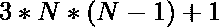

# 打印 N 个数字，这样它们的和就是一个完美的立方体

> 原文:[https://www . geeksforgeeks . org/print-n-numbers-这样-他们的总和就是一个完美的立方体/](https://www.geeksforgeeks.org/print-n-numbers-such-that-their-sum-is-a-perfect-cube/)

给定一个数字 **N** ，任务是找到 **N** 个数字，这样它们的和就是一个[完美立方体](https://www.geeksforgeeks.org/perfect-cubes-range/)。

**示例:**

> **输入:** N = 3
> **输出:** 1 7 19
> **解释:**
> 数之和= 1 + 7 + 19 = 27，
> 是 3 = > 3 <sup>3</sup> = 27 的完美立方
> 
> **输入:** N = 4
> **输出:** 1 7 19 37
> 数之和= 1 + 7 + 19 + 37 = 64，
> 是 4 = > 4 <sup>3</sup> = 64 的完美立方

**方法:**
在考虑 [**中心六边形数字**](https://www.geeksforgeeks.org/centered-hexagonal-number/) 后，该数字表示:

> **第一个 N 个中心六边形数的和是 N 的完美立方**

所以从中心六边形数开始，级数的前 N 项将给出 N 个数，这样它们的和就是一个完美的立方体。

**例如:**

```
For N = 1,
    Centered Hexagonal Series = 1
    and 13 = 1
    Hence, {1} is the required N number

For N = 2,
    Centered Hexagonal Series = 1, 7
    and 23 = 1 + 7 = 8
    Hence, {1, 7} are the required N number

For N = 3,
    Centered Hexagonal Series = 1, 7, 19
    and 33 = 1 + 7 + 19 = 27
    Hence, {1, 7, 19} are the required N number
.
.
and so on.
```

因此，可以说打印中心六边形数字的前 N 项将给出所需的 N 个数字。
同样，中心六边形数字的第 n 项是:


**算法:**

*   用一个循环变量(比如说 **i** )从 1 到 N 迭代一个[循环](https://www.geeksforgeeks.org/loops-in-c-and-cpp/)，对于每个迭代–
    1.  使用公式 **3*i*(i-1) + 1** 求出中心六边形数的第 N 个<sup>项。</sup>
    2.  在数组中追加第 i <sup>个</sup>项。

下面是上述方法的实现:

## C++

```
// C++ implementation to find the N
// numbers such that their
// sum is a perfect cube

#include <bits/stdc++.h>
using namespace std;

// Function to find the N
// numbers such that their
// sum is a perfect cube
void findNumbers(int n)
{
    int i = 1;
    // Loop to find the Ith term
    // of the Centered Hexagonal number
    while (i <= n) {
        cout << (3 * i * (i - 1) + 1)
             << " ";
        i++;
    }
}

// Driver Code
int main()
{
    int n = 4;

    // Function Call
    findNumbers(n);
}
```

## Java 语言(一种计算机语言，尤用于创建网站)

```
// Java implementation to find the N
// numbers such that their
// sum is a perfect cube
class GFG
{

    // Function to find the N
    // numbers such that their
    // sum is a perfect cube
    static void findNumbers(int n)
    {
        int i = 1;

        // Loop to find the Ith term
        // of the Centered Hexagonal number
        while (i <= n)
        {
            System.out.print((3 * i * (i - 1) + 1) + " ");
            i++;
        }
    }

    // Driver Code
    public static void main (String[] args)
    {
        int n = 4;

        // Function Call
        findNumbers(n);
    }
}

// This code is contributed by AnkitRai01
```

## C#

```
// C# implementation to find the N
// numbers such that their
// sum is a perfect cube
using System;

public class GFG
{

    // Function to find the N
    // numbers such that their
    // sum is a perfect cube
    static void findNumbers(int n)
    {
        int i = 1;

        // Loop to find the Ith term
        // of the Centered Hexagonal number
        while (i <= n)
        {
            Console.Write((3 * i * (i - 1) + 1) + " ");
            i++;
        }
    }

    // Driver Code
    public static void Main()
    {
        int n = 4;

        // Function Call
        findNumbers(n);
    }
}

// This code is contributed by AnkitRai01
```

## 蟒蛇 3

```
# Python3 implementation to find the N
# numbers such that their
# sum is a perfect cube

# Function to find the N
# numbers such that their
# sum is a perfect cube
def findNumbers(n):
    i = 1

    # Loop to find the Ith term
    # of the Centered Hexagonal number
    while (i <= n):
        print((3 * i * (i - 1) + 1), end=" ")
        i += 1

# Driver Code
n = 4

# Function Call
findNumbers(n)

# This code is contributed by mohit kumar 29
```

## java 描述语言

```
<script>

// Javascript implementation to find
// the N numbers such that their sum
// is a perfect cube

// Function to find the N
// numbers such that their
// sum is a perfect cube
function findNumbers(n)
{
    let i = 1;

    // Loop to find the Ith term
    // of the Centered Hexagonal number
    while (i <= n)
    {
        document.write((3 * i * (i - 1) +
                       1) + " ");
        i++;
    }
}

// Driver Code
let n = 4;

// Function Call
findNumbers(n);

// This code is contributed by Surbhi Tyagi.

</script>
```

**Output:** 

```
1 7 19 37
```

**性能分析:**

*   **时间复杂度:**和上面的方法一样，我们正在寻找所有的 N Centered 六边形数，所以需要 **O(N)** 。
*   **辅助空间:**和上面的方法一样，没有使用额外的空间，所以使用的辅助空间将是 **O(1)**