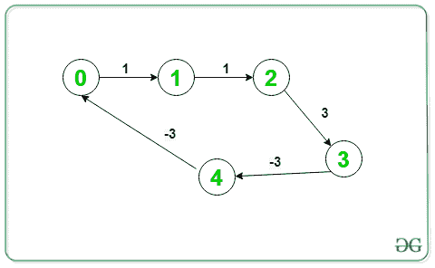

# 在有向图中打印负重量循环

> 原文:[https://www . geesforgeks . org/print-负重量-有向图中的循环/](https://www.geeksforgeeks.org/print-negative-weight-cycle-in-a-directed-graph/)

给定一个由 **V** 顶点和 **E** 边组成的加权有向图。任务是打印权重之和为负的[循环路径](https://www.geeksforgeeks.org/detect-cycle-in-a-graph/)。如果不存在这样的路径，则打印**-【1】**。

> **输入:** V = 5，E = 5，下图:
> 
> 这里，对于给定的负周期 o/p(1-> 2-> 3-> 4-> 1)；在图中，必须有 4–> 1 的边，而不是 4–> 0 的边
> 
> 
> 
> **输出:** 1 2 3 4 1
> **解释:**
> 给定图形包含负循环，(1- > 2- > 3- > 4- > 1)
> 
> **输入:** V = 5，E = 5，下图:
> 
> 
> 
> **输出:** 0 1 2 3 4 0
> **解释:**
> 给定图形包含负周期，(0->1->2->3->4->0)

**方法:**思路是使用[贝尔曼-福特算法](https://www.geeksforgeeks.org/bellman-ford-algorithm-dp-23/)，用于[检测负循环](https://www.geeksforgeeks.org/detect-negative-cycle-graph-bellman-ford/)与否。要打印负循环，执行贝尔曼-福特的**第 n 次**迭代，并从该迭代中松弛的任何边中选择一个顶点。使用此顶点及其祖先，可以打印负循环。以下是步骤:

*   执行贝尔曼-福特算法的 **N-1** 次迭代，放松每条边 **(u，v)** 。跟踪每个顶点的父节点，并将其存储在一个数组中**父节点[]** 。
*   现在，再做一次迭代，如果在这个**第 n 次迭代**中没有发生边缘松弛，那么图中就不存在负权重的循环。
*   否则取一个变量 **C** 存储任意边 **(u，v)** 的顶点 **v** ，在**第 n 次**迭代中放松。
*   现在，从 **C** 顶点开始，向它的祖先走，直到找到一个循环，最后打印出来。
*   这个周期将是负重量的理想周期。

下面是上述方法的实现:

## C++

```
// C++ program for the above approach
#include <bits/stdc++.h>
using namespace std;

// Structure to represent a weighted
// edge in graph
struct Edge {
    int src, dest, weight;
};

// Structure to represent a directed
// and weighted graph
struct Graph {

    // V -> Number of vertices,
    // E -> Number of edges
    int V, E;

    // Graph is represented as an
    // array of edges
    struct Edge* edge;
};

// Creates a new graph with V vertices
// and E edges
struct Graph* createGraph(int V, int E)
{
    struct Graph* graph = new Graph;
    graph->V = V;
    graph->E = E;
    graph->edge = new Edge[graph->E];
    return graph;
}

vector<int> vis;
// Function runs Bellman-Ford algorithm
// and prints negative cycle(if present)
void NegCycleBellmanFord(struct Graph* graph,
                        int src)
{
    int V = graph->V;
    int E = graph->E;
    int dist[V];
    int parent[V];

    // Initialize distances from src
    // to all other vertices as INFINITE
    // and all parent as -1
    for (int i = 0; i < V; i++) {

        dist[i] = INT_MAX;
        parent[i] = -1;
    }
    dist[src] = 0;
    vis[src] = 0;
    // Relax all edges |V| - 1 times.
    bool flg = true;
    for (int i = 1; i <= V - 1; i++) {
      if(flg==false)
            break;
      flg=false;
        for (int j = 0; j < E; j++) {

            int u = graph->edge[j].src;
            int v = graph->edge[j].dest;
            int weight = graph->edge[j].weight;

            if (dist[u] != INT_MAX
                && dist[u] + weight < dist[v]) {
                flg = true;
                vis[v] = 1;
                dist[v] = dist[u] + weight;
                parent[v] = u;
            }
        }
    }

    // Check for negative-weight cycles
    int C = -1;
    for (int i = 0; i < E; i++) {

        int u = graph->edge[i].src;
        int v = graph->edge[i].dest;
        int weight = graph->edge[i].weight;

        if (dist[u] != INT_MAX
            && dist[u] + weight < dist[v]) {

            // Store one of the vertex of
            // the negative weight cycle
            C = v;
            break;
        }
    }

    if (C != -1) {

        for (int i = 0; i < V; i++)
            C = parent[C];

        // To store the cycle vertex
        vector<int> cycle;
        for (int v = C;; v = parent[v]) {

            cycle.push_back(v);
            if (v == C
                && cycle.size() > 1)
                break;
        }

        // Reverse cycle[]
        reverse(cycle.begin(), cycle.end());

        // Printing the negative cycle
        for (int v : cycle)
            cout << v << ' ';
        cout << endl;
       exit(0);
    }
}

// Driver Code
int main()
{
    // Number of vertices in graph
    int V = 5;

    // Number of edges in graph
    int E = 5;

    struct Graph* graph = createGraph(V, E);
    vis.resize(V,0);
    // Given Graph
    graph->edge[0].src = 1;
    graph->edge[0].dest = 0;
    graph->edge[0].weight = 1;

    graph->edge[1].src = 1;
    graph->edge[1].dest = 2;
    graph->edge[1].weight = 2;

    graph->edge[2].src = 2;
    graph->edge[2].dest = 3;
    graph->edge[2].weight = 3;

    graph->edge[3].src = 3;
    graph->edge[3].dest = 4;
    graph->edge[3].weight = -3;

    graph->edge[4].src = 4;
    graph->edge[4].dest = 1;
    graph->edge[4].weight = -3;

    // Function Call
    for(int src = 0;src<V;src++)
    {
      if(vis[src]==0)
         NegCycleBellmanFord(graph, src);
    } 
        cout << "-1\n";
    return 0;
}
```

## Java 语言(一种计算机语言，尤用于创建网站)

```
// Java program for the above approach
import java.util.ArrayList;
import java.util.Collections;

class GFG{

// Structure to represent a weighted
// edge in graph
static class Edge 
{
    int src, dest, weight;
}

// Structure to represent a directed
// and weighted graph
static class Graph
{

    // V. Number of vertices, E.
    // Number of edges
    int V, E;

    // Graph is represented as
    // an array of edges.
    Edge[] edge;
}

// Creates a new graph with V vertices
// and E edges
static Graph createGraph(int V, int E) 
{
    Graph graph = new Graph();
    graph.V = V;
    graph.E = E;
    graph.edge = new Edge[graph.E];

    for(int i = 0; i < graph.E; i++)
    {
        graph.edge[i] = new Edge();
    }

    return graph;
}

// Function runs Bellman-Ford algorithm
// and prints negative cycle(if present)
static void NegCycleBellmanFord(Graph graph, int src)
{
    int V = graph.V;
    int E = graph.E;
    int[] dist = new int[V];
    int[] parent = new int[V];

    // Initialize distances from src
    // to all other vertices as INFINITE
    // and all parent as -1
    for(int i = 0; i < V; i++) 
    {
        dist[i] = 1000000;
        parent[i] = -1;
    }
    dist[src] = 0;

    // Relax all edges |V| - 1 times.
    for(int i = 1; i <= V - 1; i++)
    {
        for(int j = 0; j < E; j++)
        {
            int u = graph.edge[j].src;
            int v = graph.edge[j].dest;
            int weight = graph.edge[j].weight;

            if (dist[u] != 1000000 && 
                dist[u] + weight < dist[v])
            {
                dist[v] = dist[u] + weight;
                parent[v] = u;
            }
        }
    }

    // Check for negative-weight cycles
    int C = -1;
    for(int i = 0; i < E; i++) 
    {
        int u = graph.edge[i].src;
        int v = graph.edge[i].dest;
        int weight = graph.edge[i].weight;

        if (dist[u] != 1000000 && 
            dist[u] + weight < dist[v])
        {

            // Store one of the vertex of
            // the negative weight cycle
            C = v;
            break;
        }
    }

    if (C != -1)
    {
        for(int i = 0; i < V; i++)
            C = parent[C];

        // To store the cycle vertex
        ArrayList<Integer> cycle = new ArrayList<>();
        for(int v = C;; v = parent[v])
        {
            cycle.add(v);

            if (v == C && cycle.size() > 1)
                break;
        }

        // Reverse cycle[]
        Collections.reverse(cycle);

        // Printing the negative cycle
        for(int v : cycle)
            System.out.print(v + " ");

        System.out.println();
    } 
    else
        System.out.println(-1);
}

// Driver Code
public static void main(String[] args)
{

    // Number of vertices in graph
    int V = 5;

    // Number of edges in graph
    int E = 5;

    Graph graph = createGraph(V, E);

    // Given Graph
    graph.edge[0].src = 0;
    graph.edge[0].dest = 1;
    graph.edge[0].weight = 1;

    graph.edge[1].src = 1;
    graph.edge[1].dest = 2;
    graph.edge[1].weight = 2;

    graph.edge[2].src = 2;
    graph.edge[2].dest = 3;
    graph.edge[2].weight = 3;

    graph.edge[3].src = 3;
    graph.edge[3].dest = 4;
    graph.edge[3].weight = -3;

    graph.edge[4].src = 4;
    graph.edge[4].dest = 1;
    graph.edge[4].weight = -3;

    // Function Call
    NegCycleBellmanFord(graph, 0);
}
}

// This code is contributed by sanjeev2552
```

## 蟒蛇 3

```
# Python3 program for the above approach

# Structure to represent a weighted
# edge in graph
class Edge:   
    def __init__(self):
        self.src = 0
        self.dest = 0
        self.weight = 0

# Structure to represent a directed
# and weighted graph
class Graph:

    def __init__(self):

        # V. Number of vertices, E.
        # Number of edges
        self.V = 0
        self.E = 0

        # Graph is represented as
        # an array of edges.
        self.edge = []

# Creates a new graph with V vertices
# and E edges
def createGraph(V, E):
    graph = Graph();
    graph.V = V;
    graph.E = E;
    graph.edge = [Edge() for i in range(graph.E)]
    return graph;

# Function runs Bellman-Ford algorithm
# and prints negative cycle(if present)
def NegCycleBellmanFord(graph, src):
    V = graph.V;
    E = graph.E;
    dist =[1000000 for i in range(V)]
    parent =[-1 for i in range(V)]
    dist[src] = 0;

    # Relax all edges |V| - 1 times.
    for i in range(1, V):
        for j in range(E):

            u = graph.edge[j].src;
            v = graph.edge[j].dest;
            weight = graph.edge[j].weight;

            if (dist[u] != 1000000 and
                dist[u] + weight < dist[v]):

                dist[v] = dist[u] + weight;
                parent[v] = u;

    # Check for negative-weight cycles
    C = -1;    
    for i in range(E):   
        u = graph.edge[i].src;
        v = graph.edge[i].dest;
        weight = graph.edge[i].weight;

        if (dist[u] != 1000000 and 
            dist[u] + weight < dist[v]):

            # Store one of the vertex of
            # the negative weight cycle
            C = v;
            break;

    if (C != -1):       
        for i in range(V):       
            C = parent[C];

        # To store the cycle vertex
        cycle = []       
        v = C

        while (True):
            cycle.append(v)
            if (v == C and len(cycle) > 1):
                break;
            v = parent[v]

        # Reverse cycle[]
        cycle.reverse()

        # Printing the negative cycle
        for v in cycle:       
            print(v, end = " ");             
        print()   
    else:
        print(-1);

# Driver Code
if __name__=='__main__':

    # Number of vertices in graph
    V = 5;

    # Number of edges in graph
    E = 5; 
    graph = createGraph(V, E);

    # Given Graph
    graph.edge[0].src = 0;
    graph.edge[0].dest = 1;
    graph.edge[0].weight = 1;

    graph.edge[1].src = 1;
    graph.edge[1].dest = 2;
    graph.edge[1].weight = 2;

    graph.edge[2].src = 2;
    graph.edge[2].dest = 3;
    graph.edge[2].weight = 3;

    graph.edge[3].src = 3;
    graph.edge[3].dest = 4;
    graph.edge[3].weight = -3;

    graph.edge[4].src = 4;
    graph.edge[4].dest = 1;
    graph.edge[4].weight = -3;

    # Function Call
    NegCycleBellmanFord(graph, 0);

# This code is contributed by Pratham76
```

## C#

```
// C# program for the above approach
using System;
using System.Collections;
using System.Collections.Generic;

class GFG {

    // Structure to represent a weighted
    // edge in graph
    class Edge {
        public int src, dest, weight;
    }
    // Structure to represent a directed
    // and weighted graph
    class Graph {

        // V. Number of vertices, E. Number of edges
        public int V, E;

        // graph is represented as an array of edges.
        public Edge[] edge;
    }

    // Creates a new graph with V vertices
    // and E edges
    static Graph createGraph(int V, int E)
    {
        Graph graph = new Graph();
        graph.V = V;
        graph.E = E;
        graph.edge = new Edge[graph.E];

        for (int i = 0; i < graph.E; i++) {
            graph.edge[i] = new Edge();
        }

        return graph;
    }

    // Function runs Bellman-Ford algorithm
    // and prints negative cycle(if present)
    static void NegCycleBellmanFord(Graph graph, int src)
    {
        int V = graph.V;
        int E = graph.E;
        int[] dist = new int[V];
        int[] parent = new int[V];

        // Initialize distances from src
        // to all other vertices as INFINITE
        // and all parent as -1
        for (int i = 0; i < V; i++) {

            dist[i] = 1000000;
            parent[i] = -1;
        }
        dist[src] = 0;

        // Relax all edges |V| - 1 times.
        for (int i = 1; i <= V - 1; i++) {
            for (int j = 0; j < E; j++) {

                int u = graph.edge[j].src;
                int v = graph.edge[j].dest;
                int weight = graph.edge[j].weight;

                if (dist[u] != 1000000
                    && dist[u] + weight < dist[v]) {

                    dist[v] = dist[u] + weight;
                    parent[v] = u;
                }
            }
        }

        // Check for negative-weight cycles
        int C = -1;
        for (int i = 0; i < E; i++) {

            int u = graph.edge[i].src;
            int v = graph.edge[i].dest;
            int weight = graph.edge[i].weight;

            if (dist[u] != 1000000
                && dist[u] + weight < dist[v]) {

                // Store one of the vertex of
                // the negative weight cycle
                C = v;
                break;
            }
        }

        if (C != -1) {

            for (int i = 0; i < V; i++)
                C = parent[C];

            // To store the cycle vertex
            ArrayList cycle = new ArrayList();
            for (int v = C;; v = parent[v]) {

                cycle.Add(v);
                if (v == C && cycle.Count > 1)
                    break;
            }

            // Reverse cycle[]
            cycle.Reverse();

            // Printing the negative cycle
            foreach(int v in cycle) Console.Write(v + " ");
            Console.WriteLine();
        }
        else
            Console.WriteLine(-1);
    }

    // Driver Code
    public static void Main(string[] args)
    {

        // Number of vertices in graph
        int V = 5;

        // Number of edges in graph
        int E = 5;

        Graph graph = createGraph(V, E);

        // Given Graph
        graph.edge[0].src = 0;
        graph.edge[0].dest = 1;
        graph.edge[0].weight = 1;

        graph.edge[1].src = 1;
        graph.edge[1].dest = 2;
        graph.edge[1].weight = 2;

        graph.edge[2].src = 2;
        graph.edge[2].dest = 3;
        graph.edge[2].weight = 3;

        graph.edge[3].src = 3;
        graph.edge[3].dest = 4;
        graph.edge[3].weight = -3;

        graph.edge[4].src = 4;
        graph.edge[4].dest = 1;
        graph.edge[4].weight = -3;

        // Function Call
        NegCycleBellmanFord(graph, 0);
    }
}

// This code is contributed by rutvik_56
```

## java 描述语言

```
<script>

// JavaScript program for the above approach
// Structure to represent a weighted
// edge in graph
class Edge {
    constructor()
    {
        this.src = 0;
        this.dest = 0;
        this.weight = 0;
    }
}
// Structure to represent a directed
// and weighted graph
class Graph {

    constructor()
    {
        // V. Number of vertices, E. Number of edges
        this.V = 0;
        this.E = 0;
        // graph is represented as an array of edges.
        this.edge = [];
    }
}
// Creates a new graph with V vertices
// and E edges
function createGraph(V, E)
{
    var graph = new Graph();
    graph.V = V;
    graph.E = E;
    graph.edge = Array(graph.E);

    for(var i = 0; i < graph.E; i++) {
        graph.edge[i] = new Edge();
    }
    return graph;
}
// Function runs Bellman-Ford algorithm
// and prints negative cycle(if present)
function NegCycleBellmanFord(graph, src)
{
    var V = graph.V;
    var E = graph.E;
    var dist = Array(V).fill(0);;
    var parent = Array(V).fill(0);;
    // Initialize distances from src
    // to all other vertices as INFINITE
    // and all parent as -1
    for (var i = 0; i < V; i++) {
        dist[i] = 1000000;
        parent[i] = -1;
    }
    dist[src] = 0;
    // Relax all edges |V| - 1 times.
    for (var i = 1; i <= V - 1; i++) {
        for (var j = 0; j < E; j++) {
            var u = graph.edge[j].src;
            var v = graph.edge[j].dest;
            var weight = graph.edge[j].weight;
            if (dist[u] != 1000000
                && dist[u] + weight < dist[v]) {
                dist[v] = dist[u] + weight;
                parent[v] = u;
            }
        }
    }
    // Check for negative-weight cycles
    var C = -1;
    for (var i = 0; i < E; i++) {
        var u = graph.edge[i].src;
        var v = graph.edge[i].dest;
        var weight = graph.edge[i].weight;
        if (dist[u] != 1000000
            && dist[u] + weight < dist[v]) {
            // Store one of the vertex of
            // the negative weight cycle
            C = v;
            break;
        }
    }
    if (C != -1) {
        for (var i = 0; i < V; i++)
            C = parent[C];
        // To store the cycle vertex
        var cycle = [];
        for (var v = C;; v = parent[v]) {
            cycle.push(v);
            if (v == C && cycle.length > 1)
                break;
        }
        // Reverse cycle[]
        cycle.reverse();
        // Printing the negative cycle
        for(var v of cycle) document.write(v + " ");
        document.write("<br>");
    }
    else
        document.write(-1 + "<br>");
}

// Driver Code
// Number of vertices in graph
var V = 5;
// Number of edges in graph
var E = 5;
var graph = createGraph(V, E);
// Given Graph
graph.edge[0].src = 0;
graph.edge[0].dest = 1;
graph.edge[0].weight = 1;
graph.edge[1].src = 1;
graph.edge[1].dest = 2;
graph.edge[1].weight = 2;
graph.edge[2].src = 2;
graph.edge[2].dest = 3;
graph.edge[2].weight = 3;
graph.edge[3].src = 3;
graph.edge[3].dest = 4;
graph.edge[3].weight = -3;
graph.edge[4].src = 4;
graph.edge[4].dest = 1;
graph.edge[4].weight = -3;
// Function Call
NegCycleBellmanFord(graph, 0);

</script>
```

**Output:** 

```
1 2 3 4 1
```

**时间复杂度:***O(V * E)*
T5】辅助空间: *O(V)*