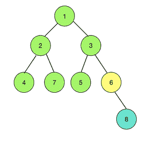

# 打印每个相邻树的所有节点颜色相同的节点

> 原文:[https://www . geeksforgeeks . org/print-node-其每个相邻树都具有相同颜色的所有节点/](https://www.geeksforgeeks.org/print-node-whose-each-neighboring-tree-has-all-nodes-of-same-color/)

给定一棵树，其 **N** **节点**从 1 到**T5】N**和**N–1****边**和数组**colors[]**其中 colors[I]表示**I<sup>th</sup>节点的颜色。任务是找到一个节点，使得连接到该节点的每个相邻树都由相同颜色的节点组成。如果不存在这样的节点，则打印-1。******

> ******输入:** N = 8，颜色[] = {1，1，1，1，2，1，3}边= {(1，2) (1，3) (2，4) (2，7) (3，5) (3，6) (6，8)}**** 
> 
> ****
> 
> 想象这棵树**** 
> 
> ******输出:** 6
> **说明:**
> 考虑节点 6，它有 2 棵树与之相连。其中一个扎根于 3，另一个扎根于 8。显然，以 3 为根的树有相同颜色的节点，以 8 为根的树只有一个节点。因此，节点 6 就是这样一个节点。****
> 
> ******输入:** N = 4，颜色[] = {1，2，3，4}，边= {(1，3) (1，2 ) (2，4)}
> **输出:** -1
> **说明:**
> 没有这样的节点。****

******方法:**思路是检查所有节点是否都有**同色**，那么任意一个节点都可以是根。否则，选择任意两个相邻且颜色不同的节点，并通过执行 DFS 检查这些节点的子树。如果这些节点中的任何一个满足条件，那么该节点可以是根。如果这两个节点都不满足条件，则不存在这样的根，并打印-1。****

1.  ****遍历树，找到彼此相邻的前两个不同颜色的节点，比如说 **root1** 和 **root2** 。如果没有找到这样的节点，那么所有的节点都是相同的颜色，任何节点都可以作为**根**。****
2.  ****通过将 **root1** 视为树的根，检查每个子树的所有节点的颜色是否相同。如果条件满足，那么**根 1** 就是答案。****
3.  ****如果**根 1** 不满足条件，对**根 2** 重复步骤 2。****
4.  ****如果**根 2** 不满足条件，则不存在这样的根，输出为-1。****

****下面是上述方法的实现:****

## ****C++****

```
**// C++ program for the above approach
#include <bits/stdc++.h>
using namespace std;

const int NN = 1e5 + 5;
// Vector to store the tree
vector<int> G[NN];

// Function to perform dfs
void dfs(int node, int parent,
         bool& check,
         int current_colour,
         int* colours)
{
    // Check is assigned to false if either it
    // is already false or the current_colour
    // is not same as the node colour
    check = check
            && (colours[node] == current_colour);

    // Iterate over the neighbours of node
    for (auto a : G[node]) {

        // If the neighbour is
        // not the parent node
        if (a != parent) {

            // call the function
            // for the neighbour
            dfs(a, node, check,
                current_colour,
                colours);
        }
    }
}
// Function to check whether all the
// nodes in each subtree of the given
// node have same colour
bool checkPossibility(
    int root, int* colours)
{

    // Initialise the boolean answer
    bool ans = true;
    // Iterate over the neighbours
    // of selected root
    for (auto a : G[root]) {

        // Initialise the colour
        // for this subtree
        // as the colour of
        // first neighbour
        int current_colour = colours[a];

        // Variable to check
        // condition of same
        // colour for each subtree
        bool check = true;

        // dfs function call
        dfs(a, root, check,
            current_colour, colours);

        // Check if any one subtree
        // does not have all
        // nodes of same colour
        // then ans will become false

        ans = ans && check;
    }

    // Return the answer
    return ans;
}

// Function to add edges to the tree
void addedge(int x, int y)
{
    // y is added as a neighbour of x
    G[x].push_back(y);

    // x is added as a neighbour of y
    G[y].push_back(x);
}

// Function to find the node
void solve(int* colours, int N)
{
    // Initialise root1 as -1
    int root1 = -1;

    // Initialise root2 as -1
    int root2 = -1;

    // Find the first two nodes of
    // different colour which are adjacent
    // to each other
    for (int i = 1; i <= N; i++) {
        for (auto a : G[i]) {
            if (colours[a] != colours[i]) {
                root1 = a;
                root2 = i;
                break;
            }
        }
    }

    // If no two nodes of different
    // colour are found
    if (root1 == -1) {
        // make any node (say 1)
        // as the root
        cout << endl
             << "1" << endl;
    }

    // Check if making root1
    // as the root of the
    // tree solves the purpose
    else if (
        checkPossibility(root1, colours)) {

        cout << root1 << endl;
    }

    // check  for root2
    else if (
        checkPossibility(root2, colours)) {

        cout << root2 << endl;
    }

    // otherwise no such root exist
    else {
        cout << "-1" << endl;
    }
}

// Driver code
int32_t main()
{
    // Number of nodes
    int N = 8;

    // add edges
    addedge(1, 2);
    addedge(1, 3);
    addedge(2, 4);
    addedge(2, 7);
    addedge(3, 5);
    addedge(3, 6);
    addedge(6, 8);

    // Node colours
    // 0th node is extra to make
    // the array 1 indexed
    int colours[9] = { 0, 1, 1, 1,
                       1, 1, 2, 1, 3 };

    solve(colours, N);

    return 0;
}**
```

## ****Java 语言(一种计算机语言，尤用于创建网站)****

```
**// Java program for the above approach
import java.util.*;

class GFG{

static int NN = (int)(1e5 + 5);

// Vector to store the tree
@SuppressWarnings("unchecked")
static Vector<Integer> []G = new Vector[NN];

// Function to perform dfs
static void dfs(int node, int parent,
                boolean check,
                int current_colour,
                int[] colours)
{

    // Check is assigned to false if either it
    // is already false or the current_colour
    // is not same as the node colour
    check = check &&
           (colours[node] == current_colour);

    // Iterate over the neighbours of node
    for(int a : G[node])
    {

        // If the neighbour is
        // not the parent node
        if (a != parent)
        {

            // Call the function
            // for the neighbour
            dfs(a, node, check,
                current_colour,
                colours);
        }
    }
}

// Function to check whether all the
// nodes in each subtree of the given
// node have same colour
static boolean checkPossibility(int root,
                                int[] colours)
{

    // Initialise the boolean answer
    boolean ans = true;

    // Iterate over the neighbours
    // of selected root
    for(int a : G[root])
    {

        // Initialise the colour
        // for this subtree
        // as the colour of
        // first neighbour
        int current_colour = colours[a];

        // Variable to check
        // condition of same
        // colour for each subtree
        boolean check = true;

        // dfs function call
        dfs(a, root, check,
            current_colour, colours);

        // Check if any one subtree
        // does not have all
        // nodes of same colour
        // then ans will become false
        ans = ans && check;
    }

    // Return the answer
    return ans;
}

// Function to add edges to the tree
static void addedge(int x, int y)
{

    // y is added as a neighbour of x
    G[x].add(y);

    // x is added as a neighbour of y
    G[y].add(x);
}

// Function to find the node
static void solve(int[] colours, int N)
{

    // Initialise root1 as -1
    int root1 = -1;

    // Initialise root2 as -1
    int root2 = -1;

    // Find the first two nodes of
    // different colour which are adjacent
    // to each other
    for(int i = 1; i <= N; i++)
    {
        for(int a : G[i])
        {
            if (colours[a] != colours[i])
            {
                root1 = a;
                root2 = i;
                break;
            }
        }
    }

    // If no two nodes of different
    // colour are found
    if (root1 == -1)
    {

        // Make any node (say 1)
        // as the root
        System.out.println("1" + "\n");
    }

    // Check if making root1
    // as the root of the
    // tree solves the purpose
    else if (checkPossibility(root1, colours))
    {
        System.out.print(root1 + "\n");
    }

    // Check for root2
    else if (checkPossibility(root2, colours))
    {
        System.out.print(root2 + "\n");
    }

    // Otherwise no such root exist
    else
    {
        System.out.print("-1" + "\n");
    }
}

// Driver code
public static void main(String[] args)
{

    // Number of nodes
    int N = 8;

    for(int i = 0; i < G.length; i++)
        G[i] = new Vector<Integer>();

    // Add edges
    addedge(1, 2);
    addedge(1, 3);
    addedge(2, 4);
    addedge(2, 7);
    addedge(3, 5);
    addedge(3, 6);
    addedge(6, 8);

    // Node colours 0th node is extra
    // to make the array 1 indexed
    int colours[] = { 0, 1, 1, 1,
                      1, 1, 2, 1, 3 };

    solve(colours, N);
}
}

// This code is contributed by 29AjayKumar**
```

## ****蟒蛇 3****

```
**# Python3 program for the above approach
NN = 1e5 + 5

# Vector to store tree
G = []
for i in range(int(NN)):
    G.append([])

# Function to perform dfs
def dfs(node, parent, check,
        current_colour, colours):

    # Check is assigned to false if 
    # either it is already false or
    # the current_colour is not same
    # as the node colour
    check[0] = check[0] & (colours[node] ==
                           current_colour)

    # Iterate over the neighbours of node
    for a in G[node]:

        # If the neighbour is
        # not the parent node
        if a != parent:

            # Call the function
            # for the neighbour
            dfs(a, node, check,
                current_colour, colours)

# Function to check whether all the
# nodes in each subtree of the given
# node have same colour
def checkPossibility(root, colours):

    # Initialise the boolean answer
    ans = True

    for a in G[root]:

        # Initialise the colour
        # for this subtree
        # as the colour of
        # first neighbour
        current_colour = colours[a]

        # Variable to check
        # condition of same
        # colour for each subtree
        check = [True]

        # dfs function call
        dfs(a, root, check,
            current_colour, colours)

        # Check if any one subtree
        # does not have all
        # nodes of same colour
        # then ans will become false
        ans = ans & check[0]

    # Return the ans
    return ans

# Function to add edges to the tree
def addedge(x, y):

    # y is added as a neighbour of x
    G[x].append(y)

    # x is added as a neighbour of y
    G[y].append(x)

# Function to find the node
def solve(colours, N):

    # Initialise the root1 as -1
    root1 = -1

    # Initialise the root 2 as -1
    root2 = -1

    # Find the first two nodes of
    # different colour which are adjacent
    # to each other
    for i in range(1, N + 1):
        for a in G[i]:
            if colours[a] != colours[i]:
                root1 = a
                root2 = i
                break

    # If no two nodes of different
    # colour are found
    if root1 == -1:

        # make any node (say 1)
        # as the root
        print(1)

    # Check if making root1
    # as the root of the
    # tree solves the purpose
    elif checkPossibility(root1, colours):
        print(root1)

    # Check for root2
    elif checkPossibility(root2, colours):
        print(root2)

    # Otherwise no such root exist
    else:
        print(-1)

# Driver code

# Number of nodes
N = 8

# add edges
addedge(1, 2)
addedge(1, 3)
addedge(2, 4)
addedge(2, 7)
addedge(3, 5)
addedge(3, 6)
addedge(6, 8)

# Node colours
# 0th node is extra to make
# the array 1 indexed
colours = [ 0, 1, 1, 1, 1,
            1, 2, 1, 3 ]

solve(colours, N)

# This code is contributed by Stuti Pathak**
```

## ****C#****

```
**// C# program for the above approach
using System;
using System.Collections.Generic;
class GFG{
    static int NN = (int)(1e5 + 5);

    // List to store the tree
    static List<int>[] G = new List<int>[ NN ];

    // Function to perform dfs
    static void dfs(int node, int parent, bool check,
                    int current_colour, int[] colours)
    {

        // Check is assigned to false if either it
        // is already false or the current_colour
        // is not same as the node colour
        check = check && (colours[node] == current_colour);

        // Iterate over the neighbours of node
        foreach(int a in G[node])
        {

            // If the neighbour is
            // not the parent node
            if (a != parent)
            {

                // Call the function
                // for the neighbour
                dfs(a, node, check,
                    current_colour, colours);
            }
        }
    }

    // Function to check whether all the
    // nodes in each subtree of the given
    // node have same colour
    static bool checkPossibility(int root, int[] colours)
    {

        // Initialise the bool answer
        bool ans = true;

        // Iterate over the neighbours
        // of selected root
        foreach(int a in G[root])
        {

            // Initialise the colour
            // for this subtree
            // as the colour of
            // first neighbour
            int current_colour = colours[a];

            // Variable to check
            // condition of same
            // colour for each subtree
            bool check = true;

            // dfs function call
            dfs(a, root, check, current_colour, colours);

            // Check if any one subtree
            // does not have all
            // nodes of same colour
            // then ans will become false
            ans = ans && check;
        }

        // Return the answer
        return ans;
    }

    // Function to add edges to the tree
    static void addedge(int x, int y)
    {

        // y is added as a neighbour of x
        G[x].Add(y);

        // x is added as a neighbour of y
        G[y].Add(x);
    }

    // Function to find the node
    static void solve(int[] colours, int N)
    {

        // Initialise root1 as -1
        int root1 = -1;

        // Initialise root2 as -1
        int root2 = -1;

        // Find the first two nodes of
        // different colour which are adjacent
        // to each other
        for (int i = 1; i <= N; i++)
        {
            foreach(int a in G[i])
            {
                if (colours[a] != colours[i])
                {
                    root1 = a;
                    root2 = i;
                    break;
                }
            }
        }

        // If no two nodes of different
        // colour are found
        if (root1 == -1)
        {

            // Make any node (say 1)
            // as the root
            Console.WriteLine("1" + "\n");
        }

        // Check if making root1
        // as the root of the
        // tree solves the purpose
        else if (checkPossibility(root1, colours))
        {
            Console.Write(root1 + "\n");
        }

        // Check for root2
        else if (checkPossibility(root2, colours))
        {
            Console.Write(root2 + "\n");
        }

        // Otherwise no such root exist
        else
        {
            Console.Write("-1" + "\n");
        }
    }

    // Driver code
    public static void Main(String[] args)
    {

        // Number of nodes
        int N = 8;

        for (int i = 0; i < G.Length; i++)
            G[i] = new List<int>();

        // Add edges
        addedge(1, 2);
        addedge(1, 3);
        addedge(2, 4);
        addedge(2, 7);
        addedge(3, 5);
        addedge(3, 6);
        addedge(6, 8);

        // Node colours 0th node is extra
        // to make the array 1 indexed
        int[] colours = {0, 1, 1, 1, 1, 1, 2, 1, 3};
        solve(colours, N);
    }
}

// This code is contributed by Rajput-Ji**
```

## ****java 描述语言****

```
**<script>

// Javascript program for the above approach

var NN = 100005;

// List to store the tree
var G = Array.from(Array(NN), ()=>Array());

// Function to perform dfs
function dfs(node, parent, check, current_colour, colours)
{
    // Check is assigned to false if either it
    // is already false or the current_colour
    // is not same as the node colour
    check = check && (colours[node] == current_colour);
    // Iterate over the neighbours of node
    for(var a of G[node])
    {
        // If the neighbour is
        // not the parent node
        if (a != parent)
        {
            // Call the function
            // for the neighbour
            dfs(a, node, check,
                current_colour, colours);
        }
    }
}
// Function to check whether all the
// nodes in each subtree of the given
// node have same colour
function checkPossibility(root, colours)
{
    // Initialise the bool answer
    var ans = true;
    // Iterate over the neighbours
    // of selected root
    for(var a of G[root])
    {
        // Initialise the colour
        // for this subtree
        // as the colour of
        // first neighbour
        var current_colour = colours[a];
        // Variable to check
        // condition of same
        // colour for each subtree
        var check = true;
        // dfs function call
        dfs(a, root, check, current_colour, colours);
        // Check if any one subtree
        // does not have all
        // nodes of same colour
        // then ans will become false
        ans = ans && check;
    }
    // Return the answer
    return ans;
}
// Function to add edges to the tree
function addedge(x, y)
{
    // y is added as a neighbour of x
    G[x].push(y);
    // x is added as a neighbour of y
    G[y].push(x);
}
// Function to find the node
function solve(colours, N)
{
    // Initialise root1 as -1
    var root1 = -1;
    // Initialise root2 as -1
    var root2 = -1;
    // Find the first two nodes of
    // different colour which are adjacent
    // to each other
    for (var i = 1; i <= N; i++)
    {
        for(var a of G[i])
        {
            if (colours[a] != colours[i])
            {
                root1 = a;
                root2 = i;
                break;
            }
        }
    }
    // If no two nodes of different
    // colour are found
    if (root1 == -1)
    {
        // Make any node (say 1)
        // as the root
        document.write("1" + "<br>");
    }
    // Check if making root1
    // as the root of the
    // tree solves the purpose
    else if (checkPossibility(root1, colours))
    {
        document.write(root1 + "<br>");
    }
    // Check for root2
    else if (checkPossibility(root2, colours))
    {
        document.write(root2 + "<br>");
    }
    // Otherwise no such root exist
    else
    {
        document.write("-1" + "<br>");
    }
}
// Driver code
// Number of nodes
var N = 8;

// Add edges
addedge(1, 2);
addedge(1, 3);
addedge(2, 4);
addedge(2, 7);
addedge(3, 5);
addedge(3, 6);
addedge(6, 8);
// Node colours 0th node is extra
// to make the array 1 indexed
var colours = [0, 1, 1, 1, 1, 1, 2, 1, 3];
solve(colours, N);

</script>**
```

******Output:** 

```
6
```**** 

*******时间复杂度:** O(N) 其中N 为树中节点数。*
***辅助空间:** O(1)*****