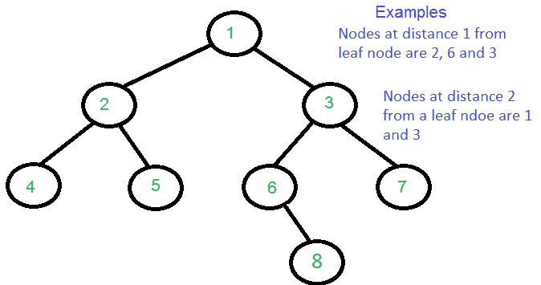

# 打印距叶节点距离为 k 的所有节点

> 原文:[https://www . geesforgeks . org/print-nodes-distance-k-leaf-node/](https://www.geeksforgeeks.org/print-nodes-distance-k-leaf-node/)

给定一棵二叉树和一个正整数 k，打印距离叶节点距离为 k 的所有节点。
这里距离的含义与[之前的帖子](https://www.geeksforgeeks.org/find-distance-two-given-nodes/)不同。这里离叶子的 k 距离意味着比叶子节点高 k 级。例如，如果 k 大于二叉树的高度，那么就不应该打印任何东西。预期时间复杂度为 O(n)，其中 n 是给定二叉树中的节点数。



这个想法是遍历树。继续存储所有祖先，直到我们碰到一个叶节点。当我们到达一个叶节点时，我们在距离 k 处打印祖先。我们还需要跟踪已经打印为输出的节点。为此，我们使用了一个布尔数组。

## C++

```
/* Program to print all nodes
which are at distance k from a leaf */
#include <iostream>
using namespace std;
#define MAX_HEIGHT 10000

struct Node {
    int key;
    Node *left, *right;
};

/* utility that allocates a new Node with the given key  */
Node* newNode(int key)
{
    Node* node = new Node;
    node->key = key;
    node->left = node->right = NULL;
    return (node);
}

/* This function prints all nodes that are distance k from a leaf node
   path[] --> Store ancestors of a node
   visited[] --> Stores true if a node is printed as output.  A node may be k
                 distance away from many leaves, we want to print it once */
void kDistantFromLeafUtil(Node* node, int path[], bool visited[],
                          int pathLen, int k)
{
    // Base case
    if (node == NULL)
        return;

    /* append this Node to the path array */
    path[pathLen] = node->key;
    visited[pathLen] = false;
    pathLen++;

    /* it's a leaf, so print the ancestor at distance k only
       if the ancestor is not already printed  */
    if (node->left == NULL &&
        node->right == NULL &&
        pathLen - k - 1 >= 0 &&
        visited[pathLen - k - 1] == false)
    {
        cout << path[pathLen - k - 1] << " ";
        visited[pathLen - k - 1] = true;
        return;
    }

    /* If not leaf node, recur for left and right subtrees */
    kDistantFromLeafUtil(node->left, path, visited, pathLen, k);
    kDistantFromLeafUtil(node->right, path, visited, pathLen, k);
}

/* Given a binary tree and a number k, print all nodes that are k
   distant from a leaf*/
void printKDistantfromLeaf(Node* node, int k)
{
    int path[MAX_HEIGHT];
    bool visited[MAX_HEIGHT] = { false };
    kDistantFromLeafUtil(node, path, visited, 0, k);
}

/* Driver code*/
int main()
{
    // Let us create binary tree
  // given in the above example
    Node* root = newNode(1);
    root->left = newNode(2);
    root->right = newNode(3);
    root->left->left = newNode(4);
    root->left->right = newNode(5);
    root->right->left = newNode(6);
    root->right->right = newNode(7);
    root->right->left->right = newNode(8);

    cout << "Nodes at distance 2 are: ";
    printKDistantfromLeaf(root, 2);

    return 0;
}
```

## Java 语言(一种计算机语言，尤用于创建网站)

```
// Java program to print all nodes at a distance k from leaf
// A binary tree node
class Node {
    int data;
    Node left, right;

    Node(int item)
    {
        data = item;
        left = right = null;
    }
}

class BinaryTree {
    Node root;

    /* This function prints all nodes that are distance k from a leaf node
     path[] --> Store ancestors of a node
     visited[] --> Stores true if a node is printed as output.  A node may
     be k distance away from many leaves, we want to print it once */
    void kDistantFromLeafUtil(Node node, int path[], boolean visited[],
                              int pathLen, int k)
    {
        // Base case
        if (node == null)
            return;

        /* append this Node to the path array */
        path[pathLen] = node.data;
        visited[pathLen] = false;
        pathLen++;

        /* it's a leaf, so print the ancestor at distance k only
         if the ancestor is not already printed  */
        if (node.left == null && node.right == null
            && pathLen - k - 1 >= 0 && visited[pathLen - k - 1] == false) {
            System.out.print(path[pathLen - k - 1] + " ");
            visited[pathLen - k - 1] = true;
            return;
        }

        /* If not leaf node, recur for left and right subtrees */
        kDistantFromLeafUtil(node.left, path, visited, pathLen, k);
        kDistantFromLeafUtil(node.right, path, visited, pathLen, k);
    }

    /* Given a binary tree and a number k, print all nodes that are k
     distant from a leaf*/
    void printKDistantfromLeaf(Node node, int k)
    {
        int path[] = new int[1000];
        boolean visited[] = new boolean[1000];
        kDistantFromLeafUtil(node, path, visited, 0, k);
    }

    // Driver program to test the above functions
    public static void main(String args[])
    {
        BinaryTree tree = new BinaryTree();

        /* Let us construct the tree shown in above diagram */
        tree.root = new Node(1);
        tree.root.left = new Node(2);
        tree.root.right = new Node(3);
        tree.root.left.left = new Node(4);
        tree.root.left.right = new Node(5);
        tree.root.right.left = new Node(6);
        tree.root.right.right = new Node(7);
        tree.root.right.left.right = new Node(8);

        System.out.println(" Nodes at distance 2 are :");
        tree.printKDistantfromLeaf(tree.root, 2);
    }
}

// This code has been contributed by Mayank Jaiswal
```

## 蟒蛇 3

```
# Program to print all nodes which are at
# distance k from a leaf

# utility that allocates a new Node with
# the given key
class newNode:
    def __init__(self, key):
        self.key = key
        self.left = self.right = None

# This function prints all nodes that
# are distance k from a leaf node
# path[] -. Store ancestors of a node
# visited[] -. Stores true if a node is
# printed as output. A node may be k distance
# away from many leaves, we want to print it once
def kDistantFromLeafUtil(node, path, visited,
                                 pathLen, k):

    # Base case
    if (node == None):
        return

    # append this Node to the path array
    path[pathLen] = node.key
    visited[pathLen] = False
    pathLen += 1

    # it's a leaf, so print the ancestor at
    # distance k only if the ancestor is
    # not already printed
    if (node.left == None and node.right == None and
                            pathLen - k - 1 >= 0 and
                            visited[pathLen - k - 1] == False):
        print(path[pathLen - k - 1], end = " ")
        visited[pathLen - k - 1] = True
        return

    # If not leaf node, recur for left
    # and right subtrees
    kDistantFromLeafUtil(node.left, path,
                         visited, pathLen, k)
    kDistantFromLeafUtil(node.right, path,
                         visited, pathLen, k)

# Given a binary tree and a number k,
# print all nodes that are k distant from a leaf
def printKDistantfromLeaf(node, k):
    global MAX_HEIGHT
    path = [None] * MAX_HEIGHT
    visited = [False] * MAX_HEIGHT
    kDistantFromLeafUtil(node, path, visited, 0, k)

# Driver Code
MAX_HEIGHT = 10000

# Let us create binary tree given in
# the above example
root = newNode(1)
root.left = newNode(2)
root.right = newNode(3)
root.left.left = newNode(4)
root.left.right = newNode(5)
root.right.left = newNode(6)
root.right.right = newNode(7)
root.right.left.right = newNode(8)

print("Nodes at distance 2 are:", end = " ")
printKDistantfromLeaf(root, 2)

# This code is contributed by pranchalK
```

## C#

```
using System;

// C# program to print all nodes at a distance k from leaf
// A binary tree node
public class Node {
    public int data;
    public Node left, right;

    public Node(int item)
    {
        data = item;
        left = right = null;
    }
}

public class BinaryTree {
    public Node root;

    /* This function prints all nodes that are distance k from a leaf node
     path[] --> Store ancestors of a node
     visited[] --> Stores true if a node is printed as output.  A node may
     be k distance away from many leaves, we want to print it once */
    public virtual void kDistantFromLeafUtil(Node node, int[] path, bool[] visited, int pathLen, int k)
    {
        // Base case
        if (node == null) {
            return;
        }

        /* append this Node to the path array */
        path[pathLen] = node.data;
        visited[pathLen] = false;
        pathLen++;

        /* it's a leaf, so print the ancestor at distance k only
         if the ancestor is not already printed  */
        if (node.left == null && node.right == null && pathLen - k - 1 >= 0 && visited[pathLen - k - 1] == false) {
            Console.Write(path[pathLen - k - 1] + " ");
            visited[pathLen - k - 1] = true;
            return;
        }

        /* If not leaf node, recur for left and right subtrees */
        kDistantFromLeafUtil(node.left, path, visited, pathLen, k);
        kDistantFromLeafUtil(node.right, path, visited, pathLen, k);
    }

    /* Given a binary tree and a number k, print all nodes that are k
     distant from a leaf*/
    public virtual void printKDistantfromLeaf(Node node, int k)
    {
        int[] path = new int[1000];
        bool[] visited = new bool[1000];
        kDistantFromLeafUtil(node, path, visited, 0, k);
    }

    // Driver program to test the above functions
    public static void Main(string[] args)
    {
        BinaryTree tree = new BinaryTree();

        /* Let us construct the tree shown in above diagram */
        tree.root = new Node(1);
        tree.root.left = new Node(2);
        tree.root.right = new Node(3);
        tree.root.left.left = new Node(4);
        tree.root.left.right = new Node(5);
        tree.root.right.left = new Node(6);
        tree.root.right.right = new Node(7);
        tree.root.right.left.right = new Node(8);

        Console.WriteLine(" Nodes at distance 2 are :");
        tree.printKDistantfromLeaf(tree.root, 2);
    }
}

// This code is contributed by Shrikant13
```

## java 描述语言

```
<script>

    // JavaScript program to print all
    // nodes at a distance k from leaf
    // A binary tree node

    class Node
    {
        constructor(item) {
           this.left = null;
           this.right = null;
           this.data = item;
        }
    }

    let root;

    /* This function prints all nodes that
       are distance k from a leaf node
       path[] --> Store ancestors of a node
       visited[] --> Stores true if a node is
       printed as output.  A node may
       be k distance away from many leaves,
       we want to print it once */
    function kDistantFromLeafUtil(node, path, visited, pathLen, k)
    {
        // Base case
        if (node == null)
            return;

        /* append this Node to the path array */
        path[pathLen] = node.data;
        visited[pathLen] = false;
        pathLen++;

        /* it's a leaf, so print the ancestor at distance k only
         if the ancestor is not already printed  */
        if (node.left == null && node.right == null
            && (pathLen - k - 1) >= 0 &&
            visited[pathLen - k - 1] == false) {
            document.write(path[pathLen - k - 1] + " ");
            visited[pathLen - k - 1] = true;
            return;
        }

        /* If not leaf node, recur for left and right subtrees */
        kDistantFromLeafUtil(node.left, path, visited, pathLen, k);
        kDistantFromLeafUtil(node.right, path, visited, pathLen, k);
    }

    /* Given a binary tree and a number k, print all nodes that are k
     distant from a leaf*/
    function printKDistantfromLeaf(node, k)
    {
        let path = new Array(1000);
        path.fill(0);
        let visited = new Array(1000);
        visited.fill(false);
        kDistantFromLeafUtil(node, path, visited, 0, k);
    }

    /* Let us construct the tree shown in above diagram */
    root = new Node(1);
    root.left = new Node(2);
    root.right = new Node(3);
    root.left.left = new Node(4);
    root.left.right = new Node(5);
    root.right.left = new Node(6);
    root.right.right = new Node(7);
    root.right.left.right = new Node(8);

    document.write(" Nodes at distance 2 are : ");
    printKDistantfromLeaf(root, 2);

</script>
```

**Output**

```
Nodes at distance 2 are: 1 3 
```

**时间复杂度:**上述代码的时间复杂度为 O(n)，因为代码进行简单的树遍历。

**空间优化解:**

## C++

```
// C++  program to print all nodes at a distance k from leaf
// A binary tree node
#include <bits/stdc++.h>
using namespace std;
struct Node
{
  int data;
  Node *left, *right;
};

// Utility function to 
// create a new tree node  
Node* newNode(int key)  
{  
  Node *temp = new Node;  
  temp->data= key;  
  temp->left = temp->right = NULL;  
  return temp;  
}

/* Given a binary tree and a number k,
print all nodes that are k
distant from a leaf*/
int printKDistantfromLeaf(struct Node *node, int k)
{
  if (node == NULL)
    return -1;
  int lk = printKDistantfromLeaf(node->left, k);
  int rk = printKDistantfromLeaf(node->right, k);
  bool isLeaf = lk == -1 && lk == rk;
  if (lk == 0 || rk == 0 || (isLeaf && k == 0))
    cout<<(" " )<<( node->data);
  if (isLeaf && k > 0)
    return k - 1; // leaf node
  if (lk > 0 && lk < k)
    return lk - 1; // parent of left leaf
  if (rk > 0 && rk < k)
    return rk - 1; // parent of right leaf
  return -2;
}

// Driver code
int main()
{
  Node *root = NULL;

  /* Let us construct the tree shown in above diagram */
  root =  newNode(1);
  root->left =  newNode(2);
  root->right =  newNode(3);
  root->left->left =  newNode(4);
  root->left->right =  newNode(5);
  root->right->left =  newNode(6);
  root->right->right =  newNode(7);
  root->right->left->right =  newNode(8);

  cout << (" Nodes at distance 2 are :") << endl;
  printKDistantfromLeaf(root, 2);
}

// This code contributed by aashish1995
```

## Java 语言(一种计算机语言，尤用于创建网站)

```
// Java program to print all nodes at a distance k from leaf
// A binary tree node
class Node {
    int data;
    Node left, right;

    Node(int item)
    {
        data = item;
        left = right = null;
    }
}

class BinaryTree {
    Node root;

    /* Given a binary tree and a nuber k, print all nodes that are k
    distant from a leaf*/
    int printKDistantfromLeaf(Node node, int k)
    {
        if (node == null)
            return -1;
        int lk = printKDistantfromLeaf(node.left, k);
        int rk = printKDistantfromLeaf(node.right, k);
        boolean isLeaf = lk == -1 && lk == rk;
        if (lk == 0 || rk == 0 || (isLeaf && k == 0))
            System.out.print(" " + node.data);
        if (isLeaf && k > 0)
            return k - 1; // leaf node
        if (lk > 0 && lk < k)
            return lk - 1; // parent of left leaf
        if (rk > 0 && rk < k)
            return rk - 1; // parent of right leaf

        return -2;
    }

    // Driver program to test the above functions
    public static void main(String args[])
    {
        BinaryTree tree = new BinaryTree();

        /* Let us construct the tree shown in above diagram */
        tree.root = new Node(1);
        tree.root.left = new Node(2);
        tree.root.right = new Node(3);
        tree.root.left.left = new Node(4);
        tree.root.left.right = new Node(5);
        tree.root.right.left = new Node(6);
        tree.root.right.right = new Node(7);
        tree.root.right.left.right = new Node(8);

        System.out.println(" Nodes at distance 2 are :");
        tree.printKDistantfromLeaf(tree.root, 2);
    }
}

// This code has been contributed by Vijayan Annamalai
```

## C#

```
// C# program to print all nodes at a distance k from leaf
// A binary tree node
using System;

class Node {
    public int data;
    public Node left, right;

    public Node(int item)
    {
        data = item;
        left = right = null;
    }
}

class BinaryTree {

    Node root;

    /* Given a binary tree and a nuber k, print all nodes that are k
    distant from a leaf*/
    int printKDistantfromLeaf(Node node, int k)
    {
        if (node == null)
            return -1;
        int lk = printKDistantfromLeaf(node.left, k);
        int rk = printKDistantfromLeaf(node.right, k);
        bool isLeaf = lk == -1 && lk == rk;
        if (lk == 0 || rk == 0 || (isLeaf && k == 0))
            Console.Write(" " + node.data);
        if (isLeaf && k > 0)
            return k - 1; // leaf node
        if (lk > 0 && lk < k)
            return lk - 1; // parent of left leaf
        if (rk > 0 && rk < k)
            return rk - 1; // parent of right leaf

        return -2;
    }

    // Driver program to test the above functions
    public static void Main(string []args)
    {
        BinaryTree tree = new BinaryTree();

        /* Let us construct the tree shown in above diagram */
        tree.root = new Node(1);
        tree.root.left = new Node(2);
        tree.root.right = new Node(3);
        tree.root.left.left = new Node(4);
        tree.root.left.right = new Node(5);
        tree.root.right.left = new Node(6);
        tree.root.right.right = new Node(7);
        tree.root.right.left.right = new Node(8);

        Console.Write("Nodes at distance 2 are :");
        tree.printKDistantfromLeaf(tree.root, 2);
    }
}

// This code is contributed by rutvik_56
```

## java 描述语言

```
<script>

// JavaScript program to print all nodes
// at a distance k from leaf

// A binary tree node
class Node
{
    constructor(item)
    {
        this.data = item;
        this.left = null;
        this.right = null;
    }
}

class BinaryTree
{
    constructor()
    {
        this.root = null;
    }

    // Given a binary tree and a nuber
    // k, print all nodes that are k
    // distant from a leaf
    printKDistantfromLeaf(node, k)
    {
        if (node == null)
            return -1;

        var lk = this.printKDistantfromLeaf(node.left, k);
        var rk = this.printKDistantfromLeaf(node.right, k);
        var isLeaf = lk == -1 && lk == rk;

        if (lk == 0 || rk == 0 || (isLeaf && k == 0))
            document.write(" " + node.data);

        // Leaf node
        if (isLeaf && k > 0)
            return k - 1;

        // Parent of left leaf
        if (lk > 0 && lk < k)
            return lk - 1;

        // Parent of right leaf
        if (rk > 0 && rk < k)
            return rk - 1;

        return -2;
    }
}

// Driver code
var tree = new BinaryTree();

// Let us construct the tree shown
// in above diagram
tree.root = new Node(1);
tree.root.left = new Node(2);
tree.root.right = new Node(3);
tree.root.left.left = new Node(4);
tree.root.left.right = new Node(5);
tree.root.right.left = new Node(6);
tree.root.right.right = new Node(7);
tree.root.right.left.right = new Node(8);

document.write("Nodes at distance 2 are :<br>");
tree.printKDistantfromLeaf(tree.root, 2);

// This code is contributed by rdtank

</script>
```

**Output**

```
 Nodes at distance 2 are :
 3 1
```

**发现有不正确的地方请写评论，或者想分享更多以上讨论话题的信息**

**另一种方法:**

## C++

```
// Print all nodes that are at distance k from a leaf node
#include <iostream>
using namespace std;

struct bstnode {
    int data;
    bstnode* right;
    bstnode* left;
};

bstnode* newnode(int data)
{
    bstnode* temp = new bstnode();
    temp->data = data;
    temp->right = temp->left = NULL;
    return temp;
}

void del(bstnode* root)
{
    if (root != NULL) {
        del(root->left);
        del(root->right);
        delete root;
    }
}

int printk(bstnode* root, int k)
{
    if (root == NULL)
        return 0;

    int l = printk(root->left, k);
    int r = printk(root->right, k);

    if (l == k || r == k)
        cout << root->data << " ";

    return 1 + max(l, r);
}

int main()
{
    bstnode* root = NULL;
    root = newnode(1);
    root->left = newnode(2);
    root->right = newnode(3);
    root->left->left = newnode(4);
    root->left->right = newnode(5);
    root->right->left = newnode(6);
    root->right->right = newnode(7);
    root->right->left->right = newnode(8);
    //    root->right->right->right=newnode(9);

    int k = 2;
    printk(root, k);

    del(root);

    return 0;
}
```

**Output**

```
3 1 
```

**时间复杂度:** O(n)作为代码做一个简单的树遍历。
**辅助** **空间:**使用 O(h)作为函数调用栈，其中 h =树的高度。