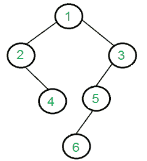

# 打印所有没有同级的节点

> 原文:[https://www . geesforgeks . org/print-nodes-don-同胞-二叉树/](https://www.geeksforgeeks.org/print-nodes-dont-sibling-binary-tree/)

给定二叉树，打印所有没有兄弟节点的节点(兄弟节点是具有相同父节点的节点。在二叉树中，最多只能有一个兄弟)。不应打印根目录，因为根目录不能有同级。
例如，对于下面的树，输出应该是“4 5 6”。

[](https://media.geeksforgeeks.org/wp-content/cdn-uploads/Binary-Tree.png)

这是一个典型的树遍历问题。我们从根开始，检查该节点是否有一个子节点，如果有，则打印该节点的唯一子节点。如果节点有两个子节点，则这两个子节点都重复出现。

下面是上述方法的实现:

## C++

```
/* Program to find singles in a given binary tree */
#include <bits/stdc++.h>
using namespace std;

// A Binary Tree Node
struct node
{
    struct node *left, *right;
    int key;
};

// Utility function to create a new tree node
node* newNode(int key)
{
    node *temp = new node;
    temp->key = key;
    temp->left = temp->right = NULL;
    return temp;
}

// Function to print all non-root nodes
// that don't have a sibling
void printSingles(struct node *root)
{
    // Base case
    if (root == NULL)
      return;

    // If this is an internal node, recur for left
    // and right subtrees
    if (root->left != NULL && root->right != NULL)
    {
        printSingles(root->left);
        printSingles(root->right);
    }

    // If left child is NULL and right is not,
    // print right child
    // and recur for right child
    else if (root->right != NULL)
    {
        cout << root->right->key << " ";
        printSingles(root->right);
    }

    // If right child is NULL and left is
    // not, print left child
    // and recur for left child
    else if (root->left != NULL)
    {
        cout << root->left->key << " ";
        printSingles(root->left);
    }
}

// Driver program to test above functions
int main()
{
    // Let us create binary tree
    // given in the above example
    node *root = newNode(1);
    root->left = newNode(2);
    root->right = newNode(3);
    root->left->right = newNode(4);
    root->right->left = newNode(5);
    root->right->left->left = newNode(6);
    printSingles(root);
    return 0;
}
```

## Java 语言(一种计算机语言，尤用于创建网站)

```
// Java program to print all nodes
// that don't have sibling

// A binary tree node
class Node
{
    int data;
    Node left, right;

    Node(int item)
    {
        data = item;
        left = right = null;
    }
}

class BinaryTree
{
    Node root;

    // Function to print all non-root nodes
    // that don't have a sibling
    void printSingles(Node node)
    {
    // Base case
    if (node == null)
      return;

    // If this is an internal node, recur for left
    // and right subtrees
    if (node.left != null && node.right != null)
    {
        printSingles(node.left);
        printSingles(node.right);
    }

    // If left child is NULL and right
    // is not, print right child
    // and recur for right child
    else if (node.right != null)
    {
        System.out.print(node.right.data + " ");
        printSingles(node.right);
    }

    // If right child is NULL and left
    // is not, print left child
    // and recur for left child
    else if (node.left != null)
    {
        System.out.print( node.left.data + " ");
        printSingles(node.left);
    }
}
    // Driver program to test the above functions
    public static void main(String args[])
    {
        BinaryTree tree = new BinaryTree();

        /* Let us construct the tree
           shown in above diagram */
        tree.root = new Node(1);
        tree.root.left = new Node(2);
        tree.root.right = new Node(3);
        tree.root.left.right = new Node(4);
        tree.root.right.left = new Node(5);
        tree.root.right.left.right = new Node(6);
        tree.printSingles(tree.root);
    }
}

// This code has been contributed by Mayank Jaiswal
```

## 计算机编程语言

```
# Python3 program to find singles in a given binary tree

# A Binary Tree Node
class Node:

    # A constructor to create new tree node
    def __init__(self, key):
        self.key = key
        self.left = None
        self.right = None

# Function to print all non-root nodes that don't have
# a sibling
def printSingles(root):

    # Base Case
    if root is None:
        return

    # If this is an internal node , recur for left
    # and right subtrees
    if root.left is not None and root.right is not None:
        printSingles(root.left)
        printSingles(root.right)

    # If left child is NULL, and right is not, print
    # right child and recur for right child
    elif root.right is not None:
        print root.right.key,
        printSingles(root.right)

    # If right child is NULL and left is not, print
    # left child and recur for left child
    elif root.left is not None:
        print root.left.key,
        printSingles(root.left)

# Driver program to test above function
root = Node(1)
root.left = Node(2)
root.right = Node(3)
root.left.right = Node(4)
root.right.left = Node(5)
root.right.left.left = Node(6)
printSingles(root)

# This code is contributed by Nikhil Kumar Singh(nickzuck_007)
```

## C#

```
using System;

// C# program to print all nodes that don't have sibling

// A binary tree node
public class Node
{
    public int data;
    public Node left, right;

    public Node(int item)
    {
        data = item;
        left = right = null;
    }
}

public class BinaryTree
{
    public Node root;

    // Function to print all non-root nodes that don't have a sibling
    public virtual void printSingles(Node node)
    {
    // Base case
    if (node == null)
    {
      return;
    }

    // If this is an internal node, recur for left
    // and right subtrees
    if (node.left != null && node.right != null)
    {
        printSingles(node.left);
        printSingles(node.right);
    }

    // If left child is NULL and right is not, print right child
    // and recur for right child
    else if (node.right != null)
    {
        Console.Write(node.right.data + " ");
        printSingles(node.right);
    }

    // If right child is NULL and left is not, print left child
    // and recur for left child
    else if (node.left != null)
    {
        Console.Write(node.left.data + " ");
        printSingles(node.left);
    }
    }
    // Driver program to test the above functions
    public static void Main(string[] args)
    {
        BinaryTree tree = new BinaryTree();

        /* Let us construct the tree shown in above diagram */
        tree.root = new Node(1);
        tree.root.left = new Node(2);
        tree.root.right = new Node(3);
        tree.root.left.right = new Node(4);
        tree.root.right.left = new Node(5);
        tree.root.right.left.right = new Node(6);
        tree.printSingles(tree.root);
    }
}

// This code is contributed by Shrikant13
```

## java 描述语言

```
<script>

      // JavaScript program to print all
      // nodes that don't have sibling

      // A binary tree node
      class Node {
        constructor(item) {
          this.data = item;
          this.left = null;
          this.right = null;
        }
      }

      class BinaryTree {
        constructor() {
          this.root = null;
        }
        // Function to print all non-root nodes
        // that don't have a sibling
        printSingles(node) {
          // Base case
          if (node == null) {
            return;
          }

          // If this is an internal node, recur for left
          // and right subtrees
          if (node.left != null && node.right != null) {
            this.printSingles(node.left);
            this.printSingles(node.right);
          }

          // If left child is NULL and right is not,
          // print right child
          // and recur for right child
          else if (node.right != null) {
            document.write(node.right.data + " ");
            this.printSingles(node.right);
          }

          // If right child is NULL and left is not,
          // print left child
          // and recur for left child
          else if (node.left != null) {
            document.write(node.left.data + " ");
            this.printSingles(node.left);
          }
        }
      }
      // Driver program to test the above functions
      var tree = new BinaryTree();

      /* Let us construct the tree shown in above diagram */
      tree.root = new Node(1);
      tree.root.left = new Node(2);
      tree.root.right = new Node(3);
      tree.root.left.right = new Node(4);
      tree.root.right.left = new Node(5);
      tree.root.right.left.right = new Node(6);
      tree.printSingles(tree.root);

</script>
```

**输出:**

```
4 5 6 
```

**时间复杂度:** O(n)

**在**中交替实现**迭代方法:**

我们从根开始，检查该节点是否有一个子节点，如果有，则打印该节点的唯一子节点。如果该节点有两个子节点，则推送队列中的两个子节点。

下面是上述方法的实现:

## C++14

```
// CPP program for above approach
#include <bits/stdc++.h>
using namespace std; 

// A Binary Tree Node 
struct node 
{ 
    struct node *left, *right; 
    int data; 
}; 

// Utility function to
// create a new tree node 
node* newNode(int key) 
{ 
  node *temp = new node; 
  temp->data= key; 
  temp->left = temp->right = NULL; 
  return temp; 
} 

// Function to print all
// non-root nodes that
// don't have a sibling 
void printSingles(struct node *root) 
{ 

  // Base case 
  if (root == NULL) 
   return; 

  queue<node *> q1;
  q1.push(root);

  int flag=0;
  vector<int> v;

  // While q1 is not empty
  while(q1.empty() == false)
  {
      struct node * temp=q1.front();
      q1.pop();

      // Check if temp->left is not
      // NULL and temp->right is NULL
      if(temp->left != NULL &&
                      temp->right == NULL)
      {
          flag=1;
          v.push_back(temp->left->data);
      }

      // Check if temp->left is equal
      // NULL and temp->right is not NULL
      if(temp->left == NULL &&
                        temp->right != NULL)
      {
          flag=1;
          v.push_back(temp->right->data);
      }

      // Check if temp->left is not
      // NULL
      if(temp->left != NULL)
      {
          q1.push(temp->left);
      }

      // Check if temp->right is not
      // NULL
      if(temp->right != NULL)
      {
          q1.push(temp->right);
      }
  }

  // Sort v in increasing order
  sort(v.begin(), v.end());

  // Iterate i from 0 to v.size() - 1
  for (int i = 0; i < v.size(); i++)
  {
      cout<< v[i] << " ";
  }

  // Check is v is empty
  if (v.size() == 0)
  {
      cout<<"-1";
  } 
} 

// Driver program to test
// above functions 
int main() 
{ 

  // Let us create binary tree
  // given in the above example 
  node *root = newNode(1); 
  root->left = newNode(2); 
  root->right = newNode(3); 
  root->left->right = newNode(4); 
  root->right->left = newNode(5); 
  root->right->left->left = newNode(6); 

  // Function Call
  printSingles(root); 
  return 0; 
}
```

## Java 语言(一种计算机语言，尤用于创建网站)

```
// JAVA program for above approach
import java.util.*;
class GFG
{ 

// A Binary Tree Node 
static class node 
{ 
    node left, right; 
    int data; 
}; 

// Utility function to
// create a new tree node 
static node newNode(int key) 
{ 
  node temp = new node(); 
  temp.data = key; 
  temp.left = temp.right = null; 
  return temp; 
} 

// Function to print all
// non-root nodes that
// don't have a sibling 
static void printSingles(node root) 
{ 

  // Base case 
  if (root == null) 
   return;   
  Queue<node > q1 = new LinkedList<>();
  q1.add(root);
  int flag = 0;
  Vector<Integer> v = new Vector<>();

  // While q1 is not empty
  while(q1.isEmpty() == false)
  {
      node  temp = q1.peek();
      q1.remove();

      // Check if temp.left is not
      // null and temp.right is null
      if(temp.left != null &&
                      temp.right == null)
      {
          flag = 1;
          v.add(temp.left.data);
      }

      // Check if temp.left is equal
      // null and temp.right is not null
      if(temp.left == null &&
                        temp.right != null)
      {
          flag = 1;
          v.add(temp.right.data);
      }

      // Check if temp.left is not
      // null
      if(temp.left != null)
      {
          q1.add(temp.left);
      }

      // Check if temp.right is not
      // null
      if(temp.right != null)
      {
          q1.add(temp.right);
      }
  }

  // Sort v in increasing order
  Collections.sort(v);

  // Iterate i from 0 to v.size() - 1
  for (int i = 0; i < v.size(); i++)
  {
      System.out.print( v.get(i) + " ");
  }

  // Check is v is empty
  if (v.size() == 0)
  {
      System.out.print("-1");
  } 
} 

// Driver program to test
// above functions 
public static void main(String[] args) 
{ 

  // Let us create binary tree
  // given in the above example 
  node root = newNode(1); 
  root.left = newNode(2); 
  root.right = newNode(3); 
  root.left.right = newNode(4); 
  root.right.left = newNode(5); 
  root.right.left.left = newNode(6); 

  // Function Call
  printSingles(root); 
}
} 

// This code is contributed by aashish1995
```

## 蟒蛇 3

```
# Python3 program for above approach
from queue import Queue

# A Binary Tree Node
class Node:

    # A constructor to create new tree node
    def __init__(self, key):

        self.key = key
        self.left = None
        self.right = None

# Function to print all non-root nodes
# that don't have a sibling
def printSingles(root):

    # Base Case
    if root is None:
        return

    q1 = Queue(maxsize = 100)
    q1.put(root)
    flag = 0
    v = []

    # While q1 is not empty
    while q1.empty() == False:
        temp = q1.get()

        # Check if temp->left is not
        # NULL and temp->right is NULL
        if temp.left is not None and temp.right is None:
            flag = 1
            v.append(temp.left.key)

        # Check if temp->left is equal
        # NULL and temp->right is not NULL
        if temp.left is None and temp.right is not None:
            flag = 1
            v.append(temp.right.key)

        # Check if temp->left is not
        # NULL
        if temp.left is not None:
            q1.put(temp.left)

        # Check if temp->right is not
        # NULL
        if temp.right is not None:
            q1.put(temp.right)

    # Sort v in increasing order
    v.sort()   
    for i in v:
        print(i, end = " ")

    # Check is v is empty
    if len(v) == 0:
        print("-1")

# Driver code
root = Node(1)
root.left = Node(2)
root.right = Node(3)
root.left.right = Node(4)
root.right.left = Node(5)
root.right.left.left = Node(6)

printSingles(root)

# This code is contributed by codersaty
```

## C#

```
// C# program for above approach
using System;
using System.Collections.Generic;

class GFG
{ 

  // A Binary Tree Node 
  public
    class node 
    { 
      public
        node left, right; 
      public
        int data; 
    }; 

  // Utility function to
  // create a new tree node 
  static node newNode(int key) 
  { 
    node temp = new node(); 
    temp.data = key; 
    temp.left = temp.right = null; 
    return temp; 
  } 

  // Function to print all
  // non-root nodes that
  // don't have a sibling 
  static void printSingles(node root) 
  { 

    // Base case 
    if (root == null) 
      return;   
    Queue<node > q1 = new Queue<node>();
    q1.Enqueue(root);
    int flag = 0;
    List<int> v = new List<int>();

    // While q1 is not empty
    while(q1.Count != 0)
    {
      node  temp = q1.Peek();
      q1.Dequeue();

      // Check if temp.left is not
      // null and temp.right is null
      if(temp.left != null &&
         temp.right == null)
      {
        flag = 1;
        v.Add(temp.left.data);
      }

      // Check if temp.left is equal
      // null and temp.right is not null
      if(temp.left == null &&
         temp.right != null)
      {
        flag = 1;
        v.Add(temp.right.data);
      }

      // Check if temp.left is not
      // null
      if(temp.left != null)
      {
        q1.Enqueue(temp.left);
      }

      // Check if temp.right is not
      // null
      if(temp.right != null)
      {
        q1.Enqueue(temp.right);
      }
    }

    // Sort v in increasing order
    v.Sort();

    // Iterate i from 0 to v.Count - 1
    for (int i = 0; i < v.Count; i++)
    {
      Console.Write( v[i] + " ");
    }

    // Check is v is empty
    if (v.Count == 0)
    {
      Console.Write("-1");
    } 
  } 

  // Driver program to test
  // above functions 
  public static void Main(String[] args) 
  { 

    // Let us create binary tree
    // given in the above example 
    node root = newNode(1); 
    root.left = newNode(2); 
    root.right = newNode(3); 
    root.left.right = newNode(4); 
    root.right.left = newNode(5); 
    root.right.left.left = newNode(6); 

    // Function Call
    printSingles(root); 
  }
} 

// This code is contributed by Rajput-Ji.
```

## java 描述语言

```
<script>

// JavaScript program for above approach

    // A Binary Tree Node
    class node {
    constructor(val) {
        this.data = val;
        this.left = null;
        this.right = null;
    }
}

    // Utility function to
    // create a new tree node
     function newNode(key) {
        var temp = new node();
        temp.data = key;
        temp.left = temp.right = null;
        return temp;
    }

    // Function to print all
    // non-root nodes that
    // don't have a sibling
    function printSingles( root) {

        // Base case
        if (root == null)
            return;
        var q1 = [];
        q1.push(root);
        var flag = 0;
        var v = [];

        // While q1 is not empty
        while (q1.length != 0) {
            var temp = q1.pop();

            // Check if temp.left is not
            // null and temp.right is null
            if (temp.left != null && temp.right == null) {
                flag = 1;
                v.push(temp.left.data);
            }

            // Check if temp.left is equal
            // null and temp.right is not null
            if (temp.left == null && temp.right != null) {
                flag = 1;
                v.push(temp.right.data);
            }

            // Check if temp.left is not
            // null
            if (temp.left != null) {
                q1.push(temp.left);
            }

            // Check if temp.right is not
            // null
            if (temp.right != null) {
                q1.push(temp.right);
            }
        }

        // Sort v in increasing order
        v.sort((a,b)=>a-b);

        // Iterate i from 0 to v.size() - 1
        for (i = 0; i < v.length; i++) {
            document.write(v[i] + " ");
        }

        // Check is v is empty
        if (v.length == 0) {
            document.write("-1");
        }
    }

    // Driver program to test
    // above functions

        // Let us create binary tree
        // given in the above example
        var root = newNode(1);
        root.left = newNode(2);
        root.right = newNode(3);
        root.left.right = newNode(4);
        root.right.left = newNode(5);
        root.right.left.left = newNode(6);

        // Function Call
        printSingles(root);

// This code contributed by umadevi9616

</script>
```

**Output**

```
4 5 6 
```

本文由**阿曼古普塔**整理。如果您发现任何不正确的地方，或者您想分享关于上面讨论的主题的更多信息，请写评论