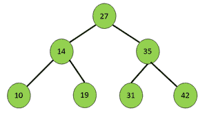
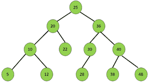

# 按照顶层顺序和颠倒底层顺序交替打印二叉查找树的节点

> 原文:[https://www . geesforgeks . org/print-二进制搜索树的节点-顶层-顺序-和-颠倒-底层-顺序-交替/](https://www.geeksforgeeks.org/print-nodes-of-a-binary-search-tree-in-top-level-order-and-reversed-bottom-level-order-alternately/)

给定一个[二叉查找树](https://www.geeksforgeeks.org/binary-search-tree-set-1-search-and-insertion/)，任务是按照以下顺序打印 BST 的节点:

*   如果 BST 包含编号从 ***1*** 到 ***N*** 的级别，则打印顺序为级别 ***1*** 、级别 ***N*** 、级别 ***2*** 、级别***N–1***等等。
*   顶层顺序(***)1、2*** 、…)节点从左至右打印，底层顺序(***【N】***、 ***N-1*** 、…)节点从右至左打印。

**示例:**

> **输入:**
> [](https://media.geeksforgeeks.org/wp-content/uploads/20200918150402/pic2-300x167.png) 
> **输出:** 27 42 31 19 10 14 35
> **解释:**
> 一级从左到右:27
> 三级从右到左:42 31 19 10
> 二级从左到右:14 35
> 
> **输入:**
> [](https://media.geeksforgeeks.org/wp-content/uploads/20200918150049/pic1-300x165.png) 
> **输出:** 25 48 38 28 12 5 20 36 40 30 22 10

**做法:**解决问题的思路是将 BST 的节点按照级别和节点值的升序和降序进行存储，在升序和降序之间交替打印同一级别的所有节点。按照以下步骤解决问题:

*   初始化一个[最小堆](https://www.geeksforgeeks.org/implement-min-heap-using-stl/)和一个[最大堆](https://www.geeksforgeeks.org/priority-queue-in-cpp-stl/)，分别按照级别和节点值的升序和降序存储节点。
*   在给定的 **BST** 上执行[级顺序遍历](https://www.geeksforgeeks.org/level-order-tree-traversal/)，以将节点存储在相应的[优先级队列](https://www.geeksforgeeks.org/priority-queue-set-1-introduction/)中。
*   从**最小堆**开始，依次交替打印每一级的所有节点**最大堆**。
*   如果发现**最小堆**或**最大堆**中的任何一级已经打印，跳到下一级。

下面是上述方法的实现:

## C++

```
// C++ program for the above approach

#include <bits/stdc++.h>
using namespace std;

// Structure of a BST node
struct node {
    int data;
    struct node* left;
    struct node* right;
};

// Utility function to create a new BST node
struct node* newnode(int d)
{
    struct node* temp
        = (struct node*)malloc(sizeof(struct node));
    temp->left = NULL;
    temp->right = NULL;
    temp->data = d;
    return temp;
}

// Function to print the nodes of a
// BST in Top Level Order and Reversed
// Bottom Level Order alternatively
void printBST(node* root)
{
    // Stores the nodes in descending order
    // of the level and node values
    priority_queue<pair<int, int> > great;

    // Stores the nodes in ascending order
    // of the level and node values

    priority_queue<pair<int, int>,
                   vector<pair<int, int> >,
                   greater<pair<int, int> > >
        small;

    // Initialize a stack for
    // level order traversal
    stack<pair<node*, int> > st;

    // Push the root of BST
    // into the stack
    st.push({ root, 1 });

    // Perform Level Order Traversal
    while (!st.empty()) {

        // Extract and pop the node
        // from the current level
        node* curr = st.top().first;

        // Stores level of current node
        int level = st.top().second;
        st.pop();

        // Store in the priority queues
        great.push({ level, curr->data });
        small.push({ level, curr->data });

        // Traverse left subtree
        if (curr->left)
            st.push({ curr->left, level + 1 });

        // Traverse right subtree
        if (curr->right)
            st.push({ curr->right, level + 1 });
    }

    // Stores the levels that are printed
    unordered_set<int> levelsprinted;

    // Print the nodes in the required manner
    while (!small.empty() && !great.empty()) {

        // Store the top level of traversal
        int toplevel = small.top().first;

        // If the level is already printed
        if (levelsprinted.find(toplevel)
            != levelsprinted.end())
            break;

        // Otherwise
        else
            levelsprinted.insert(toplevel);

        // Print nodes of same level
        while (!small.empty()
               && small.top().first == toplevel) {
            cout << small.top().second << " ";
            small.pop();
        }

        // Store the bottom level of traversal
        int bottomlevel = great.top().first;

        // If the level is already printed
        if (levelsprinted.find(bottomlevel)
            != levelsprinted.end()) {
            break;
        }
        else {
            levelsprinted.insert(bottomlevel);
        }

        // Print the nodes of same level
        while (!great.empty()
               && great.top().first == bottomlevel) {
            cout << great.top().second << " ";
            great.pop();
        }
    }
}

// Driver Code
int main()
{
    /*
    Given BST

                                25
                              /     \
                            20      36
                           /  \      / \
                          10   22   30 40
                         /  \      /   / \
                        5   12    28  38 48
    */

    // Creating the BST
    node* root = newnode(25);
    root->left = newnode(20);
    root->right = newnode(36);
    root->left->left = newnode(10);
    root->left->right = newnode(22);
    root->left->left->left = newnode(5);
    root->left->left->right = newnode(12);
    root->right->left = newnode(30);
    root->right->right = newnode(40);
    root->right->left->left = newnode(28);
    root->right->right->left = newnode(38);
    root->right->right->right = newnode(48);

    // Function Call
    printBST(root);

    return 0;
}
```

**Output:**

```
25 48 38 28 12 5 20 36 40 30 22 10

```

***时间复杂度:** O(V log(V))，其中 V 表示给定二叉树中的顶点数*
***辅助空间:** O(V)*