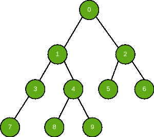

# 打印二叉树中任意两个节点之间的路径|集合 2

> 原文:[https://www . geesforgeks . org/print-二进制树中任意两个节点之间的路径-set-2/](https://www.geeksforgeeks.org/print-path-between-any-two-nodes-in-a-binary-tree-set-2/)

给定由不同节点和一对节点组成的二叉树。任务是找到并打印二叉树中两个给定节点之间的路径。
**例:**

> **输入:** N1 = 7，N2 = 4
> 
> 
> 
> **输出:** 7 3 1 4

**方法:**在[这篇](https://www.geeksforgeeks.org/print-path-between-any-two-nodes-in-a-binary-tree/)文章中已经讨论了解决这个问题的方法。在本文中，将讨论一种甚至优化的递归方法。
在这种递归方法中，以下是步骤:

1.  递归地查找第一个值，一旦找到就将该值添加到堆栈中。
2.  现在，无论是在回溯还是前向跟踪中，每个被访问的节点都会将值添加到堆栈中，但如果该节点是在前向跟踪中添加的，则在回溯中将其移除，并继续执行此操作，直到找到第二个值或所有节点都被访问。

**例如:**考虑 7 和 9 之间的路径要在上面的树中找到。我们以 DFS 的形式遍历树，一旦找到值 7，就将其添加到堆栈中。穿越路径 0 - > 1 - > 3 - > 7。
现在回溯时，在堆栈中添加 3 和 1。所以到目前为止，堆栈有[7，3，1]，子级 1 有一个右子级，所以我们首先将它添加到堆栈中。现在，堆栈包含[7，3，1，4]。访问 4 的左子代，将其添加到堆栈中。堆栈现在包含[7，3，1，4，8]。由于没有进一步的节点，我们将返回到前一个节点，并且因为 8 已经被添加到堆栈中，所以删除它。现在节点 4 有了一个正确的子节点，我们将其添加到堆栈中，因为这是我们要寻找的第二个值，不会再有任何递归调用。最后，堆栈包含[7，3，1，4，9]。
以下是上述办法的实施:

## C++

```
// CPP implementation of the approach
#include <bits/stdc++.h>
using namespace std;

// A binary tree node
class Node {
 public:
  int value;
  Node *left, *right;

  Node(int value) {
    this->value = value;
    left = NULL;
    right = NULL;
  }
};

bool firstValueFound = false;
bool secondValueFound = false;
stack<Node *> stk;
Node *root = NULL;

// Function to find the path between
// two nodes in binary tree
void pathBetweenNode(Node *root, int v1, int v2) {
  // Base condition
  if (root == NULL) return;

  // If both the values are found then return
  if (firstValueFound && secondValueFound) return;

  // Starting the stack frame with
  // isAddedToStack = false flag
  bool isAddedToStack = false;

  // If one of the value is found then add the
  // value to the stack and make the isAddedToStack = true
  if (firstValueFound ^ secondValueFound) {
    stk.push(root);
    isAddedToStack = true;
  }

  // If none of the two values is found
  if (!(firstValueFound && secondValueFound)) {
    pathBetweenNode(root->left, v1, v2);
  }

  // Ccopy of current state of firstValueFound
  // and secondValueFound flag
  bool localFirstValueFound = firstValueFound;
  bool localSecondValueFound = secondValueFound;

  // If the first value is found
  if (root->value == v1) firstValueFound = true;

  // If the second value is found
  if (root->value == v2) secondValueFound = true;

  bool localAdded = false;

  // If one of the value is found and the value
  // was not added to the stack yet or there was
  // only one value found and now both the values
  // are found and was not added to
  // the stack then add it
  if (((firstValueFound ^ secondValueFound) ||
       ((localFirstValueFound ^ localSecondValueFound) &&
        (firstValueFound && secondValueFound))) &&
      !isAddedToStack) {
    localAdded = true;
    stk.push(root);
  }

  // If none of the two values is found yet
  if (!(firstValueFound && secondValueFound)) {
    pathBetweenNode(root->right, v1, v2);
  }

  if ((firstValueFound ^ secondValueFound) && !isAddedToStack && !localAdded)
    stk.push(root);

  if ((firstValueFound ^ secondValueFound) && isAddedToStack) stk.pop();
}

// Function to find the path between
// two nodes in binary tree
stack<Node *> pathBetweenNode(int v1, int v2)
{

  // Global root
  pathBetweenNode(::root, v1, v2);

  // If both the values are found
  // then return the stack
  if (firstValueFound && secondValueFound)
  {

    // Global Stack Object
    return ::stk;
  }

  // If none of the two values is
  // found then return empty stack
  stack<Node *> stk;
  return stk;
}

// Recursive function to print the
// contents of a stack in reverse
void print(stack<Node *> stk)
{

  // If the stack is empty
  if (stk.empty()) return;

  // Get the top value
  int value = stk.top()->value;
  stk.pop();

  // Recursive call
  print(stk);

  // Print the popped value
  cout << value << " ";
}

// Driver code
int main(int argc, char const *argv[])
{
  root = new Node(0);
  root->left = new Node(1);
  root->right = new Node(2);
  root->left->left = new Node(3);
  root->left->right = new Node(4);
  root->right->left = new Node(5);
  root->right->right = new Node(6);
  root->left->left->left = new Node(7);
  root->left->right->left = new Node(8);
  root->left->right->right = new Node(9);

  // Find and print the path
  stack<Node *> stck = pathBetweenNode(7, 4);
  print(stck);
}

// This code is contributed by sanjeev2552
```

## Java 语言(一种计算机语言，尤用于创建网站)

```
// Java implementation of the approach
import java.util.Stack;

public class GFG {

    // A binary tree node
    private static class Node {
        public Node left;
        public int value;
        public Node right;

        public Node(int value)
        {
            this.value = value;
            left = null;
            right = null;
        }
    }

    private boolean firstValueFound = false;
    private boolean secondValueFound = false;
    private Stack<Node> stack = new Stack<Node>();
    private Node root = null;

    public GFG(Node root)
    {
        this.root = root;
    }

    // Function to find the path between
    // two nodes in binary tree
    public Stack<Node> pathBetweenNode(int v1, int v2)
    {
        pathBetweenNode(this.root, v1, v2);

        // If both the values are found
        // then return the stack
        if (firstValueFound && secondValueFound) {
            return stack;
        }

        // If none of the two values is
        // found then return empty stack
        return new Stack<Node>();
    }

    // Function to find the path between
    // two nodes in binary tree
    private void pathBetweenNode(Node root, int v1, int v2)
    {
        // Base condition
        if (root == null)
            return;

        // If both the values are found then return
        if (firstValueFound && secondValueFound)
            return;

        // Starting the stack frame with
        // isAddedToStack = false flag
        boolean isAddedToStack = false;

        // If one of the value is found then add the
        // value to the stack and make the isAddedToStack = true
        if (firstValueFound ^ secondValueFound) {
            stack.add(root);
            isAddedToStack = true;
        }

        // If none of the two values is found
        if (!(firstValueFound && secondValueFound)) {
            pathBetweenNode(root.left, v1, v2);
        }

        // Ccopy of current state of firstValueFound
        // and secondValueFound flag
        boolean localFirstValueFound = firstValueFound;
        boolean localSecondValueFound = secondValueFound;

        // If the first value is found
        if (root.value == v1)
            firstValueFound = true;

        // If the second value is found
        if (root.value == v2)
            secondValueFound = true;

        boolean localAdded = false;

        // If one of the value is found and the value
        // was not added to the stack yet or there was
        // only one value found and now both the values
        // are found and was not added to
        // the stack then add it
        if (((firstValueFound ^ secondValueFound)
             || ((localFirstValueFound ^ localSecondValueFound)
                 && (firstValueFound && secondValueFound)))
            && !isAddedToStack) {
            localAdded = true;
            stack.add(root);
        }

        // If none of the two values is found yet
        if (!(firstValueFound && secondValueFound)) {
            pathBetweenNode(root.right, v1, v2);
        }

        if ((firstValueFound ^ secondValueFound)
            && !isAddedToStack && !localAdded)
            stack.add(root);

        if ((firstValueFound ^ secondValueFound)
            && isAddedToStack)
            stack.pop();
    }

    // Recursive function to print the
    // contents of a stack in reverse
    private static void print(Stack<Node> stack)
    {

        // If the stack is empty
        if (stack.isEmpty())
            return;

        // Get the top value
        int value = stack.pop().value;

        // Recursive call
        print(stack);

        // Print the popped value
        System.out.print(value + " ");
    }

    // Driver code
    public static void main(String[] args)
    {
        Node root = new Node(0);
        root.left = new Node(1);
        root.right = new Node(2);
        root.left.left = new Node(3);
        root.left.right = new Node(4);
        root.right.left = new Node(5);
        root.right.right = new Node(6);
        root.left.left.left = new Node(7);
        root.left.right.left = new Node(8);
        root.left.right.right = new Node(9);

        // Find and print the path
        GFG pathBetweenNodes = new GFG(root);
        Stack<Node> stack
            = pathBetweenNodes.pathBetweenNode(7, 4);
        print(stack);
    }
}
```

## 蟒蛇 3

```
# Python3 implementation of
# the above approach

# A binary tree node
class Node:

    def __init__(self, value):

        self.left = None
        self.right = None
        self.value = value

firstValueFound = False
secondValueFound = False
stack = []
root = None

# Function to find the path
# between two nodes in binary
# tree
def pathBetweennode(v1, v2):

    global firstValueFound, secondValueFound
    pathBetweenNode(root, v1, v2)

    # If both the values are found
    # then return the stack
    if (firstValueFound and
        secondValueFound):
        return stack

    # If none of the two values is
    # found then return empty stack
    return []

# Function to find the path
# between two nodes in binary
# tree
def pathBetweenNode(root,
                    v1, v2):
    global firstValueFound, secondValueFound

    # Base condition
    if (root == None):
        return

    # If both the values are found
    # then return
    if (firstValueFound and
        secondValueFound):
        return

    # Starting the stack frame with
    # isAddedToStack = false flag
    isAddedToStack = False

    # If one of the value is found
    # then add the value to the
    # stack and make the isAddedToStack = true
    if (firstValueFound ^ secondValueFound):
        stack.append(root)
        isAddedToStack = True

    # If none of the two values
    # is found
    if (not (firstValueFound and
             secondValueFound)):
        pathBetweenNode(root.left,
                        v1, v2)

    # Ccopy of current state of
    # firstValueFound and
    # secondValueFound flag
    localFirstValueFound = firstValueFound
    localSecondValueFound = secondValueFound

    # If the first value is found
    if (root.value == v1):
        firstValueFound = True

    # If the second value is found
    if (root.value == v2):
        secondValueFound = True

    localAdded = False

    # If one of the value is found
    # and the value was not added
    # to the stack yet or there was
    # only one value found and now
    # both the values are found and
    # was not added to the stack
    # then add it
    if (((firstValueFound ^
          secondValueFound) or
        ((localFirstValueFound ^
          localSecondValueFound) and
         (firstValueFound and
          secondValueFound))) and
          not isAddedToStack):
        localAdded = True
        stack.append(root)

    # If none of the two values
    # is found yet
    if (not (firstValueFound and
             secondValueFound)):
        pathBetweenNode(root.right,
                        v1, v2)

    if ((firstValueFound ^
         secondValueFound) and
         not isAddedToStack and
         not localAdded):
        stack.append(root)

    if ((firstValueFound ^
         secondValueFound) and
         isAddedToStack):
        stack.pop()

# Recursive function to print
# the contents of a stack in
# reverse
def pri(stack):

    # If the stack is empty
    if (len(stack) == 0):
        return

    # Get the top value
    value = stack.pop().value

    # Recursive call
    pri(stack)

    # Print the popped value
    print(value, end = " ")

# Driver code
if __name__ == "__main__":

    root = Node(0)
    root.left = Node(1)
    root.right = Node(2)
    root.left.left = Node(3)
    root.left.right = Node(4)
    root.right.left = Node(5)
    root.right.right = Node(6)
    root.left.left.left = Node(7)
    root.left.right.left = Node(8)
    root.left.right.right = Node(9)

    # Find and print the path
    stack = pathBetweennode(7, 4)
    pri(stack)

# This code is contributed by Rutvik_56
```

## C#

```
// C# implementation of the approach
using System;
using System.Collections;
using System.Collections.Generic;

class GFG
{

    // A binary tree node
    public class Node
    {
        public Node left;
        public int value;
        public Node right;

        public Node(int value)
        {
            this.value = value;
            left = null;
            right = null;
        }
    }

    private Boolean firstValueFound = false;
    private Boolean secondValueFound = false;
    private Stack<Node> stack = new Stack<Node>();
    private Node root = null;

    public GFG(Node root)
    {
        this.root = root;
    }

    // Function to find the path between
    // two nodes in binary tree
    public Stack<Node> pathBetweenNode(int v1, int v2)
    {
        pathBetweenNode(this.root, v1, v2);

        // If both the values are found
        // then return the stack
        if (firstValueFound && secondValueFound)
        {
            return stack;
        }

        // If none of the two values is
        // found then return empty stack
        return new Stack<Node>();
    }

    // Function to find the path between
    // two nodes in binary tree
    private void pathBetweenNode(Node root, int v1, int v2)
    {
        // Base condition
        if (root == null)
            return;

        // If both the values are found then return
        if (firstValueFound && secondValueFound)
            return;

        // Starting the stack frame with
        // isAddedToStack = false flag
        Boolean isAddedToStack = false;

        // If one of the value is found then add the
        // value to the stack and make the isAddedToStack = true
        if (firstValueFound ^ secondValueFound)
        {
            stack.Push(root);
            isAddedToStack = true;
        }

        // If none of the two values is found
        if (!(firstValueFound && secondValueFound))
        {
            pathBetweenNode(root.left, v1, v2);
        }

        // Ccopy of current state of firstValueFound
        // and secondValueFound flag
        Boolean localFirstValueFound = firstValueFound;
        Boolean localSecondValueFound = secondValueFound;

        // If the first value is found
        if (root.value == v1)
            firstValueFound = true;

        // If the second value is found
        if (root.value == v2)
            secondValueFound = true;

        Boolean localAdded = false;

        // If one of the value is found and the value
        // was not added to the stack yet or there was
        // only one value found and now both the values
        // are found and was not added to
        // the stack then add it
        if (((firstValueFound ^ secondValueFound)
            || ((localFirstValueFound ^ localSecondValueFound)
            && (firstValueFound && secondValueFound)))
            && !isAddedToStack)
        {
            localAdded = true;
            stack.Push(root);
        }

        // If none of the two values is found yet
        if (!(firstValueFound && secondValueFound))
        {
            pathBetweenNode(root.right, v1, v2);
        }

        if ((firstValueFound ^ secondValueFound)
            && !isAddedToStack && !localAdded)
            stack.Push(root);

        if ((firstValueFound ^ secondValueFound)
            && isAddedToStack)
            stack.Pop();
    }

    // Recursive function to print the
    // contents of a stack in reverse
    private static void print(Stack<Node> stack)
    {

        // If the stack is empty
        if (stack.Count==0)
            return;

        // Get the top value
        int value = stack.Pop().value;

        // Recursive call
        print(stack);

        // Print the Popped value
        Console.Write(value + " ");
    }

    // Driver code
    public static void Main(String []args)
    {
        Node root = new Node(0);
        root.left = new Node(1);
        root.right = new Node(2);
        root.left.left = new Node(3);
        root.left.right = new Node(4);
        root.right.left = new Node(5);
        root.right.right = new Node(6);
        root.left.left.left = new Node(7);
        root.left.right.left = new Node(8);
        root.left.right.right = new Node(9);

        // Find and print the path
        GFG pathBetweenNodes = new GFG(root);
        Stack<Node> stack
            = pathBetweenNodes.pathBetweenNode(7, 4);
        print(stack);
    }
}

// This code is contributed by Arnab Kundu
```

## java 描述语言

```
<script>

    // JavaScript implementation of the approach

    // A binary tree node
    class Node {
        constructor(value) {
           this.left = null;
           this.right = null;
           this.value = value;
        }
    }

    let firstValueFound = false;
    let secondValueFound = false;
    let stack = [];
    let root = null;

    // Function to find the path between
    // two nodes in binary tree
    function path_BetweenNode(root, v1, v2)
    {
        // Base condition
        if (root == null)
            return;

        // If both the values are found then return
        if (firstValueFound && secondValueFound)
            return;

        // Starting the stack frame with
        // isAddedToStack = false flag
        let isAddedToStack = false;

        // If one of the value is found then add the
        // value to the stack and make the isAddedToStack = true
        if (firstValueFound ^ secondValueFound) {
            stack.push(root);
            isAddedToStack = true;
        }

        // If none of the two values is found
        if (!(firstValueFound && secondValueFound)) {
            path_BetweenNode(root.left, v1, v2);
        }

        // Ccopy of current state of firstValueFound
        // and secondValueFound flag
        let localFirstValueFound = firstValueFound;
        let localSecondValueFound = secondValueFound;

        // If the first value is found
        if (root.value == v1)
            firstValueFound = true;

        // If the second value is found
        if (root.value == v2)
            secondValueFound = true;

        let localAdded = false;

        // If one of the value is found and the value
        // was not added to the stack yet or there was
        // only one value found and now both the values
        // are found and was not added to
        // the stack then add it
        if (((firstValueFound ^ secondValueFound)
             || ((localFirstValueFound ^ localSecondValueFound)
                 && (firstValueFound && secondValueFound)))
            && !isAddedToStack) {
            localAdded = true;
            stack.push(root);
        }

        // If none of the two values is found yet
        if (!(firstValueFound && secondValueFound)) {
            path_BetweenNode(root.right, v1, v2);
        }

        if ((firstValueFound ^ secondValueFound)
            && !isAddedToStack && !localAdded)
            stack.push(root);

        if ((firstValueFound ^ secondValueFound)
            && isAddedToStack)
            stack.pop();
    }

    // Function to find the path between
    // two nodes in binary tree
    function pathBetweenNode(v1, v2)
    {
        path_BetweenNode(root, v1, v2);

        // If both the values are found
        // then return the stack
        if (firstValueFound && secondValueFound) {
            return stack;
        }
        // If none of the two values is
        // found then return empty stack
        return [];
    }

    // Recursive function to print the
    // contents of a stack in reverse
    function print(stack)
    {

        // If the stack is empty
        if (stack.length == 0)
            return;

        // Get the top value
        let value = stack[stack.length - 1].value;
        stack.pop();

        // Recursive call
        print(stack);

        // Print the popped value
        document.write(value + " ");
    }

    root = new Node(0);
    root.left = new Node(1);
    root.right = new Node(2);
    root.left.left = new Node(3);
    root.left.right = new Node(4);
    root.right.left = new Node(5);
    root.right.right = new Node(6);
    root.left.left.left = new Node(7);
    root.left.right.left = new Node(8);
    root.left.right.right = new Node(9);

    // Find and print the path
    stack = pathBetweenNode(7, 4);
    print(stack);

</script>
```

**Output:** 

```
7 3 1 4
```