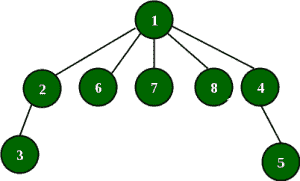

# 给定直径、高度和顶点的树的可能边

> 原文:[https://www . geesforgeks . org/print-可能-边-树-给定-直径-高度-顶点/](https://www.geeksforgeeks.org/print-possible-edges-tree-given-diameter-height-vertices/)

找到一棵有给定值的树，打印树的边。如果树不存在，则打印“-1”。

给定三个整数 n，d 和 h。

```
n -> Number of vertices. [1, n]
d -> Diameter of the tree (largest 
   distance between two vertices).
h -> Height of the tree (longest distance
   between vertex 1 and another vertex)
```

示例:

```
Input : n = 5, d = 3, h = 2 
Output : 1 2
         2 3
         1 4
         1 5
Explanation :  
```


```
We can see that the height of the tree is 2 (1 -> 
2 --> 5) and diameter is 3 ( 3 -> 2 -> 1 -> 5).
So our conditions are satisfied.

Input :  n = 8, d = 4, h = 2
Output : 1 2
         2 3
         1 4
         4 5
         1 6
         1 7
         1 8
Explanation :
```



1.  注意当 *d = 1，*我们不能构造一棵树(如果树有 2 个以上的顶点)。同样，当 *d > 2*h* 时，我们不能建造一棵树。
2.  我们知道，高度是从顶点 1 到另一个顶点的最长路径。所以从顶点 1 开始，通过添加边到 h 来构建路径。现在，如果 *d > h* ，我们应该添加另一条路径来满足从顶点 1 开始的直径，长度为*d–h*。
3.  我们的高度和直径条件得到了满足。但是仍然会留下一些顶点。在端点以外的任何顶点添加剩余顶点。这一步不会改变我们的直径和高度。选择顶点 1 以添加剩余的顶点(您可以选择任何一个)。
4.  但是当 *d == h* 时，选择顶点 2 来添加剩余的顶点。

## C++

```
// C++ program to construct tree for given count
// width and height.
#include <bits/stdc++.h>
using namespace std;

// Function to construct the tree
void constructTree(int n, int d, int h)
{
    if (d == 1) {

        // Special case when d == 2, only one edge
        if (n == 2 && h == 1) {
            cout << "1 2" << endl;
            return;
        }
        cout << "-1" << endl; // Tree is not possible
        return;
    }

    if (d > 2 * h) {
        cout << "-1" << endl;
        return;
    }

    // Satisfy the height condition by add
    // edges up to h
    for (int i = 1; i <= h; i++)    
        cout << i << " " << i + 1 << endl;

    if (d > h) {

        // Add d - h edges from 1 to
        // satisfy diameter condition
        cout << "1"
            << " " << h + 2 << endl;
        for (int i = h + 2; i <= d; i++) {
            cout << i << " " << i + 1 << endl;
        }
    }

    // Remaining edges at vertex 1 or 2(d == h)
    for (int i = d + 1; i < n; i++)
    {
        int k = 1;
        if (d == h)
            k = 2;
        cout << k << " " << i + 1 << endl;
    }
}

// Driver Code
int main()
{
    int n = 5, d = 3, h = 2;
    constructTree(n, d, h);
    return 0;
}
```

## Java 语言(一种计算机语言，尤用于创建网站)

```
// Java program to construct tree for given count
// width and height.
class GfG {

// Function to construct the tree
static void constructTree(int n, int d, int h)
{
    if (d == 1) {

        // Special case when d == 2, only one edge
        if (n == 2 && h == 1) {
            System.out.println("1 2");
            return;
        }
        System.out.println("-1"); // Tree is not possible
        return;
    }

    if (d > 2 * h) {
        System.out.println("-1");
        return;
    }

    // Satisfy the height condition by add
    // edges up to h
    for (int i = 1; i <= h; i++)    
        System.out.println(i + " " + (i + 1));

    if (d > h) {

        // Add d - h edges from 1 to
        // satisfy diameter condition
        System.out.println("1" + " " + (h + 2));
        for (int i = h + 2; i <= d; i++) {
            System.out.println(i + " " + (i + 1));
        }
    }

    // Remaining edges at vertex 1 or 2(d == h)
    for (int i = d + 1; i < n; i++)
    {
        int k = 1;
        if (d == h)
            k = 2;
        System.out.println(k + " " + (i + 1));
    }
}

// Driver Code
public static void main(String[] args)
{
    int n = 5, d = 3, h = 2;
    constructTree(n, d, h);
}
}
```

## 蟒蛇 3

```
# Python3 code to construct tree for given count
# width and height.

# Function to construct the tree
def constructTree(n, d, h):
    if d == 1:

        # Special case when d == 2, only one edge
        if n == 2 and h == 1:
            print("1 2")
            return 0

        print("-1")    # Tree is not possible
        return 0

    if d > 2 * h:
        print("-1")
        return 0

    # Satisfy the height condition by add
    # edges up to h
    for i in range(1, h+1):
        print(i," " , i + 1)

    if d > h:

        # Add d - h edges from 1 to
        # satisfy diameter condition
        print(1,"  ", h + 2)
        for i in range(h+2, d+1):
            print(i, " " , i + 1)

    # Remaining edges at vertex 1 or 2(d == h)
    for i in range(d+1, n):
        k = 1
        if d == h:
            k = 2
        print(k ," " , i + 1)

# Driver Code
n = 5
d = 3
h = 2
constructTree(n, d, h)

# This code is contributed by "Sharad_Bhardwaj".
```

## C#

```
// C# program to construct tree for 
// given count width and height.
using System;

class GfG
{

    // Function to construct the tree
    static void constructTree(int n, int d, int h)
    {
        if (d == 1)
        {

            // Special case when d == 2,
            // only one edge
            if (n == 2 && h == 1)
            {
                Console.WriteLine("1 2");
                return;
            }

            // Tree is not possible
            Console.WriteLine("-1");
            return;
        }

        if (d > 2 * h)
        {
            Console.WriteLine("-1");
            return;
        }

        // Satisfy the height condition
        // by add edges up to h
        for (int i = 1; i <= h; i++)
            Console.WriteLine(i + " " + (i + 1));

        if (d > h)
        {

            // Add d - h edges from 1 to
            // satisfy diameter condition
            Console.WriteLine("1" + " " + (h + 2));
            for (int i = h + 2; i <= d; i++)
            {
                Console.WriteLine(i + " " + (i + 1));
            }
        }

        // Remaining edges at vertex 1 or 2(d == h)
        for (int i = d + 1; i < n; i++)
        {
            int k = 1;
            if (d == h)
                k = 2;
            Console.WriteLine(k + " " + (i + 1));
        }
    }

    // Driver Code
    public static void Main(String[] args)
    {
        int n = 5, d = 3, h = 2;
        constructTree(n, d, h);
    }
}

// This code is contributed by 29AjayKumar
```

## java 描述语言

```
<script>

// Javascript program to construct tree for
// given count width and height.

// Function to construct the tree
function constructTree(n, d, h)
{
    if (d == 1)
    {

        // Special case when d == 2,
        // only one edge
        if (n == 2 && h == 1)
        {
            document.write("1 2", "<br>");
            return;
        }

        // Tree is not possible
        document.write("-1", "<br>");
        return;
    }

    if (d > 2 * h)
    {
        document.write("-1", "<br>");
        return;
    }

    // Satisfy the height condition
    // by add edges up to h
    for(var i = 1; i <= h; i++)
        document.write(i + " " + (i + 1), "<br>");

    if (d > h)
    {

        // Add d - h edges from 1 to
        // satisfy diameter condition
        document.write("1" + " " + (h + 2), "<br>");
        for(var i = h + 2; i <= d; i++)
        {
            document.write(i + " " + (i + 1), "<br>");
        }
    }

    // Remaining edges at vertex 1 or 2(d == h)
    for(var i = d + 1; i < n; i++)
    {
        var k = 1;
        if (d == h)
            k = 2;

        document.write(k + " " + (i + 1), "<br>");
    }
}

// Driver Code
var n = 5, d = 3, h = 2;

constructTree(n, d, h);

// This code is contributed by bunnyram19

</script>
```

**输出:**

```
1 2
2 3
1 4
1 5
```