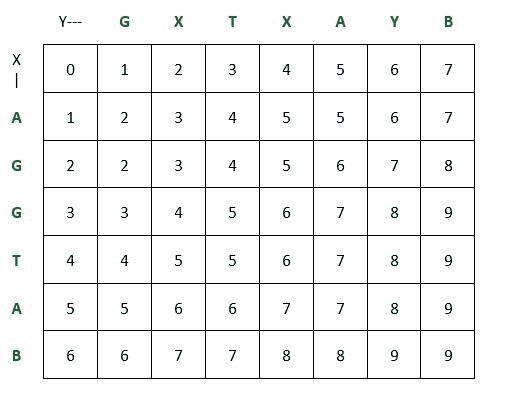

# 打印最短公共超序列

> 原文:[https://www . geesforgeks . org/print-short-common-super quence/](https://www.geeksforgeeks.org/print-shortest-common-supersequence/)

给定两个字符串 X 和 Y，打印同时具有 X 和 Y 作为子序列的最短字符串。如果存在多个最短超序列，请打印其中任何一个。
**例:**

```
Input: X = "AGGTAB",  Y = "GXTXAYB"
Output: "AGXGTXAYB" OR "AGGXTXAYB" 
OR Any string that represents shortest
supersequence of X and Y

Input: X = "HELLO",  Y = "GEEK"
Output: "GEHEKLLO" OR "GHEEKLLO"
OR Any string that represents shortest 
supersequence of X and Y
```

我们已经讨论了如何打印两个给定字符串的最短可能超序列长度[这里](https://www.geeksforgeeks.org/shortest-common-supersequence/)。在这篇文章中，我们打印了最短的超序列。
我们已经在下面讨论了在之前的后
中寻找最短超序列长度的算法

```
Let X[0..m-1] and Y[0..n-1] be two strings and m and be respective 
lengths.

if (m == 0) return n;
if (n == 0) return m;

// If last characters are same, then add 1 to result and
// recur for X[]
if (X[m-1] == Y[n-1]) 
    return 1 + SCS(X, Y, m-1, n-1);

// Else find shortest of following two
//  a) Remove last character from X and recur
//  b) Remove last character from Y and recur
else return 1 + min( SCS(X, Y, m-1, n), SCS(X, Y, m, n-1) );
```

下表显示了如果我们使用动态编程对**字符串 X =“AGGTAB”和 Y =“GXTXAYB”**、
进行自下而上的求解，则上述算法遵循的步骤



使用 DP 解决方案矩阵，我们可以按照以下步骤–
轻松打印两个字符串的最短超序列

```
We start from the bottom-right most cell of the matrix and 
push characters in output string based on below rules-

 1\. If the characters corresponding to current cell (i, j) 
    in X and Y are same, then the character is part of shortest 
    supersequence. We append it in output string and move 
    diagonally to next cell (i.e. (i - 1, j - 1)).

 2\. If the characters corresponding to current cell (i, j)
    in X and Y are different, we have two choices -

    If matrix[i - 1][j] > matrix[i][j - 1],
    we add character corresponding to current 
    cell (i, j) in string Y in output string 
    and move to the left cell i.e. (i, j - 1)
    else
    we add character corresponding to current 
    cell (i, j) in string X in output string 
    and move to the top cell i.e. (i - 1, j)

 3\. If string Y reaches its end i.e. j = 0, we add remaining
    characters of string X in the output string
    else if string X reaches its end i.e. i = 0, we add 
    remaining characters of string Y in the output string.
```

以下是上述想法的实现–

## C++

```
/* A dynamic programming based C++ program print
   shortest supersequence of two strings */
#include <bits/stdc++.h>
using namespace std;

// returns shortest supersequence of X and Y
string printShortestSuperSeq(string X, string Y)
{
    int m = X.length();
    int n = Y.length();

    // dp[i][j] contains length of shortest supersequence
    // for X[0..i-1] and Y[0..j-1]
    int dp[m + 1][n + 1];

    // Fill table in bottom up manner
    for (int i = 0; i <= m; i++)
    {
        for (int j = 0; j <= n; j++)
        {
            // Below steps follow recurrence relation
            if(i == 0)
                dp[i][j] = j;
            else if(j == 0)
                dp[i][j] = i;
            else if(X[i - 1] == Y[j - 1])
                dp[i][j] = 1 + dp[i - 1][j - 1];
            else
                dp[i][j] = 1 + min(dp[i - 1][j], dp[i][j - 1]);
        }
    }

    // Following code is used to print shortest supersequence

    // dp[m][n] stores the length of the shortest supersequence
    // of X and Y

    // string to store the shortest supersequence
    string str;

    // Start from the bottom right corner and one by one
    // push characters in output string
    int i = m, j = n;
    while (i > 0 && j > 0)
    {
        // If current character in X and Y are same, then
        // current character is part of shortest supersequence
        if (X[i - 1] == Y[j - 1])
        {
            // Put current character in result
            str.push_back(X[i - 1]);

            // reduce values of i, j and index
            i--, j--;
        }

        // If current character in X and Y are different
        else if (dp[i - 1][j] > dp[i][j - 1])
        {
            // Put current character of Y in result
            str.push_back(Y[j - 1]);

            // reduce values of j and index
            j--;
        }
        else
        {
            // Put current character of X in result
            str.push_back(X[i - 1]);

            // reduce values of i and index
            i--;
        }
    }

    // If Y reaches its end, put remaining characters
    // of X in the result string
    while (i > 0)
    {
        str.push_back(X[i - 1]);
        i--;
    }

    // If X reaches its end, put remaining characters
    // of Y in the result string
    while (j > 0)
    {
        str.push_back(Y[j - 1]);
        j--;
    }

    // reverse the string and return it
    reverse(str.begin(), str.end());
    return str;
}

// Driver program to test above function
int main()
{
    string X = "AGGTAB";
    string Y = "GXTXAYB";

    cout << printShortestSuperSeq(X, Y);

    return 0;
}
```

## Java 语言(一种计算机语言，尤用于创建网站)

```
/* A dynamic programming based Java program print
shortest supersequence of two strings */
class GFG {

    // returns shortest supersequence of X and Y
    static String printShortestSuperSeq(String X, String Y)
    {
        int m = X.length();
        int n = Y.length();

        // dp[i][j] contains length of
        // shortest supersequence
        // for X[0..i-1] and Y[0..j-1]
        int dp[][] = new int[m + 1][n + 1];

        // Fill table in bottom up manner
        for (int i = 0; i <= m; i++)
        {
            for (int j = 0; j <= n; j++)
            {

                // Below steps follow recurrence relation
                if (i == 0)
                {
                    dp[i][j] = j;
                }
                else if (j == 0)
                {
                    dp[i][j] = i;
                }
                else if (X.charAt(i - 1) == Y.charAt(j - 1))
                {
                    dp[i][j] = 1 + dp[i - 1][j - 1];
                }
                else
                {
                    dp[i][j] = 1 + Math.min(dp[i - 1][j], dp[i][j - 1]);
                }
            }
        }

        // Following code is used to print
        // shortest supersequence dp[m][n] s
        // tores the length of the shortest
        // supersequence of X and Y

        // string to store the shortest supersequence
        String str = "";

        // Start from the bottom right corner and one by one
        // push characters in output string
        int i = m, j = n;
        while (i > 0 && j > 0)

        {
            // If current character in X and Y are same, then
            // current character is part of shortest supersequence
            if (X.charAt(i - 1) == Y.charAt(j - 1))

            {
                // Put current character in result
                str += (X.charAt(i - 1));

                // reduce values of i, j and index
                i--;
                j--;
            }

            // If current character in X and Y are different
            else if (dp[i - 1][j] > dp[i][j - 1])
            {

                // Put current character of Y in result
                str += (Y.charAt(j - 1));

                // reduce values of j and index
                j--;
            }
            else
            {

                // Put current character of X in result
                str += (X.charAt(i - 1));

                // reduce values of i and index
                i--;
            }
        }

        // If Y reaches its end, put remaining characters
        // of X in the result string
        while (i > 0)
        {
            str += (X.charAt(i - 1));
            i--;
        }

        // If X reaches its end, put remaining characters
        // of Y in the result string
        while (j > 0)
        {
            str += (Y.charAt(j - 1));
            j--;
        }

        // reverse the string and return it
        str = reverse(str);
        return str;
    }

    static String reverse(String input)
    {
        char[] temparray = input.toCharArray();
        int left, right = 0;
        right = temparray.length - 1;

        for (left = 0; left < right; left++, right--)
        {
            // Swap values of left and right
            char temp = temparray[left];
            temparray[left] = temparray[right];
            temparray[right] = temp;
        }
        return String.valueOf(temparray);
    }

    // Driver code
    public static void main(String[] args)
    {
        String X = "AGGTAB";
        String Y = "GXTXAYB";
        System.out.println(printShortestSuperSeq(X, Y));
    }
}

// This code is contributed by 29AjayKumar
```

## 蟒蛇 3

```
# A dynamic programming based Python3 program print
# shortest supersequence of two strings

# returns shortest supersequence of X and Y
def printShortestSuperSeq(x, y):
    m = len(x)
    n = len(y)

    # dp[i][j] contains length of shortest
    # supersequence for X[0..i-1] and Y[0..j-1]
    dp = [[0 for i in range(n + 1)]
             for j in range(n + 1)]

    # Fill table in bottom up manner
    for i in range(m + 1):
        for j in range(n + 1):

            # Below steps follow recurrence relation
            if i == 0:
                dp[i][j] = j
            elif j == 0:
                dp[i][j] = i
            elif x[i - 1] == y[j - 1]:
                dp[i][j] = 1 + dp[i - 1][j - 1]
            else:
                dp[i][j] = 1 + min(dp[i - 1][j],
                                   dp[i][j - 1])

    # Following code is used to print
    # shortest supersequence

    # dp[m][n] stores the length of the
    # shortest supersequence of X and Y

    # string to store the shortest supersequence
    string = ""

    # Start from the bottom right corner and
    # one by one push characters in output string
    i = m
    j = n
    while i > 0 and j > 0:

        # If current character in X and Y are same,
        # then current character is part of
        # shortest supersequence
        if x[i - 1] == y[j - 1]:

            # Put current character in result
            string += x[i - 1]

            # reduce values of i, j and index
            i -= 1
            j -= 1

        # If current character in X and Y are different
        elif dp[i - 1][j] > dp[i][j - 1]:

            # Put current character of Y in result
            string += y[j - 1]

            # reduce values of j and index
            j -= 1
        else:

            # Put current character of X in result
            string += x[i - 1]

            # reduce values of i and index
            i -= 1

    # If Y reaches its end, put remaining characters
    # of X in the result string
    while i > 0:
        string += x[i - 1]
        i -= 1

    # If X reaches its end, put remaining characters
    # of Y in the result string
    while j > 0:
        string += y[j - 1]
        j -= 1

    string = list(string)

    # reverse the string and return it
    string.reverse()
    return ''.join(string)

# Driver Code
if __name__ == "__main__":
    x = "AGGTAB"
    y = "GXTXAYB"

    print(printShortestSuperSeq(x, y))

# This code is contributed by
# sanjeev2552
```

## C#

```
/* A dynamic programming based C# program print
shortest supersequence of two strings */
using System;

class GFG
{

    // returns shortest supersequence of X and Y
    static String printShortestSuperSeq(String X, String Y)
    {
        int m = X.Length;
        int n = Y.Length;

        // dp[i,j] contains length of
        // shortest supersequence
        // for X[0..i-1] and Y[0..j-1]
        int [,]dp = new int[m + 1, n + 1];
        int i, j;

        // Fill table in bottom up manner
        for (i = 0; i <= m; i++)
        {
            for (j = 0; j <= n; j++)
            {

                // Below steps follow recurrence relation
                if (i == 0)
                {
                    dp[i, j] = j;
                }
                else if (j == 0)
                {
                    dp[i, j] = i;
                }
                else if (X[i - 1] == Y[j - 1])
                {
                    dp[i, j] = 1 + dp[i - 1, j - 1];
                }
                else
                {
                    dp[i, j] = 1 + Math.Min(dp[i - 1, j], dp[i, j - 1]);
                }
            }
        }

        // Following code is used to print
        // shortest supersequence dp[m,n] s
        // tores the length of the shortest
        // supersequence of X and Y

        // string to store the shortest supersequence
        String str = "";

        // Start from the bottom right corner and one by one
        // push characters in output string
        i = m; j = n;
        while (i > 0 && j > 0)

        {
            // If current character in X and Y are same, then
            // current character is part of shortest supersequence
            if (X[i - 1] == Y[j - 1])

            {
                // Put current character in result
                str += (X[i - 1]);

                // reduce values of i, j and index
                i--;
                j--;
            }

            // If current character in X and Y are different
            else if (dp[i - 1, j] > dp[i, j - 1])
            {

                // Put current character of Y in result
                str += (Y[j - 1]);

                // reduce values of j and index
                j--;
            }
            else
            {

                // Put current character of X in result
                str += (X[i - 1]);

                // reduce values of i and index
                i--;
            }
        }

        // If Y reaches its end, put remaining characters
        // of X in the result string
        while (i > 0)
        {
            str += (X[i - 1]);
            i--;
        }

        // If X reaches its end, put remaining characters
        // of Y in the result string
        while (j > 0)
        {
            str += (Y[j - 1]);
            j--;
        }

        // reverse the string and return it
        str = reverse(str);
        return str;
    }

    static String reverse(String input)
    {
        char[] temparray = input.ToCharArray();
        int left, right = 0;
        right = temparray.Length - 1;

        for (left = 0; left < right; left++, right--)
        {
            // Swap values of left and right
            char temp = temparray[left];
            temparray[left] = temparray[right];
            temparray[right] = temp;
        }
        return String.Join("",temparray);
    }

    // Driver code
    public static void Main(String[] args)
    {
        String X = "AGGTAB";
        String Y = "GXTXAYB";
        Console.WriteLine(printShortestSuperSeq(X, Y));
    }
}

/* This code has been contributed
by PrinciRaj1992*/
```

## java 描述语言

```
<script>

/* A dynamic programming based Javascript program print
shortest supersequence of two strings */

// returns shortest supersequence of X and Y
function printShortestSuperSeq(X,Y)
{
         let m = X.length;
        let n = Y.length;

        // dp[i][j] contains length of
        // shortest supersequence
        // for X[0..i-1] and Y[0..j-1]
        let dp = new Array(m + 1);
        for(let i=0;i<(m+1);i++)
        {
            dp[i]=new Array(n+1);
            for(let j=0;j<(n+1);j++)
                dp[i][j]=0;
        }

        // Fill table in bottom up manner
        for (let i = 0; i <= m; i++)
        {
            for (let j = 0; j <= n; j++)
            {

                // Below steps follow recurrence relation
                if (i == 0)
                {
                    dp[i][j] = j;
                }
                else if (j == 0)
                {
                    dp[i][j] = i;
                }
                else if (X[i-1] == Y[j-1])
                {
                    dp[i][j] = 1 + dp[i - 1][j - 1];
                }
                else
                {
                    dp[i][j] =
                    1 + Math.min(dp[i - 1][j], dp[i][j - 1]);
                }
            }
        }

        // Following code is used to print
        // shortest supersequence dp[m][n] s
        // tores the length of the shortest
        // supersequence of X and Y

        // string to store the shortest supersequence
        let str = "";

        // Start from the bottom right corner and one by one
        // push characters in output string
        let i = m, j = n;
        while (i > 0 && j > 0)

        {
            // If current character in X and Y are same, then
            // current character is part of shortest supersequence
            if (X[i-1] == Y[j-1])

            {
                // Put current character in result
                str += (X[i-1]);

                // reduce values of i, j and index
                i--;
                j--;
            }

            // If current character in X and Y are different
            else if (dp[i - 1][j] > dp[i][j - 1])
            {

                // Put current character of Y in result
                str += (Y[j-1]);

                // reduce values of j and index
                j--;
            }
            else
            {

                // Put current character of X in result
                str += (X[i-1]);

                // reduce values of i and index
                i--;
            }
        }

        // If Y reaches its end, put remaining characters
        // of X in the result string
        while (i > 0)
        {
            str += (X[i-1]);
            i--;
        }

        // If X reaches its end, put remaining characters
        // of Y in the result string
        while (j > 0)
        {
            str += (Y[j-1]);
            j--;
        }

        // reverse the string and return it
        str = reverse(str);
        return str;
}

function reverse(input)
{
    let temparray = input.split("");
        let left, right = 0;
        right = temparray.length - 1;

        for (left = 0; left < right; left++, right--)
        {
            // Swap values of left and right
            let temp = temparray[left];
            temparray[left] = temparray[right];
            temparray[right] = temp;
        }
        return (temparray).join("");
}

// Driver code
let X = "AGGTAB";
let Y = "GXTXAYB";
document.write(printShortestSuperSeq(X, Y));

// This code is contributed by rag2127

</script>
```

**Output**

```
AGXGTXAYB
```

**上述解的时间复杂度**为 O(n <sup>2</sup> )。
**程序使用的辅助空间**为 O(n <sup>2</sup> )。
本文由**阿迪蒂亚·戈尔**供稿。如果你喜欢 GeeksforGeeks 并想投稿，你也可以使用[write.geeksforgeeks.org](https://write.geeksforgeeks.org)写一篇文章或者把你的文章邮寄到 review-team@geeksforgeeks.org。看到你的文章出现在极客博客主页上，帮助其他极客。
如果发现有不正确的地方，或者想分享更多关于上述话题的信息，请写评论。