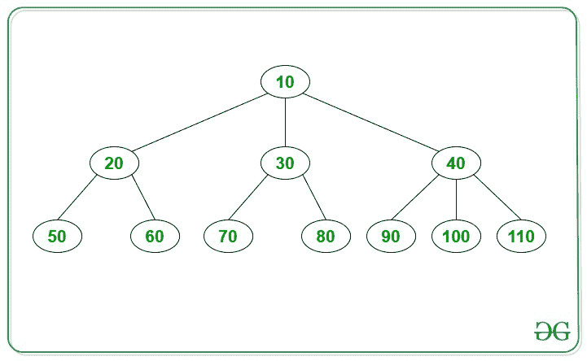

# 打印 N 元树中给定节点的兄弟节点

> 原文:[https://www . geesforgeks . org/print-给定 n 元树中节点的兄弟节点/](https://www.geeksforgeeks.org/print-siblings-of-given-node-in-an-n-ary-tree/)

给定一个 [**N 元树**](https://www.geeksforgeeks.org/generic-treesn-array-trees/) 和一个元素 **X** ，任务是用值 **X** 打印节点的兄弟节点。

> 如果两个节点位于同一级别并且具有相同的父节点，则它们被视为**兄弟节点**。

**示例:**

> **输入:** X = 100
> 
> 
> 
> **输出:**90 110
> T3】说明:值为 90、100、110 的节点有相同的父节点，即值为 40 的节点。因此，节点 90 和 110 是给定节点 X( = 100)的兄弟节点。
> 
> **输入:** X = 30
> 
> 
> 
> **输出:**20 40
> T3】说明:值为 20、30、40 的节点有相同的父节点，即值为 10 的节点。因此，节点 20 和 40 是给定节点 X( = 30)的兄弟节点。

**方法:**按照下面给出的步骤解决问题:

1.  在给定的 **N** 元树上执行[级顺序遍历](https://www.geeksforgeeks.org/level-order-tree-traversal/)。
2.  初始化一个[队列](https://www.geeksforgeeks.org/queue-data-structure/) **q** 进行等级顺序遍历。
3.  对于遇到的每个节点，[将其所有子节点推入队列](https://www.geeksforgeeks.org/queuepush-and-queuepop-in-cpp-stl/)。
4.  将当前节点的子节点推入队列时，检查:这些子节点是否等于给定值 **X** 。如果发现为真，则打印除 **X** 之外的当前子节点作为所需答案。
5.  否则，继续[穿越树](https://www.geeksforgeeks.org/tree-traversals-inorder-preorder-and-postorder/)。

下面是上述方法的实现:

## C++

```
// C++ program for the above approach
#include <bits/stdc++.h>
using namespace std;

// Structure of a node of N-ary tree
struct Node {
    int key;
    vector<Node*> child;
};

// Function to create a new node
Node* newNode(int key)
{
    Node* temp = new Node;
    temp->key = key;
    return temp;
}

// Function to find the siblings
// of the node value
void Siblings(Node* root, int value)
{
    int flag = 0;

    if (root == NULL)
        return;

    // Stores nodes level wise
    queue<Node*> q;

    // Push the root
    q.push(root);

    // Continue until all levels
    // are traversed
    while (!q.empty()) {

        // Stores current node
        Node* temp = q.front();
        q.pop();

        // Enqueue all children of the current node
        for (int i = 0; i < temp->child.size(); i++) {

            // If node value is found
            if (temp->child[i]->key == value) {

                flag = 1;

                // Print all children of current node
                // except value as the answer
                for (int j = 0; j < temp->child.size();
                     j++) {

                    if (value
                        != temp->child[j]->key)
                        cout << temp->child[j]->key
                             << " ";
                }
                break;
            }

            // Push the child nodes
            // of temp into the queue
            q.push(temp->child[i]);
        }
    }

    if (flag == 0)
        cout << "No siblings!!";
}

Node* constructTree()
{
    Node* root = newNode(10);
    (root->child).push_back(newNode(20));

    (root->child).push_back(newNode(30));

    (root->child).push_back(newNode(40));

    (root->child[0]->child).push_back(newNode(50));

    (root->child[0]->child).push_back(newNode(60));

    (root->child[1]->child).push_back(newNode(70));

    (root->child[1]->child).push_back(newNode(80));

    (root->child[2]->child).push_back(newNode(90));

    (root->child[2]->child).push_back(newNode(100));

    (root->child[2]->child).push_back(newNode(110));

    return root;
}

// Driver Code
int main()
{

    // Stores root of the
    // constructed tree
    Node* root = constructTree();

    int X = 30;
    // Print siblings of Node X
    Siblings(root, X);

    return 0;
}
```

## Java 语言(一种计算机语言，尤用于创建网站)

```
// Java program for the
// above approach
import java.util.*;
class GFG{

// Structure of a node
// of N-ary tree
static class Node
{
  int key;
  Vector<Node> child =
         new Vector<>();
};

// Function to create a
// new node
static Node newNode(int key)
{
  Node temp = new Node();
  temp.key = key;
  return temp;
}

// Function to find the
// siblings of the node
/// value
static void Siblings(Node root,
                     int value)
{
  int flag = 0;

  if (root == null)
    return;

  // Stores nodes level wise
  Queue<Node> q =
    new LinkedList<>();

  // Push the root
  q.add(root);

  // Continue until all
  // levels are traversed
  while (!q.isEmpty())
  {
    // Stores current node
    Node temp = q.peek();
    q.remove();

    // Enqueue all children
    // of the current node
    for (int i = 0;
         i < temp.child.size();
         i++)
    {
      // If node value is found
      if (temp.child.get(i).key ==
          value)
      {
        flag = 1;

        // Print all children of current
        // node
        // except value as the answer
        for (int j = 0;
             j < temp.child.size();
             j++)
        {
          if (value !=
              temp.child.get(j).key)
            System.out.print(
            temp.child.get(j).key + " ");
        }
        break;
      }

      // Push the child nodes
      // of temp into the queue
      q.add(temp.child.get(i));
    }
  }

  if (flag == 0)
    System.out.print("No siblings!!");
}

static Node constructTree()
{
  Node root = newNode(10);

  (root.child).add(newNode(20));
  (root.child).add(newNode(30));
  (root.child).add(newNode(40));
  (root.child.get(0).child).add(newNode(50));
  (root.child.get(0).child).add(newNode(60));
  (root.child.get(1).child).add(newNode(70));
  (root.child.get(1).child).add(newNode(80));
  (root.child.get(2).child).add(newNode(90));
  (root.child.get(2).child).add(newNode(100));
  (root.child.get(2).child).add(newNode(110));

  return root;
}

// Driver Code
public static void main(String[] args)
{
  // Stores root of the
  // constructed tree
  Node root = constructTree();

  int X = 30;
  // Print siblings of Node X
  Siblings(root, X);
}
}

// This code is contributed by Rajput-Ji
```

## C#

```
// C# program for the
// above approach
using System;
using System.Collections.Generic;
class GFG{

// Structure of a node
// of N-ary tree
public class Node
{
  public int key;
  public List<Node> child =
         new List<Node>();
};

// Function to create a
// new node
static Node newNode(int key)
{
  Node temp = new Node();
  temp.key = key;
  return temp;
}

// Function to find the
// siblings of the node
/// value
static void Siblings(Node root,
                     int value)
{
  int flag = 0;

  if (root == null)
    return;

  // Stores nodes level
  // wise
  Queue<Node> q =
        new Queue<Node>();

  // Push the root
  q.Enqueue(root);

  // Continue until all
  // levels are traversed
  while (q.Count != 0)
  {
    // Stores current node
    Node temp = q.Peek();
    q.Dequeue();

    // Enqueue all children
    // of the current node
    for (int i = 0;
             i < temp.child.Count; i++)
    {
      // If node value is found
      if (temp.child[i].key == value)
      {
        flag = 1;

        // Print all children of
        // current node except value
        // as the answer
        for (int j = 0;
             j < temp.child.Count; j++)
        {
          if (value != temp.child[j].key)
            Console.Write(temp.child[j].key + " ");
        }
        break;
      }

      // Push the child nodes
      // of temp into the queue
      q.Enqueue(temp.child[i]);
    }
  }

  if (flag == 0)
    Console.Write("No siblings!!");
}

static Node constructTree()
{
  Node root = newNode(10);

  (root.child).Add(newNode(20));
  (root.child).Add(newNode(30));
  (root.child).Add(newNode(40));
  (root.child[0].child).Add(newNode(50));
  (root.child[0].child).Add(newNode(60));
  (root.child[1].child).Add(newNode(70));
  (root.child[1].child).Add(newNode(80));
  (root.child[2].child).Add(newNode(90));
  (root.child[2].child).Add(newNode(100));
  (root.child[2].child).Add(newNode(110));

  return root;
}

// Driver Code
public static void Main(String[] args)
{
  // Stores root of the
  // constructed tree
  Node root = constructTree();

  int X = 30;

  // Print siblings of Node X
  Siblings(root, X);
}
}

// This code is contributed by Rajput-Ji
```

## java 描述语言

```
<script>

// Javascript program for the above approach

// Structure of a node of N-ary tree
class Node
{
    constructor(key)
    {
        this.child = [];
        this.key = key;
    }
}

// Function to create a
// new node
function newNode(key)
{
    let temp = new Node(key);
    return temp;
}

// Function to find the
// siblings of the node
/// value
function Siblings(root, value)
{
    let flag = 0;

    if (root == null)
        return;

    // Stores nodes level wise
    let q = [];

    // Push the root
    q.push(root);

    // Continue until all
    // levels are traversed
    while (q.length > 0)
    {

        // Stores current node
        let temp = q[0];
        q.shift();

        // Enqueue all children
        // of the current node
        for(let i = 0; i < temp.child.length; i++)
        {

            // If node value is found
            if (temp.child[i].key == value)
            {
                flag = 1;

                // Print all children of current
                // node
                // except value as the answer
                for(let j = 0;
                        j < temp.child.length;
                        j++)
                {
                    if (value != temp.child[j].key)
                        document.write(temp.child[j].key + " ");
                }
                break;
            }

            // Push the child nodes
            // of temp into the queue
            q.push(temp.child[i]);
        }
    }

    if (flag == 0)
    document.write("No siblings!!");
}

function constructTree()
{
    let root = newNode(10);

    (root.child).push(newNode(20));
    (root.child).push(newNode(30));
    (root.child).push(newNode(40));
    (root.child[0].child).push(newNode(50));
    (root.child[0].child).push(newNode(60));
    (root.child[1].child).push(newNode(70));
    (root.child[1].child).push(newNode(80));
    (root.child[2].child).push(newNode(90));
    (root.child[2].child).push(newNode(100));
    (root.child[2].child).push(newNode(110));

    return root;
}

// Driver code

// Stores root of the
// constructed tree
let root = constructTree();

let X = 30;

// Print siblings of Node X
Siblings(root, X);

// This code is contributed by divyeshrabadiya07

</script>
```

**Output:** 

```
20 40
```

***时间复杂度:**O(N<sup>2</sup>)*
***辅助空间:** O(N)*