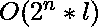
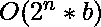

# 打印字符串的所有子序列|迭代方法

> 原文:[https://www . geesforgeks . org/print-subseries-string-iterative-method/](https://www.geeksforgeeks.org/print-subsequences-string-iterative-method/)

给定一个字符串 s，以迭代的方式打印给定字符串的所有可能的子序列。我们已经讨论了 [**递归方法来打印一个字符串的所有子序列**](https://www.geeksforgeeks.org/print-subsequences-string/) 。

**示例:**

```
Input : abc
Output : a, b, c, ab, ac, bc, abc

Input : aab
Output : a, b, aa, ab, aab
```

**方法 1 :**
在这里，我们讨论更简单更容易的迭代方法，类似于[幂集](https://www.geeksforgeeks.org/power-set/)。我们使用从 1 的[二进制表示](https://en.wikipedia.org/wiki/Binary_number#Representation)到 2^length(s–1 的位模式。

input = "abc"
二进制表示考虑 1 到(2^3-1)，即 1 到 7。
从二进制表示的左(MSB)到右(LSB)开始，将二进制表示中对应于位值 1 的输入字符串中的字符追加到最终子序列字符串 sub 中。

示例:
001 = > abc。只有 c 对应于位 1。所以，子序列= c.
101 = > abc。a 和 c 对应于位 1。所以，子序列= ac。
二进制 _ 表示(1) = 001 = > c
二进制 _ 表示(2) = 010 = > b
二进制 _ 表示(3) = 011 = > bc
二进制 _ 表示(4) = 100 = > a
二进制 _ 表示(5) = 101 = > ac
二进制 _ 表示(6) = 110 = > ab
二进制 _ 表示(7) =

下面是上述方法的实现:

## C++

```
// C++ program to print all Subsequences
// of a string in iterative manner
#include <bits/stdc++.h>
using namespace std;

// function to find subsequence
string subsequence(string s, int binary, int len)
{
    string sub = "";
    for (int j = 0; j < len; j++)

        // check if jth bit in binary is 1
        if (binary & (1 << j))

            // if jth bit is 1, include it
            // in subsequence
            sub += s[j];

    return sub;
}

// function to print all subsequences
void possibleSubsequences(string s){

    // map to store subsequence
    // lexicographically by length
    map<int, set<string> > sorted_subsequence;

    int len = s.size();

    // Total number of non-empty subsequence
    // in string is 2^len-1
    int limit = pow(2, len);

    // i=0, corresponds to empty subsequence
    for (int i = 1; i <= limit - 1; i++) {

        // subsequence for binary pattern i
        string sub = subsequence(s, i, len);

        // storing sub in map
        sorted_subsequence[sub.length()].insert(sub);
    }

    for (auto it : sorted_subsequence) {

        // it.first is length of Subsequence
        // it.second is set<string>
        cout << "Subsequences of length = "
             << it.first << " are:" << endl;

        for (auto ii : it.second)

            // ii is iterator of type set<string>
            cout << ii << " ";

        cout << endl;
    }
}

// driver function
int main()
{
    string s = "aabc";
    possibleSubsequences(s);
    return 0;
}
```

## Java 语言(一种计算机语言，尤用于创建网站)

```
// Java program to print all Subsequences
// of a String in iterative manner
import java.util.ArrayList;
import java.util.Arrays;
import java.util.HashMap;
import java.util.HashSet;
import java.util.Map;
import java.util.SortedMap;
import java.util.TreeMap;

class Graph{

// Function to find subsequence
static String subsequence(String s,
                          int binary,
                          int len)
{
    String sub = "";

    for(int j = 0; j < len; j++)

        // Check if jth bit in binary is 1
        if ((binary & (1 << j)) != 0)

            // If jth bit is 1, include it
            // in subsequence
            sub += s.charAt(j);

    return sub;
}

// Function to print all subsequences
static void possibleSubsequences(String s)
{

    // Map to store subsequence
    // lexicographically by length
    SortedMap<Integer,
              HashSet<String>> sorted_subsequence = new TreeMap<Integer,
                                                                HashSet<String>>();

    int len = s.length();

    // Total number of non-empty subsequence
    // in String is 2^len-1
    int limit = (int) Math.pow(2, len);

    // i=0, corresponds to empty subsequence
    for(int i = 1; i <= limit - 1; i++)
    {

        // Subsequence for binary pattern i
        String sub = subsequence(s, i, len);

        // Storing sub in map
        if (!sorted_subsequence.containsKey(sub.length()))
            sorted_subsequence.put(
                sub.length(), new HashSet<>());
            sorted_subsequence.get(
                sub.length()).add(sub);
    }

    for(Map.Entry<Integer,
                  HashSet<String>> it : sorted_subsequence.entrySet())
    {

        // it.first is length of Subsequence
        // it.second is set<String>
        System.out.println("Subsequences of length = " +
                           it.getKey() + " are:");

        for(String ii : it.getValue())

            // ii is iterator of type set<String>
            System.out.print(ii + " ");

        System.out.println();
    }
}

// Driver code
public static void main(String[] args)
{
    String s = "aabc";

    possibleSubsequences(s);
}
}

// This code is contributed by sanjeev2552
```

## 蟒蛇 3

```
# Python3 program to print all Subsequences
# of a string in iterative manner

# function to find subsequence
def subsequence(s, binary, length):
    sub = ""
    for j in range(length):

        # check if jth bit in binary is 1
        if (binary & (1 << j)):

            # if jth bit is 1, include it
            # in subsequence
            sub += s[j]
    return sub

# function to print all subsequences
def possibleSubsequences(s):

    # map to store subsequence
    # lexicographically by length
    sorted_subsequence = {}

    length = len(s)

    # Total number of non-empty subsequence
    # in string is 2^len-1
    limit = 2 ** length

    # i=0, corresponds to empty subsequence
    for i in range(1, limit):

        # subsequence for binary pattern i
        sub = subsequence(s, i, length)

        # storing sub in map
        if len(sub) in sorted_subsequence.keys():
            sorted_subsequence[len(sub)] = \
             tuple(list(sorted_subsequence[len(sub)]) + [sub])
        else:
            sorted_subsequence[len(sub)] = [sub]

    for it in sorted_subsequence:

        # it.first is length of Subsequence
        # it.second is set<string>
        print("Subsequences of length =", it, "are:")
        for ii in sorted(set(sorted_subsequence[it])):

            # ii is iterator of type set<string>
            print(ii, end = ' ')
        print()

# Driver Code
s = "aabc"
possibleSubsequences(s)

# This code is contributed by ankush_953
```

## java 描述语言

```
<script>

// Javascript program to print all Subsequences
// of a string in iterative manner

// function to find subsequence
function subsequence(s, binary, len)
{
    let sub = "";
    for(let j = 0; j < len; j++)

        // Check if jth bit in binary is 1
        if (binary & (1 << j))

            // If jth bit is 1, include it
            // in subsequence
            sub += s[j];

    return sub;
}

// Function to print all subsequences
function possibleSubsequences(s)
{

    // map to store subsequence
    // lexicographically by length
    let sorted_subsequence = new Map();

    let len = s.length;

    // Total number of non-empty subsequence
    // in string is 2^len-1
    let limit = Math.pow(2, len);

    // i=0, corresponds to empty subsequence
    for(let i = 1; i <= limit - 1; i++)
    {

        // Subsequence for binary pattern i
        let sub = subsequence(s, i, len);

        // Storing sub in map
        if (!sorted_subsequence.has(sub.length))
            sorted_subsequence.set(sub.length, new Set());

        sorted_subsequence.get(sub.length).add(sub);
    }

    for(let it of sorted_subsequence)
    {

        // it.first is length of Subsequence
        // it.second is set<string>
        document.write("Subsequences of length = " +
                       it[0] + " are:" + "<br>");

        for(let ii of it[1])

            // ii is iterator of type set<string>
            document.write(ii + " ");

        document.write("<br>");
    }
}

// Driver code
let s = "aabc";

possibleSubsequences(s);

// This code is contributed by gfgking

</script>
```

**输出:**

```
Subsequences of length = 1 are:
a b c 
Subsequences of length = 2 are:
aa ab ac bc 
Subsequences of length = 3 are:
aab aac abc 
Subsequences of length = 4 are:
aabc
```

时间复杂度:，其中 n 为查找子序列的字符串长度，l 为二进制字符串长度。

**方法 2 :**
方法是获取最右边的置位位的位置，并在给定字符串中的相应字符附加到子序列后重置该位，并将重复相同的操作，直到相应的二进制模式没有置位位为止。

如果输入是 s = "abc"
二进制表示，则考虑 1 到(2^3-1)，即 1 到 7。
001 = > abc。只有 c 对应于位 1。所以，子序列= c
101 = > abc。a 和 c 对应于位 1。所以，子序列= ac。
让我们使用 5 的二进制表示，即 101。
最右边的位在位置 1，在 sub = c 的开头追加字符，重置位置 1 = > 100
最右边的位在位置 3，在 sub = ac 的开头追加字符，重置位置 3 = > 000
由于现在没有剩余的设置位，我们停止计算子序列。

示例:
二进制 _ 表示(1) = 001 = > c
二进制 _ 表示(2) = 010 = > b
二进制 _ 表示(3) = 011 = > bc
二进制 _ 表示(4) = 100 = > a
二进制 _ 表示(5) = 101 = > ac
二进制 _ 表示(6) = 110 = > ab
二进制 _ 表示(7) =

下面是上述方法的实现:

## C++

```
// C++ code all Subsequences of a
// string in iterative manner
#include <bits/stdc++.h>
using namespace std;

// function to find subsequence
string subsequence(string s, int binary)
{
    string sub = "";
    int pos;

    // loop while binary is greater than 0
    while(binary>0)
    {
        // get the position of rightmost set bit
        pos=log2(binary&-binary)+1;

        // append at beginning as we are
        // going from LSB to MSB
        sub=s[pos-1]+sub;

        // resets bit at pos in binary
        binary= (binary & ~(1 << (pos-1)));
    }
    reverse(sub.begin(),sub.end());
    return sub;
}

// function to print all subsequences
void possibleSubsequences(string s){

    // map to store subsequence
    // lexicographically by length
    map<int, set<string> > sorted_subsequence;

    int len = s.size();

    // Total number of non-empty subsequence
    // in string is 2^len-1
    int limit = pow(2, len);

    // i=0, corresponds to empty subsequence
    for (int i = 1; i <= limit - 1; i++) {

        // subsequence for binary pattern i
        string sub = subsequence(s, i);

        // storing sub in map
        sorted_subsequence[sub.length()].insert(sub);
    }

    for (auto it : sorted_subsequence) {

        // it.first is length of Subsequence
        // it.second is set<string>
        cout << "Subsequences of length = "
            << it.first << " are:" << endl;

        for (auto ii : it.second)

            // ii is iterator of type set<string>
            cout << ii << " ";

        cout << endl;
    }
}

// driver function
int main()
{
    string s = "aabc";
    possibleSubsequences(s);

    return 0;
}
```

## 蟒蛇 3

```
# Python3 program to print all Subsequences
# of a string in an iterative manner
from math import log2, floor

# function to find subsequence
def subsequence(s, binary):
    sub = ""

    # loop while binary is greater than
    while(binary > 0):

        # get the position of rightmost set bit
        pos=floor(log2(binary&-binary) + 1)

        # append at beginning as we are
        # going from LSB to MSB
        sub = s[pos - 1] + sub

        # resets bit at pos in binary
        binary= (binary & ~(1 << (pos - 1)))

    sub = sub[::-1]
    return sub

# function to print all subsequences
def possibleSubsequences(s):

    # map to store subsequence
    # lexicographically by length
    sorted_subsequence = {}

    length = len(s)

    # Total number of non-empty subsequence
    # in string is 2^len-1
    limit = 2 ** length

    # i=0, corresponds to empty subsequence
    for i in range(1, limit):

        # subsequence for binary pattern i
        sub = subsequence(s, i)

        # storing sub in map
        if len(sub) in sorted_subsequence.keys():
            sorted_subsequence[len(sub)] = \
            tuple(list(sorted_subsequence[len(sub)]) + [sub])
        else:
            sorted_subsequence[len(sub)] = [sub]

    for it in sorted_subsequence:

        # it.first is length of Subsequence
        # it.second is set<string>
        print("Subsequences of length =", it, "are:")
        for ii in sorted(set(sorted_subsequence[it])):

            # ii is iterator of type set<string>
            print(ii, end = ' ')
        print()

# Driver Code
s = "aabc"
possibleSubsequences(s)

# This code is contributed by ankush_953
```

**输出:**

```
Subsequences of length = 1 are:
a b c 
Subsequences of length = 2 are:
aa ab ac bc 
Subsequences of length = 3 are:
aab aac abc 
Subsequences of length = 4 are:
aabc
```

时间复杂度:，其中 n 为查找子序列的字符串长度，b 为二进制字符串中的设置位数。