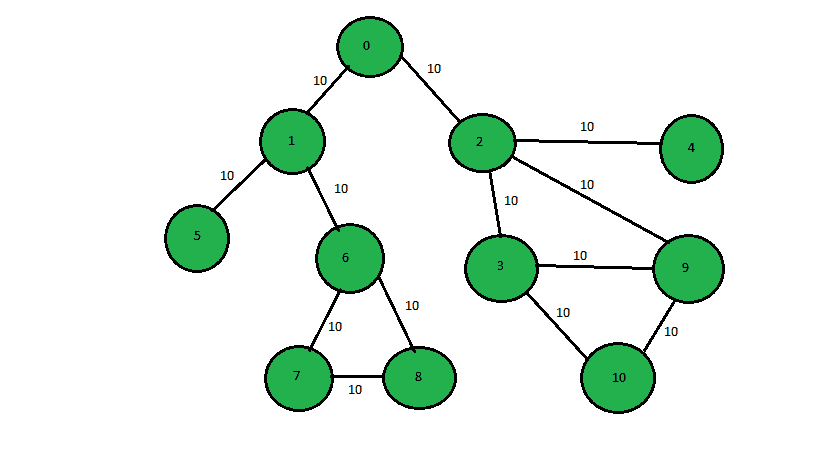
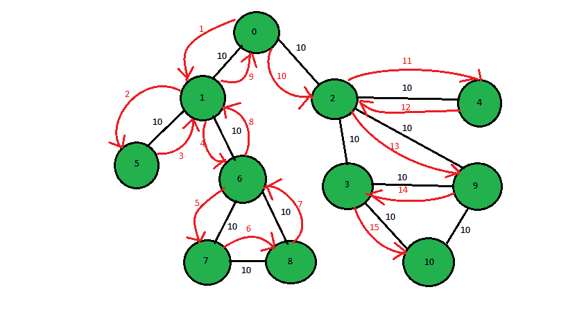

# 逐级打印 DFS 遍历(也是回溯)

> 原文:[https://www . geesforgeks . org/print-the-DFS-遍历-逐步-回溯-还/](https://www.geeksforgeeks.org/print-the-dfs-traversal-step-wise-backtracking-also/)

给定一个[图](https://www.geeksforgeeks.org/graph-data-structure-and-algorithms/)，任务是打印一个图的 DFS 遍历，该图包括包括回溯在内的每个步骤。



```
1st step:- 0 -> 1
2nd step:- 1 -> 5
3rd step:- 5 -> 1 (backtracking step)
4th step:- 1 -> 6...
and so on till all the nodes are visited.

Dfs step-wise(including backtracking) is:
0 1 5 1 6 7 8 7 6 1 0 2 4 2 9 3 10
```

**注:**在上图中，边缘之间的权重刚刚添加。它在 DFS 遍历中没有任何作用。



**进场:**T2】DFS 带[回溯](https://www.geeksforgeeks.org/backtracking-algorithms/)这里会用到。首先，使用 DFS 同时访问每个节点，并跟踪以前使用的边和父节点。如果一个节点出现在所有相邻节点都被访问过的地方，使用最后使用的边回溯并打印节点。继续这些步骤，在每一步，父节点将成为当前节点。继续上面的步骤，找到图的完整的 DFS 遍历。

下面是上述方法的实现:

## C++

```
// C++ program to print the complete
// DFS-traversal of graph
// using back-tracking
#include <bits/stdc++.h>
using namespace std;
const int N = 1000;
vector<int> adj[N];

// Function to print the complete DFS-traversal
void dfsUtil(int u, int node, bool visited[],
             vector<pair<int, int> > road_used, int parent,
             int it)
{
    int c = 0;

    // Check if all th node is visited or not
    // and count unvisited nodes
    for (int i = 0; i < node; i++)
        if (visited[i])
            c++;

    // If all the node is visited return;
    if (c == node)
        return;

    // Mark not visited node as visited
    visited[u] = true;

    // Track the current edge
    road_used.push_back({ parent, u });

    // Print the node
    cout << u << " ";

    // Check for not visited node and proceed with it.
    for (int x : adj[u]) {

        // call the DFs function if not visited
        if (!visited[x])
            dfsUtil(x, node, visited, road_used, u, it + 1);
    }

    // Backtrack through the last
    // visited nodes
    for (auto y : road_used)
        if (y.second == u)
            dfsUtil(y.first, node, visited, road_used, u,
                    it + 1);
}

// Function to call the DFS function
// which prints the DFS-traversal stepwise
void dfs(int node)
{

    // Create a array of visited node
    bool visited[node];

    // Vector to track last visited road
    vector<pair<int, int> > road_used;

    // Initialize all the node with false
    for (int i = 0; i < node; i++)
        visited[i] = false;

    // call the function
    dfsUtil(0, node, visited, road_used, -1, 0);
}

// Function to insert edges in Graph
void insertEdge(int u, int v)
{
    adj[u].push_back(v);
    adj[v].push_back(u);
}

// Driver Code
int main()
{
    // number of nodes and edges in the graph
    int node = 11, edge = 13;

    // Function call to create the graph
    insertEdge(0, 1);
    insertEdge(0, 2);
    insertEdge(1, 5);
    insertEdge(1, 6);
    insertEdge(2, 4);
    insertEdge(2, 9);
    insertEdge(6, 7);
    insertEdge(6, 8);
    insertEdge(7, 8);
    insertEdge(2, 3);
    insertEdge(3, 9);
    insertEdge(3, 10);
    insertEdge(9, 10);

    // Call the function to print
    dfs(node);

    return 0;
}
```

## Java 语言(一种计算机语言，尤用于创建网站)

```
// Java program to print the complete
// DFS-traversal of graph
// using back-tracking
import java.io.*;
import java.util.*;
class GFG
{

    static int N = 1000;
    static ArrayList<ArrayList<Integer>> adj =
      new ArrayList<ArrayList<Integer>>();

    // Function to print the complete DFS-traversal
    static void dfsUtil(int u, int node, boolean visited[],
                        ArrayList<ArrayList<Integer>> road_used,
                        int parent, int it)
    {
        int c = 0;

         // Check if all th node is visited or not
        // and count unvisited nodes
        for (int i = 0; i < node; i++)
            if (visited[i])
                c++;

        // If all the node is visited return;
        if (c == node)
            return;

        // Mark not visited node as visited
        visited[u] = true;

        // Track the current edge
        road_used.add(new ArrayList<Integer>(Arrays.asList( parent, u )));

        // Print the node
        System.out.print(u + " ");

        // Check for not visited node and proceed with it.
        for (int x : adj.get(u))
        {
            // call the DFs function if not visited
            if (!visited[x])
            {   
                dfsUtil(x, node, visited, road_used, u, it + 1);              
            }
        }

        // Backtrack through the last
        // visited nodes      
        for(int y = 0; y < road_used.size(); y++)
        {
            if(road_used.get(y).get(1) == u)
            {
                dfsUtil(road_used.get(y).get(0), node,
                        visited,road_used, u, it + 1);
            }
        }

    }

    // Function to call the DFS function
    // which prints the DFS-traversal stepwise
    static void dfs(int node)
    {

        // Create a array of visited node
        boolean[] visited = new boolean[node];

        // Vector to track last visited road
        ArrayList<ArrayList<Integer>> road_used =
          new ArrayList<ArrayList<Integer>>();

        // Initialize all the node with false
        for (int i = 0; i < node; i++)
        {
            visited[i] = false;
        }

        // call the function
        dfsUtil(0, node, visited, road_used, -1, 0);
    }

    // Function to insert edges in Graph
    static void insertEdge(int u, int v)
    {
        adj.get(u).add(v);
        adj.get(v).add(u);
    }

    // Driver Code
    public static void main (String[] args)
    {

        // number of nodes and edges in the graph
        int node = 11, edge = 13;
        for(int i = 0; i < N; i++)
        {
            adj.add(new ArrayList<Integer>());
        }

        // Function call to create the graph
        insertEdge(0, 1);
        insertEdge(0, 2);
        insertEdge(1, 5);
        insertEdge(1, 6);
        insertEdge(2, 4);
        insertEdge(2, 9);
        insertEdge(6, 7);
        insertEdge(6, 8);
        insertEdge(7, 8);
        insertEdge(2, 3);
        insertEdge(3, 9);
        insertEdge(3, 10);
        insertEdge(9, 10);

        // Call the function to print
        dfs(node);
    }
}

// This code is contributed by avanitrachhadiya2155
```

## 蟒蛇 3

```
# Python3 program to print the
# complete DFS-traversal of graph
# using back-tracking
N = 1000
adj = [[] for i in range(N)]

# Function to print the complete DFS-traversal
def dfsUtil(u, node,visited,
            road_used, parent, it):
    c = 0

    # Check if all th node is visited
    # or not and count unvisited nodes
    for i in range(node):
        if (visited[i]):
            c += 1

    # If all the node is visited return
    if (c == node):
        return

    # Mark not visited node as visited
    visited[u] = True

    # Track the current edge
    road_used.append([parent, u])

    # Print the node
    print(u, end = " ")

    # Check for not visited node
    # and proceed with it.
    for x in adj[u]:

        # Call the DFs function
        # if not visited
        if (not visited[x]):
            dfsUtil(x, node, visited,
                    road_used, u, it + 1)

    # Backtrack through the last
    # visited nodes
    for y in road_used:
        if (y[1] == u):
            dfsUtil(y[0], node, visited,
                    road_used, u, it + 1)

# Function to call the DFS function
# which prints the DFS-traversal stepwise
def dfs(node):

    # Create a array of visited node
    visited = [False for i in range(node)]

    # Vector to track last visited road
    road_used = []

    # Initialize all the node with false
    for i in range(node):
        visited[i] = False

    # Call the function
    dfsUtil(0, node, visited,
            road_used, -1, 0)

# Function to insert edges in Graph
def insertEdge(u, v):

    adj[u].append(v)
    adj[v].append(u)

# Driver Code
if __name__ == '__main__':

    # Number of nodes and edges in the graph
    node = 11
    edge = 13

    # Function call to create the graph
    insertEdge(0, 1)
    insertEdge(0, 2)
    insertEdge(1, 5)
    insertEdge(1, 6)
    insertEdge(2, 4)
    insertEdge(2, 9)
    insertEdge(6, 7)
    insertEdge(6, 8)
    insertEdge(7, 8)
    insertEdge(2, 3)
    insertEdge(3, 9)
    insertEdge(3, 10)
    insertEdge(9, 10)

    # Call the function to print
    dfs(node)

# This code is contributed by mohit kumar 29
```

## C#

```
// C# program for the above approach
using System;
using System.Collections.Generic;

public class GFG {
    static int N = 1000;
    static List<List<int> > adj = new List<List<int> >();

    // Function to print the complete DFS-traversal
    static void dfsUtil(int u, int node, bool[] visited,
                        List<List<int> > road_used,
                        int parent, int it)
    {
        int c = 0;

        // Check if all th node is visited or not
        // and count unvisited nodes
        for (int i = 0; i < node; i++)
            if (visited[i])
                c++;

        // If all the node is visited return;
        if (c == node)
            return;

        // Mark not visited node as visited
        visited[u] = true;

        // Track the current edge
        road_used.Add(new List<int>() { parent, u });

        // Print the node
        Console.Write(u + " ");

        // Check for not visited node and proceed with it.
        foreach(int x in adj[u])
        {
            // call the DFs function if not visited
            if (!visited[x]) {
                dfsUtil(x, node, visited, road_used, u,
                        it + 1);
            }
        }
        // Backtrack through the last
        // visited nodes
        for (int y = 0; y < road_used.Count; y++) {
            if (road_used[y][1] == u) {
                dfsUtil(road_used[y][0], node, visited,
                        road_used, u, it + 1);
            }
        }
    }

    // Function to call the DFS function
    // which prints the DFS-traversal stepwise
    static void dfs(int node)
    {
        // Create a array of visited node
        bool[] visited = new bool[node];

        // Vector to track last visited road
        List<List<int> > road_used = new List<List<int> >();

        // Initialize all the node with false
        for (int i = 0; i < node; i++) {
            visited[i] = false;
        }

        // call the function
        dfsUtil(0, node, visited, road_used, -1, 0);
    }

    // Function to insert edges in Graph
    static void insertEdge(int u, int v)
    {
        adj[u].Add(v);
        adj[v].Add(u);
    }
    static public void Main()
    {
        // number of nodes and edges in the graph
        int node = 11;
        for (int i = 0; i < N; i++) {
            adj.Add(new List<int>());
        }

        // Function call to create the graph
        insertEdge(0, 1);
        insertEdge(0, 2);
        insertEdge(1, 5);
        insertEdge(1, 6);
        insertEdge(2, 4);
        insertEdge(2, 9);
        insertEdge(6, 7);
        insertEdge(6, 8);
        insertEdge(7, 8);
        insertEdge(2, 3);
        insertEdge(3, 9);
        insertEdge(3, 10);
        insertEdge(9, 10);

        // Call the function to print
        dfs(node);
    }
}
// This code is contributed by rag2127
```

## java 描述语言

```
<script>
// Javascript program to print the complete
// DFS-traversal of graph
// using back-tracking

    let N = 1000;
    let adj =[];

    // Function to print the complete DFS-traversal
    function dfsUtil(u,node,visited,road_used,parent,it)
    {
        let c = 0;

        // Check if all th node is visited or not
        // and count unvisited nodes
        for (let i = 0; i < node; i++)
            if (visited[i])
                c++;

        // If all the node is visited return;
        if (c == node)
            return;

        // Mark not visited node as visited
        visited[u] = true;

        // Track the current edge
        road_used.push([ parent, u ]);

        // Print the node
        document.write(u + " ");

        // Check for not visited node and proceed with it.
        for (let x=0;x<adj[u].length;x++)
        {
            // call the DFs function if not visited
            if (!visited[adj[u][x]])
            {  
                dfsUtil(adj[u][x], node, visited, road_used, u, it + 1);             
            }
        }

        // Backtrack through the last
        // visited nodes     
        for(let y = 0; y < road_used.length; y++)
        {
            if(road_used[y][1] == u)
            {
                dfsUtil(road_used[y][0], node,
                        visited,road_used, u, it + 1);
            }
        }
    }

    // Function to call the DFS function
    // which prints the DFS-traversal stepwise
    function dfs(node)
    {
        // Create a array of visited node
        let visited = new Array(node);

        // Vector to track last visited road
        let road_used = [];

        // Initialize all the node with false
        for (let i = 0; i < node; i++)
        {
            visited[i] = false;
        }

        // call the function
        dfsUtil(0, node, visited, road_used, -1, 0);
    }

    // Function to insert edges in Graph
    function insertEdge(u,v)
    {
        adj[u].push(v);
        adj[v].push(u);
    }

     // Driver Code
    let node = 11, edge = 13;
    for(let i = 0; i < N; i++)
        {
            adj.push([]);
        }

        // Function call to create the graph
        insertEdge(0, 1);
        insertEdge(0, 2);
        insertEdge(1, 5);
        insertEdge(1, 6);
        insertEdge(2, 4);
        insertEdge(2, 9);
        insertEdge(6, 7);
        insertEdge(6, 8);
        insertEdge(7, 8);
        insertEdge(2, 3);
        insertEdge(3, 9);
        insertEdge(3, 10);
        insertEdge(9, 10);

        // Call the function to print
        dfs(node);

// This code is contributed by unknown2108
</script>
9
```

**Output:** 

```
0 1 5 1 6 7 8 7 6 1 0 2 4 2 9 3 10
```