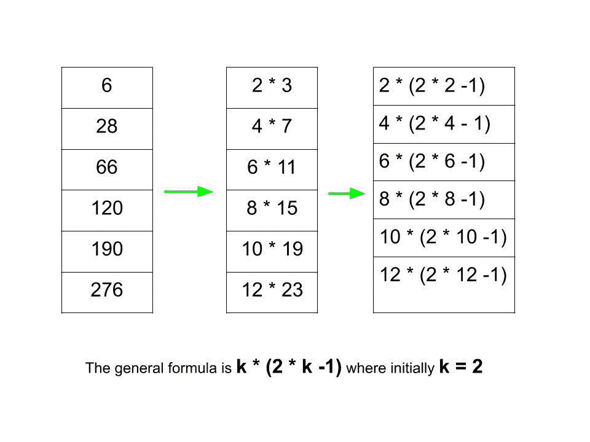

# 打印系列 6、28、66、120、190、276 的前 N 个术语……

> 原文:[https://www . geesforgeks . org/print-the-first-n-terms-of-series-6-28-66-120-190-276/](https://www.geeksforgeeks.org/print-the-first-n-terms-of-the-series-6-28-66-120-190-276/)

给定一个数字 **N** ，任务是打印系列 **6、28、66、120、190、276 的前 N 个术语，以此类推**。
**例:**

> **输入:**N = 10
> T3】输出:6 28 66 120 190 276 378 496 630 780
> T6】输入:N = 4
> T9】输出: 6 28 66 120

**方法:**要解决上述问题，我们必须观察以下模式:

[](https://media.geeksforgeeks.org/wp-content/uploads/20200623201023/GFG1.jpg)

> 通式如下:
> **k *(2 * k–1)**，其中，最初 k = 2

下面是上述方法的实现:

## C++

```
// C++ program for the above approach
#include <bits/stdc++.h>
using namespace std;

// Function to print the series
void printSeries(int n)
{
    // Initialise the value of k with 2
    int k = 2;

    // Iterate from 1 to n
    for (int i = 0; i < n; i++) {

        // Print each number
        cout << (k * (2 * k - 1))
             << " ";

        // Increment the value of
        // K by 2 for next number
        k += 2;
    }

    cout << endl;
}

// Driver Code
int main()
{
    // Given number N
    int N = 12;

    // Function Call
    printSeries(N);
    return 0;
}
```

## Java 语言(一种计算机语言，尤用于创建网站)

```
// Java program for the above approach
class GFG{

// Function to print the series
static void printSeries(int n)
{
    // Initialise the value of k with 2
    int k = 2;

    // Iterate from 1 to n
    for (int i = 0; i < n; i++)
    {

        // Print each number
        System.out.print(k * (2 * k - 1) + " ");

        // Increment the value of
        // K by 2 for next number
        k += 2;
    }

    System.out.println();
}

// Driver code
public static void main(String args[])
{
    // Given number N
    int N = 12;

    // Function Call
    printSeries(N);
}
}

// This code is contributed by shivaniisnghss2110
```

## 蟒蛇 3

```
# Python3 program for the above approach

# Function to print the series
def PrintSeries(n):

    # Initialise the value of k with 2
    k = 2

    # Iterate from 1 to n
    for i in range(0, n):

        # Print each number
        print(k * (2 * k - 1), end = ' ')

        # Increment the value of
        # K by 2 for next number
        k = k + 2

# Driver code    

# Given number
n = 12

# Function Call
PrintSeries(n)

# This code is contributed by poulami21ghosh  
```

## C#

```
// C# program for the above approach
using System;

class GFG{

// Function to print the series
static void printSeries(int n)
{

    // Initialise the value of k with 2
    int k = 2;

    // Iterate from 1 to n
    for(int i = 0; i < n; i++)
    {

        // Print each number
        Console.Write(k * (2 * k - 1) + " ");

        // Increment the value of
        // K by 2 for next number
        k += 2;
    }
    Console.WriteLine();
}

// Driver code
public static void Main()
{

    // Given number N
    int N = 12;

    // Function call
    printSeries(N);
}
}

// This code is contributed by sanjoy_62
```

## java 描述语言

```
<script>
// javascript program for the above approach

// Function to print the series
function printSeries( n)
{

    // Initialise the value of k with 2
    let k = 2;

    // Iterate from 1 to n
    for (let i = 0; i < n; i++) {

        // Print each number
        document.write((k * (2 * k - 1))
             + " ");

        // Increment the value of
        // K by 2 for next number
        k += 2;
    }

   document.writeln("<br/>");
}

// Driver Code

    // Given number N
    let N = 12;

    // Function Call
    printSeries(N);

// This code is contributed by Rajput-Ji

</script>
```

**Output:** 

```
6 28 66 120 190 276 378 496 630 780 946 1128
```

**时间复杂度:***O(N)*
T5】辅助空间: *O(1)*