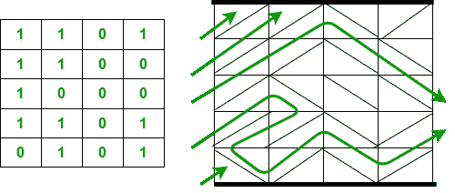
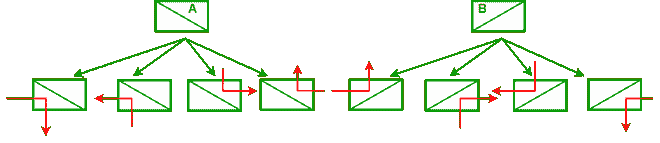

# 打印网格中每一行的索引，从中可以逃离网格

> 原文:[https://www . geeksforgeeks . org/print-the-indexes-for-a-grid-每一行都有可能逃离网格/](https://www.geeksforgeeks.org/print-the-indices-for-every-row-of-a-grid-from-which-escaping-from-the-grid-is-possible/)

给定维度为 **M * N** 的二进制 [2D 数组](https://www.geeksforgeeks.org/multidimensional-arrays-c-cpp/)**arr【】**表示网格，其中“ **0** ”表示在单元的主对角线上有一堵墙，而“ **1** ”表示在单元的交叉对角线上有一堵墙。任务是针对每一个 **i <sup>第</sup>** 行打印一个可以逃离网格的行的索引，假设一个人不能逃离网格的顶部或底部。

**示例:**

> **输入:** arr[][] = {{1，1，0，1}，{1，1，0，0}，{1，0，0，0}，{1，1，0，1}，{0，1，0，1}}
> **输出:** -1 -1 2 3 -1
> **解释:**
> 
> 
> 
> 第 0、1 或 4 行不存在转义路径。
> 如果一个人从第 2 <sup>行第</sup>行进入网格，那么他将按照上图所示的路径从单元(2，3)中出来。
> 如果一个人从 3 <sup>第</sup>行进入网格，那么他将按照上图所示的路径从单元(3，3)中出来。
> 
> **输入:** arr[][] = {{1，1，0}，{0，1，0}，{0，1，0}，{0，1，0}}
> **输出:** -1 2 3 -1

**方法:**给定的问题可以基于以下观察来解决:



*   从上面的图像可以观察到，对于给定的壁取向，取决于人进入细胞的方向，只有一种选择用于离开该细胞。
*   因此，对于每一行，想法是在给定的方向上迭代，跟踪一个人进入单元格的方向。

按照以下步骤解决问题:

*   [使用变量**行**迭代范围**【0，M–1】**](https://www.geeksforgeeks.org/range-based-loop-c/)，并执行以下操作:
    *   初始化两个变量，比如 **i** 和 **j** 来存储该人当前所在单元格的行索引和列索引。
    *   将**行**分配给 **i** ，将 **0** 分配给 **j** 。
    *   初始化一个变量，比如 **dir，**来存储一个人进入单元格的方向。
    *   重复直到 **j** 至少不是 **N** 并执行以下操作:
        *   如果 **arr[i][j]** 为 **1** ，则检查以下情况:
            *   如果 **dir** 等于“ **L** ，那么将 **i** 减 **1** ，并将 **D** 赋给 **dir** 。
            *   否则，如果 **dir** 等于“ **U** ，则将 **j** 减 **1** ，并将“ **R** 赋给 **dir** 。
            *   否则，如果 **dir** 等于“ **R** ，那么将 **i** 增加 **1** ，并将 **U** 分配给 **dir** 。
            *   否则，将 **j** 增加 **1** ，并将 **L** 分配给 **dir** 。
        *   否则，如果 **arr[i][j]** 为 **0** ，则检查以下情况:
            *   如果 **dir** 等于“ **L** ，那么将 **i** 增加 **1** ，并将 **U** 分配给 **dir** 。
            *   否则，如果 **dir** 等于“ **U** ，那么将 **j** 增加 **1** ，并将 **L** 分配给 **dir** 。
            *   否则，如果 **dir** 等于“ **R** ，那么将 **i** 减 **1** ，并将 **D** 赋给 **dir** 。
            *   否则，将 **j** 减 **1** ，并将 **R** 分配给 **dir** 。
        *   否则，如果 **i** 或 **j** 为 **0** 或 **i** 等于 **M** 或 **j** 等于 **N** 则断开。
    *   如果 **j** 等于 **N** ，则打印值 **i** 。
    *   否则，打印 **-1** 。

下面是上述方法的实现:

## C++

```
// C++ program for the above approach
#include <bits/stdc++.h>
using namespace std;

// Function to find the row index for
// every row of a matrix from which one
// can exit the grid after entering from left
void findPath(vector<vector<int> >& arr,
              int M, int N)
{
    // Iterate over the range [0, M-1]
    for (int row = 0; row < M; row++) {

        // Stores the direction from
        // which a person enters a cell
        char dir = 'L';

        // Row index from which
        // one enters the grid
        int i = row;

        // Column index from which
        // one enters the grid
        int j = 0;

        // Iterate until j is atleast N-1
        while (j < N) {

            // If Mat[i][j] is equal to 1
            if (arr[i][j] == 1) {

                // If entry is from left cell
                if (dir == 'L') {

                    // Decrement i by 1
                    i--;

                    // Assign 'D' to dir
                    dir = 'D';
                }

                // If entry is from upper cell
                else if (dir == 'U') {
                    // Decrement j by 1
                    j--;
                    // Assign 'R' to dir
                    dir = 'R';
                }
                // If entry is from right cell
                else if (dir == 'R') {

                    // Increment i by 1
                    i++;

                    // Assign 'U' to dir
                    dir = 'U';
                }

                // If entry is from bottom cell
                else if (dir == 'D') {

                    // Increment j by 1
                    j++;

                    // Assign 'L' to dir
                    dir = 'L';
                }
            }

            // Otherwise,
            else {
                // If entry is from left cell
                if (dir == 'L') {

                    // Increment i by 1
                    i++;

                    // Assign 'U' to dir
                    dir = 'U';
                }

                // If entry is from upper cell
                else if (dir == 'U') {

                    // Increment j by 1
                    j++;

                    // Assign 'L' to dir
                    dir = 'L';
                }

                // If entry is from right cell
                else if (dir == 'R') {

                    // Decrement i by 1
                    i--;

                    // Assign 'D' to dir
                    dir = 'D';
                }
                // If entry is from lower cell
                else if (dir == 'D') {

                    // Decrement j by 1
                    j--;

                    // Assign 'R' to dir
                    dir = 'R';
                }
            }

            // If i or j is less than 0 or i is
            // equal to M or j is equal to N
            if (i < 0 || i == M || j < 0 || j == N)
                break;
        }

        // If j is equal to N
        if (j == N)
            cout << i << " ";

        // Otherwise
        else
            cout << -1 << " ";
    }
}
// Driver Code
int main()
{
    // Input
    vector<vector<int> > arr = { { 1, 1, 0, 1 },
                                 { 1, 1, 0, 0 },
                                 { 1, 0, 0, 0 },
                                 { 1, 1, 0, 1 },
                                 { 0, 1, 0, 1 } };
    int M = arr.size();
    int N = arr[0].size();

    // Function call
    findPath(arr, M, N);
}
```

## Java 语言(一种计算机语言，尤用于创建网站)

```
// Java program for the above approach
import java.util.*;

class GFG{

// Function to find the row index for
// every row of a matrix from which one
// can exit the grid after entering from left
static void findPath(int [][]arr,
                     int M, int N)
{

    // Iterate over the range [0, M-1]
    for(int row = 0; row < M; row++)
    {

        // Stores the direction from
        // which a person enters a cell
        char dir = 'L';

        // Row index from which
        // one enters the grid
        int i = row;

        // Column index from which
        // one enters the grid
        int j = 0;

        // Iterate until j is atleast N-1
        while (j < N)
        {

            // If Mat[i][j] is equal to 1
            if (arr[i][j] == 1)
            {

                // If entry is from left cell
                if (dir == 'L')
                {

                    // Decrement i by 1
                    i--;

                    // Assign 'D' to dir
                    dir = 'D';
                }

                // If entry is from upper cell
                else if (dir == 'U')
                {

                    // Decrement j by 1
                    j--;

                    // Assign 'R' to dir
                    dir = 'R';
                }

                // If entry is from right cell
                else if (dir == 'R')
                {

                    // Increment i by 1
                    i++;

                    // Assign 'U' to dir
                    dir = 'U';
                }

                // If entry is from bottom cell
                else if (dir == 'D')
                {

                    // Increment j by 1
                    j++;

                    // Assign 'L' to dir
                    dir = 'L';
                }
            }

            // Otherwise,
            else
            {

                // If entry is from left cell
                if (dir == 'L')
                {

                    // Increment i by 1
                    i++;

                    // Assign 'U' to dir
                    dir = 'U';
                }

                // If entry is from upper cell
                else if (dir == 'U')
                {

                    // Increment j by 1
                    j++;

                    // Assign 'L' to dir
                    dir = 'L';
                }

                // If entry is from right cell
                else if (dir == 'R')
                {

                    // Decrement i by 1
                    i--;

                    // Assign 'D' to dir
                    dir = 'D';
                }

                // If entry is from lower cell
                else if (dir == 'D')
                {

                    // Decrement j by 1
                    j--;

                    // Assign 'R' to dir
                    dir = 'R';
                }
            }

            // If i or j is less than 0 or i is
            // equal to M or j is equal to N
            if (i < 0 || i == M || j < 0 || j == N)
                break;
        }

        // If j is equal to N
        if (j == N)
            System.out.print(i + " ");

        // Otherwise
        else
            System.out.print(-1 + " ");
    }
}

// Driver Code
public static void main(String[] args)
{

    // Input
    int [][]arr = { { 1, 1, 0, 1 },
                    { 1, 1, 0, 0 },
                    { 1, 0, 0, 0 },
                    { 1, 1, 0, 1 },
                    { 0, 1, 0, 1 } };
    int M = arr.length;
    int N = arr[0].length;

    // Function call
    findPath(arr, M, N);
}
}

// This code is contributed by shikhasingrajput
```

## 蟒蛇 3

```
# Python3 program
# for the above approach

# Function to find the row index for
# every row of a matrix from which one
# can exit the grid after entering from left
def findPath(arr, M,  N) :

    # Iterate over the range [0, M-1]
    for row in range(M):

        # Stores the direction from
        # which a person enters a cell
        dir = 'L'

        # Row index from which
        # one enters the grid
        i = row

        # Column index from which
        # one enters the grid
        j = 0

        # Iterate until j is atleast N-1
        while (j < N) :

            # If Mat[i][j] is equal to 1
            if (arr[i][j] == 1) :

                # If entry is from left cell
                if (dir == 'L') :

                    # Decrement i by 1
                    i -= 1

                    # Assign 'D' to dir
                    dir = 'D'

                # If entry is from upper cell
                elif (dir == 'U') :
                    # Decrement j by 1
                    j -= 1
                    # Assign 'R' to dir
                    dir = 'R'

                # If entry is from right cell
                elif (dir == 'R') :

                    # Increment i by 1
                    i += 1

                    # Assign 'U' to dir
                    dir = 'U'

                # If entry is from bottom cell
                elif (dir == 'D') :

                    # Increment j by 1
                    j += 1

                    # Assign 'L' to dir
                    dir = 'L'

            # Otherwise,
            else :
                # If entry is from left cell
                if (dir == 'L') :

                    # Increment i by 1
                    i += 1

                    # Assign 'U' to dir
                    dir = 'U'

                # If entry is from upper cell
                elif (dir == 'U') :

                    # Increment j by 1
                    j += 1

                    # Assign 'L' to dir
                    dir = 'L'

                # If entry is from right cell
                elif (dir == 'R') :

                    # Decrement i by 1
                    i -= 1

                    # Assign 'D' to dir
                    dir = 'D'

                # If entry is from lower cell
                elif (dir == 'D') :

                    # Decrement j by 1
                    j -= 1

                    # Assign 'R' to dir
                    dir = 'R'

            # If i or j is less than 0 or i is
            # equal to M or j is equal to N
            if (i < 0 or i == M or j < 0 or j == N):
                break

        # If j is equal to N
        if (j == N) :
            print(i, end = " ")

        # Otherwise
        else :
            print(-1, end = " ")

# Driver Code

arr = [[ 1, 1, 0, 1 ],
    [ 1, 1, 0, 0 ],
    [ 1, 0, 0, 0 ],
    [ 1, 1, 0, 1 ],
    [ 0, 1, 0, 1 ]]

M = len(arr)
N = len(arr[0])

# Function call
findPath(arr, M, N)

# This code is contributed by susmitakundugoaldanga.
```

## C#

```
// C# program for the above approach

using System;

class GFG {
    // Function to find the row index for
    // every row of a matrix from which one
    // can exit the grid after entering from left
    static void findPath(int[, ] arr, int M, int N)
    {
        // Iterate over the range [0, M-1]
        for (int row = 0; row < M; row++) {

            // Stores the direction from
            // which a person enters a cell
            char dir = 'L';

            // Row index from which
            // one enters the grid
            int i = row;

            // Column index from which
            // one enters the grid
            int j = 0;

            // Iterate until j is atleast N-1
            while (j < N) {

                // If Mat[i][j] is equal to 1
                if (arr[i, j] == 1) {

                    // If entry is from left cell
                    if (dir == 'L') {

                        // Decrement i by 1
                        i--;

                        // Assign 'D' to dir
                        dir = 'D';
                    }

                    // If entry is from upper cell
                    else if (dir == 'U') {
                        // Decrement j by 1
                        j--;
                        // Assign 'R' to dir
                        dir = 'R';
                    }
                    // If entry is from right cell
                    else if (dir == 'R') {

                        // Increment i by 1
                        i++;

                        // Assign 'U' to dir
                        dir = 'U';
                    }

                    // If entry is from bottom cell
                    else if (dir == 'D') {

                        // Increment j by 1
                        j++;

                        // Assign 'L' to dir
                        dir = 'L';
                    }
                }

                // Otherwise,
                else {
                    // If entry is from left cell
                    if (dir == 'L') {

                        // Increment i by 1
                        i++;

                        // Assign 'U' to dir
                        dir = 'U';
                    }

                    // If entry is from upper cell
                    else if (dir == 'U') {

                        // Increment j by 1
                        j++;

                        // Assign 'L' to dir
                        dir = 'L';
                    }

                    // If entry is from right cell
                    else if (dir == 'R') {

                        // Decrement i by 1
                        i--;

                        // Assign 'D' to dir
                        dir = 'D';
                    }
                    // If entry is from lower cell
                    else if (dir == 'D') {

                        // Decrement j by 1
                        j--;

                        // Assign 'R' to dir
                        dir = 'R';
                    }
                }

                // If i or j is less than 0 or i is
                // equal to M or j is equal to N
                if (i < 0 || i == M || j < 0 || j == N)
                    break;
            }

            // If j is equal to N
            if (j == N)
                Console.Write(i + " ");

            // Otherwise
            else
                Console.Write(-1 + " ");
        }
    }

    // Driver Code
    public static void Main()
    {

        // Input
        int[, ] arr = { { 1, 1, 0, 1 },
                        { 1, 1, 0, 0 },
                        { 1, 0, 0, 0 },
                        { 1, 1, 0, 1 },
                        { 0, 1, 0, 1 } };
        int M = arr.GetLength(0);
        int N = arr.GetLength(1);

        // Function call
        findPath(arr, M, N);
    }
}

// This code is contributed by ukasp.
```

## java 描述语言

```
<script>

// Javascript implementation of the above approach

// Function to find the row index for
// every row of a matrix from which one
// can exit the grid after entering from left
function findPath(arr, M, N)
{

    // Iterate over the range [0, M-1]
    for(let row = 0; row < M; row++)
    {

        // Stores the direction from
        // which a person enters a cell
        let dir = 'L';

        // Row index from which
        // one enters the grid
        let i = row;

        // Column index from which
        // one enters the grid
        let j = 0;

        // Iterate until j is atleast N-1
        while (j < N)
        {

            // If Mat[i][j] is equal to 1
            if (arr[i][j] == 1)
            {

                // If entry is from left cell
                if (dir == 'L')
                {

                    // Decrement i by 1
                    i--;

                    // Assign 'D' to dir
                    dir = 'D';
                }

                // If entry is from upper cell
                else if (dir == 'U')
                {

                    // Decrement j by 1
                    j--;

                    // Assign 'R' to dir
                    dir = 'R';
                }

                // If entry is from right cell
                else if (dir == 'R')
                {

                    // Increment i by 1
                    i++;

                    // Assign 'U' to dir
                    dir = 'U';
                }

                // If entry is from bottom cell
                else if (dir == 'D')
                {

                    // Increment j by 1
                    j++;

                    // Assign 'L' to dir
                    dir = 'L';
                }
            }

            // Otherwise,
            else
            {

                // If entry is from left cell
                if (dir == 'L')
                {

                    // Increment i by 1
                    i++;

                    // Assign 'U' to dir
                    dir = 'U';
                }

                // If entry is from upper cell
                else if (dir == 'U')
                {

                    // Increment j by 1
                    j++;

                    // Assign 'L' to dir
                    dir = 'L';
                }

                // If entry is from right cell
                else if (dir == 'R')
                {

                    // Decrement i by 1
                    i--;

                    // Assign 'D' to dir
                    dir = 'D';
                }

                // If entry is from lower cell
                else if (dir == 'D')
                {

                    // Decrement j by 1
                    j--;

                    // Assign 'R' to dir
                    dir = 'R';
                }
            }

            // If i or j is less than 0 or i is
            // equal to M or j is equal to N
            if (i < 0 || i == M || j < 0 || j == N)
                break;
        }

        // If j is equal to N
        if (j == N)
            document.write(i + " ");

        // Otherwise
        else
            document.write(-1 + " ");
    }
}

  // Driver Code

    // Input
    let arr = [[ 1, 1, 0, 1 ],
               [ 1, 1, 0, 0 ],
               [ 1, 0, 0, 0 ],
               [ 1, 1, 0, 1 ],
               [ 0, 1, 0, 1 ]];
    let M = arr.length;
    let N = arr[0].length;

    // Function call
    findPath(arr, M, N);

</script>
```

**Output:** 

```
-1 -1 2 3 -1
```

***时间复杂度:** O(M * N)。*
***辅助空间:** O(1)*