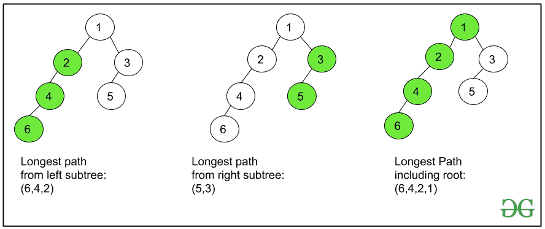

# 打印二叉树中从根到叶的最长路径

> 原文:[https://www . geesforgeks . org/print-二叉树从根到叶的最长路径/](https://www.geeksforgeeks.org/print-the-longest-path-from-root-to-leaf-in-a-binary-tree/)

给定一个[二叉树](https://www.geeksforgeeks.org/binary-tree-data-structure/)，任务是打印从根节点到叶节点的最长路径。如果有多个答案，打印其中任何一个。

**示例:**

```
Input: 
      4
     / \
    3   6
       / \
      5   7
Output: 
4 -> 6 -> 7 
Explanation:
Longest paths from root to leaf
are (4 -> 6 -> 5) 
and (4 -> 6 -> 7).
Print any of them.

Input:
         1
        / \
       2   3
     /  \
    4    5
          \
           6
Output:
1 -> 2 -> 5 -> 6
```

**天真方法:**思路是生成从根节点到所有叶节点的所有可能路径，跟踪最大长度的路径，最后打印最长路径。

***时间复杂度:** O(N <sup>2</sup> )*

**高效途径:**思路是利用[递归](https://www.geeksforgeeks.org/recursion/)高效解决这个问题。主要思想是递归地从左子树和右子树中获得最长的路径，然后将当前节点添加到一个更长的节点，这将是从当前节点到叶子的最长路径。从根节点开始，对递归调用的**每个节点**执行以下步骤。

*   如果根节点为空，则不存在路径，返回一个空向量。
*   通过递归遍历**根- >右，得到向量**右向量**中右子树的最长路径。**
*   类似地，通过递归遍历左**根- >来获得向量**左向量**中从左子树开始的最长路径。**
*   比较**右向量**和**左向量**的长度，并将当前节点附加到两个向量中较长的一个上并返回该向量。

通过遵循上述步骤，在树遍历结束时获得的向量是可能的最长路径。反向打印矢量，作为从根到叶的最长路径。

请看这张图片，了解如何使用从左和右子树的节点开始的最长路径来获得从当前节点开始的最长路径:

[](https://media.geeksforgeeks.org/wp-content/uploads/20200619192551/Copy-of-figure1.png)

下面是上述方法的实现:

## C++

```
// C++ Program to print Longest Path
// from root to leaf in a Binary tree
#include <bits/stdc++.h>
using namespace std;

// Tree node Structure
struct Node {
    int data;
    Node *left, *right;
};

struct Node* newNode(int data)
{
    struct Node* node = new Node;
    node->data = data;
    node->left = node->right = NULL;

    return (node);
}

// Function to find and return the
// longest path
vector<int> longestPath(Node* root)
{

    // If root is null means there
    // is no binary tree so
    // return a empty vector
    if (root == NULL) {
        vector<int> temp
            = {};
        return temp;
    }

    // Recursive call on root->right
    vector<int> rightvect
        = longestPath(root->right);

    // Recursive call on root->left
    vector<int> leftvect
        = longestPath(root->left);

    // Compare the size of the two vectors
    // and insert current node accordingly
    if (leftvect.size() > rightvect.size())
        leftvect.push_back(root->data);

    else
        rightvect.push_back(root->data);

    // Return the appropriate vector
    return (leftvect.size() > rightvect.size()
                ? leftvect
                : rightvect);
}

// Driver Code
int main()
{
    struct Node* root = newNode(1);
    root->left = newNode(2);
    root->right = newNode(3);
    root->left->left = newNode(4);
    root->left->right = newNode(5);
    root->left->right->right = newNode(6);

    vector<int> output = longestPath(root);
    int n = output.size();

    cout << output[n - 1];
    for (int i = n - 2; i >= 0; i--) {
        cout << " -> " << output[i];
    }

    return 0;
}
```

## Java 语言(一种计算机语言，尤用于创建网站)

```
// Java program to print Longest Path
// from root to leaf in a Binary tree
import java.io.*;
import java.util.ArrayList;

class GFG{

// Binary tree node
static class Node
{
    Node left;
    Node right;
    int data;
};

// Function to create a new
// Binary node
static Node newNode(int data)
{
    Node temp = new Node();

    temp.data = data;
    temp.left = null;
    temp.right = null;

    return temp;
}

// Function to find and return the
// longest path
public static ArrayList<Integer> longestPath(Node root)
{

    // If root is null means there
    // is no binary tree so
    // return a empty vector
    if(root == null)
    {
        ArrayList<Integer> output = new ArrayList<>();
        return output;
    }

    // Recursive call on root.right
    ArrayList<Integer> right = longestPath(root.right);

    // Recursive call on root.left
    ArrayList<Integer> left = longestPath(root.left);

    // Compare the size of the two ArrayList
    // and insert current node accordingly
    if(right.size() < left.size())
    {
        left.add(root.data);
    }
    else
    {
        right.add(root.data);
    }

    // Return the appropriate ArrayList
    return (left.size() >
            right.size() ? left :right);
}

// Driver Code
public static void main(String[] args)
{
    Node root = newNode(1);
    root.left = newNode(2);
    root.right = newNode(3);
    root.left.left = newNode(4);
    root.left.right = newNode(5);
    root.left.right.right = newNode(6);

    ArrayList<Integer> output = longestPath(root);
    int n = output.size();

    System.out.print(output.get(n - 1));
    for(int i = n - 2; i >= 0; i--)
    {
        System.out.print(" -> " + output.get(i));
    }
}
}

// This code is contributed by HamreetSingh
```

## 蟒蛇 3

```
# Python3 program to print longest path
# from root to leaf in a Binary tree

# Tree node Structure
class Node:

    def __init__(self, key):

        self.data = key
        self.left = None
        self.right = None

# Function to find and return the
# longest path
def longestPath(root):

    # If root is null means there
    # is no binary tree so
    # return a empty vector
    if (root == None):
        return []

    # Recursive call on root.right
    rightvect = longestPath(root.right)

    # Recursive call on root.left
    leftvect = longestPath(root.left)

    # Compare the size of the two vectors
    # and insert current node accordingly
    if (len(leftvect) > len(rightvect)):
        leftvect.append(root.data)
    else:
        rightvect.append(root.data)

    # Return the appropriate vector
    if len(leftvect) > len(rightvect):
        return leftvect

    return rightvect

# Driver Code
if __name__ == '__main__':

    root = Node(1)
    root.left = Node(2)
    root.right = Node(3)
    root.left.left = Node(4)
    root.left.right = Node(5)
    root.left.right.right = Node(6)

    output = longestPath(root)
    n = len(output)

    print(output[n - 1], end = "")
    for i in range(n - 2, -1, -1):
        print(" ->", output[i], end = "")

# This code is contributed by mohit kumar 29
```

## C#

```
// C# program to print
// longest Path from
// root to leaf in a
// Binary tree
using System;
using System.Collections.Generic;
class GFG{

// Binary tree node
class Node
{
  public Node left;
  public Node right;
  public int data;
};

// Function to create a new
// Binary node
static Node newNode(int data)
{
  Node temp = new Node();
  temp.data = data;
  temp.left = null;
  temp.right = null;
  return temp;
}

// Function to find and
// return the longest path
static List<int> longestPath(Node root)
{   
  // If root is null means there
  // is no binary tree so
  // return a empty vector
  if(root == null)
  {
    List<int> output = new List<int>();
    return output;
  }

  // Recursive call on root.right
  List<int> right = longestPath(root.right);

  // Recursive call on root.left
  List<int> left = longestPath(root.left);

  // Compare the size of the two List
  // and insert current node accordingly
  if(right.Count < left.Count)
  {
    left.Add(root.data);
  }
  else
  {
    right.Add(root.data);
  }

  // Return the appropriate List
  return (left.Count >
          right.Count ?
          left :right);
}

// Driver Code
public static void Main(String[] args)
{
  Node root = newNode(1);
  root.left = newNode(2);
  root.right = newNode(3);
  root.left.left = newNode(4);
  root.left.right = newNode(5);
  root.left.right.right = newNode(6);

  List<int> output = longestPath(root);
  int n = output.Count;

  Console.Write(output[n - 1]);
  for(int i = n - 2; i >= 0; i--)
  {
    Console.Write(" -> " + output[i]);
  }
}
}

// This code is contributed by 29AjayKumar
```

## java 描述语言

```
<script>

// Javascript program to print Longest Path
// from root to leaf in a Binary tree

// Binary tree node
class Node
{

    // Function to create a new
    // Binary node
    constructor(data)
    {
        this.data = data;
        this.left = this.right = null;
    }
}

// Function to find and return the
// longest path
function longestPath(root)
{

    // If root is null means there
    // is no binary tree so
    // return a empty vector
    if (root == null)
    {
        let output = [];
        return output;
    }

    // Recursive call on root.right
    let right = longestPath(root.right);

    // Recursive call on root.left
    let left = longestPath(root.left);

    // Compare the size of the two ArrayList
    // and insert current node accordingly
    if (right.length < left.length)
    {
        left.push(root.data);
    }
    else
    {
        right.push(root.data);
    }

    // Return the appropriate ArrayList
    return (left.length >
            right.length ? left :right);
}

// Driver code
let root = new Node(1);
root.left = new Node(2);
root.right = new Node(3);
root.left.left = new Node(4);
root.left.right = new Node(5);
root.left.right.right = new Node(6);

let output = longestPath(root);
let n = output.length;

document.write(output[n - 1]);
for(let i = n - 2; i >= 0; i--)
{
    document.write(" -> " + output[i]);
}

// This code is contributed by unknown2108

</script>
```

**Output**

```
1 -> 2 -> 5 -> 6
```

***时间复杂度:**O(N)*
T5**辅助空间:** O(N)