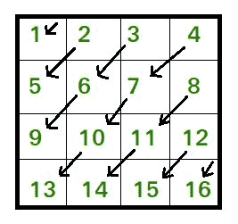

# 对角向下打印矩阵

> 原文:[https://www . geeksforgeeks . org/print-the-matrix-对角向下/](https://www.geeksforgeeks.org/print-the-matrix-diagonally-downwards/)

给定一个大小为 n*n 的矩阵，按照以下模式打印该矩阵。



**产量:1 2 5 3 6 9 4 7 10 13 8 11 14 12 15 16**
**例:**

```
Input :matrix[2][2]= { {1, 2},
                       {3, 4} }
Output : 1 2 3 4

Input :matrix[3][3]= { {1, 2, 3},
                       {4, 5, 6},
                       {7, 8, 9} }
Output : 1 2 4 3 5 7 6 8 9
```

下面是上述模式的 C++实现。

## C++

```
// CPP program to print matrix downward
#include <bits/stdc++.h>
using namespace std;

void printMatrixDiagonallyDown(vector<vector<int> > matrix,
                                                    int n)
{
    // printing elements above and on
    // second diagonal
    for (int k = 0; k < n; k++) {

        // traversing downwards starting
        // from first row
        int row = 0, col = k;
        while (col >= 0) {
            cout << matrix[row][col] << " ";
            row++, col--;
        }
    }

    // printing elements below second
    // diagonal
    for (int j = 1; j < n; j++) {

        // traversing downwards starting
        // from last column
        int col = n - 1, row = j;
        while (row < n) {
            cout << matrix[row][col] << " ";
            row++, col--;
        }
    }
}

int main()
{
    vector<vector<int> > matrix{ { 1, 2, 3 },
                                 { 4, 5, 6 },
                                 { 7, 8, 9 } };
    int n = 3;
    printMatrixDiagonallyDown(matrix, n);
    return 0;
}
```

## Java 语言(一种计算机语言，尤用于创建网站)

```
// JAVA program to print
// matrix downward
class GFG{
static void printMatrixDiagonallyDown(int[][] matrix,
                                      int n)
{
  // printing elements above and on
  // second diagonal
  for (int k = 0; k < n; k++)
  {
    // traversing downwards
    // starting from first row
    int row = 0, col = k;
    while (col >= 0)
    {
      System.out.print(matrix[row][col] + " ");
      row++;
      col--;
    }
  }

  // printing elements below
  // second diagonal
  for (int j = 1; j < n; j++)
  {
    // traversing downwards starting
    // from last column
    int col = n - 1, row = j;
    while (row < n)
    {
      System.out.print(matrix[row][col] + " ");
      row++;
      col--;
    }
  }
}

// Driver code
public static void main(String[] args)
{
  int[][] matrix = {{1, 2, 3},
                    {4, 5, 6},
                    {7, 8, 9}};
  int n = 3;
  printMatrixDiagonallyDown(matrix, n);
}
}

// This code is contributed by Rajput-Ji
```

## 蟒蛇 3

```
# Python 3 program to print matrix downward

def printMatrixDiagonallyDown(matrix,n):
    # printing elements above and on
    # second diagonal
    for k in range(n):
        # traversing downwards starting
        # from first row
        row = 0
        col = k
        while (col >= 0):
            print(matrix[row][col],end = " ")
            row += 1
            col -= 1

    # printing elements below second
    # diagonal
    for j in range(1,n):
        # traversing downwards starting
        # from last column
        col = n - 1
        row = j
        while (row < n):
            print(matrix[row][col],end = " ")
            row += 1
            col -= 1

if __name__ == '__main__':
    matrix = [[1, 2, 3],[4, 5, 6],[7, 8, 9]]
    n = 3
    printMatrixDiagonallyDown(matrix, n)

# This code is contributed by Surendra_Gangwar
```

## C#

```
// C# program to print
// matrix downward
using System;
class GFG{
static void printMatrixDiagonallyDown(int[,] matrix,
                                      int n)
{
  // printing elements above and on
  // second diagonal
  for (int k = 0; k < n; k++)
  {
    // traversing downwards
    // starting from first row
    int row = 0, col = k;

    while (col >= 0)
    {
      Console.Write(matrix[row,col] + " ");
      row++;
      col--;
    }
  }

  // printing elements below
  // second diagonal
  for (int j = 1; j < n; j++)
  {
    // traversing downwards starting
    // from last column
    int col = n - 1, row = j;
    while (row < n)
    {
      Console.Write(matrix[row,col] + " ");
      row++;
      col--;
    }
  }
}

// Driver code
public static void Main(String[] args)
{
  int[,] matrix = {{1, 2, 3},
                   {4, 5, 6},
                   {7, 8, 9}};
  int n = 3;
  printMatrixDiagonallyDown(matrix, n);
}
}

// This code is contributed by Amit Katiyar
```

## java 描述语言

```
<script>

// JavaScript program to print
// matrix downward
function printMatrixDiagonallyDown(matrix,n)
{
// printing elements above and on
// second diagonal
for (let k = 0; k < n; k++)
{
    // traversing downwards
    // starting from first row
    let row = 0, col = k;
    while (col >= 0)
    {
    document.write(matrix[row][col] + " ");
    row++;
    col--;
    }
}

// printing elements below
// second diagonal
for (let j = 1; j < n; j++)
{
    // traversing downwards starting
    // from last column
    let col = n - 1, row = j;
    while (row < n)
    {
    document.write(matrix[row][col] + " ");
    row++;
    col--;
    }
}
}

// Driver code

let matrix = [[1, 2, 3],
                    [4, 5, 6],
                    [7, 8, 9]];
let n = 3;
printMatrixDiagonallyDown(matrix, n);

// This code is contributed by sravan kumar

</script>
```

**输出:**

```
1 2 4 3 5 7 6 8 9
```

**时间复杂度:O(n*n)**