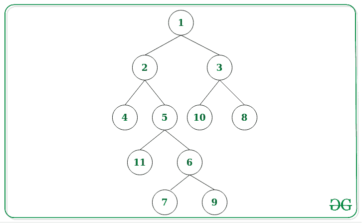
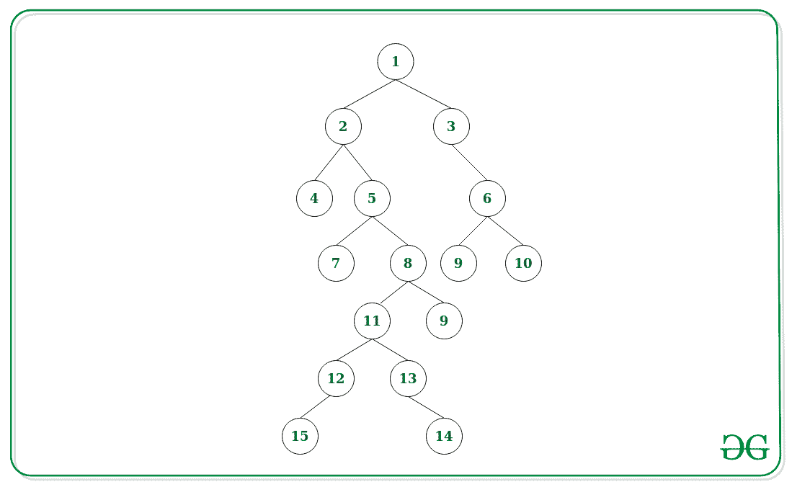

# 打印二叉树每一级的中间节点

> 原文:[https://www . geeksforgeeks . org/print-每层二叉树的中间节点/](https://www.geeksforgeeks.org/print-the-middle-nodes-of-each-level-of-a-binary-tree/)

给定一个[二叉树](https://www.geeksforgeeks.org/binary-tree-data-structure/)，任务是打印二叉树的每个[级的中间节点。考虑到 **M** 为任意级别的节点数，如果 **M** 为奇数，则打印 **(M/2) <sup>第</sup>个**节点。否则，打印 **(M/2) <sup>第</sup>** 节点和 **((M/2) + 1) <sup>第</sup>** 节点。](https://www.geeksforgeeks.org/get-level-of-a-node-in-a-binary-tree/)

**示例:**

> **输入:**下面是给定的树:
> 
> 
> 
> **输出:**
> 1
> 2 3
> 5 10
> 11 6
> 7 9
> **说明:**
> 每一级的中间节点为:
> 级 0–1
> 级 1–2 和 3
> 级 2–5 和 10
> 级 3–11 和 6
> 级 4–7 和 9
> 
> **输入:**下面是给定的树:
> 
> 
> 
> **输出:**
> 1
> 2 3
> 5
> 8 9
> 11
> 12 13
> 15 14
> **说明:**
> 每一级的中间节点为:
> 级 0–1
> 级 1–2 和 3
> 级 2–5
> 级 3–8 和 9
> 级 4–11
> 级 5–12 和 13

**方法:**想法是在给定的树上执行 [DFS 遍历，并将每个级别的所有节点存储在](https://www.geeksforgeeks.org/dfs-traversal-of-a-tree-using-recursion/)[向量](https://www.geeksforgeeks.org/vector-in-cpp-stl/)的[图](https://www.geeksforgeeks.org/map-associative-containers-the-c-standard-template-library-stl/)中。现在遍历地图并相应地打印中间节点。以下是步骤:

1.  初始化一个向量图 **M** 来存储一个向量中每个级别对应的所有节点。
2.  对给定的树执行 [DFS 遍历](https://www.geeksforgeeks.org/depth-first-search-or-dfs-for-a-graph/)，从**0 级**开始，[递归地](https://www.geeksforgeeks.org/recursion/)调用左右子树，在该级中增加 **1** 。
3.  将上述 DFS 遍历中每一级对应的所有节点存储为 **M【级】。push_back(root- >数据)**。
4.  现在，遍历地图 **M** 并对每个级别执行以下操作:
    *   在地图 **M** 中找到与每个关卡相关的矢量(比如说 **A** )的大小(比如说 **S** )。
    *   如果 S 为奇数，则只需将**A[(S–1)/2]**的值打印为中间的 **(S/2) <sup>第</sup>** 节点。
    *   否则打印**A【(S–1)/2】**和**A【(S–1)/2+1】**的值作为中间 **(S/2) <sup>第</sup>** 和 **((S/2) + 1) <sup>第</sup>** <sup>第</sup>节点。

下面是上述方法的实现:

## C++

```
// C++ program for the above approach

#include <bits/stdc++.h>
using namespace std;

// Structure Node of Binary Tree
struct node {
    int data;
    struct node* left;
    struct node* right;
};

// Function to create a new node
struct node* newnode(int d)
{
    struct node* temp
        = (struct node*)malloc(
            sizeof(struct node));
    temp->data = d;
    temp->left = NULL;
    temp->right = NULL;

    // Return the created node
    return temp;
}

// Function that performs the DFS
// traversal on Tree to store all the
// nodes at each level in map M
void dfs(node* root, int l,
         map<int, vector<int> >& M)
{
    // Base Case
    if (root == NULL)
        return;

    // Push the current level node
    M[l].push_back(root->data);

    // Left Recursion
    dfs(root->left, l + 1, M);

    // Right Recursion
    dfs(root->right, l + 1, M);
}

// Function that print all the middle
// nodes for each level in Binary Tree
void printMidNodes(node* root)
{

    // Stores all node in each level
    map<int, vector<int> > M;

    // Perform DFS traversal
    dfs(root, 0, M);

    // Traverse the map M
    for (auto& it : M) {

        // Get the size of vector
        int size = it.second.size();

        // For odd number of elements
        if (size & 1) {

            // Print (M/2)th Element
            cout << it.second[(size - 1) / 2]
                 << endl;
        }

        // Otherwise
        else {

            // Print (M/2)th and
            // (M/2 + 1)th Element
            cout << it.second[(size - 1) / 2]
                 << ' '
                 << it.second[(size - 1) / 2 + 1]
                 << endl;
        }
    }
}

// Driver Code
int main()
{
    /*
    Binary tree shown below is:

                                1
                              /   \
                            2      3
                          /   \   /  \
                         4     5 10   8
                              / \
                             11  6
                                / \
                               7   9

    */

    // Given Tree
    struct node* root = newnode(1);
    root->left = newnode(2);
    root->right = newnode(3);
    root->left->left = newnode(4);
    root->left->right = newnode(5);
    root->left->right->left = newnode(11);
    root->left->right->right = newnode(6);
    root->left->right->right->left = newnode(7);
    root->left->right->right->right = newnode(9);
    root->right->left = newnode(10);
    root->right->right = newnode(8);

    // Function Call
    printMidNodes(root);

    return 0;
}
```

## Java 语言(一种计算机语言，尤用于创建网站)

```
// Java program for
// the above approach
import java.util.*;
class GFG{

static Map<Integer, Vector<Integer> > M;

// Structure Node of
// Binary Tree
static class node
{
  int data;
  node left;
  node right;
  public node() {}
  public node(int data,
              node left,
              node right)
  {
    super();
    this.data = data;
    this.left = left;
    this.right = right;
  }
};

// Function to create a new node
static node newnode(int d)
{
  node temp = new node();
  temp.data = d;
  temp.left = null;
  temp.right = null;

  // Return the created node
  return temp;
}

// Function that performs the DFS
// traversal on Tree to store all the
// nodes at each level in map M
static void dfs(node root, int l)
{
  // Base Case
  if (root == null)
    return;

  // Push the current level node
  if(!M.containsKey(l))
  {
    Vector<Integer> temp = new Vector<Integer>();
    temp.add(root.data);
    M.put(l, temp);
  }
  else
    M.get(l).add(root.data);

  // Left Recursion
  dfs(root.left, l + 1);

  // Right Recursion
  dfs(root.right, l + 1);
}

// Function that print all the middle
// nodes for each level in Binary Tree
static void printMidNodes(node root)
{
  // Stores all node in each level
  M = new HashMap<Integer,
          Vector<Integer> >();

  // Perform DFS traversal
  dfs(root, 0);

  // Traverse the map M
  for (Map.Entry<Integer,
       Vector<Integer>> it : M.entrySet())
  {
    // Get the size of vector
    int size = it.getValue().size();

    // For odd number of elements
    if (size % 2 == 1)
    {
      // Print (M/2)th Element
      System.out.print(it.getValue().get((size - 1) / 2) + "\n");
    }

    // Otherwise
    else
    {
      // Print (M/2)th and
      // (M/2 + 1)th Element
      System.out.print(it.getValue().get((size - 1) / 2) + " " +
                       it.getValue().get(((size - 1) / 2) + 1) + "\n");
    }
  }
}

// Driver Code
public static void main(String[] args)
{
  /*
    Binary tree shown below is:

                                1
                              /   \
                            2      3
                          /   \   /  \
                         4     5 10   8
                              / \
                             11  6
                                / \
                               7   9

    */

  // Given Tree
  node root = newnode(1);
  root.left = newnode(2);
  root.right = newnode(3);
  root.left.left = newnode(4);
  root.left.right = newnode(5);
  root.left.right.left = newnode(11);
  root.left.right.right = newnode(6);
  root.left.right.right.left = newnode(7);
  root.left.right.right.right = newnode(9);
  root.right.left = newnode(10);
  root.right.right = newnode(8);

  // Function Call
  printMidNodes(root);
}
}

//This code is contributed by 29AjayKumar
```

## 蟒蛇 3

```
# Python3 program for the above approach

# Structure Node of Binary Tree
class node:

    def __init__(self, data):

        self.data = data
        self.left = None
        self.right = None

# Function to create a new node
def newnode(d):

    temp = node(d)

    # Return the created node
    return temp

# Function that performs the DFS
# traversal on Tree to store all the
# nodes at each level in map M
def dfs(root, l, M):

    # Base Case
    if (root == None):
        return

    # Push the current level node
    if l not in M:
        M[l] = []

    M[l].append(root.data)

    # Left Recursion
    dfs(root.left, l + 1, M)

    # Right Recursion
    dfs(root.right, l + 1, M)

# Function that print all the middle
# nodes for each level in Binary Tree
def printMidNodes(root):

    # Stores all node in each level
    M = dict()

    # Perform DFS traversal
    dfs(root, 0, M)

    # Traverse the map M
    for it in M.values():

        # Get the size of vector
        size = len(it)

        # For odd number of elements
        if (size & 1):

            # Print (M/2)th Element
            print(it[(size - 1) // 2])

        # Otherwise
        else:

            # Print (M/2)th and
            # (M/2 + 1)th Element
            print(str(it[(size - 1) // 2]) + ' ' +
                  str(it[(size - 1) // 2 + 1]))

# Driver Code
if __name__=="__main__":

    '''
    Binary tree shown below is:
            1
          /   \
        2      3
      /   \   /  \
     4     5 10   8
          / \
         11  6
            / \
           7   9
    '''

    # Given Tree
    root = newnode(1)
    root.left = newnode(2)
    root.right = newnode(3)
    root.left.left = newnode(4)
    root.left.right = newnode(5)
    root.left.right.left = newnode(11)
    root.left.right.right = newnode(6)
    root.left.right.right.left = newnode(7)
    root.left.right.right.right = newnode(9)
    root.right.left = newnode(10)
    root.right.right = newnode(8)

    # Function Call
    printMidNodes(root)

# This code is contributed by rutvik_56
```

## C#

```
// C# program for
// the above approach
using System;
using System.Collections;
using System.Collections.Generic;

class GFG{

static Dictionary<int,ArrayList> M;

// Structure Node of
// Binary Tree
class node
{
  public int data;
  public node left;
  public node right;
  public node(int data,
              node left,
              node right)
  {
    this.data = data;
    this.left = left;
    this.right = right;
  }
};

// Function to create a new node
static node newnode(int d)
{
  node temp = new node(d, null, null);

  // Return the created node
  return temp;
}

// Function that performs the DFS
// traversal on Tree to store all the
// nodes at each level in map M
static void dfs(node root, int l)
{
  // Base Case
  if (root == null)
    return;

  // Push the current level node
  if(!M.ContainsKey(l))
  {
    ArrayList temp = new ArrayList();
    temp.Add(root.data);
    M[l] = temp;
  }
  else
    M[l].Add(root.data);

  // Left Recursion
  dfs(root.left, l + 1);

  // Right Recursion
  dfs(root.right, l + 1);
}

// Function that print all the middle
// nodes for each level in Binary Tree
static void printMidNodes(node root)
{
  // Stores all node in each level
  M = new Dictionary<int, ArrayList>();

  // Perform DFS traversal
  dfs(root, 0);

  // Traverse the map M
  foreach (KeyValuePair<int,ArrayList> it in M)
  {
    // Get the size of vector
    int size = it.Value.Count;

    // For odd number of elements
    if (size % 2 == 1)
    {
      // Print (M/2)th Element
      Console.Write(it.Value[(size - 1) / 2] + "\n");
    }

    // Otherwise
    else
    {

      // Print (M/2)th and
      // (M/2 + 1)th Element
      Console.Write(it.Value[(size - 1) / 2] + " " +
                       it.Value[((size - 1) / 2) + 1] + "\n");
    }
  }
}

// Driver Code
public static void Main(string[] args)
{
  /*
    Binary tree shown below is:

                                1
                              /   \
                            2      3
                          /   \   /  \
                         4     5 10   8
                              / \
                             11  6
                                / \
                               7   9

    */

  // Given Tree
  node root = newnode(1);
  root.left = newnode(2);
  root.right = newnode(3);
  root.left.left = newnode(4);
  root.left.right = newnode(5);
  root.left.right.left = newnode(11);
  root.left.right.right = newnode(6);
  root.left.right.right.left = newnode(7);
  root.left.right.right.right = newnode(9);
  root.right.left = newnode(10);
  root.right.right = newnode(8);

  // Function Call
  printMidNodes(root);
}
}

// This code is contributed by pratham76
```

## java 描述语言

```
<script>

// Javascript program for
// the above approach
var M = new Map();

// Structure Node of
// Binary Tree
class node
{
    constructor(data, left, right)
    {
        this.data = data;
        this.left = left;
        this.right = right;
    }
};

// Function to create a new node
function newnode(d)
{
    var temp = new node(d, null, null);

    // Return the created node
    return temp;
}

// Function that performs the DFS
// traversal on Tree to store all the
// nodes at each level in map M
function dfs(root, l)
{

    // Base Case
    if (root == null)
        return;

    // Push the current level node
    if (!M.has(l))
    {
        var temp = [];
        temp.push(root.data);
        M.set(l, temp);
    }
    else
    {
        var temp = M.get(l);
        temp.push(root.data);
        M.set(l, temp);
    }

    // Left Recursion
    dfs(root.left, l + 1);

    // Right Recursion
    dfs(root.right, l + 1);
}

// Function that print all the middle
// nodes for each level in Binary Tree
function printMidNodes(root)
{

    // Stores all node in each level
    M = new Map();

    // Perform DFS traversal
    dfs(root, 0);

    // Traverse the map M
    M.forEach((value,key) => {

        // Get the size of vector
        var size = value.length;

        // For odd number of elements
        if (size % 2 == 1)
        {
            // Print (M/2)th Element
            document.write(value[parseInt(
                (size - 1) / 2)] + "<br>");
        }

        // Otherwise
        else
        {

            // Print (M/2)th and
            // (M/2 + 1)th Element
            document.write(value[parseInt((size - 1) / 2)] + " " +
                          value[parseInt(((size - 1) / 2) + 1)] + "<br>");
        }
    });
}

// Driver Code
/*
  Binary tree shown below is:

          1
        /   \
      2      3
    /   \   /  \
   4     5 10   8
        / \
       11  6
          / \
         7   9

  */

// Given Tree
var root = newnode(1);
root.left = newnode(2);
root.right = newnode(3);
root.left.left = newnode(4);
root.left.right = newnode(5);
root.left.right.left = newnode(11);
root.left.right.right = newnode(6);
root.left.right.right.left = newnode(7);
root.left.right.right.right = newnode(9);
root.right.left = newnode(10);
root.right.right = newnode(8);

// Function Call
printMidNodes(root);

// This code is contributed by noob2000

</script>
```

**Output:** 

```
1
2 3
5 10
11 6
7 9
```

***时间复杂度:**O(N<sup>2</sup>)*
***辅助空间:** O(N)*