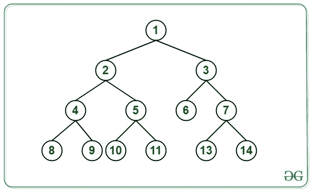
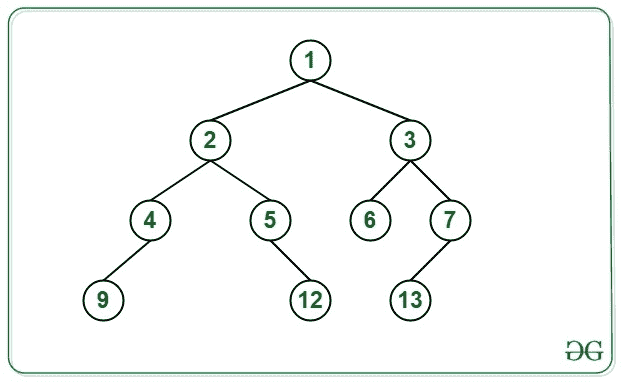

# 打印二叉树每一级的级别值对应的节点

> 原文:[https://www . geesforgeks . org/print-节点-对应于二进制树的每一级的级值/](https://www.geeksforgeeks.org/print-the-nodes-corresponding-to-the-level-value-for-each-level-of-a-binary-tree/)

给定一个 [**二叉树**](https://www.geeksforgeeks.org/binary-tree-data-structure/) ，每一级 **L** 的任务是打印该树的 **L <sup>th</sup>** 节点。如果任何级别都不存在 **L <sup>th</sup>** 节点，则打印 **-1** 。

***注意:**考虑根节点在二叉树的 1 级。*

**示例:**

> **输入:**下面是给定的树:
> [](https://media.geeksforgeeks.org/wp-content/cdn-uploads/20201012143554/BTExample.jpg) 
> **输出:**
> 级别 1: 1
> 级别 2: 3
> 级别 3: 6
> 级别 4: 11
> **说明:**
> 对于第一个级别，第一个节点为 1。
> 对于第二层，第二个节点为 3。
> 对于第三级，第三节点为 6。
> 对于第四个级别，第四个节点是 11。
> 
> **输入:**下面是给定的树:
> [](https://media.geeksforgeeks.org/wp-content/cdn-uploads/20201012143741/BTExample2.jpg) 
> **输出:**
> 级别 1: 1
> 级别 2: 3
> 级别 3: 6
> 级别 4: -1
> **说明:**
> 对于第一个级别，第一个节点为 1。
> 对于第二层，第二个节点为 3。
> 对于第三级，第三节点为 6。
> 对于第四级，第四节点不可用。因此，print -1。

**方法:**解决这个问题的思路是使用[多地图](https://www.geeksforgeeks.org/multimap-associative-containers-the-c-standard-template-library-stl/)。按照以下步骤解决问题:

1.  [遍历给定的树](https://www.geeksforgeeks.org/tree-traversals-inorder-preorder-and-postorder/)并将每个节点的级别和节点的值存储在**多地图**中。
2.  节点的级别被认为是多重映射的关键。记录二叉树的最大[级别(比如 **L** )。](https://www.geeksforgeeks.org/find-level-maximum-sum-binary-tree/)
3.  现在，在范围**【1，L】**内迭代多重映射，并执行以下操作:
    *   对于每一级 **L** ，遍历至该级的 **L <sup>第</sup>T5】节点，检查是否存在。如果发现存在，打印该节点的值。**
    *   否则，打印**-1”**，进入下一级。

下面是上述方法的实现:

## C++

```
// C++ program for the above approach
#include <bits/stdc++.h>
using namespace std;

// Stores the level of the node and
// its value at the max level of BT
multimap<int, int> m;

// Stores the maximum level
int maxlevel = 0;

// Structure of Binary Tree
struct node {

    int data;
    struct node* left;
    struct node* right;
};

// Function to insert the node in
// the Binary Tree
struct node* newnode(int d)
{
    struct node* temp
        = (struct node*)malloc(
            sizeof(struct node));
    temp->data = d;
    temp->left = NULL;
    temp->right = NULL;
    return temp;
}

// Function to find node of Nth level
void findNode(struct node* root, int level)
{
    // If root exists
    if (root) {

        // Traverse left subtree
        findNode(root->left, level + 1);

        // Insert the node's level and
        // its value into the multimap
        m.insert({ level, root->data });

        // Update the maximum level
        maxlevel = max(maxlevel, level);

        // Traverse the right subtree
        findNode(root->right, level + 1);
    }
}

// Function to print the L-th node at
// L-th level of the Binary Tree
void printNode(struct node* root, int level)
{
    // Function Call
    findNode(root, level);

    // Iterator for traversing map
    multimap<int, int>::iterator it;

    // Iterate all the levels
    for (int i = 0; i <= maxlevel; i++) {

        // Print the current level
        cout << "Level " << i + 1 << ": ";

        it = m.find(i);
        int flag = 0;

        // Iterate upto i-th node of the
        // i-th level
        for (int j = 0; j < i; j++) {

            it++;

            // If end of the level
            // is reached
            if (it == m.end()) {
                flag = 1;
                break;
            }
        }

        // If i-th node does not exist
        // in the i-th level
        if (flag == 1 || it->first != i) {
            cout << "-1" << endl;
        }

        // Otherwise
        else {

            // Print the i-th node
            cout << it->second << endl;
        }
    }
}

// Driver code
int main()
{
    // Construct the Binary Tree
    struct node* root = newnode(1);
    root->left = newnode(2);
    root->right = newnode(3);

    root->left->left = newnode(4);
    root->left->right = newnode(5);

    root->left->right->left = newnode(11);
    root->left->right->right = newnode(12);
    root->left->left->left = newnode(9);
    root->left->left->right = newnode(10);
    root->right->left = newnode(6);
    root->right->right = newnode(7);
    root->right->right->left = newnode(13);
    root->right->right->right = newnode(14);

    // Function Call
    printNode(root, 0);
}
```

**Output:**

```
Level 1: 1
Level 2: 3
Level 3: 6
Level 4: 12

```

***时间复杂度:** O(N)，其中 N 是二叉树中的节点数。*
***辅助空间:** O(N)*