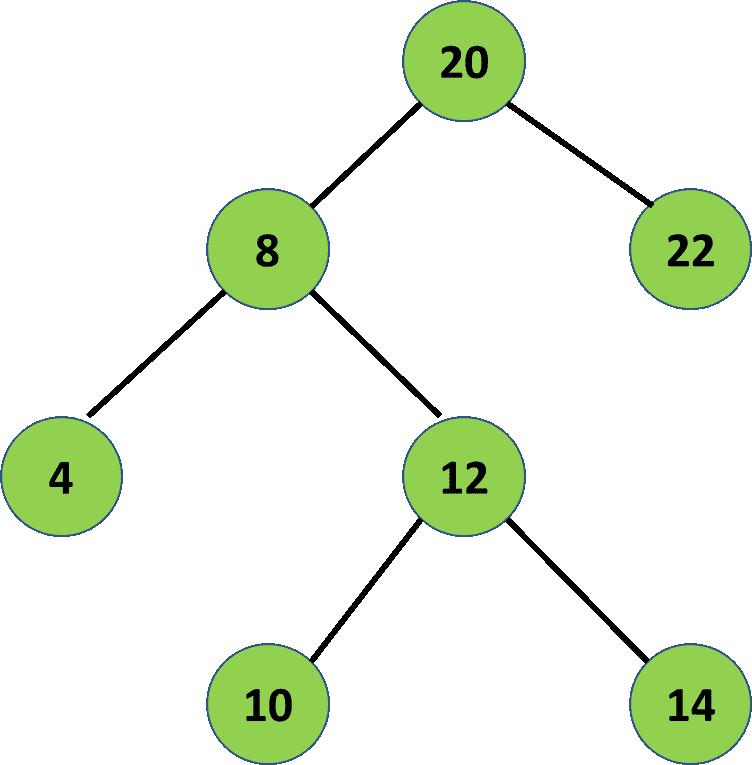
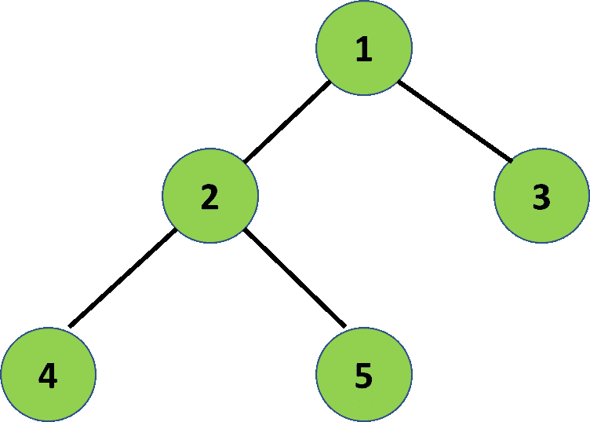

# 打印叶节点上方的节点

> 原文:[https://www . geeksforgeeks . org/print-叶子节点上方的节点/](https://www.geeksforgeeks.org/print-the-nodes-that-are-just-above-the-leaf-node/)

给定一个由 **N** 节点组成的[二叉树](https://www.geeksforgeeks.org/binary-tree-data-structure/)，任务是打印叶子节点正上方的节点。
**例:**

> **输入:** N = 7，下面是给定的二叉树:
> 
> 
> 
> **输出:** 20 8 12
> **说明:**
> 节点 20 就在叶节点 22 的上方。
> 节点 8 正好在叶节点 4 的上方。
> 节点 12 正好在叶节点 10 和 14 的上方。
> 
> **输入:** N = 5，下面是给定的二叉树:
> 
> 
> 
> **输出:** 1 2
> **说明:**
> 节点 1 就在叶节点 3 的上方。
> 节点 2 刚好在叶节点 4 和 5 的上方。

**方法:**想法是[遍历树](https://www.geeksforgeeks.org/tree-traversals-inorder-preorder-and-postorder/)，对于每个节点，检查它是否可以是刚好在叶节点上方的那个。为此，当前节点必须有子节点，并且至少有一个子节点应该是叶节点。以下是步骤:

*   [遍历树](https://www.geeksforgeeks.org/tree-traversals-inorder-preorder-and-postorder/)并检查每个节点。
*   如果当前节点有两个子节点，请检查其中是否有根节点。如果是，则打印当前节点。
*   如果当前节点只有一个左或右子节点，则检查该左或右子节点是否是叶节点。如果是，则打印当前节点。
*   否则，继续遍历树并移动到下一个节点。

下面是上述方法的实现:

## C++

```
// C++ program for the above approach
#include <bits/stdc++.h>
using namespace std;

// Node of tree
struct node {
    int data;
    struct node *left, *right;
};

// Creates and initializes a new
// node for the tree
struct node* newnode(int data)
{
    struct node* temp = new node();
    temp->data = data;
    temp->left = temp->right = NULL;
    return temp;
}

// Prints all nodes which are just
// above leaf node
void cal(struct node* root)
{

    // If tree is empty
    if (root == NULL) {
        return;
    }

    // If it is a leaf node
    if (root->left == NULL
        && root->right == NULL) {
        return;
    }

    // For internal nodes
    else {

        // If node has two children
        if (root->left != NULL
            && root->right != NULL) {

            if ((root->left->left == NULL
                 && root->left->right == NULL)
                || (root->right->left == NULL
                    && root->right->right == NULL)) {

                cout << root->data << " ";
            }
        }

        // If node has only left child
        if (root->left != NULL
            && root->right == NULL) {

            if (root->left->left == NULL
                && root->left->right == NULL) {

                cout << root->data << " ";
            }
        }

        // If node has only right child
        if (root->right != NULL
            && root->left == NULL) {

            if (root->right->left == NULL
                && root->right->right == NULL) {

                cout << root->data << " ";
            }
        }
    }

    // Recursively Call for left
    // and right subtree
    cal(root->left);
    cal(root->right);
}

// Driver Code
int main()
{
    // Construct a tree
    node* root = newnode(20);
    root->left = newnode(8);
    root->right = newnode(22);
    root->left->left = newnode(4);
    root->left->right = newnode(12);
    root->left->right->left = newnode(10);
    root->left->right->right = newnode(14);

    // Function Call
    cal(root);

    return 0;
}
```

## Java 语言(一种计算机语言，尤用于创建网站)

```
// Java program for the above approach
import java.util.*;

// Class containing the left and right
// child of current node and the
// key value
class Node
{
    int data;
    Node left, right;

    // Constructor of the class
    public Node(int item)
    {
        data = item;
        left = right = null;
    }
}

class GFG{

Node root;

// Prints all nodes which are just
// above leaf node
static void cal(Node root)
{

    // If tree is empty
    if (root == null)
    {
        return;
    }

    // If it is a leaf node
    if (root.left == null &&
       root.right == null)
    {
        return;
    }

    // For internal nodes
    else
    {

        // If node has two children
        if (root.left != null &&
           root.right != null)
        {
            if ((root.left.left == null &&
                root.left.right == null) ||
               (root.right.left == null &&
               root.right.right == null))
            {
                System.out.print(root.data + " ");
            }
        }

        // If node has only left child
        if (root.left != null &&
           root.right == null)
        {
            if (root.left.left == null &&
               root.left.right == null)
            {
                System.out.print(root.data + " ");
            }
        }

        // If node has only right child
        if (root.right != null &&
             root.left == null)
        {
            if (root.right.left == null &&
               root.right.right == null)
            {
                System.out.print(root.data + " ");
            }
        }
    }

    // Recursively call for left
    // and right subtree
    cal(root.left);
    cal(root.right);
}

// Driver Code
public static void main (String[] args)
{
    GFG tree = new GFG();

    tree.root = new Node(20);
    tree.root.left = new Node(8);
    tree.root.right = new Node(22);

    tree.root.left.left = new Node(4);
    tree.root.left.right = new Node(12);

    tree.root.left.right.left = new Node(10);
    tree.root.left.right.right = new Node(14);

    // Function call
    cal(tree.root);
}
}

// This code is contributed by offbeat
```

## 蟒蛇 3

```
# Python3 program for the
# above approach

# Node of tree
class newNode:

    def __init__(self, data):

        self.data = data
        self.left = None
        self.right = None

# Creates and initializes a new
# node for the tree

# Prints all nodes which are
# just above leaf node
def cal(root):

    # If tree is empty
    if (root == None):
        return

    # If it is a leaf node
    if (root.left == None and
        root.right == None):
        return

    # For internal nodes
    else:

        # If node has two children
        if (root.left != None and
            root.right != None):
            if ((root.left.left == None and
                 root.left.right == None) or
                (root.right.left == None and
                 root.right.right == None)):
                print(root.data, end = " ")

        # If node has only left child
        if (root.left != None and
            root.right == None):
            if (root.left.left == None and
                root.left.right == None):
                print(root.data, end = " ")

        # If node has only right child
        if (root.right != None and
            root.left == None):
            if (root.right.left == None and
                root.right.right == None):
                print(root.data, end = " ")

    # Recursively Call for left
    # and right subtree
    cal(root.left)
    cal(root.right)

# Driver Code
if __name__ == '__main__':

    # Construct a tree
    root = newNode(20)
    root.left = newNode(8)
    root.right = newNode(22)
    root.left.left = newNode(4)
    root.left.right = newNode(12)
    root.left.right.left = newNode(10)
    root.left.right.right = newNode(14)

    # Function Call
    cal(root)

# This code is contributed by SURENDRA_GANGWAR
```

## C#

```
// C# program for the above approach
using System;

// Class containing the left and right
// child of current node and the
// key value
class Node
{
    public int data;
    public Node left, right;

    // Constructor of the class
    public Node(int item)
    {
        data = item;
        left = right = null;
    }
}

class GFG{   
Node root;

// Prints all nodes which are just
// above leaf node
static void cal(Node root)
{
    // If tree is empty
    if (root == null)
    {
        return;
    }

    // If it is a leaf node
    if (root.left == null &&
        root.right == null)
    {
        return;
    }

    // For internal nodes
    else
    {
        // If node has two children
        if (root.left != null &&
            root.right != null)
        {
            if ((root.left.left == null &&
                 root.left.right == null) ||
                (root.right.left == null &&
                 root.right.right == null))
            {
                Console.Write(root.data + " ");
            }
        }

        // If node has only left child
        if (root.left != null &&
            root.right == null)
        {
            if (root.left.left == null &&
                root.left.right == null)
            {
                Console.Write(root.data + " ");
            }
        }

        // If node has only right child
        if (root.right != null &&
            root.left == null)
        {
            if (root.right.left == null &&
                root.right.right == null)
            {
                Console.Write(root.data + " ");
            }
        }
    }

    // Recursively call for left
    // and right subtree
    cal(root.left);
    cal(root.right);
}

// Driver Code
public static void Main(String[] args)
{
    GFG tree = new GFG();
    tree.root = new Node(20);
    tree.root.left = new Node(8);
    tree.root.right = new Node(22);
    tree.root.left.left = new Node(4);
    tree.root.left.right = new Node(12);
    tree.root.left.right.left = new Node(10);
    tree.root.left.right.right = new Node(14);

    // Function call
    cal(tree.root);
}
}

// This code is contributed by Rajput-Ji
```

## java 描述语言

```
<script>
    // Javascript implementation of the above approach

    // Class containing the left and right
    // child of current node and the
    // key value
    class Node
    {
        constructor(item) {
           this.data = item;
           this.left = this.right = null;
        }
    }

    class GFG
    {

    }

    let root;

    // Prints all nodes which are just
    // above leaf node
    function cal(root)
    {

        // If tree is empty
        if (root == null)
        {
            return;
        }

        // If it is a leaf node
        if (root.left == null &&
           root.right == null)
        {
            return;
        }

        // For internal nodes
        else
        {

            // If node has two children
            if (root.left != null &&
               root.right != null)
            {
                if ((root.left.left == null &&
                    root.left.right == null) ||
                   (root.right.left == null &&
                   root.right.right == null))
                {
                    document.write(root.data + " ");
                }
            }

            // If node has only left child
            if (root.left != null &&
               root.right == null)
            {
                if (root.left.left == null &&
                   root.left.right == null)
                {
                    document.write(root.data + " ");
                }
            }

            // If node has only right child
            if (root.right != null &&
                 root.left == null)
            {
                if (root.right.left == null &&
                   root.right.right == null)
                {
                    document.write(root.data + " ");
                }
            }
        }

        // Recursively call for left
        // and right subtree
        cal(root.left);
        cal(root.right);
    }

    let tree = new GFG();

    tree.root = new Node(20);
    tree.root.left = new Node(8);
    tree.root.right = new Node(22);

    tree.root.left.left = new Node(4);
    tree.root.left.right = new Node(12);

    tree.root.left.right.left = new Node(10);
    tree.root.left.right.right = new Node(14);

    // Function call
    cal(tree.root);

</script>
```

**Output:** 

```
20 8 12
```

**时间复杂度:***O(N)*
T5】辅助空间: *O(N)*