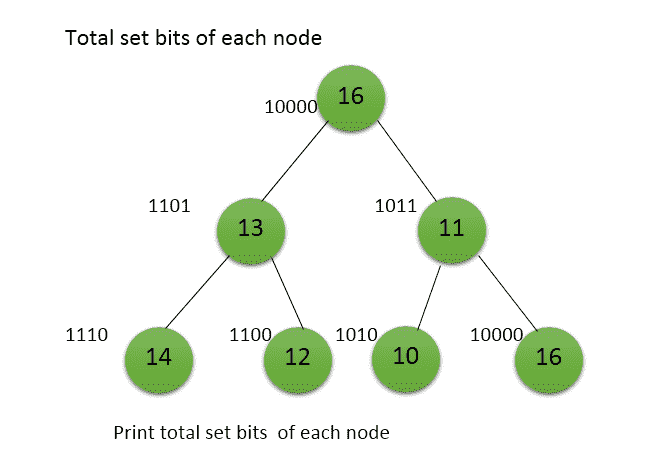

# 打印二叉树每个节点的设置位数

> 原文:[https://www . geesforgeks . org/print-二进制树的每个节点中的集位数/](https://www.geeksforgeeks.org/print-the-number-of-set-bits-in-each-node-of-a-binary-tree/)

给定一棵二叉树。任务是打印二叉树中每个节点的设置位数。



其思想是使用任意[树遍历方法](https://www.geeksforgeeks.org/tree-traversals-inorder-preorder-and-postorder/)遍历给定的二叉树，对于每个节点[计算设置位数](https://www.geeksforgeeks.org/count-set-bits-in-an-integer/)并打印出来。

**注**:也可以使用 C++中的 **__builtin_popcount()** 函数直接对整数中的设置位数进行计数。

下面是上述方法的实现:

## C++

```
// CPP program to print the number of set bits
// in each node of the binary tree

#include <bits/stdc++.h>

using namespace std;

// Binary Tree node
struct Node {
    int data;
    struct Node *left, *right;
};

// Utility function that allocates a new Node
Node* newNode(int data)
{
    Node* node = new Node;
    node->data = data;
    node->left = node->right = NULL;
    return (node);
}

// Function to print the number of set bits
// in each node of the binary tree
void printSetBit(Node* root)
{
    if (root == NULL)
        return;

    // Print the number of set bits of
    // current node using __builtin_popcount()
    cout << "Set bits in Node " << root->data << " = " <<
                  __builtin_popcount(root->data) << "\n";

    // Traverse Left Subtree
    printSetBit(root->left);

    // Traverse Right Subtree
    printSetBit(root->right);
}

// Driver code
int main()
{
    Node* root = newNode(16);
    root->left = newNode(13);
    root->left->left = newNode(14);
    root->left->right = newNode(12);
    root->right = newNode(11);
    root->right->left = newNode(10);
    root->right->right = newNode(16);

    printSetBit(root);

    return 0;
}
```

## Java 语言(一种计算机语言，尤用于创建网站)

```
// Java program to print the number of set bits
// in each node of the binary tree
import java.util.*;

class GFG
{

// Binary Tree node
static class Node
{
    int data;
    Node left, right;
};

// Utility function that allocates a new Node
static Node newNode(int data)
{
    Node node = new Node();
    node.data = data;
    node.left = node.right = null;
    return (node);
}

// Function to print the number of set bits
// in each node of the binary tree
static void printSetBit(Node root)
{
    if (root == null)
        return;

    // Print the number of set bits of
    // current node using __builtin_popcount()
    System.out.print("Set bits in Node " + root.data + " = " +
                      Integer.bitCount(root.data) + "\n");

    // Traverse Left Subtree
    printSetBit(root.left);

    // Traverse Right Subtree
    printSetBit(root.right);
}

// Driver code
public static void main(String[] args)
{
    Node root = newNode(16);
    root.left = newNode(13);
    root.left.left = newNode(14);
    root.left.right = newNode(12);
    root.right = newNode(11);
    root.right.left = newNode(10);
    root.right.right = newNode(16);

    printSetBit(root);
}
}

// This code is contributed by PrinciRaj1992
```

## 蟒蛇 3

```
# Python3 program to print the number of set bits
# in each node of the binary tree

# Binary Tree node
class Node:
    def __init__(self):
        self.data = None
        self.left = None
        self.right = None

# Utility function that allocates a new Node
def newNode(data):
    node = Node()
    node.data = data
    node.left = None
    node.right = None
    return node

# Function to print the number of set bits
# in each node of the binary tree
def printSetBit(root: Node):
    if root is None:
        return

    # Print the number of set bits of
    # current node using count()
    print("Set bits in Node %d = %d" %
         (root.data, bin(root.data).count('1')))

    # Traverse Left Subtree
    printSetBit(root.left)

    # Traverse Right Subtree
    printSetBit(root.right)

# Driver Code
if __name__ == "__main__":
    root = newNode(16)
    root.left = newNode(13)
    root.left.left = newNode(14)
    root.left.right = newNode(12)
    root.right = newNode(11)
    root.right.left = newNode(10)
    root.right.right = newNode(16)

    printSetBit(root)

# This code is contributed by
# sanjeev2552
```

## C#

```
// C# program to print the number of set bits
// in each node of the binary tree
using System;

class GFG
{

// Binary Tree node
public class Node
{
    public int data;
    public Node left, right;
};

// Utility function that allocates a new Node
static Node newNode(int data)
{
    Node node = new Node();
    node.data = data;
    node.left = node.right = null;
    return (node);
}

// Function to print the number of set bits
// in each node of the binary tree
static void printSetBit(Node root)
{
    if (root == null)
        return;

    // Print the number of set bits of
    // current node using __builtin_popcount()
    Console.Write("Set bits in Node " + root.data +
                  " = " + bitCount(root.data) + "\n");

    // Traverse Left Subtree
    printSetBit(root.left);

    // Traverse Right Subtree
    printSetBit(root.right);
}

static int bitCount(int x)
{
    int setBits = 0;
    while (x != 0)
    {
        x = x & (x - 1);
        setBits++;
    }
    return setBits;
}

// Driver code
public static void Main(String[] args)
{
    Node root = newNode(16);
    root.left = newNode(13);
    root.left.left = newNode(14);
    root.left.right = newNode(12);
    root.right = newNode(11);
    root.right.left = newNode(10);
    root.right.right = newNode(16);

    printSetBit(root);
}
}

// This code is contributed by 29AjayKumar
```

## java 描述语言

```
<script>

// Javascript program to print the number
// of set bits in each node of the binary tree

// A Binary Tree Node
class Node
{
    constructor(data)
    {
        this.left = null;
        this.right = null;
        this.data = data;
    }
}

// Utility function that allocates a new Node
function newNode(data)
{
    let node = new Node(data);
    return (node);
}

function bitCount(x)
{
    let setBits = 0;
    while (x != 0)
    {
        x = x & (x - 1);
        setBits++;
    }
    return setBits;
}

// Function to print the number of set bits
// in each node of the binary tree
function printSetBit(root)
{
    if (root == null)
        return;

    // Print the number of set bits of
    // current node using __builtin_popcount()
    document.write("Set bits in Node " + root.data +
                   " = " + bitCount(root.data) + "</br>");

    // Traverse Left Subtree
    printSetBit(root.left);

    // Traverse Right Subtree
    printSetBit(root.right);
}

// Driver code
let root = newNode(16);
root.left = newNode(13);
root.left.left = newNode(14);
root.left.right = newNode(12);
root.right = newNode(11);
root.right.left = newNode(10);
root.right.right = newNode(16);

printSetBit(root);

// This code is contributed by suresh07

</script>
```

**Output:** 

```
Set bits in Node 16 = 1
Set bits in Node 13 = 3
Set bits in Node 14 = 3
Set bits in Node 12 = 2
Set bits in Node 11 = 3
Set bits in Node 10 = 2
Set bits in Node 16 = 1
```