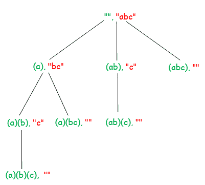

# 以括号形式打印所有断串方式

> 原文:[https://www . geesforgeks . org/print-way-break-string-方括号-form/](https://www.geeksforgeeks.org/print-ways-break-string-bracket-form/)

给定一个字符串，找到所有以括号形式断开给定字符串的方法。将每个子字符串括在括号内。

**示例:**

```
Input : abc
Output: (a)(b)(c)
        (a)(bc)
        (ab)(c)
        (abc)

Input : abcd
Output : (a)(b)(c)(d)
         (a)(b)(cd)
         (a)(bc)(d)
         (a)(bcd)
         (ab)(c)(d)
         (ab)(cd)
         (abc)(d)
         (abcd)

```

**我们强烈建议你尽量减少浏览器，先自己试试这个。**
想法是用递归。我们维护两个参数——要处理的下一个字符的索引和到目前为止的输出字符串。我们从下一个要处理的字符的索引开始，将由未处理的字符串形成的子字符串追加到输出字符串中，并在剩余的字符串上递归，直到处理完整个字符串。我们使用 std::substr 来形成输出字符串。substr(pos，n)返回长度为 n 的子字符串，该子字符串从当前字符串的位置 pos 开始。

下图显示了输入字符串“abc”的递归树。图表上的每个节点显示已处理的字符串(用绿色标记)和未处理的字符串(用红色标记)。



以下是上述想法的实现-

## C++

```
// C++ Program to find all combinations of Non-
// overlapping substrings formed from given
// string
#include <iostream>
using namespace std;

// find all combinations of non-overlapping
// substrings formed by input string str
// index – index of the next character to
//          be processed
// out - output string so far
void findCombinations(string str, int index, string out)
{
    if (index == str.length())
        cout << out << endl;

    for (int i = index; i < str.length(); i++)
    {
        // append substring formed by str[index,
        // i] to output string
        findCombinations(
            str,
            i + 1,
            out + "(" + str.substr(index, i + 1 - index)
                + ")");
    }
}

// Driver Code
int main()
{
    // input string
    string str = "abcd";

    findCombinations(str, 0, "");

    return 0;
}
```

## Java 语言(一种计算机语言，尤用于创建网站)

```
// Java program to find all combinations of Non-
// overlapping substrings formed from given
// string

class GFG
{
    // find all combinations of non-overlapping
    // substrings formed by input string str
    static void findCombinations(String str, int index,
                                 String out)
    {
        if (index == str.length())
            System.out.println(out);

        for (int i = index; i < str.length(); i++)

            // append substring formed by str[index,
            // i] to output string
            findCombinations(str, i + 1, out +
                "(" + str.substring(index, i+1) + ")" );
    }

    // Driver Code
    public static void main (String[] args)
    {
        // input string
        String str = "abcd";
        findCombinations(str, 0, "");
    }
}

// Contributed by Pramod Kumar
```

## 计算机编程语言

```
# Python3 Program to find all combinations of Non-
# overlapping substrings formed from given
# string

# find all combinations of non-overlapping
# substrings formed by input string str
# index – index of the next character to
#          be processed
# out - output string so far
def findCombinations(string, index, out):
    if index == len(string):
        print(out)

    for i in range(index, len(string), 1):

        # append substring formed by str[index,
        # i] to output string
        findCombinations(string, i + 1, out + "(" +
                         string[index:i + 1] + ")")

# Driver Code
if __name__ == "__main__":

    # input string
    string = "abcd"
    findCombinations(string, 0, "")

# This code is contributed by
# sanjeev2552
```

## C#

```
// C# program to find all combinations
// of Non-overlapping substrings formed
// from given string
using System;

class GFG {
    // find all combinations of non-overlapping
    // substrings formed by input string str
    public static void
    findCombinations(string str, int index, string @out)
    {
        if (index == str.Length) {
            Console.WriteLine(@out);
        }

        for (int i = index; i < str.Length; i++) {

            // append substring formed by
            // str[index, i] to output string
            findCombinations(
                str, i + 1,
                @out + "("
                    + str.Substring(index, (i + 1) - index)
                    + ")");
        }
    }

    // Driver Code
    public static void Main(string[] args)
    {
        // input string
        string str = "abcd";
        findCombinations(str, 0, "");
    }
}

// This code is contributed by Shrikant13
```

**Output**

```
(a)(b)(c)(d)
(a)(b)(cd)
(a)(bc)(d)
(a)(bcd)
(ab)(c)(d)
(ab)(cd)
(abc)(d)
(abcd)

```

**时间复杂度:**O(N<sup>2</sup>)
T5】辅助空间: O(N <sup>2</sup>

本文由**阿迪蒂亚·戈尔**供稿。如果你喜欢极客博客并想投稿，你也可以写一篇文章并把你的文章邮寄到 contribute@geeksforgeeks.org。看到你的文章出现在极客博客主页上，帮助其他极客。
如果你发现任何不正确的地方，或者你想分享更多关于上述话题的信息，请写评论