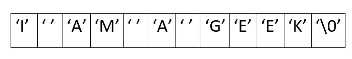
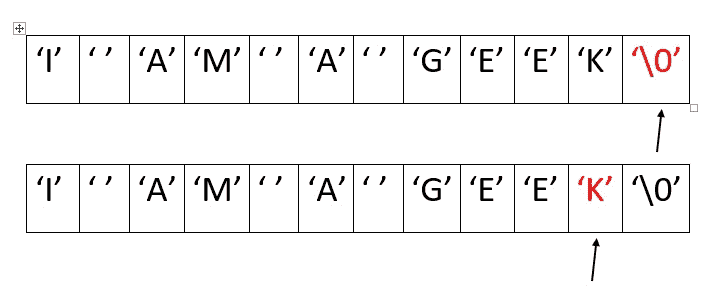
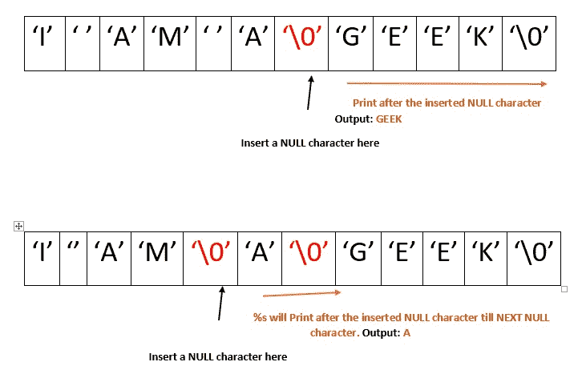
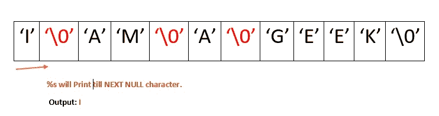

# 逆序打印字符串的单词

> 原文:[https://www . geesforgeks . org/print-words-string-reverse-order/](https://www.geeksforgeeks.org/print-words-string-reverse-order/)

让有一个字符串说“我是一个极客”。所以，输出应该是“GEEK A AM I”。这可以通过多种方式实现。其中一个解决方案在[字符串中的倒字](https://www.geeksforgeeks.org/reverse-words-in-a-given-string/)中给出。

**示例:**

```
Input : I AM A GEEK
Output : GEEK A AM I

Input : GfG IS THE BEST
Output : BEST THE IS GfG
```

这可以通过使用“ **%s 格式说明符**的属性以更简单的方式完成。
*属性* : %s 将获得所有值，直到它为空，即“\0”。

示例:char String[] =“我是极客”存储如下图所示:



**逼近:**从最后一个字符开始遍历字符串，向第一个字符移动。遍历时，如果遇到一个空格字符，在该位置放一个空值，并在空值字符后打印剩余的字符串。重复此操作，直到循环结束，当循环结束时，打印字符串，%s 将打印字符，直到遇到第一个空字符。

让我们借助图表来看看这种方法:
**第一步:**从最后一个字符开始遍历，直到遇到一个空格字符。



**第二步:**在空格字符的位置放一个空字符，并在后面打印字符串。



**第三步:**结束时，循环到达第一个字符时结束，所以打印剩余字符时，将打印第一个空字符，因此将打印第一个单词。



## C++

```
// C++ program to print reverse
// of words in a string.
#include <iostream>

using namespace std;

string wordReverse(string str)
{
    int i = str.length() - 1;
    int start, end = i + 1;
    string result = "";

    while (i >= 0) {
        if (str[i] == ' ') {
            start = i + 1;
            while (start != end)
                result += str[start++];

            result += ' ';

            end = i;
        }
        i--;
    }
    start = 0;
    while (start != end)
        result += str[start++];

    return result;
}

// Driver code
int main()
{
    string str = "I AM A GEEK";

    cout << wordReverse(str);

    return 0;
}

// This code is contributed
// by Imam
```