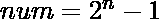
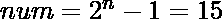
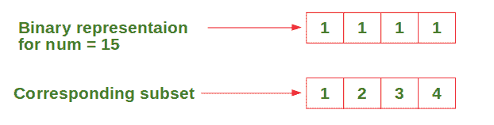
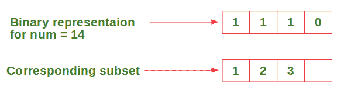
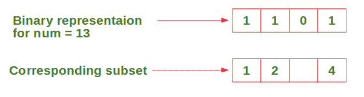

# 不使用数组或循环打印{1，2，3，…n}的所有子集

> 原文:[https://www . geesforgeks . org/printing-123-n 的所有子集-不使用数组或循环/](https://www.geeksforgeeks.org/printing-all-subsets-of-123-n-without-using-array-or-loop/)

给定一个自然数 **n** ，打印集合的所有子集，不使用任何数组或循环(只允许使用**递归**)。
**例:**

```
Input : n = 4
Output : { 1 2 3 4 }
         { 1 2 3 }
         { 1 2 4 }
         { 1 2 }
         { 1 3 4 }
         { 1 3 }
         { 1 4 }
         { 1 }
         { 2 3 4 }
         { 2 3 }
         { 2 4 }
         { 2 }
         { 3 4 }
         { 3 }
         { 4 }
         { }

Input : n = 2
Output : { 1 2 }
         { 1 }
         { 2 }
         { }
```

**进场:**

*   从开始到 0。
*   考虑带有 **n** 位的**数**的二进制表示。
*   从代表 1 的最左边一位开始，第二位代表 2，以此类推，直到代表 **n** 的第**n 位。**
*   如果设置了位，则打印该位对应的数字。
*   对 **num** 的所有值执行上述步骤，直到等于 0。

让我们通过一个例子来理解上面的方法:
考虑输入 n = 4，从开始。







以此类推……直到 num = 0。
以下是上述方法的实现:

## C++

```
// C++ code to print all subsets
// of {1, 2, 3, n} without using
// array or loop, just recursion.
#include <bits/stdc++.h>
using namespace std;

void subset(int, int, int);

// This recursive function calls subset
// function to print the subsets one by one.
// numBits --> number of bits needed to
// represent the number (simply input value n).
// num --> Initially equal to 2 ^ n - 1 and
// decreases by 1 every recursion until 0.
void printSubsets(int numOfBits, int num)
{
    if (num >= 0)
    {
        cout << "{ ";

        // Print the subset corresponding to
        // binary representation of num.
        subset(numOfBits - 1, num, numOfBits);
        cout << "}" << endl;

        // Call the function recursively to
        // print the next subset.
        printSubsets(numOfBits, num - 1);
    }
    else
        return;
}

// This function recursively prints the
// subset corresponding to the binary
// representation of num.
// nthBit --> nth bit from right side
// starting from n and decreases until 0
void subset(int nthBit, int num, int numOfBits)
{
    if (nthBit >= 0)
    {
        // Print number in given subset only
        // if the bit corresponding to it
        // is set in num.
        if (num & (1 << nthBit))
        {
            cout << numOfBits - nthBit << " ";
        }

        // Check for the next bit
        subset(nthBit - 1, num, numOfBits);
    }
    else
        return;
}

// Driver Code
int main()
{
    int n = 4;
    printSubsets(n, pow(2, n) - 1);
}

// This code is contributed by
// sanjeev2552
```

## Java 语言(一种计算机语言，尤用于创建网站)

```
// Java code to print all subsets
// of {1, 2, 3, n} without using
// array or loop, just recursion.
class GfG
{

    // This recursive function calls subset
    // function to print the subsets one by one.
    // numBits --> number of bits needed to
    // represent the number (simply input value n).
    // num --> Initially equal to 2 ^ n - 1 and
    // decreases by 1 every recursion until 0.
    static void printSubSets(int numOfBits, int num)
    {
        if (num >= 0)
        {
            System.out.print("{ ");

            // Print the subset corresponding to
            // binary representation of num.
            subset(numOfBits - 1, num, numOfBits);
            System.out.println("}");

            // Call the function recursively to
            // print the next subset.
            printSubSets(numOfBits, num - 1);

        } else
            return;
    }

    // This function recursively prints the
    // subset corresponding to the binary
    // representation of num.
    // nthBit --> nth bit from right side
    // starting from n and decreases until 0.
    static void subset(int nthBit, int num, int numOfBits)
    {
        if (nthBit >= 0)
        {
            // Print number in given subset only
            // if the bit corresponding to it
            // is set in num.
            if ((num & (1 << nthBit)) != 0)
            {
                System.out.print(numOfBits - nthBit + " ");

            }

            // Check for the next bit
            subset(nthBit - 1, num, numOfBits);
        } else
            return;
    }

    // Driver code
    public static void main(String[] args)
    {
        int n = 4;
        printSubSets(n, (int) (Math.pow(2, n)) -1);
    }
}

// This code is contributed by laststringx
```

## 蟒蛇 3

```
# Python3 code to print all subsets
# of {1, 2, 3, …n} without using
# array or loop, just recursion.

# This recursive function calls subset
# function to print the subsets one by one.
# numBits --> number of bits needed to
# represent the number (simply input value n).
# num --> Initially equal to 2 ^ n - 1 and
# decreases by 1 every recursion until 0.
def printSubsets(numOfBits, num):

    if num >= 0:
        print("{", end = " ")

        # Print the subset corresponding to
        # binary representation of num.
        subset(numOfBits-1, num, numOfBits)
        print("}")

        # Call the function recursively to
        # print the next subset.
        printSubsets(numOfBits, num-1)

    else:
        return

# This function recursively prints the
# subset corresponding to the binary
# representation of num.
# nthBit --> nth bit from right side
# starting from n and decreases until 0.
def subset(nthBit, num, numOfBits):

    if nthBit >= 0:

        # Print number in given subset only
        # if the bit corresponding to it
        # is set in num.
        if num & (1 << nthBit) != 0:
            print(numOfBits - nthBit, end = " ")

        # Check for the next bit
        subset(nthBit-1, num, numOfBits)

    else:
        return

# Driver Code   
n = 4
printSubsets(n, 2**n - 1)
```

## C#

```
// C# code to print all subsets
// of {1, 2, 3, n} without using
// array or loop, just recursion.
using System;

class GfG
{

    // This recursive function calls subset
    // function to print the subsets one by one.
    // numBits --> number of bits needed to
    // represent the number (simply input value n).
    // num --> Initially equal to 2 ^ n - 1 and
    // decreases by 1 every recursion until 0.
    static void printSubSets(int numOfBits, int num)
    {
        if (num >= 0)
        {
            Console.Write("{ ");

            // Print the subset corresponding to
            // binary representation of num.
            subset(numOfBits - 1, num, numOfBits);
            Console.WriteLine("}");

            // Call the function recursively to
            // print the next subset.
            printSubSets(numOfBits, num - 1);

        } else
            return;
    }

    // This function recursively prints the
    // subset corresponding to the binary
    // representation of num.
    // nthBit --> nth bit from right side
    // starting from n and decreases until 0.
    static void subset(int nthBit, int num, int numOfBits)
    {
        if (nthBit >= 0)
        {
            // Print number in given subset only
            // if the bit corresponding to it
            // is set in num.
            if ((num & (1 << nthBit)) != 0)
            {
                Console.Write(numOfBits - nthBit + " ");

            }

            // Check for the next bit
            subset(nthBit - 1, num, numOfBits);
        } else
            return;
    }

    // Driver codeM
    public static void Main(String[] args)
    {
        int n = 4;
        printSubSets(n, (int) (Math.Pow(2, n)) -1);
    }
}

// This code is contributed by Srathore
```

## java 描述语言

```
<script>

// Javascript code to print all subsets
// of {1, 2, 3, n} without using
// array or loop, just recursion.

// This recursive function calls subset
// function to print the subsets one by one.
// numBits --> number of bits needed to
// represent the number (simply input value n).
// num --> Initially equal to 2 ^ n - 1 and
// decreases by 1 every recursion until 0.
function printSubsets(numOfBits, num)
{
    if (num >= 0)
    {
        document.write( "{ ");

        // Print the subset corresponding to
        // binary representation of num.
        subset(numOfBits - 1, num, numOfBits);
        document.write( "}<br>" );

        // Call the function recursively to
        // print the next subset.
        printSubsets(numOfBits, num - 1);
    }
    else
        return;
}

// This function recursively prints the
// subset corresponding to the binary
// representation of num.
// nthBit --> nth bit from right side
// starting from n and decreases until 0
function subset(nthBit, num, numOfBits)
{
    if (nthBit >= 0)
    {
        // Print number in given subset only
        // if the bit corresponding to it
        // is set in num.
        if (num & (1 << nthBit))
        {
            document.write( numOfBits - nthBit + " ");
        }

        // Check for the next bit
        subset(nthBit - 1, num, numOfBits);
    }
    else
        return;
}

// Driver Code
var n = 4;
printSubsets(n, Math.pow(2, n) - 1);

</script>
```

**Output:** 

```
{ 1 2 3 4 }
{ 1 2 3 }
{ 1 2 4 }
{ 1 2 }
{ 1 3 4 }
{ 1 3 }
{ 1 4 }
{ 1 }
{ 2 3 4 }
{ 2 3 }
{ 2 4 }
{ 2 }
{ 3 4 }
{ 3 }
{ 4 }
{ }
```

**时间复杂度:** 