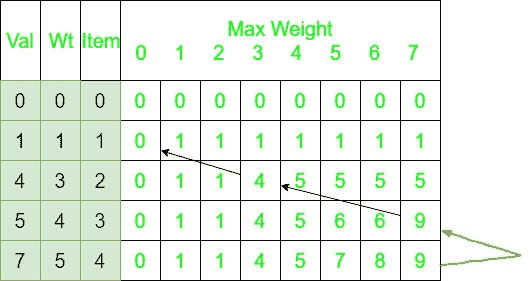

# 打印 0/1 背包中的物品

> 原文:[https://www.geeksforgeeks.org/printing-items-01-knapsack/](https://www.geeksforgeeks.org/printing-items-01-knapsack/)

给定 n 个物品的重量和值，将这些物品放入容量为 W 的背包中，得到背包中的最大总值。换句话说，给定两个整数数组，val[0..n-1]和 wt[0..n-1]分别表示与 n 个项目相关联的值和权重。同样给定一个代表背包容量的整数 W，找出项目，使得给定子集的这些项目的权重之和小于或等于 W。您不能分解一个项目，要么选择完整的项目，要么不选择它(0-1 属性)。
**先决条件:** [0/1 背包](https://www.geeksforgeeks.org/knapsack-problem/)
**示例:**

```
Input : val[] = {60, 100, 120};
        wt[] = {10, 20, 30};
        W = 50;
Output : 220 //maximum value that can be obtained
         30 20 //weights 20 and 30 are included. 

Input : val[] = {40, 100, 50, 60};
        wt[] = {20, 10, 40, 30};
        W = 60;
Output : 200
         30 20 10
```

**进场:**
让 val[] = {1，4，5，7}，wt[] = {1，3，4，5}
W = 7。
2d 背包表看起来像:



从 K[n][W]开始回溯。这里 K[n][W]是 9。
由于该值来自顶部(灰色箭头所示)，因此不包括该行中的项目。在桌子上垂直向上，不要把这个放在背包里。现在，这个值 K[n-1][W]是 9，它不是从顶部来的，这意味着这一行中的项目被包括在内，并垂直向上，然后按所包括项目的重量向左移动(如黑色箭头所示)。继续这个过程，在背包中包括总价值为 9 的权重 3 和 4。

## C++

```
// CPP code for Dynamic Programming based
// solution for 0-1 Knapsack problem
#include <bits/stdc++.h>
#include <iostream>
using namespace std;

// A utility function that returns maximum of two integers
int max(int a, int b) { return (a > b) ? a : b; }

// Prints the items which are put in a knapsack of capacity W
void printknapSack(int W, int wt[], int val[], int n)
{
    int i, w;
    int K[n + 1][W + 1];

    // Build table K[][] in bottom up manner
    for (i = 0; i <= n; i++) {
        for (w = 0; w <= W; w++) {
            if (i == 0 || w == 0)
                K[i][w] = 0;
            else if (wt[i - 1] <= w)
                K[i][w] = max(val[i - 1] +
                    K[i - 1][w - wt[i - 1]], K[i - 1][w]);
            else
                K[i][w] = K[i - 1][w];
        }
    }

    // stores the result of Knapsack
    int res = K[n][W];
    cout<< res << endl;

    w = W;
    for (i = n; i > 0 && res > 0; i--) {

        // either the result comes from the top
        // (K[i-1][w]) or from (val[i-1] + K[i-1]
        // [w-wt[i-1]]) as in Knapsack table. If
        // it comes from the latter one/ it means
        // the item is included.
        if (res == K[i - 1][w])
            continue;   
        else {

            // This item is included.
            cout<<" "<<wt[i - 1] ;

            // Since this weight is included its
            // value is deducted
            res = res - val[i - 1];
            w = w - wt[i - 1];
        }
    }
}

// Driver code
int main()
{
    int val[] = { 60, 100, 120 };
    int wt[] = { 10, 20, 30 };
    int W = 50;
    int n = sizeof(val) / sizeof(val[0]);

    printknapSack(W, wt, val, n);

    return 0;
}

// this code is contributed by shivanisinghss2110
```

## C

```
// CPP code for Dynamic Programming based
// solution for 0-1 Knapsack problem
#include <stdio.h>

// A utility function that returns maximum of two integers
int max(int a, int b) { return (a > b) ? a : b; }

// Prints the items which are put in a knapsack of capacity W
void printknapSack(int W, int wt[], int val[], int n)
{
    int i, w;
    int K[n + 1][W + 1];

    // Build table K[][] in bottom up manner
    for (i = 0; i <= n; i++) {
        for (w = 0; w <= W; w++) {
            if (i == 0 || w == 0)
                K[i][w] = 0;
            else if (wt[i - 1] <= w)
                K[i][w] = max(val[i - 1] +
                    K[i - 1][w - wt[i - 1]], K[i - 1][w]);
            else
                K[i][w] = K[i - 1][w];
        }
    }

    // stores the result of Knapsack
    int res = K[n][W];   
    printf("%d\n", res);

    w = W;
    for (i = n; i > 0 && res > 0; i--) {

        // either the result comes from the top
        // (K[i-1][w]) or from (val[i-1] + K[i-1]
        // [w-wt[i-1]]) as in Knapsack table. If
        // it comes from the latter one/ it means
        // the item is included.
        if (res == K[i - 1][w])
            continue;       
        else {

            // This item is included.
            printf("%d ", wt[i - 1]);

            // Since this weight is included its
            // value is deducted
            res = res - val[i - 1];
            w = w - wt[i - 1];
        }
    }
}

// Driver code
int main()
{
    int val[] = { 60, 100, 120 };
    int wt[] = { 10, 20, 30 };
    int W = 50;
    int n = sizeof(val) / sizeof(val[0]);

    printknapSack(W, wt, val, n);

    return 0;
}
```

## Java 语言(一种计算机语言，尤用于创建网站)

```
// Java code for Dynamic Programming based
// solution for 0-1 Knapsack problem

class GFG {

    // A utility function that returns
    // maximum of two integers
    static int max(int a, int b)
    {
        return (a > b) ? a : b;
    }

    // Prints the items which are put
    // in a knapsack of capacity W
    static void printknapSack(int W, int wt[],
                             int val[], int n)
    {
        int i, w;
        int K[][] = new int[n + 1][W + 1];

        // Build table K[][] in bottom up manner
        for (i = 0; i <= n; i++) {
            for (w = 0; w <= W; w++) {
                if (i == 0 || w == 0)
                    K[i][w] = 0;
                else if (wt[i - 1] <= w)
                    K[i][w] = Math.max(val[i - 1] +
                              K[i - 1][w - wt[i - 1]], K[i - 1][w]);
                else
                    K[i][w] = K[i - 1][w];
            }
        }

        // stores the result of Knapsack
        int res = K[n][W];
        System.out.println(res);

        w = W;
        for (i = n; i > 0 && res > 0; i--) {

            // either the result comes from the top
            // (K[i-1][w]) or from (val[i-1] + K[i-1]
            // [w-wt[i-1]]) as in Knapsack table. If
            // it comes from the latter one/ it means
            // the item is included.
            if (res == K[i - 1][w])
                continue;
            else {

                // This item is included.
                System.out.print(wt[i - 1] + " ");

                // Since this weight is included its
                // value is deducted
                res = res - val[i - 1];
                w = w - wt[i - 1];
            }
        }
    }

    // Driver code
    public static void main(String arg[])
    {
        int val[] = { 60, 100, 120 };
        int wt[] = { 10, 20, 30 };
        int W = 50;
        int n = val.length;

        printknapSack(W, wt, val, n);
    }
}

// This code is contributed by Anant Agarwal.
```

## 蟒蛇 3

```
# Python3 code for Dynamic Programming
# based solution for 0-1 Knapsack problem

# Prints the items which are put in a
# knapsack of capacity W
def printknapSack(W, wt, val, n):
    K = [[0 for w in range(W + 1)]
            for i in range(n + 1)]

    # Build table K[][] in bottom
    # up manner
    for i in range(n + 1):
        for w in range(W + 1):
            if i == 0 or w == 0:
                K[i][w] = 0
            elif wt[i - 1] <= w:
                K[i][w] = max(val[i - 1]
                  + K[i - 1][w - wt[i - 1]],
                               K[i - 1][w])
            else:
                K[i][w] = K[i - 1][w]

    # stores the result of Knapsack
    res = K[n][W]
    print(res)

    w = W
    for i in range(n, 0, -1):
        if res <= 0:
            break
        # either the result comes from the
        # top (K[i-1][w]) or from (val[i-1]
        # + K[i-1] [w-wt[i-1]]) as in Knapsack
        # table. If it comes from the latter
        # one/ it means the item is included.
        if res == K[i - 1][w]:
            continue
        else:

            # This item is included.
            print(wt[i - 1])

            # Since this weight is included
            # its value is deducted
            res = res - val[i - 1]
            w = w - wt[i - 1]

# Driver code
val = [ 60, 100, 120 ]
wt = [ 10, 20, 30 ]
W = 50
n = len(val)

printknapSack(W, wt, val, n)

# This code is contributed by Aryan Garg.
```

## C#

```
// C# code for Dynamic Programming based
// solution for 0-1 Knapsack problem

using System ;

class GFG {

    // A utility function that returns
    // maximum of two integers
    static int max(int a, int b)
    {
        return (a > b) ? a : b;
    }

    // Prints the items which are put
    // in a knapsack of capacity W
    static void printknapSack(int W, int []wt,
                            int []val, int n)
    {
        int i, w;
        int [,]K = new int[n + 1,W + 1];

        // Build table K[][] in bottom up manner
        for (i = 0; i <= n; i++) {
            for (w = 0; w <= W; w++) {
                if (i == 0 || w == 0)
                    K[i,w] = 0;
                else if (wt[i - 1] <= w)
                    K[i,w] = Math.Max(val[i - 1] +
                            K[i - 1,w - wt[i - 1]], K[i - 1,w]);
                else
                    K[i,w] = K[i - 1,w];
            }
        }

        // stores the result of Knapsack
        int res = K[n,W];
        Console.WriteLine(res);

        w = W;
        for (i = n; i > 0 && res > 0; i--) {

            // either the result comes from the top
            // (K[i-1][w]) or from (val[i-1] + K[i-1]
            // [w-wt[i-1]]) as in Knapsack table. If
            // it comes from the latter one/ it means
            // the item is included.
            if (res == K[i - 1,w])
                continue;
            else {

                // This item is included.
                Console.Write(wt[i - 1] + " ");

                // Since this weight is included its
                // value is deducted
                res = res - val[i - 1];
                w = w - wt[i - 1];
            }
        }
    }

    // Driver code
    public static void Main()
    {
        int []val = { 60, 100, 120 };
        int []wt = { 10, 20, 30 };
        int W = 50;
        int n = val.Length;

        printknapSack(W, wt, val, n);
    }
}

// This code is contributed by Ryuga.
```

## 服务器端编程语言（Professional Hypertext Preprocessor 的缩写）

```
<?php
// PHP code for Dynamic Programming based
// solution for 0-1 Knapsack problem

// Prints the items which are kept in
// a knapsack of capacity W
function printknapSack($W, &$wt, &$val, $n)
{
    $K = array_fill(0, $n + 1,
         array_fill(0, $W + 1, NULL));

    // Build table K[][] in bottom up manner
    for ($i = 0; $i <= $n; $i++)
    {
        for ($w = 0; $w <= $W; $w++)
        {
            if ($i == 0 || $w == 0)
                $K[$i][$w] = 0;
            else if ($wt[$i - 1] <= $w)
                $K[$i][$w] = max($val[$i - 1] +
                    $K[$i - 1][$w - $wt[$i - 1]],
                                 $K[$i - 1][$w]);
            else
                $K[$i][$w] = $K[$i - 1][$w];
        }
    }

    // stores the result of Knapsack
    $res = $K[$n][$W];
    echo $res . "\n";

    $w = $W;
    for ($i = $n; $i > 0 && $res > 0; $i--)
    {

        // either the result comes from the top
        // (K[i-1][w]) or from (val[i-1] + K[i-1]
        // [w-wt[i-1]]) as in Knapsack table. If
        // it comes from the latter one/ it means
        // the item is included.
        if ($res == $K[$i - 1][$w])
            continue;    
        else
        {

            // This item is included.
            echo $wt[$i - 1] . " ";

            // Since this weight is included
            // its value is deducted
            $res = $res - $val[$i - 1];
            $w = $w - $wt[$i - 1];
        }
    }
}

// Driver code
$val = array(60, 100, 120);
$wt = array(10, 20, 30);
$W = 50;
$n = sizeof($val);
printknapSack($W, $wt, $val, $n);

// This code is contributed by ita_c
?>
```

## java 描述语言

```
<script>

// JavaScript code for Dynamic Programming based
// solution for 0-1 Knapsack problem  

    // A utility function that returns
    // maximum of two integers
    function max(a,b)
    {
        return (a > b) ? a : b;
    }

    // Prints the items which are put
    // in a knapsack of capacity W
    function printknapSack(W,wt,val,n)
    {
        let i, w;
        let K = new Array(n + 1);
        for( i=0;i<K.length;i++)
        {
            K[i]=new Array(W+1);
            for(let j=0;j<W+1;j++)
            {
                K[i][j]=0;
            }
        }

        // Build table K[][] in bottom up manner
        for (i = 0; i <= n; i++) {
            for (w = 0; w <= W; w++) {
                if (i == 0 || w == 0)
                    K[i][w] = 0;
                else if (wt[i - 1] <= w)
                    K[i][w] = Math.max(val[i - 1] +
                        K[i - 1][w - wt[i - 1]],
                        K[i - 1][w]);
                else
                    K[i][w] = K[i - 1][w];
            }
        }

        // stores the result of Knapsack
        let res = K[n][W];
        document.write(res+"<br>");

        w = W;
        for (i = n; i > 0 && res > 0; i--)
        {

            // either the result comes from the top
            // (K[i-1][w]) or from (val[i-1] + K[i-1]
            // [w-wt[i-1]]) as in Knapsack table. If
            // it comes from the latter one/ it means
            // the item is included.
            if (res == K[i - 1][w])
                continue;
            else {

                // This item is included.
                document.write(wt[i - 1] + " ");

                // Since this weight is included its
                // value is deducted
                res = res - val[i - 1];
                w = w - wt[i - 1];
            }
        }
    }

    let val=[60, 100, 120 ];
    let wt=[10, 20, 30 ];
    let  W = 50;
    let n = val.length;
    printknapSack(W, wt, val, n);

    // This code is contributed by avanitrachhadiya2155

</script>
```

**Output:** 

```
220
30 20
```