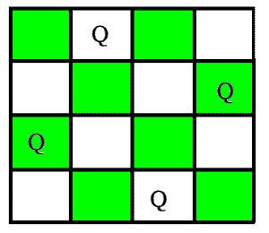
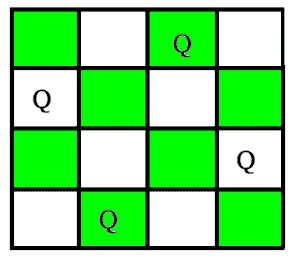
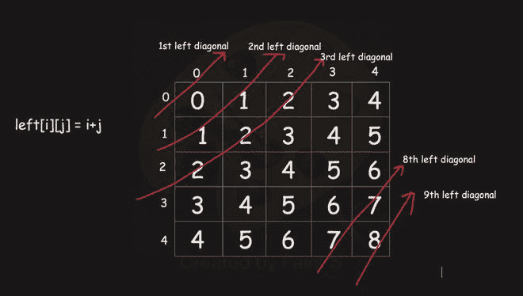
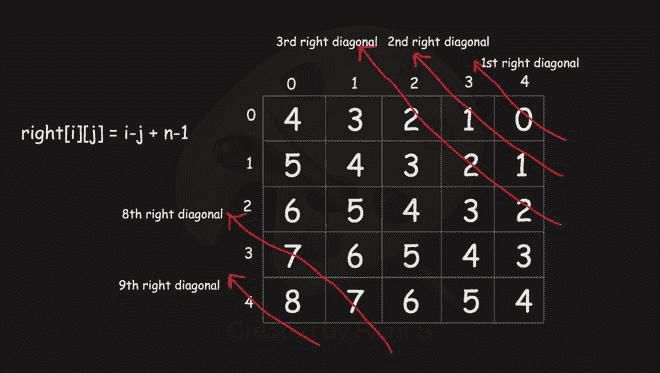

# 打印 N 皇后问题

中的所有解决方案

> 原文:[https://www . geesforgeks . org/printing-solutions-n-queen-problem/](https://www.geeksforgeeks.org/printing-solutions-n-queen-problem/)

N 皇后是把 N 个象棋皇后放在 N×N 个棋盘上，使得没有两个皇后互相攻击的问题。例如，以下是 4 皇后问题的解决方案。
N 皇后就是把 N 个象棋皇后放在 N×N 的棋盘上，这样就不会有两个皇后互相攻击的问题。例如，以下是 4 皇后问题的两种解决方案。





在[之前的](https://www.geeksforgeeks.org/backtracking-set-3-n-queen-problem/)帖子中，我们讨论了一种只打印一个可能解决方案的方法，所以现在在这篇帖子中，任务是打印 N-Queen Problem 中的所有解决方案。每个解包含 N 皇后位置的不同板配置，其中解是[1，2，3]的排列..n]按递增顺序，此处第*和第*位的数字表示第列的第*皇后位于该数字所在的行中。对于上述示例，解决方案写成[[2 4 1 3 ] [3 1 4 2 ]]。这里讨论的解决方案是同一方法的扩展。*

**回溯算法**

想法是将皇后一个接一个地放在不同的列中，从最左边的列开始。当我们在一列中放置一个皇后时，我们检查与已经放置的皇后的冲突。在当前列中，如果我们找到没有冲突的行，我们将该行和列标记为解决方案的一部分。如果由于冲突我们没有找到这样的行，那么我们回溯并返回 false。

```
1) Start in the leftmost column
2) If all queens are placed
    return true
3) Try all rows in the current column.  Do following
   for every tried row.
    a) If the queen can be placed safely in this row
       then mark this [row, column] as part of the 
       solution and recursively check if placing  
       queen here leads to a solution.
    b) If placing queen in [row, column] leads to a
       solution then return true.
    c) If placing queen doesn't lead to a solution 
       then unmark this [row, column] (Backtrack) 
       and go to step (a) to try other rows.
3) If all rows have been tried and nothing worked, 
   return false to trigger backtracking.
```

> **一个修改是我们可以在 O(1)时间内找到我们之前放置的皇后是在一列还是在左对角线还是在右对角线。我们可以观察到**
> 
> **1)对于特定左对角线中的所有单元，它们的行+列=常数。**
> 
> **2)对于特定右对角线中的所有单元格，它们的行–col+n–1 =常数。**

**假设 n = 5，那么我们总共有 2n-1 条左右对角线**

 

> 假设我们在(2，0)处放置了一个皇后
> 
> (2，0)的左对角线值= 2。现在我们不能在(1，1)和(0，2)放置另一个皇后，因为这两个皇后的左对角线值与(2，0)相同。右对角线也可以看到类似的情况。

## C++

```
/* C/C++ program to solve N Queen Problem using
backtracking */
#include <bits/stdc++.h>
using namespace std;

vector<vector<int> > result;

/* A utility function to check if a queen can
be placed on board[row][col]. Note that this
function is called when "col" queens are
already placed in columns from 0 to col -1.
So we need to check only left side for
attacking queens */
bool isSafe(vector<vector<int> > board,
            int row, int col)
{
    int i, j;
    int N = board.size();

    /* Check this row on left side */
    for (i = 0; i < col; i++)
        if (board[row][i])
            return false;

    /* Check upper diagonal on left side */
    for (i = row, j = col; i >= 0 && j >= 0; i--, j--)
        if (board[i][j])
            return false;

    /* Check lower diagonal on left side */
    for (i = row, j = col; j >= 0 && i < N; i++, j--)
        if (board[i][j])
            return false;

    return true;
}

/* A recursive utility function to solve N
Queen problem */
bool solveNQUtil(vector<vector<int> >& board, int col)
{
    /* base case: If all queens are placed
    then return true */
    int N = board.size();
    if (col == N) {
        vector<int> v;
        for (int i = 0; i < N; i++) {
            for (int j = 0; j < N; j++) {
                if (board[i][j] == 1)
                    v.push_back(j + 1);
            }
        }
        result.push_back(v);
        return true;
    }

    /* Consider this column and try placing
    this queen in all rows one by one */
    bool res = false;
    for (int i = 0; i < N; i++) {
        /* Check if queen can be placed on
        board[i][col] */
        if (isSafe(board, i, col)) {
            /* Place this queen in board[i][col] */
            board[i][col] = 1;

            // Make result true if any placement
            // is possible
            res = solveNQUtil(board, col + 1) || res;

            /* If placing queen in board[i][col]
            doesn't lead to a solution, then
            remove queen from board[i][col] */
            board[i][col] = 0; // BACKTRACK
        }
    }

    /* If queen can not be place in any row in
        this column col then return false */
    return res;
}

/* This function solves the N Queen problem using
Backtracking. It mainly uses solveNQUtil() to
solve the problem. It returns false if queens
cannot be placed, otherwise return true and
prints placement of queens in the form of 1s.
Please note that there may be more than one
solutions, this function prints one of the
feasible solutions.*/

vector<vector<int> > nQueen(int n)
{
    result.clear();
    vector<vector<int> > board(n, vector<int>(n, 0));

    if (solveNQUtil(board, 0) == false) {
        return {};
    }

    sort(result.begin(), result.end());
    return result;
}

// Driver Code
int main()
{
    int n = 4;
    vector<vector<int> > v = nQueen(n);

    for (auto ar : v) {
        cout << "[";
        for (auto it : ar)
            cout << it << " ";
        cout << "]";
    }

    return 0;
}
```

## Java 语言(一种计算机语言，尤用于创建网站)

```
/* Java program to solve N Queen
Problem using backtracking */
import java.util.*;
class GfG {

  /* This function solves the N Queen problem using
    Backtracking. It mainly uses solveNQUtil() to
    solve the problem.
    */
    static List<List<Integer>> nQueen(int n) {
       // cols[i] = true if there is a queen previously placed at ith column
        cols = new boolean[n];
        // leftDiagonal[i] = true if there is a queen previously placed at
          // i = (row + col )th left diagonal
        leftDiagonal = new boolean[2*n];
          // rightDiagonal[i] = true if there is a queen previously placed at
          // i = (row - col + n - 1)th rightDiagonal diagonal
        rightDiagonal = new boolean[2*n];
        result  = new ArrayList<>();
        List<Integer> temp = new ArrayList<>();
        for(int i=0;i<n;i++)temp.add(0);
        solveNQUtil(result,n,0,temp);

        return result;
    }
    private static void solveNQUtil(List<List<Integer>> result,int n,int row,List<Integer> comb){
        if(row==n){
          // if row==n it means we have successfully placed all n queens.
          // hence add current arrangement to our answer
          // comb represent current combination
            result.add(new ArrayList<>(comb));
            return;
        }
        for(int col = 0;col<n;col++){
           // if we have a queen previously placed in the current column
           // or in current left or right diagonal we continue
            if(cols[col] || leftDiagonal[row+col] || rightDiagonal[row-col+n])
                continue;
           // otherwise we place a queen at cell[row][col] and
           //make current column, left diagonal and righ diagonal true
            cols[col] = leftDiagonal[row+col] = rightDiagonal[row-col+n] = true;
            comb.set(col,row+1);
            // then we goto next row
            solveNQUtil(result,n,row+1,comb);
            // then we backtrack and remove our currently placed queen
            cols[col] = leftDiagonal[row+col] = rightDiagonal[row-col+n] = false;
        }
    }
  static List<List<Integer> > result
        = new ArrayList<List<Integer> >();
   static boolean[] cols,leftDiagonal,rightDiagonal;

    // Driver code
    public static void main(String[] args)
    {
        int n = 4;

        List<List<Integer> > res = nQueen(n);
        System.out.println(res);
    }
}
```

## 蟒蛇 3

```
''' Python3 program to solve N Queen Problem using
backtracking '''

result = []

# A utility function to print solution

''' A utility function to check if a queen can
be placed on board[row][col]. Note that this
function is called when "col" queens are
already placed in columns from 0 to col -1.
So we need to check only left side for
attacking queens '''

def isSafe(board, row, col):

    # Check this row on left side
    for i in range(col):
        if (board[row][i]):
            return False

    # Check upper diagonal on left side
    i = row
    j = col
    while i >= 0 and j >= 0:
        if(board[i][j]):
            return False
        i -= 1
        j -= 1

    # Check lower diagonal on left side
    i = row
    j = col
    while j >= 0 and i < 4:
        if(board[i][j]):
            return False
        i = i + 1
        j = j - 1

    return True

''' A recursive utility function to solve N
Queen problem '''

def solveNQUtil(board, col):
    ''' base case: If all queens are placed
    then return true '''
    if (col == 4):
        v = []
        for i in board:
          for j in range(len(i)):
            if i[j] == 1:
              v.append(j+1)
        result.append(v)
        return True

    ''' Consider this column and try placing
    this queen in all rows one by one '''
    res = False
    for i in range(4):

        ''' Check if queen can be placed on
        board[i][col] '''
        if (isSafe(board, i, col)):

            # Place this queen in board[i][col]
            board[i][col] = 1

            # Make result true if any placement
            # is possible
            res = solveNQUtil(board, col + 1) or res

            ''' If placing queen in board[i][col]
            doesn't lead to a solution, then
            remove queen from board[i][col] '''
            board[i][col] = 0  # BACKTRACK

    ''' If queen can not be place in any row in
        this column col then return false '''
    return res

''' This function solves the N Queen problem using
Backtracking. It mainly uses solveNQUtil() to
solve the problem. It returns false if queens
cannot be placed, otherwise return true and
prints placement of queens in the form of 1s.
Please note that there may be more than one
solutions, this function prints one of the
feasible solutions.'''

def solveNQ(n):
    result.clear()
    board = [[0 for j in range(n)]
             for i in range(n)]
    solveNQUtil(board, 0)
    result.sort()
    return result

# Driver Code
n = 4
res = solveNQ(n)
print(res)

# This code is contributed by YatinGupta
```

## C#

```
/* C# program to solve N Queen
Problem using backtracking */
using System;
using System.Collections;
using System.Collections.Generic;

class GfG {

    static List<List<int> > result = new List<List<int> >();

    /* A utility function to check if a queen can
    be placed on board[row,col]. Note that this
    function is called when "col" queens are
    already placed in columns from 0 to col -1.
    So we need to check only left side for
    attacking queens */
    static bool isSafe(int[, ] board, int row, int col,
                       int N)
    {
        int i, j;

        /* Check this row on left side */
        for (i = 0; i < col; i++)
            if (board[row, i] == 1)
                return false;

        /* Check upper diagonal on left side */
        for (i = row, j = col; i >= 0 && j >= 0; i--, j--)
            if (board[i, j] == 1)
                return false;

        /* Check lower diagonal on left side */
        for (i = row, j = col; j >= 0 && i < N; i++, j--)
            if (board[i, j] == 1)
                return false;

        return true;
    }

    /* A recursive utility function
    to solve N Queen problem */
    static bool solveNQUtil(int[, ] board, int col, int N)
    {
        /* base case: If all queens are placed
        then return true */

        if (col == N) {
            List<int> v = new List<int>();
            for (int i = 0; i < N; i++)
                for (int j = 0; j < N; j++) {
                    if (board[i, j] == 1)
                        v.Add(j + 1);
                }
            result.Add(v);
            return true;
        }

        /* Consider this column and try placing
        this queen in all rows one by one */
        bool res = false;
        for (int i = 0; i < N; i++) {
            /* Check if queen can be placed on
            board[i,col] */
            if (isSafe(board, i, col, N)) {
                /* Place this queen in board[i,col] */
                board[i, col] = 1;

                // Make result true if any placement
                // is possible
                res = solveNQUtil(board, col + 1, N) || res;

                /* If placing queen in board[i,col]
                doesn't lead to a solution, then
                remove queen from board[i,col] */
                board[i, col] = 0; // BACKTRACK
            }
        }

        /* If queen can not be place in any row in
            this column col then return false */
        return res;
    }

    /* This function solves the N Queen problem using
    Backtracking. It mainly uses solveNQUtil() to
    solve the problem. It returns false if queens
    cannot be placed, otherwise return true and
    prints placement of queens in the form of 1s.
    Please note that there may be more than one
    solutions, this function prints one of the
    feasible solutions.*/
    static List<List<int> > solveNQ(int n)
    {
        result.Clear();
        int[, ] board = new int[n, n];

        solveNQUtil(board, 0, n);
        return result;
    }

    // Driver code
    public static void Main()
    {
        int n = 4;
        List<List<int> > res = solveNQ(n);
        for (int i = 0; i < res.Count; i++) {
            Console.Write("[");
            for (int j = 0; j < res[i].Count; j++) {
                Console.Write(res[i][j]+ " ");
            }
            Console.Write("]");
        }
    }
}

/* This code contributed by PrinciRaj1992 */
```

**Output**

```
[2 4 1 3 ][3 1 4 2 ]
```

**使用位屏蔽的高效回溯方法**

**算法:**
每行每列总是只有一个皇后，所以回溯的思路是从每行最左边一列开始放置皇后，找到一列可以放置皇后的位置，而不会与之前放置的皇后发生冲突。它从第一行重复到最后一行。放置皇后时，它会被跟踪，就好像它没有与前几行中放置的皇后发生碰撞(行方向、列方向和对角线方向)。一旦发现皇后不能被放置在一行中的特定列索引处，算法回溯并改变放置在前一行的皇后的位置，然后向前移动以将皇后放置在下一行。

1.  从三位向量开始，该向量用于在每次迭代中逐行、逐列和对角跟踪皇后位置的安全位置。
2.  三位向量将包含如下信息:
    *   **rowmask:** 设置该位向量的位索引(I)将指示，皇后不能放置在下一行的第 I 列。
    *   **ldmask:** 设置该位向量的位索引(I)将指示，皇后不能被放置在下一行的第 I 列。它表示下一行的不安全列索引位于前一行皇后的左对角线下。
    *   **rdmask:** 设置该位向量的位索引(I)将指示，皇后不能放置在下一行的第 I 列。它表示下一行的不安全列索引落在前一行皇后的右对角线上。
3.  有一个二维(NxN)矩阵(板)，它将在开始的所有索引处有“”字符，并由“Q”逐行填充。一旦所有行都被“Q”填充，当前的解决方案将被推入结果列表。

下面是上述方法的实现:

## C++

```
// CPP program for above approach
#include <bits/stdc++.h>

using namespace std;

vector<vector<int> > result;
// Program to solve N Queens problem
void solveBoard(vector<vector<char> >& board, int row,
                int rowmask, int ldmask, int rdmask,
                int& ways)
{

    int n = board.size();

    // All_rows_filled is a bit mask having all N bits set
    int all_rows_filled = (1 << n) - 1;

    // If rowmask will have all bits set, means queen has
    // been placed successfully in all rows and board is
    // displayed
    if (rowmask == all_rows_filled) {

        vector<int> v;
        for (int i = 0; i < board.size(); i++) {
            for (int j = 0; j < board.size(); j++) {
                if (board[i][j] == 'Q')
                    v.push_back(j + 1);
            }
        }
        result.push_back(v);
        return;
    }

    // We extract a bit mask(safe) by rowmask,
    // ldmask and rdmask. all set bits of 'safe'
    // indicates the safe column index for queen
    // placement of this iteration for row index(row).
    int safe
        = all_rows_filled & (~(rowmask | ldmask | rdmask));
    while (safe) {

        // Extracts the right-most set bit
        // (safe column index) where queen
        // can be placed for this row
        int p = safe & (-safe);
        int col = (int)log2(p);
        board[row][col] = 'Q';

        // This is very important:
        // we need to update rowmask, ldmask and rdmask
        // for next row as safe index for queen placement
        // will be decided by these three bit masks.

        // We have all three rowmask, ldmask and
        // rdmask as 0 in beginning. Suppose, we are placing
        // queen at 1st column index at 0th row. rowmask,
        // ldmask and rdmask will change for next row as
        // below:

        // rowmask's 1st bit will be set by OR operation
        // rowmask = 00000000000000000000000000000010

        // ldmask will change by setting 1st
        // bit by OR operation  and left shifting
        // by 1 as it has to block the next column
        // of next row because that will fall on left
        // diagonal. ldmask =
        // 00000000000000000000000000000100

        // rdmask will change by setting 1st bit
        // by OR operation and right shifting by 1
        // as it has to block the previous column
        // of next row because that will fall on right
        // diagonal. rdmask =
        // 00000000000000000000000000000001

        // these bit masks will keep updated in each
        // iteration for next row
        solveBoard(board, row + 1, rowmask | p,
                   (ldmask | p) << 1, (rdmask | p) >> 1,
                   ways);

        // Reset right-most set bit to 0 so,
        // next iteration will continue by placing the queen
        // at another safe column index of this row
        safe = safe & (safe - 1);

        // Backtracking, replace 'Q' by ' '
        board[row][col] = ' ';
    }
    return;
}

// Driver Code
int main()
{
    // Board size
    int n = 4;
    int ways = 0;

    vector<vector<char> > board;
    for (int i = 0; i < n; i++) {
        vector<char> tmp;
        for (int j = 0; j < n; j++) {
            tmp.push_back(' ');
        }
        board.push_back(tmp);
    }

    int rowmask = 0, ldmask = 0, rdmask = 0;
    int row = 0;

    // Function Call
    result.clear();
    solveBoard(board, row, rowmask, ldmask, rdmask, ways);
    sort(result.begin(),result.end());
    for (auto ar : result) {
        cout << "[";
        for (auto it : ar)
            cout << it << " ";
        cout << "]";
    }
    return 0;
}
// This code is contributed by Nikhil Vinay
```

## Java 语言(一种计算机语言，尤用于创建网站)

```
// Java Program for above approach
import java.util.*;
public class NQueenSolution {

    static List<List<Integer> > result
        = new ArrayList<List<Integer> >();

    // Program to solve N-Queens Problem
    public void solveBoard(char[][] board, int row,
                           int rowmask, int ldmask,
                           int rdmask)
    {
        int n = board.length;

        // All_rows_filled is a bit mask
        // having all N bits set
        int all_rows_filled = (1 << n) - 1;

        // If rowmask will have all bits set,
        // means queen has been placed successfully
        // in all rows and board is displayed
        if (rowmask == all_rows_filled) {
            List<Integer> v = new ArrayList<>();

            for (int i = 0; i < n; i++) {
                for (int j = 0; j < n; j++) {
                    if (board[i][j] == 'Q')
                        v.add(j + 1);
                }
            }
            result.add(v);
            return;
        }

        // We extract a bit mask(safe) by rowmask,
        // ldmask and rdmask. all set bits of 'safe'
        // indicates the safe column index for queen
        // placement of this iteration for row index(row).
        int safe = all_rows_filled
                   & (~(rowmask | ldmask | rdmask));
        while (safe > 0) {

            // Extracts the right-most set bit
            // (safe column index) where queen
            // can be placed for this row
            int p = safe & (-safe);
            int col = (int)(Math.log(p) / Math.log(2));
            board[row][col] = 'Q';

            // This is very important:
            // we need to update rowmask, ldmask and rdmask
            // for next row as safe index for queen
            // placement will be decided by these three bit
            // masks.

            // We have all three rowmask, ldmask and
            // rdmask as 0 in beginning. Suppose, we are
            // placing queen at 1st column index at 0th row.
            // rowmask, ldmask and rdmask will change for
            // next row as below:

            // rowmask's 1st bit will be set by OR operation
            // rowmask = 00000000000000000000000000000010

            // ldmask will change by setting 1st
            // bit by OR operation  and left shifting
            // by 1 as it has to block the next column
            // of next row because that will fall on left
            // diagonal. ldmask =
            // 00000000000000000000000000000100

            // rdmask will change by setting 1st bit
            // by OR operation and right shifting by 1
            // as it has to block the previous column
            // of next row because that will fall on right
            // diagonal. rdmask =
            // 00000000000000000000000000000001

            // these bit masks will keep updated in each
            // iteration for next row
            solveBoard(board, row + 1, rowmask | p,
                       (ldmask | p) << 1,
                       (rdmask | p) >> 1);

            // Reset right-most set bit to 0 so,
            // next iteration will continue by placing the
            // queen at another safe column index of this
            // row
            safe = safe & (safe - 1);

            // Backtracking, replace 'Q' by ' '
            board[row][col] = ' ';
        }
    }

    // Program to print board
    public void printBoard(char[][] board)
    {
        for (int i = 0; i < board.length; i++) {
            System.out.print("|");
            for (int j = 0; j < board[i].length; j++) {
                System.out.print(board[i][j] + "|");
            }
            System.out.println();
        }
    }

    // Driver Code
    public static void main(String args[])
    {

        // Board size
        int n = 4;

        char board[][] = new char[n][n];
        for (int i = 0; i < n; i++) {
            for (int j = 0; j < n; j++) {
                board[i][j] = ' ';
            }
        }

        int rowmask = 0, ldmask = 0, rdmask = 0;
        int row = 0;

        NQueenSolution solution = new NQueenSolution();

        // Function Call
        result.clear();
        solution.solveBoard(board, row, rowmask, ldmask,
                            rdmask);
        System.out.println(result);
    }
}

// This code is contributed by Nikhil Vinay
```

## 蟒蛇 3

```
# Python program for above approach
import math

result = []

# Program to solve N-Queens Problem

def solveBoard(board, row, rowmask,
               ldmask, rdmask):

    n = len(board)

    # All_rows_filled is a bit mask
    # having all N bits set
    all_rows_filled = (1 << n) - 1

    # If rowmask will have all bits set, means
    # queen has been placed successfully
    # in all rows and board is displayed
    if (rowmask == all_rows_filled):
        v = []
        for i in board:
            for j in range(len(i)):
                if i[j] == 'Q':
                    v.append(j+1)
        result.append(v)

    # We extract a bit mask(safe) by rowmask,
    # ldmask and rdmask. all set bits of 'safe'
    # indicates the safe column index for queen
    # placement of this iteration for row index(row).
    safe = all_rows_filled & (~(rowmask |
                                ldmask | rdmask))

    while (safe > 0):

        # Extracts the right-most set bit
        # (safe column index) where queen
        # can be placed for this row
        p = safe & (-safe)
        col = (int)(math.log(p)/math.log(2))
        board[row][col] = 'Q'

        # This is very important:
        # we need to update rowmask, ldmask and rdmask
        # for next row as safe index for queen placement
        # will be decided by these three bit masks.

        # We have all three rowmask, ldmask and
        # rdmask as 0 in beginning. Suppose, we are placing
        # queen at 1st column index at 0th row. rowmask, ldmask
        # and rdmask will change for next row as below:

        # rowmask's 1st bit will be set by OR operation
        # rowmask = 00000000000000000000000000000010

        # ldmask will change by setting 1st
        # bit by OR operation  and left shifting
        # by 1 as it has to block the next column
        # of next row because that will fall on left diagonal.
        # ldmask = 00000000000000000000000000000100

        # rdmask will change by setting 1st bit
        # by OR operation and right shifting by 1
        # as it has to block the previous column
        # of next row because that will fall on right diagonal.
        # rdmask = 00000000000000000000000000000001

        # these bit masks will keep updated in each
        # iteration for next row
        solveBoard(board, row+1, rowmask | p,
                   (ldmask | p) << 1, (rdmask | p) >> 1)

        # Reset right-most set bit to 0 so, next
        # iteration will continue by placing the queen
        # at another safe column index of this row
        safe = safe & (safe-1)

        # Backtracking, replace 'Q' by ' '
        board[row][col] = ' '

# Program to print board

def printBoard(board):
    for row in board:
        print("|" + "|".join(row) + "|")

# Driver Code

def main():

    n = 4  # board size
    board = []

    for i in range(n):
        row = []
        for j in range(n):
            row.append(' ')
        board.append(row)

    rowmask = 0
    ldmask = 0
    rdmask = 0
    row = 0

    # Function Call
    result.clear()
    solveBoard(board, row, rowmask, ldmask, rdmask)
    result.sort()
    print(result)

if __name__ == "__main__":
    main()

# This code is contributed by Nikhil Vinay
```

**Output**

```
[2 4 1 3 ][3 1 4 2 ]
```

本文由 [**萨哈布拉**](https://practice.geeksforgeeks.org/user-profile.php?user=sahil_coder) 供稿。如果你喜欢 GeeksforGeeks 并想投稿，你也可以使用[write.geeksforgeeks.org](https://write.geeksforgeeks.org)写一篇文章或者把你的文章邮寄到 review-team@geeksforgeeks.org。看到你的文章出现在极客博客主页上，帮助其他极客。

如果你发现任何不正确的地方，或者你想分享更多关于上面讨论的话题的信息，请写评论。