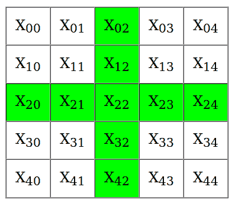

# 在矩阵中以加号“+”模式打印字符串

> 原文:[https://www . geesforgeks . org/printing-string-plus-pattern-matrix/](https://www.geeksforgeeks.org/printing-string-plus-pattern-matrix/)

给定一个字符串，在矩阵中打印出来，这样就形成了一个加号。

**示例:**

```
Input: TOP
Output:  
X    T    X
T    O    P
X    P    X

Input: FEVER
Output:
X    X    F    X    X
X    X    E    X    X
F    E    V    E    R
X    X    E    X    X
X    X    R    X    X

```

**进场:**
思路很简单。首先，我们可以访问矩阵的每个元素，并使其为“X”。然后我们将在矩阵的中间行和中间列插入字符串的字符。例如，我们有一个长度为 5 的字符串。所以我们需要一个(5X5)矩阵。



为了访问矩阵的中间列，列索引被设为常数，并等于(n/2)，其中 n 是字符串的长度。它的行索引将从 0 变为(n-1)。
要访问中间行，行索引将被设为常量并等于(n/2)，列索引将从 0 变为(n-1)。

下面是上述方法的实现:

## C++

```
// CPP program to print the 
// string in 'plus' pattern
#include <bits/stdc++.h>
#define max 100
using namespace std;

// Function to make a cross in the matrix
void carveCross(string str)
{ 
    int n = str.length();
    if (n % 2 == 0) 
    {  
        /* As, it is not possible to make 
        the cross exactly in the middle of 
        the matrix with an even length string.*/
        cout << "Not possible. Please enter "
             << "odd length string.\n";
    }
    else {

        // declaring a 2D array i.e a matrix
        char arr[max][max]; 
        int m = n / 2;

        /* Now, we will fill all the 
        elements of the array with 'X'*/
        for (int i = 0; i < n; i++) {
            for (int j = 0; j < n; j++) {
                arr[i][j] = 'X';
            }
        }

        /* Now, we will place the characters 
        of the string in the matrix, such 
        that a cross is formed in it.*/
        for (int i = 0; i < n; i++) 
        { 
            /* here the characters of the 
            string will be added in the 
            middle column of our array.*/
            arr[i][m] = str[i];
        }

        for (int i = 0; i < n; i++) 
        { 
            // here the characters of the 
            // string will be added in the 
            // middle row of our array.
            arr[m][i] = str[i];
        }

        /* Now finally, we will print 
        the array*/
        for (int i = 0; i < n; i++) {
            for (int j = 0; j < n; j++) {
                cout << arr[i][j] << " ";
            }
            cout << "\n";
        }
    }
}

// driver code
int main()
{
    string str = "PICTURE";
    carveCross(str);
    return 0;
}
```

## Java 语言(一种计算机语言，尤用于创建网站)

```
// Java program to print the
// string in 'plus' pattern
class GFG {
static final int max = 100;

// Function to make a cross in the matrix
static void carveCross(String str) {
    int n = str.length();
    if (n % 2 == 0) {

        // As, it is not possible to make
        // the cross exactly in the middle of
        // the matrix with an even length string.
        System.out.print("Not possible. Please enter "
                             + "odd length string.\n");
    } 
    else {

        // declaring a 2D array i.e a matrix
        char arr[][] = new char[max][max];
        int m = n / 2;

        // Now, we will fill all the
        // elements of the array with 'X'
        for (int i = 0; i < n; i++) 
        {
            for (int j = 0; j < n; j++) 
            {
                arr[i][j] = 'X';
        }
    }

    // Now, we will place the characters
    // of the string in the matrix, such
    // that a cross is formed in it.
    for (int i = 0; i < n; i++) {

        // here the characters of the
        // string will be added in the
        // middle column of our array.
        arr[i][m] = str.charAt(i);
    }

    for (int i = 0; i < n; i++) {

        // here the characters of the
        // string will be added in the
        // middle row of our array.
        arr[m][i] = str.charAt(i);
    }

    // Now finally, we will print
    // the array
    for (int i = 0; i < n; i++)
    {
        for (int j = 0; j < n; j++)
        {
            System.out.print(arr[i][j] + " ");
        }
        System.out.print("\n");
    }
    }
}

// Driver code
public static void main(String[] args) {
    String str = "PICTURE";
    carveCross(str);
}
}
// This code is contributed by Anant Agarwal.
```

## 蟒蛇 3

```
# Python 3 program to print the 
# string in 'plus' pattern
max = 100

# Function to make a cross 
# in the matrix
def carveCross(str):

    n = len(str)
    if (n % 2 == 0) :

        ''' As, it is not possible to make 
        the cross exactly in the middle of 
        the matrix with an even length string.'''
        print("Not possible. Please enter "
            , "odd length string.\n")

    else :

        # declaring a 2D array i.e a matrix
        arr = [[ False for x in range(max)] 
                       for y in range(max)] 
        m = n // 2

        ''' Now, we will fill all the 
        elements of the array with 'X'''
        for i in range( n) :
            for j in range(n) :
                arr[i][j] = 'X'

        '''Now, we will place the characters 
        of the string in the matrix, such 
        that a cross is formed in it.'''
        for i in range(n):

            ''' here the characters of the 
            string will be added in the 
            middle column of our array.'''
            arr[i][m] = str[i]

        for i in range(n):

            # here the characters of the 
            # string will be added in the 
            # middle row of our array.
            arr[m][i] = str[i]

        # Now finally, we will print 
        # the array
        for i in range(n):
            for j in range(n):
                print( arr[i][j] , end=" ")

            print()

# Driver Code
if __name__ == "__main__":
    str = "PICTURE"
    carveCross(str)

# This code is contributed 
# by ChitraNayal
```

## C#

```
// C# program to print the
// string in 'plus' pattern
using System;
class GFG {
static  int max = 100;

// Function to make a cross in the matrix
static void carveCross(String str) {
    int n = str.Length;
    if (n % 2 == 0) {

        // As, it is not possible to make
        // the cross exactly in the middle of
        // the matrix with an even length string.
        Console.Write("Not possible. Please enter "
                            + "odd length string.");
    } 
    else {

        // declaring a 2D array i.e a matrix
        char [,]arr = new char[max,max];
        int m = n / 2;

        // Now, we will fill all the
        // elements of the array with 'X'
        for (int i = 0; i < n; i++) 
        {
            for (int j = 0; j < n; j++) 
            {
                arr[i,j] = 'X';
        }
    }

    // Now, we will place the characters
    // of the string in the matrix, such
    // that a cross is formed in it.
    for (int i = 0; i < n; i++) {

        // here the characters of the
        // string will be added in the
        // middle column of our array.
        arr[i,m] = str[i];
    }

    for (int i = 0; i < n; i++) {

        // here the characters of the
        // string will be added in the
        // middle row of our array.
        arr[m,i] = str[i];
    }

    // Now finally, we will print
    // the array
    for (int i = 0; i < n; i++)
    {
        for (int j = 0; j < n; j++)
        {
            Console.Write(arr[i,j] + " ");
        }
           Console.WriteLine();
    }
    }
}

// Driver code
public static void Main() {
    string str = "PICTURE";
    carveCross(str);
}
}
// This code is contributed by vt_m.
```

## 服务器端编程语言（Professional Hypertext Preprocessor 的缩写）

```
<?php
// PHP program to print the string
// in 'plus' pattern

// Function to make a cross 
// in the matrix
function carveCross($str)
{ 
    $n = strlen($str);
    if ($n % 2 == 0) 
    { 
        /* As, it is not possible to make 
        the cross exactly in the middle of 
        the matrix with an even length string.*/
        echo ("Not possible. Please enter ");
        echo( "odd length string.\n");
    }
    else
    {

        // declaring a 2D array i.e a matrix
        $arr = array(); 
        $m = $n / 2;

        /* Now, we will fill all the 
        elements of the array with 'X'*/
        for ($i = 0; $i < $n; $i++) 
        {
            for ($j = 0; $j < $n; $j++) 
            {
                $arr[$i][$j] = 'X';
            }
        }

        /* Now, we will place the characters 
        of the string in the matrix, such 
        that a cross is formed in it.*/
        for ($i = 0; $i < $n; $i++) 
        { 
            /* here the characters of the 
            string will be added in the 
            middle column of our array.*/
            $arr[$i][$m] = $str[$i];
        }

        for ($i = 0; $i < $n; $i++) 
        { 
            // here the characters of the 
            // string will be added in the 
            // middle row of our array.
            $arr[$m][$i] = $str[$i];
        }

        /* Now finally, we will print 
        the array*/
        for ($i = 0; $i < $n; $i++)
        {
            for ($j = 0; $j < $n; $j++) 
            {
                echo ($arr[$i][$j] . " " );
            }
            echo ("\n");
        }
    }
}

// Driver Code
$str = "PICTURE";
carveCross($str);

// This code is contributed 
// by Shivi_Aggarwal 
?>
```

**Output:**

```
X X X P X X X 
X X X I X X X 
X X X C X X X 
P I C T U R E 
X X X U X X X 
X X X R X X X 
X X X E X X X

```