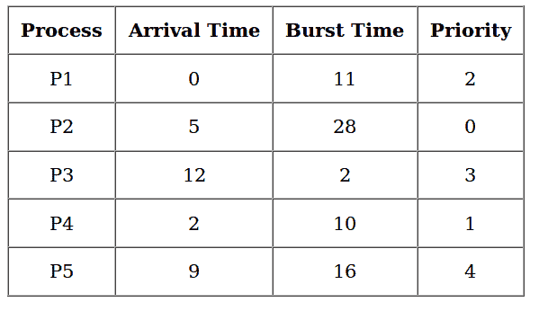
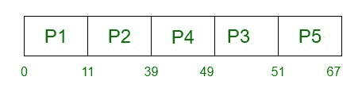

# 不同到达时间的优先级 CPU 调度–设置 2

> 原文:[https://www . geesforgeks . org/priority-CPU-调度-不同到达时间-set-2/](https://www.geeksforgeeks.org/priority-cpu-scheduling-with-different-arrival-time-set-2/)

**先决条件–**[优先级调度程序–第 1 集](https://www.geeksforgeeks.org/program-priority-scheduling-set-1/)
优先级调度是一种非抢占式算法，也是批处理系统中最常见的调度算法之一。如果两个进程具有相同的到达时间，则为每个进程分配第一个到达时间(先减去到达时间的进程)，然后与优先级进行比较(先比较最高的进程)。此外，如果两个进程具有相同的优先级，则比较进程号(先减去进程号)。当所有过程都被执行时，这个过程被重复。

**实施–**

1.  首先输入进程及其到达时间、突发时间和优先级。
2.  第一个进程将调度到达时间最低的进程，如果两个或多个进程到达时间最低，则优先级较高的进程将首先调度。
3.  现在将根据流程的到达时间和优先级安排进一步的流程。(这里我们假设优先级越低，优先级越高)。如果两个进程优先级相同，则按照进程号排序。
    **注:**在问题中，他们会明确提到，哪个号码优先级高，哪个号码优先级低。
4.  一旦所有的过程都已经到达，我们就可以根据它们的优先级来安排它们。



**甘特图–**



**示例–**

```
Input :
process no-> 1 2 3 4 5 
arrival time-> 0 1 3 2 4
burst time-> 3 6 1 2 4
priority-> 3 4 9 7 8
Output :
Process_no   arrival_time   Burst_time   Complete_time    Turn_Around_Time       Waiting_Time
1             0               3                3                   3               0
2             1               6                9                   8               2 
3             3               1                16                  13              12
4             2               2                11                  9               7
5             4               4                15                  11              7
Average Waiting Time is : 5.6
Average Turn Around time is : 8.8 
```

## C++

```
// C++ implementation for Priority Scheduling with
//Different Arrival Time priority scheduling
/*1\. sort the processes according to arrival time
2\. if arrival time is same the acc to priority
3\. apply fcfs
*/

#include <bits/stdc++.h>

using namespace std;

#define totalprocess 5

// Making a struct to hold the given input

struct process
{
int at,bt,pr,pno;
};

process proc[50];

/*
Writing comparator function to sort according to priority if
arrival time is same
*/

bool comp(process a,process b)
{
if(a.at == b.at)
{
return a.pr<b.pr;
}
else
{
    return a.at<b.at;
}
}

// Using FCFS Algorithm to find Waiting time
void get_wt_time(int wt[])
{
// declaring service array that stores cumulative burst time
int service[50];

// Initialising initial elements of the arrays
service[0] = proc[0].at;
wt[0]=0;

for(int i=1;i<totalprocess;i++)
{
service[i]=proc[i-1].bt+service[i-1];

wt[i]=service[i]-proc[i].at;

// If waiting time is negative, change it into zero

    if(wt[i]<0)
    {
    wt[i]=0;
    }
}

}

void get_tat_time(int tat[],int wt[])
{
// Filling turnaroundtime array

for(int i=0;i<totalprocess;i++)
{
    tat[i]=proc[i].bt+wt[i];
}

}

void findgc()
{
//Declare waiting time and turnaround time array
int wt[50],tat[50];

double wavg=0,tavg=0;

// Function call to find waiting time array
get_wt_time(wt);
//Function call to find turnaround time
get_tat_time(tat,wt);

int stime[50],ctime[50];

stime[0] = proc[0].at;
ctime[0]=stime[0]+tat[0];

// calculating starting and ending time
for(int i=1;i<totalprocess;i++)
    {
        stime[i]=ctime[i-1];
        ctime[i]=stime[i]+tat[i]-wt[i];
    }

cout<<"Process_no\tStart_time\tComplete_time\tTurn_Around_Time\tWaiting_Time"<<endl;

    // display the process details

for(int i=0;i<totalprocess;i++)
    {
        wavg += wt[i];
        tavg += tat[i];

        cout<<proc[i].pno<<"\t\t"<<
            stime[i]<<"\t\t"<<ctime[i]<<"\t\t"<<
            tat[i]<<"\t\t\t"<<wt[i]<<endl;
    }

        // display the average waiting time
        //and average turn around time

    cout<<"Average waiting time is : ";
    cout<<wavg/(float)totalprocess<<endl;
    cout<<"average turnaround time : ";
    cout<<tavg/(float)totalprocess<<endl;

}

int main()
{
int arrivaltime[] = { 1, 2, 3, 4, 5 };
int bursttime[] = { 3, 5, 1, 7, 4 };
int priority[] = { 3, 4, 1, 7, 8 };

for(int i=0;i<totalprocess;i++)
{
    proc[i].at=arrivaltime[i];
    proc[i].bt=bursttime[i];
    proc[i].pr=priority[i];
    proc[i].pno=i+1;
    }

    //Using inbuilt sort function

    sort(proc,proc+totalprocess,comp);

    //Calling function findgc for finding Gantt Chart

    findgc();

    return 0;
}

// This code is contributed by Anukul Chand.
```

## Java 语言(一种计算机语言，尤用于创建网站)

```
// Java implementation for Priority Scheduling with
//Different Arrival Time priority scheduling
import java.util.*;

/// Data Structure
class Process {
    int at, bt, pri, pno;
    Process(int pno, int at, int bt, int pri)
    {
        this.pno = pno;
        this.pri = pri;
        this.at = at;
        this.bt = bt;
    }
}

/// Gantt chart structure
class GChart {
    // process number, start time, complete time,
    // turn around time, waiting time
    int pno, stime, ctime, wtime, ttime;
}

// user define comparative method (first arrival first serve,
// if arrival time same then heigh priority first)
class MyComparator implements Comparator {

    public int compare(Object o1, Object o2)
    {

        Process p1 = (Process)o1;
        Process p2 = (Process)o2;
        if (p1.at < p2.at)
            return (-1);

        else if (p1.at == p2.at && p1.pri > p2.pri)
            return (-1);

        else
            return (1);
    }
}

// class to find Gantt chart
class FindGantChart {
    void findGc(LinkedList queue)
    {

        // initial time = 0
        int time = 0;

        // priority Queue sort data according
        // to arrival time or priority (ready queue)
        TreeSet prique = new TreeSet(new MyComparator());

        // link list for store processes data
        LinkedList result = new LinkedList();

        // process in ready queue from new state queue
        while (queue.size() > 0)
            prique.add((Process)queue.removeFirst());

        Iterator it = prique.iterator();

        // time set to according to first process
        time = ((Process)prique.first()).at;

        // scheduling process
        while (it.hasNext()) {

            // dispatcher dispatch the
            // process ready to running state
            Process obj = (Process)it.next();

            GChart gc1 = new GChart();
            gc1.pno = obj.pno;
            gc1.stime = time;
            time += obj.bt;
            gc1.ctime = time;
            gc1.ttime = gc1.ctime - obj.at;
            gc1.wtime = gc1.ttime - obj.bt;

            /// store the exxtreted process
            result.add(gc1);
        }

        // create object of output class and call method
        new ResultOutput(result);
    }
}
```

## 蟒蛇 3

```
# Python3 implementation for Priority Scheduling with
# Different Arrival Time priority scheduling
"""1\. sort the processes according to arrival time
   2\. if arrival time is same the acc to priority
   3\. apply fcfs """

totalprocess = 5
proc = []
for i in range(5):
    l = []
    for j in range(4):
        l.append(0)
    proc.append(l)

# Using FCFS Algorithm to find Waiting time
def get_wt_time( wt):

    # declaring service array that stores
    # cumulative burst time
    service = [0] * 5

    # Initialising initial elements
    # of the arrays
    service[0] = 0
    wt[0] = 0

    for i in range(1, totalprocess):
        service[i] = proc[i - 1][1] + service[i - 1]
        wt[i] = service[i] - proc[i][0] + 1

        # If waiting time is negative,
        # change it o zero
        if(wt[i] < 0) :    
            wt[i] = 0

def get_tat_time(tat, wt):

    # Filling turnaroundtime array
    for i in range(totalprocess):
        tat[i] = proc[i][1] + wt[i]

def findgc():

    # Declare waiting time and
    # turnaround time array
    wt = [0] * 5
    tat = [0] * 5

    wavg = 0
    tavg = 0

    # Function call to find waiting time array
    get_wt_time(wt)

    # Function call to find turnaround time
    get_tat_time(tat, wt)

    stime = [0] * 5
    ctime = [0] * 5
    stime[0] = 1
    ctime[0] = stime[0] + tat[0]

    # calculating starting and ending time
    for i in range(1, totalprocess):
        stime[i] = ctime[i - 1]
        ctime[i] = stime[i] + tat[i] - wt[i]

    print("Process_no\tStart_time\tComplete_time",
               "\tTurn_Around_Time\tWaiting_Time")

    # display the process details
    for i in range(totalprocess):
        wavg += wt[i]
        tavg += tat[i]

        print(proc[i][3], "\t\t", stime[i],
                         "\t\t", end = " ")
        print(ctime[i], "\t\t", tat[i], "\t\t\t", wt[i])

    # display the average waiting time
    # and average turn around time
    print("Average waiting time is : ", end = " ")
    print(wavg / totalprocess)
    print("average turnaround time : " , end = " ")
    print(tavg / totalprocess)

# Driver code
if __name__ =="__main__":
    arrivaltime = [1, 2, 3, 4, 5]
    bursttime = [3, 5, 1, 7, 4]
    priority = [3, 4, 1, 7, 8]

    for i in range(totalprocess):

        proc[i][0] = arrivaltime[i]
        proc[i][1] = bursttime[i]
        proc[i][2] = priority[i]
        proc[i][3] = i + 1

    # Using inbuilt sort function
    proc = sorted (proc, key = lambda x:x[2])
    proc = sorted (proc)

    # Calling function findgc for
    # finding Gantt Chart
    findgc()

# This code is contributed by
# Shubham Singh(SHUBHAMSINGH10)
```

**输出:**

```
Process_no Start_time Complete_time Turn_Around_Time Waiting_Time
1           1           4              3              0 
2           5           10             8              3
3           4           5              2              1
4          10           17             13             6
5          17           21             16             12
Average Waiting Time is : 4.4 
Average Turn Around time is : 8.4
```

**时间复杂度:** O(N * logN)，其中 N 为进程总数。
**辅助空间:** O(N)

本文由 [**阿米特·维尔马**](https://auth.geeksforgeeks.org/profile.php?user=amit verma 4&list=practice) 供稿。如果你喜欢 GeeksforGeeks 并想投稿，你也可以使用[contribute.geeksforgeeks.org](http://www.contribute.geeksforgeeks.org)写一篇文章或者把你的文章邮寄到 contribute@geeksforgeeks.org。看到你的文章出现在极客博客主页上，帮助其他极客。
如果发现有不正确的地方，或者想分享更多关于上述话题的信息，请写评论。