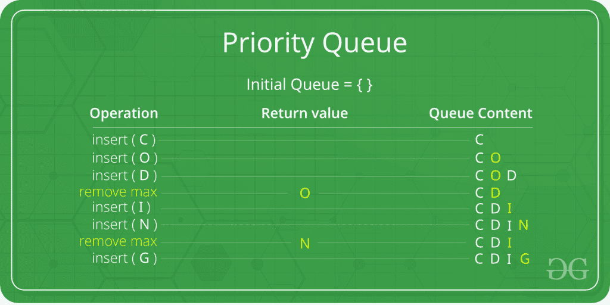

# 优先级队列|集合 1(简介)

> 原文:[https://www . geesforgeks . org/priority-queue-set-1-introduction/](https://www.geeksforgeeks.org/priority-queue-set-1-introduction/)

优先级队列是[队列](https://www.geeksforgeeks.org/queue-set-1introduction-and-array-implementation/)的扩展，具有以下属性。

1.  每个项目都有一个相关的优先级。
2.  优先级高的元素在优先级低的元素之前出队。
3.  如果两个元素具有相同的优先级，则根据它们在队列中的顺序提供服务。

在下面的优先级队列中，具有最大 ASCII 值的元素将具有最高优先级。


典型的优先级队列支持以下操作。
**插入(项目，优先级):**插入具有给定优先级的项目。
**获取最高优先级():**返回最高优先级的项目。
**删除最高优先级():**删除最高优先级的项目。

**如何实现优先级排队？**
****使用数组:**** 一个简单的实现就是使用数组的如下结构。

```
struct item {
   int item;
   int priority;
}
```

insert()操作可以通过在 O(1)时间内在数组末尾添加一个项来实现。

getHighestPriority()操作可以通过线性搜索数组中优先级最高的项来实现。这个操作需要 O(n)个时间。

deleteHighestPriority()操作可以通过首先线性搜索一个项目，然后通过将所有后续项目向后移动一个位置来移除该项目来实现。

我们也可以使用链表，链表所有操作的时间复杂度和数组一样。链表的优点是 deleteHighestPriority()可以更有效，因为我们不必移动项目。

**使用堆:**
堆通常是优先队列实现的首选，因为堆比数组或链表提供更好的性能。在二进制堆中，getHighestPriority()可以在 O(1)时间实现，insert()可以在 O(Logn)时间实现，deleteHighestPriority()也可以在 O(Logn)时间实现。
借助[斐波那契堆](http://en.wikipedia.org/wiki/Fibonacci_heap)，insert()和 getHighestPriority()可以在 O(1)摊销时间内实现，deleteHighestPriority()可以在 O(Logn)摊销时间内实现。

**优先级队列的应用:**
1) CPU 调度
2)像[迪克斯特拉最短路径算法](https://www.geeksforgeeks.org/greedy-algorithms-set-7-dijkstras-algorithm-for-adjacency-list-representation/)[Prim 最小生成树](https://www.geeksforgeeks.org/greedy-algorithms-set-5-prims-mst-for-adjacency-list-representation/)等图形算法
3)所有涉及优先级的[队列应用](https://www.geeksforgeeks.org/applications-of-queue-data-structure/)。

优先级队列是使用堆实现的。关于我们自己的实现和库实现，请参考下面的文章。

1.  [二进制堆(优先级队列最常见的实现)](https://www.geeksforgeeks.org/binary-heap/)
2.  [c++中的优先级队列](https://www.geeksforgeeks.org/priority-queue-in-cpp-stl/)。
3.  [Java 中的优先级队列。](https://www.geeksforgeeks.org/priority-queue-class-in-java-2/)
4.  [Python 中的优先级队列。](https://www.geeksforgeeks.org/heap-queue-or-heapq-in-python/)
5.  [JavaScript 中的优先级队列。](https://www.geeksforgeeks.org/implementation-priority-queue-javascript/)

**有用链接:**

1.  [最近关于优先级队列的文章！](https://www.geeksforgeeks.org/tag/cpp-priority-queue/)
2.  [优先级队列的应用。](https://www.geeksforgeeks.org/applications-priority-queue/)

**参考文献:**
[http://en.wikipedia.org/wiki/Priority_queue](http://en.wikipedia.org/wiki/Priority_queue)

如果你发现任何不正确的地方，或者你想分享更多关于上面讨论的话题的信息，请写评论。