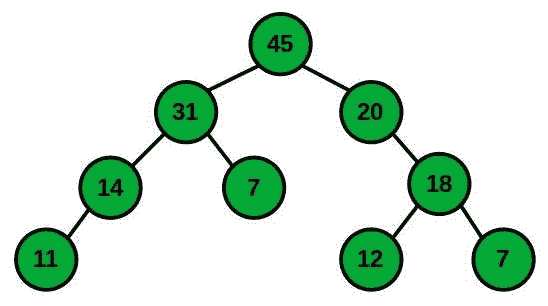
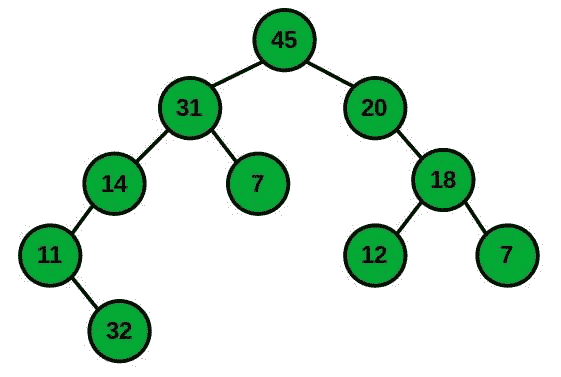
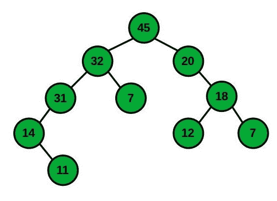
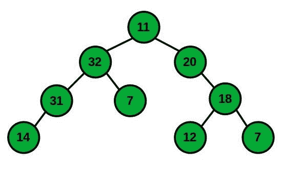
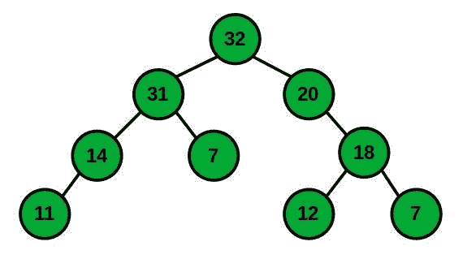
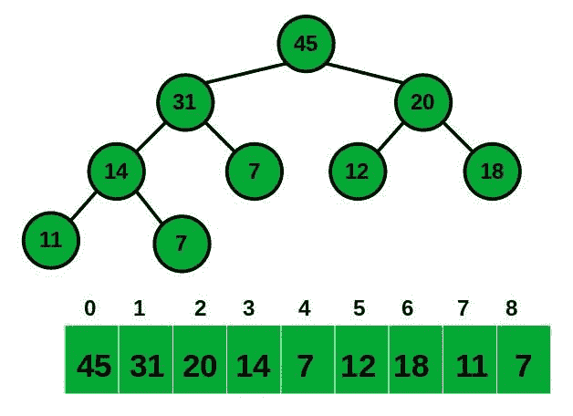

# 使用二进制堆的优先级队列

> 原文:[https://www . geesforgeks . org/priority-queue-use-binary-heap/](https://www.geeksforgeeks.org/priority-queue-using-binary-heap/)

[优先级队列](https://www.geeksforgeeks.org/priority-queue-set-1-introduction/)是[队列](https://www.geeksforgeeks.org/queue-data-structure/)的扩展，具有以下属性:

1.  每个项目都有一个相关的优先级。
2.  优先级高的元素在优先级低的元素之前出队。
3.  如果两个元素具有相同的优先级，则根据它们在队列中的顺序提供服务。

一个[二进制堆](https://www.geeksforgeeks.org/binary-heap/)是一个二叉树，具有以下属性:

1.  是[完全树](https://www.geeksforgeeks.org/check-whether-binary-tree-complete-not-set-2-recursive-solution/)。二进制堆的这个属性使得它们适合存储在[数组](https://www.geeksforgeeks.org/introduction-to-arrays/)中。
2.  二进制堆要么是**最小堆**要么是**最大堆**。
3.  在**最小二进制堆**中，根的键必须是二进制堆中所有键中最小的。相同的属性必须递归地适用于[二叉树](https://www.geeksforgeeks.org/binary-tree-data-structure/)中的所有节点。
4.  类似地，在**最大二进制堆**中，根的键必须是二进制堆中所有键中最大的。对于二叉树中的所有节点，相同的属性必须递归为真。

### <u>对二进制堆的操作</u>

*   **插入(p):** 插入具有优先级的新元素 **p** 。
*   **extractMax():** 提取具有最大优先级的元素。
*   **移除(i):** 移除迭代器 I 指向的元素。
*   **getMax():** 返回优先级最高的元素。
*   **更改优先级(I，p):** 将 **i** 指向的元素的优先级更改为 **p** 。

### <u>二进制最大堆示例</u>

*   假设下面是遵循二进制最大堆所有属性的给定二进制堆。



*   <u>现在需要在上面的堆中插入一个值为</u> **<u>32</u>** <u>的节点:</u>要插入一个元素，将新元素附加到任何叶子上。**例如**一个优先级为 **32** 的节点可以添加到节点 **11** 的叶子中。但是这违反了堆属性。要维护堆属性，上移新节点 **32** 。



*   **<u>【上移操作】在正确的位置获取 32 的节点:</u>** 将放置不正确的节点与其父节点交换，直到满足堆属性。**例如:**由于节点 **11** 小于节点 **32** 所以，交换节点 **11** 和节点 **32** 。然后，交换节点 **14** 和节点 **32** 。最后，交换节点 **31** 和节点 **32** 。



*   **<u>ExtractMax:</u>** 最大值存储在树根处。但是树根不能直接去掉。首先，用任何一片叶子替换它，然后去掉。**例如:**要去掉**节点 45** ，先用节点 **11** 替换。但是这违反了堆属性，所以下移被替换的节点。为此，请使用降档操作。



*   **<u>【shift down】操作:</u>** 用一个更大的子节点交换错误放置的节点，直到满足堆属性。**例如:**节点 **11** 与节点 **32** 交换，然后与节点 **31** 交换，最后与节点 **14** 交换。



*   **<u>变更优先级:</u>** 让变更后的元素根据其优先级是降低还是升高而上下移动。**例如:**将节点的优先级 **11 更改为 35** ，由于此更改，节点必须上移节点以维护堆属性。
*   **<u>移除:</u>** 要移除元素，请将其优先级更改为大于当前最大值的值，然后将其上移，然后使用 extract max 提取它。使用 getMax 查找当前最大值。
*   **<u>GetMax:</u>** 最大值存储在树根处。要获取 max，只需返回树根部的值。

### <u>二进制堆的数组表示</u>

由于堆是以完整的二叉树的形式维护的，因此堆可以以数组的形式表示。为了保持树的完整和浅，当插入一个新元素时，把它插入到最后一级最左边的空位置，也就是我们数组的末尾。同样，在提取最大值时，将根替换为最后一级的最后一片叶子，即数组的最后一个元素。下面是同样的插图:



下面是使用二进制堆实现优先级队列的程序:

## C++

```
// C++ code to implement priority-queue
// using array implementation of
// binary heap

#include <bits/stdc++.h>
using namespace std;

int H[50];
int size = -1;

// Function to return the index of the
// parent node of a given node
int parent(int i)
{

    return (i - 1) / 2;
}

// Function to return the index of the
// left child of the given node
int leftChild(int i)
{

    return ((2 * i) + 1);
}

// Function to return the index of the
// right child of the given node
int rightChild(int i)
{

    return ((2 * i) + 2);
}

// Function to shift up the node in order
// to maintain the heap property
void shiftUp(int i)
{
    while (i > 0 && H[parent(i)] < H[i]) {

        // Swap parent and current node
        swap(H[parent(i)], H[i]);

        // Update i to parent of i
        i = parent(i);
    }
}

// Function to shift down the node in
// order to maintain the heap property
void shiftDown(int i)
{
    int maxIndex = i;

    // Left Child
    int l = leftChild(i);

    if (l <= size && H[l] > H[maxIndex]) {
        maxIndex = l;
    }

    // Right Child
    int r = rightChild(i);

    if (r <= size && H[r] > H[maxIndex]) {
        maxIndex = r;
    }

    // If i not same as maxIndex
    if (i != maxIndex) {
        swap(H[i], H[maxIndex]);
        shiftDown(maxIndex);
    }
}

// Function to insert a new element
// in the Binary Heap
void insert(int p)
{
    size = size + 1;
    H[size] = p;

    // Shift Up to maintain heap property
    shiftUp(size);
}

// Function to extract the element with
// maximum priority
int extractMax()
{
    int result = H[0];

    // Replace the value at the root
    // with the last leaf
    H[0] = H[size];
    size = size - 1;

    // Shift down the replaced element
    // to maintain the heap property
    shiftDown(0);
    return result;
}

// Function to change the priority
// of an element
void changePriority(int i, int p)
{
    int oldp = H[i];
    H[i] = p;

    if (p > oldp) {
        shiftUp(i);
    }
    else {
        shiftDown(i);
    }
}

// Function to get value of the current
// maximum element
int getMax()
{

    return H[0];
}

// Function to remove the element
// located at given index
void remove(int i)
{
    H[i] = getMax() + 1;

    // Shift the node to the root
    // of the heap
    shiftUp(i);

    // Extract the node
    extractMax();
}

// Driver Code
int main()
{

    /*         45
            /      \
           31      14
          /  \    /  \
         13  20  7   11
        /  \
       12   7
    Create a priority queue shown in
    example in a binary max heap form.
    Queue will be represented in the
    form of array as:
    45 31 14 13 20 7 11 12 7 */

    // Insert the element to the
    // priority queue
    insert(45);
    insert(20);
    insert(14);
    insert(12);
    insert(31);
    insert(7);
    insert(11);
    insert(13);
    insert(7);

    int i = 0;

    // Priority queue before extracting max
    cout << "Priority Queue : ";
    while (i <= size) {
        cout << H[i] << " ";
        i++;
    }

    cout << "\n";

    // Node with maximum priority
    cout << "Node with maximum priority : "
         << extractMax() << "\n";

    // Priority queue after extracting max
    cout << "Priority queue after "
         << "extracting maximum : ";
    int j = 0;
    while (j <= size) {
        cout << H[j] << " ";
        j++;
    }

    cout << "\n";

    // Change the priority of element
    // present at index 2 to 49
    changePriority(2, 49);
    cout << "Priority queue after "
         << "priority change : ";
    int k = 0;
    while (k <= size) {
        cout << H[k] << " ";
        k++;
    }

    cout << "\n";

    // Remove element at index 3
    remove(3);
    cout << "Priority queue after "
         << "removing the element : ";
    int l = 0;
    while (l <= size) {
        cout << H[l] << " ";
        l++;
    }
    return 0;
}
```

## Java 语言(一种计算机语言，尤用于创建网站)

```
// Java code to implement
// priority-queue using
// array implementation of
// binary heap
import java.util.*;
class GFG{

static int []H = new int[50];
static int size = -1;

// Function to return the index of the
// parent node of a given node
static int parent(int i)
{
  return (i - 1) / 2;
}

// Function to return the index of the
// left child of the given node
static int leftChild(int i)
{
  return ((2 * i) + 1);
}

// Function to return the index of the
// right child of the given node
static int rightChild(int i)
{
  return ((2 * i) + 2);
}

// Function to shift up the
// node in order to maintain
// the heap property
static void shiftUp(int i)
{
  while (i > 0 &&
         H[parent(i)] < H[i])
  {
    // Swap parent and current node
    swap(parent(i), i);

    // Update i to parent of i
    i = parent(i);
  }
}

// Function to shift down the node in
// order to maintain the heap property
static void shiftDown(int i)
{
  int maxIndex = i;

  // Left Child
  int l = leftChild(i);

  if (l <= size &&
      H[l] > H[maxIndex])
  {
    maxIndex = l;
  }

  // Right Child
  int r = rightChild(i);

  if (r <= size &&
      H[r] > H[maxIndex])
  {
    maxIndex = r;
  }

  // If i not same as maxIndex
  if (i != maxIndex)
  {
    swap(i, maxIndex);
    shiftDown(maxIndex);
  }
}

// Function to insert a
// new element in
// the Binary Heap
static void insert(int p)
{
  size = size + 1;
  H[size] = p;

  // Shift Up to maintain
  // heap property
  shiftUp(size);
}

// Function to extract
// the element with
// maximum priority
static int extractMax()
{
  int result = H[0];

  // Replace the value
  // at the root with
  // the last leaf
  H[0] = H[size];
  size = size - 1;

  // Shift down the replaced
  // element to maintain the
  // heap property
  shiftDown(0);
  return result;
}

// Function to change the priority
// of an element
static void changePriority(int i,
                           int p)
{
  int oldp = H[i];
  H[i] = p;

  if (p > oldp)
  {
    shiftUp(i);
  }
  else
  {
    shiftDown(i);
  }
}

// Function to get value of
// the current maximum element
static int getMax()
{
  return H[0];
}

// Function to remove the element
// located at given index
static void remove(int i)
{
  H[i] = getMax() + 1;

  // Shift the node to the root
  // of the heap
  shiftUp(i);

  // Extract the node
  extractMax();
}

static void swap(int i, int j)
{
  int temp= H[i];
  H[i] = H[j];
  H[j] = temp;
}

// Driver Code
public static void main(String[] args)
{

  /*           45
            /        \
           31      14
          /  \    /  \
         13  20  7   11
        /  \
       12   7
    Create a priority queue shown in
    example in a binary max heap form.
    Queue will be represented in the
    form of array as:
    45 31 14 13 20 7 11 12 7 */

  // Insert the element to the
  // priority queue
  insert(45);
  insert(20);
  insert(14);
  insert(12);
  insert(31);
  insert(7);
  insert(11);
  insert(13);
  insert(7);

  int i = 0;

  // Priority queue before extracting max
  System.out.print("Priority Queue : ");
  while (i <= size)
  {
    System.out.print(H[i] + " ");
    i++;
  }

  System.out.print("\n");

  // Node with maximum priority
  System.out.print("Node with maximum priority : " +
                    extractMax() + "\n");

  // Priority queue after extracting max
  System.out.print("Priority queue after " +
                   "extracting maximum : ");
  int j = 0;
  while (j <= size)
  {
    System.out.print(H[j] + " ");
    j++;
  }

  System.out.print("\n");

  // Change the priority of element
  // present at index 2 to 49
  changePriority(2, 49);
  System.out.print("Priority queue after " +
                   "priority change : ");
  int k = 0;
  while (k <= size)
  {
    System.out.print(H[k] + " ");
    k++;
  }

  System.out.print("\n");

  // Remove element at index 3
  remove(3);
  System.out.print("Priority queue after " +
                   "removing the element : ");
  int l = 0;
  while (l <= size)
  {
    System.out.print(H[l] + " ");
    l++;
  }
}
}

// This code is contributed by 29AjayKumar
```

## 蟒蛇 3

```
# Python3 code to implement priority-queue
# using array implementation of
# binary heap

H = [0]*50
size = -1

# Function to return the index of the
# parent node of a given node
def parent(i) :

    return (i - 1) // 2

# Function to return the index of the
# left child of the given node
def leftChild(i) :

    return ((2 * i) + 1)

# Function to return the index of the
# right child of the given node
def rightChild(i) :

    return ((2 * i) + 2)

# Function to shift up the 
# node in order to maintain 
# the heap property
def shiftUp(i) :

    while (i > 0 and H[parent(i)] < H[i]) :

        # Swap parent and current node
        swap(parent(i), i)

        # Update i to parent of i
        i = parent(i)

# Function to shift down the node in
# order to maintain the heap property
def shiftDown(i) :

    maxIndex = i

    # Left Child
    l = leftChild(i)

    if (l <= size and H[l] > H[maxIndex]) :

        maxIndex = l

    # Right Child
    r = rightChild(i)

    if (r <= size and H[r] > H[maxIndex]) :

        maxIndex = r

    # If i not same as maxIndex
    if (i != maxIndex) :

        swap(i, maxIndex)
        shiftDown(maxIndex)

# Function to insert a 
# new element in 
# the Binary Heap
def insert(p) :

    global size
    size = size + 1
    H[size] = p

    # Shift Up to maintain 
    # heap property
    shiftUp(size)

# Function to extract 
# the element with
# maximum priority
def extractMax() :

    global size
    result = H[0]

    # Replace the value 
    # at the root with 
    # the last leaf
    H[0] = H[size]
    size = size - 1

    # Shift down the replaced 
    # element to maintain the 
    # heap property
    shiftDown(0)
    return result

# Function to change the priority
# of an element
def changePriority(i,p) :

    oldp = H[i]
    H[i] = p

    if (p > oldp) :

        shiftUp(i)

    else :

        shiftDown(i)

# Function to get value of 
# the current maximum element
def getMax() :

    return H[0]

# Function to remove the element
# located at given index
def Remove(i) :

    H[i] = getMax() + 1

    # Shift the node to the root
    # of the heap
    shiftUp(i)

    # Extract the node
    extractMax()

def swap(i, j) :

    temp = H[i]
    H[i] = H[j]
    H[j] = temp

# Insert the element to the
# priority queue
insert(45)
insert(20)
insert(14)
insert(12)
insert(31)
insert(7)
insert(11)
insert(13)
insert(7)

i = 0

# Priority queue before extracting max
print("Priority Queue : ", end = "")
while (i <= size) :

    print(H[i], end = " ")
    i += 1

print()

# Node with maximum priority
print("Node with maximum priority :" ,  extractMax())

# Priority queue after extracting max
print("Priority queue after extracting maximum : ", end = "")
j = 0
while (j <= size) :

    print(H[j], end = " ")
    j += 1

print()

# Change the priority of element
# present at index 2 to 49
changePriority(2, 49)
print("Priority queue after priority change : ", end = "")
k = 0
while (k <= size) :

    print(H[k], end = " ")
    k += 1

print()

# Remove element at index 3
Remove(3)
print("Priority queue after removing the element : ", end = "")
l = 0
while (l <= size) :

    print(H[l], end = " ")
    l += 1

    # This code is contributed by divyeshrabadiya07.
```

## C#

```
// C# code to implement priority-queue
// using array implementation of
// binary heap
using System;

class GFG{

static int []H = new int[50];
static int size = -1;

// Function to return the index of the
// parent node of a given node
static int parent(int i)
{
    return (i - 1) / 2;
}

// Function to return the index of the
// left child of the given node
static int leftChild(int i)
{
    return ((2 * i) + 1);
}

// Function to return the index of the
// right child of the given node
static int rightChild(int i)
{
    return ((2 * i) + 2);
}

// Function to shift up the
// node in order to maintain
// the heap property
static void shiftUp(int i)
{
    while (i > 0 &&
           H[parent(i)] < H[i])
    {

        // Swap parent and current node
        swap(parent(i), i);

        // Update i to parent of i
        i = parent(i);
    }
}

// Function to shift down the node in
// order to maintain the heap property
static void shiftDown(int i)
{
    int maxIndex = i;

    // Left Child
    int l = leftChild(i);

    if (l <= size &&
        H[l] > H[maxIndex])
    {
        maxIndex = l;
    }

    // Right Child
    int r = rightChild(i);

    if (r <= size &&
        H[r] > H[maxIndex])
    {
        maxIndex = r;
    }

    // If i not same as maxIndex
    if (i != maxIndex)
    {
        swap(i, maxIndex);
        shiftDown(maxIndex);
    }
}

// Function to insert a
// new element in
// the Binary Heap
static void insert(int p)
{
    size = size + 1;
    H[size] = p;

    // Shift Up to maintain
    // heap property
    shiftUp(size);
}

// Function to extract
// the element with
// maximum priority
static int extractMax()
{
    int result = H[0];

    // Replace the value
    // at the root with
    // the last leaf
    H[0] = H[size];
    size = size - 1;

    // Shift down the replaced
    // element to maintain the
    // heap property
    shiftDown(0);
    return result;
}

// Function to change the priority
// of an element
static void changePriority(int i,
                           int p)
{
    int oldp = H[i];
    H[i] = p;

    if (p > oldp)
    {
        shiftUp(i);
    }
    else
    {
        shiftDown(i);
    }
}

// Function to get value of
// the current maximum element
static int getMax()
{
    return H[0];
}

// Function to remove the element
// located at given index
static void Remove(int i)
{
    H[i] = getMax() + 1;

    // Shift the node to the root
    // of the heap
    shiftUp(i);

    // Extract the node
    extractMax();
}

static void swap(int i, int j)
{
    int temp = H[i];
    H[i] = H[j];
    H[j] = temp;
}

// Driver Code
public static void Main(String[] args)
{

/*              45
            /     \
           31      14
          / \     / \
        13  20   7   11
       / \
      12  7
    Create a priority queue shown in
    example in a binary max heap form.
    Queue will be represented in the
    form of array as:
    45 31 14 13 20 7 11 12 7 */

    // Insert the element to the
    // priority queue
    insert(45);
    insert(20);
    insert(14);
    insert(12);
    insert(31);
    insert(7);
    insert(11);
    insert(13);
    insert(7);

    int i = 0;

    // Priority queue before extracting max
    Console.Write("Priority Queue : ");
    while (i <= size)
    {
        Console.Write(H[i] + " ");
        i++;
    }

    Console.Write("\n");

    // Node with maximum priority
    Console.Write("Node with maximum priority : " +
                   extractMax() + "\n");

    // Priority queue after extracting max
    Console.Write("Priority queue after " +
                  "extracting maximum : ");
    int j = 0;
    while (j <= size)
    {
        Console.Write(H[j] + " ");
        j++;
    }

    Console.Write("\n");

    // Change the priority of element
    // present at index 2 to 49
    changePriority(2, 49);
    Console.Write("Priority queue after " +
                  "priority change : ");
    int k = 0;
    while (k <= size)
    {
        Console.Write(H[k] + " ");
        k++;
    }

    Console.Write("\n");

    // Remove element at index 3
    Remove(3);
    Console.Write("Priority queue after " +
                  "removing the element : ");
    int l = 0;
    while (l <= size)
    {
        Console.Write(H[l] + " ");
        l++;
    }
}
}

// This code is contributed by Amit Katiyar
```

## java 描述语言

```
<script>

// Javascript code to implement priority-queue
// using array implementation of
// binary heap

var H = Array(50).fill(0);
var size = -1;

// Function to return the index of the
// parent node of a given node
function parent(i)
{

    return parseInt((i - 1) / 2);
}

// Function to return the index of the
// left child of the given node
function leftChild(i)
{

    return parseInt((2 * i) + 1);
}

// Function to return the index of the
// right child of the given node
function rightChild(i)
{

    return parseInt((2 * i) + 2);
}

// Function to shift up the node in order
// to maintain the heap property
function shiftUp( i)
{
    while (i > 0 && H[parent(i)] < H[i]) {

        // Swap parent and current node
        swap(parent(i), i);

        // Update i to parent of i
        i = parent(i);
    }
}

function swap(i, j)
{
    var temp = H[i];
    H[i] = H[j];
    H[j] = temp;
}

// Function to shift down the node in
// order to maintain the heap property
function shiftDown( i)
{
    var maxIndex = i;

    // Left Child
    var l = leftChild(i);

    if (l <= size && H[l] > H[maxIndex]) {
        maxIndex = l;
    }

    // Right Child
    var r = rightChild(i);

    if (r <= size && H[r] > H[maxIndex]) {
        maxIndex = r;
    }

    // If i not same as maxIndex
    if (i != maxIndex) {
        swap(i, maxIndex);
        shiftDown(maxIndex);
    }
}

// Function to insert a new element
// in the Binary Heap
function insert( p)
{
    size = size + 1;
    H[size] = p;

    // Shift Up to maintain heap property
    shiftUp(size);
}

// Function to extract the element with
// maximum priority
function extractMax()
{
    var result = H[0];

    // Replace the value at the root
    // with the last leaf
    H[0] = H[size];
    size = size - 1;

    // Shift down the replaced element
    // to maintain the heap property
    shiftDown(0);
    return result;
}

// Function to change the priority
// of an element
function changePriority(i, p)
{
    var oldp = H[i];
    H[i] = p;

    if (p > oldp) {
        shiftUp(i);
    }
    else {
        shiftDown(i);
    }
}

// Function to get value of the current
// maximum element
function getMax()
{

    return H[0];
}

// Function to remove the element
// located at given index
function remove(i)
{
    H[i] = getMax() + 1;

    // Shift the node to the root
    // of the heap
    shiftUp(i);

    // Extract the node
    extractMax();
}

// Driver Code
/*         45
        /      \
       31      14
      /  \    /  \
     13  20  7   11
    /  \
   12   7
Create a priority queue shown in
example in a binary max heap form.
Queue will be represented in the
form of array as:
45 31 14 13 20 7 11 12 7 */
// Insert the element to the
// priority queue
insert(45);
insert(20);
insert(14);
insert(12);
insert(31);
insert(7);
insert(11);
insert(13);
insert(7);
var i = 0;
// Priority queue before extracting max
document.write( "Priority Queue : ");
while (i <= size) {
    document.write( H[i] + " ");
    i++;
}
document.write( "<br>");
// Node with maximum priority
document.write( "Node with maximum priority : "
     + extractMax() + "<br>");
// Priority queue after extracting max
document.write( "Priority queue after "
     + "extracting maximum : ");
var j = 0;
while (j <= size) {
    document.write( H[j] + " ");
    j++;
}
document.write( "<br>");

// Change the priority of element
// present at index 2 to 49
changePriority(2, 49);
document.write( "Priority queue after "
     + "priority change : ");
var k = 0;
while (k <= size) {
    document.write( H[k] + " ");
    k++;
}
document.write( "<br>");

// Remove element at index 3
remove(3);
document.write( "Priority queue after "
     + "removing the element : ");
var l = 0;
while (l <= size) {
    document.write( H[l] + " ");
    l++;
}

// This code is contributed by noob2000.
</script>
```

**Output:** 

```
Priority Queue : 45 31 14 13 20 7 11 12 7 
Node with maximum priority : 45 
Priority queue after extracting maximum : 31 20 14 13 7 7 11 12 
Priority queue after priority change : 49 20 31 13 7 7 11 12 
Priority queue after removing the element : 49 20 31 12 7 7 11
```

**时间复杂度:**除了时间复杂度为 O(1)的 GetMax()外，所有操作的时间复杂度均为 **O(log N)** 。
***辅助空间:** O(N)*