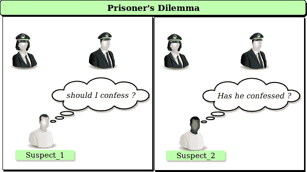

# 博弈论中的囚徒困境

> 原文:[https://www . geesforgeks . org/囚徒困境-博弈论/](https://www.geeksforgeeks.org/prisoners-dilemma-game-theory/)

一个犯罪团伙的两名成员被捕入狱。每个囚犯都被单独监禁，无法与他人交流。检察官缺乏足够的证据以主要指控对两人定罪。他们希望以较轻的罪名判处两人一年监禁。同时，检察官向每个囚犯提供一个交易。每个囚犯都有机会:通过证明对方犯了罪来背叛对方，或者通过保持沉默来与对方合作。报价为:

*   如果甲和乙都背叛了对方，他们每个人都要服刑 2 年
*   如果甲背叛乙，但乙保持沉默，甲将被释放，乙将被判入狱 3 年(反之亦然)
*   如果甲和乙都保持沉默，他们将只服刑 1 年(罪名较轻)

让我们分析一下困境的本质，假设两人都了解游戏的本质，并且尽管是同一个帮派的成员，但他们对彼此没有忠诚，也没有机会在游戏之外获得报应或奖励。

|  | 囚犯乙保持沉默 | 囚犯乙背叛 |
| 囚犯甲保持沉默 | 每人服务 1 年 | 囚犯甲:3 年
囚犯乙:获得自由 |
| 囚犯甲背叛了 | 囚犯甲:获得自由
囚犯乙:3 年 | 每人服刑 2 年 |

***请试着想一想解决办法，自己分析每个案例。***
通过分析表格，我们可以看出:
**你选择背叛对方总是受到的惩罚比较少。然而，作为一个团队，你们两个合作会更好(保持沉默)。**
把上面的说法想一想。
如果分析这个有问题那么可以看这个视频:[可汗学院的讲解](https://www.youtube.com/watch?v=UkXI-zPcDIM)

这是困局双方犯人的脸。一个人应该合作还是背叛？
即使最好的解决方案是两个囚犯互相合作，但由于彼此的不确定性，两个人都背叛了对方，得到了一个不太理想的解决方案。
这可以在现实生活中观察到，例如:

*   一对在做一个项目。如果你的竞争对手做了所有的工作，你会做得最好，因为你得到了相同的分数。但是如果你们两个都不做这项工作，你们两个都会失败。
*   广告。如果两家公司都在广告上花钱，它们的市场份额不会因为两者都不花钱而改变。但是，如果一家公司的支出超过另一家，他们将获得利益。

[囚徒困境](https://en.wikipedia.org/wiki/Prisoner%27s_dilemma)表明，两个理性的人可能不会合作，即使这样做最符合他们的利益。继续在这个美丽的世界里四处看看。谁知道有一天你会发现自己陷入囚徒困境！

本文由**阿迪蒂亚·尼哈尔·库马尔·辛格**供稿。如果你喜欢 GeeksforGeeks 并想投稿，你也可以使用[contribute.geeksforgeeks.org](http://www.contribute.geeksforgeeks.org)写一篇文章或者把你的文章邮寄到 contribute@geeksforgeeks.org。看到你的文章出现在极客博客主页上，帮助其他极客。

如果你发现任何不正确的地方，或者你想分享更多关于上面讨论的话题的信息，请写评论。