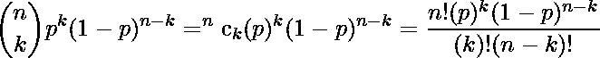
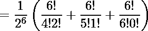

# 在 N 次投掷硬币中获得至少 K 个头像的概率

> 原文:[https://www . geesforgeks . org/probability-get-less-k-heads-n-tosses-coins/](https://www.geeksforgeeks.org/probability-getting-least-k-heads-n-tosses-coins/)

给定 N 个硬币，任务是在同时投掷所有 N 个硬币后，找到获得至少 K 个头像的概率。
**例:**

```
Suppose we have 3 unbiased coins and we have to
find the probability of getting at least 2 heads,
so there are 23 = 8 ways to toss these
coins, i.e.,
HHH, HHT, HTH, HTT, THH, THT, TTH, TTT 

Out of which there are 4 set which contain at
least 2 Heads i.e.,
HHH, HHT, HH, THH

So the probability is 4/8 or 0.5
```

**n 次试验中恰好 k 次成功的概率与任意一次试验中成功的概率 p 由下式给出:**

**所以概率(得到至少 4 个头)=**


**方法 1(Naive)**
Naive 方法是将阶乘的值存储在 dp[]数组中，并在需要时直接调用。但是这种方法的问题是，我们只能把它存储到一定的值，之后就会导致溢出。
以下是上述方法的实施

## C++

```
// Naive approach in C++ to find probability of
// at least k heads
#include<bits/stdc++.h>
using namespace std;
#define MAX 21

double fact[MAX];

// Returns probability of getting at least k
// heads in n tosses.
double probability(int k, int n)
{
    double ans = 0;
    for (int i = k; i <= n; ++i)

        // Probability of getting exactly i
        // heads out of n heads
        ans += fact[n] / (fact[i] * fact[n - i]);

    // Note: 1 << n = pow(2, n)
    ans = ans / (1LL << n);
    return ans;
}

void precompute()
{
    // Preprocess all factorial only upto 19,
    // as after that it will overflow
    fact[0] = fact[1] = 1;

    for (int i = 2; i < 20; ++i)
        fact[i] = fact[i - 1] * i;
}

// Driver code
int main()
{
    precompute();

    // Probability of getting 2 head out of 3 coins
    cout << probability(2, 3) << "\n";

    // Probability of getting 3 head out of 6 coins
    cout << probability(3, 6) <<"\n";

    // Probability of getting 12 head out of 18 coins
    cout << probability(12, 18);

    return 0;
}
```

## Java 语言(一种计算机语言，尤用于创建网站)

```
// JAVA Code for Probability of getting
// atleast K heads in N tosses of Coins
class GFG {

    public static double fact[];

    // Returns probability of getting at least k
    // heads in n tosses.
    public static double probability(int k, int n)
    {
        double ans = 0;
        for (int i = k; i <= n; ++ i)

            // Probability of getting exactly i
            // heads out of n heads
            ans += fact[n] / (fact[i] * fact[n-i]);

        // Note: 1 << n = pow(2, n)
        ans = ans / (1 << n);
        return ans;
    }

    public static void precompute()
    {
        // Preprocess all factorial only upto 19,
        // as after that it will overflow
        fact[0] = fact[1] = 1;

        for (int i = 2; i < 20; ++i)
            fact[i] = fact[i - 1] * i;
    }

    // Driver code
    public static void main(String[] args)
    {
        fact = new double[100];
        precompute();

        // Probability of getting 2 head out
        // of 3 coins
        System.out.println(probability(2, 3));

        // Probability of getting 3 head out
        // of 6 coins
        System.out.println(probability(3, 6));

        // Probability of getting 12 head out
        // of 18 coins
        System.out.println(probability(12, 18));

    }
 }
// This code is contributed by Arnav Kr. Mandal
```

## 蟒蛇 3

```
# Naive approach in Python3
# to find probability of
# at least k heads

MAX=21

fact=[0]*MAX

# Returns probability of
# getting at least k
# heads in n tosses.
def probability(k, n):
    ans = 0
    for i in range(k,n+1):

        # Probability of getting exactly i
        # heads out of n heads
        ans += fact[n] / (fact[i] * fact[n - i])

    # Note: 1 << n = pow(2, n)
    ans = ans / (1 << n)
    return ans

def precompute():

    # Preprocess all factorial
    # only upto 19,
    # as after that it
    # will overflow
    fact[0] = 1
    fact[1] = 1

    for i in range(2,20):
        fact[i] = fact[i - 1] * i

# Driver code
if __name__=='__main__':
    precompute()

    # Probability of getting 2
    # head out of 3 coins
    print(probability(2, 3))

    # Probability of getting
    # 3 head out of 6 coins
    print(probability(3, 6))

    # Probability of getting
    # 12 head out of 18 coins
    print(probability(12, 18))

# This code is contributed by
# mits
```

## C#

```
// C# Code for Probability of getting
// atleast K heads in N tosses of Coins
using System;

class GFG
{

    public static double []fact;

    // Returns probability of getting at least k
    // heads in n tosses.
    public static double probability(int k, int n)
    {
        double ans = 0;
        for (int i = k; i <= n; ++ i)

            // Probability of getting exactly i
            // heads out of n heads
            ans += fact[n] / (fact[i] * fact[n - i]);

        // Note: 1 << n = pow(2, n)
        ans = ans / (1 << n);
        return ans;
    }

    public static void precompute()
    {
        // Preprocess all factorial only upto 19,
        // as after that it will overflow
        fact[0] = fact[1] = 1;

        for (int i = 2; i < 20; ++i)
            fact[i] = fact[i - 1] * i;
    }

    // Driver code
    public static void Main()
    {
        fact = new double[100];
        precompute();

        // Probability of getting 2 head out
        // of 3 coins
        Console.WriteLine(probability(2, 3));

        // Probability of getting 3 head out
        // of 6 coins
        Console.WriteLine(probability(3, 6));

        // Probability of getting 12 head out
        // of 18 coins
        Console.Write(probability(12, 18));

    }
}
// This code is contributed by nitin mittal.
```

## 服务器端编程语言（Professional Hypertext Preprocessor 的缩写）

```
<?php
// Naive approach in PHP to find
// probability of at least k heads
$MAX = 21;

$fact = array_fill(0, $MAX, 0);

// Returns probability of getting
// at least k heads in n tosses.
function probability($k, $n)
{
    global $fact;
    $ans = 0;
    for ($i = $k; $i <= $n; ++$i)

        // Probability of getting exactly
        // i heads out of n heads
        $ans += $fact[$n] / ($fact[$i] *
                             $fact[$n - $i]);

    // Note: 1 << n = pow(2, n)
    $ans = $ans / (1 << $n);
    return $ans;
}

function precompute()
{
    global $fact;

    // Preprocess all factorial only
    // upto 19, as after that it
    // will overflow
    $fact[0] = $fact[1] = 1;

    for ($i = 2; $i < 20; ++$i)
        $fact[$i] = $fact[$i - 1] * $i;
}

// Driver code
precompute();

// Probability of getting 2
// head out of 3 coins
echo number_format(probability(2, 3), 6) . "\n";

// Probability of getting 3
// head out of 6 coins
echo number_format(probability(3, 6), 6) . "\n";

// Probability of getting 12
// head out of 18 coins
echo number_format(probability(12, 18), 6);

// This code is contributed by mits
?>
```

## java 描述语言

```
<script>

// javascript Code for Probability of getting
// atleast K heads in N tosses of Coins

let fact;

    // Returns probability of getting at least k
    // heads in n tosses.
    function probability( k, n) {
        let ans = 0, i;
        for ( i = k; i <= n; ++i)

            // Probability of getting exactly i
            // heads out of n heads
            ans += fact[n] / (fact[i] * fact[n - i]);

        // Note: 1 << n = pow(2, n)
        ans = ans / (1 << n);
        return ans;
    }

     function precompute() {
        // Preprocess all factorial only upto 19,
        // as after that it will overflow
        fact[0] = fact[1] = 1;

        for ( let i = 2; i < 20; ++i)
            fact[i] = fact[i - 1] * i;
    }

    // Driver code

        fact = Array(100).fill(0);
        precompute();

        // Probability of getting 2 head out
        // of 3 coins
        document.write(probability(2, 3)+"<br/>");

        // Probability of getting 3 head out
        // of 6 coins
        document.write(probability(3, 6)+"<br/>");

        // Probability of getting 12 head out
        // of 18 coins
        document.write(probability(12, 18).toFixed(6)+"<br/>");

// This code is contributed by shikhasingrajput

</script>
```

**输出:**

```
0.5
0.65625
0.118942
```

**时间复杂度:** O(n)其中 n < 20
**辅助空间:** O(n)
**方法二(动态规划和 Log)**
另一种方式是使用动态规划和对数。log()对于存储任意数字的阶乘而不用担心溢出确实很有用。让我们看看我们如何使用它:

```
At first let see how n! can be written.
n! = n * (n-1) * (n-2) * (n-3) * ... * 3 * 2 * 1

Now take log on base 2 both the sides as:
=> log(n!) = log(n) + log(n-1) + log(n-2) + ... + log(3) 
         + log(2) + log(1)

Now whenever we need to find the factorial of any number, we can use
this precomputed value. For example:
Suppose if we want to find the value of <sup>nC</sup><sub><sup>i which can be written as:</sup></sub>
=> nCi = n! / (i! * (n-i)! )

Taking log<sub>2() both sides as:</sub>
=> log2 (nCi) = log2 ( n! / (i! * (n-i)! ) )
=> log2 (nCi) = log2 ( n! ) - log2(i!) - log2( (n-i)! )  `

Putting dp[num] = log<sub>2 (num!), we get:</sub>
=> log2 (nCi) = dp[n] - dp[i] - dp[n-i] 

But as we see in above relation there is an extra factor of 2<sup>n which</sup>
<sup>tells the probability of getting i heads, so</sup>
=> log2 (2n) = n.

We will subtract this n from above result to get the final answer:
=> Pi (log2 (nCi)) = dp[n] - dp[i] - dp[n-i] - n

Now: Pi (nCi) = 2 dp[n] - dp[i] - dp[n-i] - n

Tada! Now the questions boils down the summation of P<sub>i for all i in</sub>
<sub>[k, n] will yield the answer which can be calculated easily without</sub>
<sub>overflow.</sub>
```

下面是说明这一点的代码:

## C++

```
// Dynamic and Logarithm approach find probability of
// at least k heads
#include<bits/stdc++.h>
using namespace std;
#define MAX 100001

// dp[i] is going to store Log ( i !) in base 2
double dp[MAX];

double probability(int k, int n)
{
    double ans = 0; // Initialize result

    // Iterate from k heads to n heads
    for (int i=k; i <= n; ++i)
    {
        double res = dp[n] - dp[i] - dp[n-i] - n;
        ans += pow(2.0, res);
    }

    return ans;
}

void precompute()
{
    // Preprocess all the logarithm value on base 2
    for (int i=2; i < MAX; ++i)
        dp[i] = log2(i) + dp[i-1];
}

// Driver code
int main()
{
    precompute();

    // Probability of getting 2 head out of 3 coins
    cout << probability(2, 3) << "\n";

    // Probability of getting 3 head out of 6 coins
    cout << probability(3, 6) << "\n";

    // Probability of getting 500 head out of 10000 coins
    cout << probability(500, 1000);

    return 0;
}
```

## Java 语言(一种计算机语言，尤用于创建网站)

```
// Dynamic and Logarithm approach find probability of
// at least k heads
import java.math.*;
class GFG {

static int MAX = 100001;

// dp[i] is going to store Log ( i !) in base 2
static double dp[] = new double[MAX];

static double probability(int k, int n)
{
    double ans = 0.0; // Initialize result

    // Iterate from k heads to n heads
    for (int i=k; i <= n; ++i)
    {
        double res = dp[n] - dp[i] - dp[n-i] - n;
        ans += Math.pow(2.0, res);
    }

    return ans;
}

static void precompute()
{
    // Preprocess all the logarithm value on base 2
    for (int i=2; i < MAX; ++i)
        dp[i] = (Math.log(i)/Math.log(2)) + dp[i-1];
}

// Driver code
public static void main(String args[])
{
    precompute();

    // Probability of getting 2 head out of 3 coins
    System.out.println(probability(2, 3));

    // Probability of getting 3 head out of 6 coins
    System.out.println(probability(3, 6));

    // Probability of getting 500 head out of 10000 coins
    System.out.println(probability(500, 1000));
}

}
```

## 蟒蛇 3

```
# Dynamic and Logarithm approach find probability of
# at least k heads

from math import log2
MAX=100001

# dp[i] is going to store Log ( i !) in base 2
dp=[0]*MAX

def probability( k, n):

    ans = 0 # Initialize result

    # Iterate from k heads to n heads
    for i in range(k,n+1):

        res = dp[n] - dp[i] - dp[n-i] - n
        ans = ans + pow(2.0, res)

    return ans

def precompute():

    # Preprocess all the logarithm value on base 2
    for i in range(2,MAX):
        dp[i] = log2(i) + dp[i-1]

# Driver code
if __name__=='__main__':
    precompute()

    # Probability of getting 2 head out of 3 coins
    print(probability(2, 3))

    # Probability of getting 3 head out of 6 coins
    print(probability(3, 6))

    # Probability of getting 500 head out of 10000 coins
    print(probability(500, 1000))

#this code is contributed by ash264
```

## C#

```
// Dynamic and Logarithm approach find probability of
// at least k heads
using System;

class GFG
{

static int MAX = 100001;

// dp[i] is going to store Log ( i !) in base 2
static double[] dp = new double[MAX];

static double probability(int k, int n)
{
    double ans = 0.0; // Initialize result

    // Iterate from k heads to n heads
    for (int i = k; i <= n; ++i)
    {
        double res = dp[n] - dp[i] - dp[n-i] - n;
        ans += Math.Pow(2.0, res);
    }
    return ans;
}

static void precompute()
{
    // Preprocess all the logarithm value on base 2
    for (int i = 2; i < MAX; ++i)
        dp[i] = (Math.Log(i) / Math.Log(2)) + dp[i - 1];
}

// Driver code
public static void Main()
{
    precompute();

    // Probability of getting 2 head out of 3 coins
    Console.WriteLine(probability(2, 3));

    // Probability of getting 3 head out of 6 coins
    Console.WriteLine(probability(3, 6));

    // Probability of getting 500 head out of 10000 coins
    Console.WriteLine(Math.Round(probability(500, 1000),6));
}
}

// This code is contributed by mits
```

## 服务器端编程语言（Professional Hypertext Preprocessor 的缩写）

```
<?php
// Dynamic and Logarithm approach
// find probability of at least k heads
$MAX = 100001;

// dp[i] is going to store
// Log ( i !) in base 2
$dp = array_fill(0, $MAX, 0);

function probability($k, $n)
{
    global $MAX, $dp;
    $ans = 0; // Initialize result

    // Iterate from k heads to n heads
    for ($i = $k; $i <= $n; ++$i)
    {
        $res = $dp[$n] - $dp[$i] -
               $dp[$n - $i] - $n;
        $ans += pow(2.0, $res);
    }

    return $ans;
}

function precompute()
{
    global $MAX, $dp;

    // Preprocess all the logarithm
    // value on base 2
    for ($i = 2; $i < $MAX; ++$i)

        // Note : log2() function is not in php
        // Some OUTPUT very in their decimal point
        // Basically log(value,base) is work as
        // this logic : "log10(value)/log10(2)"
        // equals to log2(value)
        $dp[$i] = log($i, 2) + $dp[$i - 1];
}

// Driver code
precompute();

// Probability of getting 2
// head out of 3 coins
echo probability(2, 3)."\n";

// Probability of getting 3
// head out of 6 coins
echo probability(3, 6)."\n";

// Probability of getting 500
// head out of 10000 coins
echo probability(500, 1000);

// This code is contributed by mits
?>
```

## java 描述语言

```
<script>
// Dynamic and Logarithm approach find probability of
// at least k heads
    let MAX = 100001;

    // dp[i] is going to store Log ( i !) in base 2
    let dp = new Array(MAX).fill(0);

    function probability(k , n)
    {
        var ans = 0.0; // Initialize result

        // Iterate from k heads to n heads
        for (let i = k; i <= n; ++i)
        {
            var res = dp[n] - dp[i] - dp[n - i] - n;
            ans += Math.pow(2.0, res);
        }

        return ans;
    }

    function precompute()
    {

        // Preprocess all the logarithm value on base 2
        for (let i = 2; i < MAX; ++i)
            dp[i] = (Math.log(i) / Math.log(2)) + dp[i - 1];
    }

    // Driver code
    precompute();

    // Probability of getting 2 head out of 3 coins
    document.write(probability(2, 3).toFixed(2)+"<br/>");

    // Probability of getting 3 head out of 6 coins
    document.write(probability(3, 6).toFixed(5)+"<br/>");

    // Probability of getting 500 head out of 10000 coins
    document.write(probability(500, 1000).toFixed(6)+"<br/>");   

// This code is contributed by Amit Katiyar
</script>
```

**输出:**

```
0.5
0.65625
0.512613
```

**时间复杂度:** O(n)
**辅助空间:** O(n)
**这种方式对于 1 到 10 之间的大 n 值都是有利的 <sup>6</sup>**
本文由[舒巴姆班萨尔](https://www.facebook.com/banalshubham)供稿。如果你喜欢 GeeksforGeeks 并想投稿，你也可以使用[contribute.geeksforgeeks.org](http://www.contribute.geeksforgeeks.org)写一篇文章或者把你的文章邮寄到 contribute@geeksforgeeks.org。看到你的文章出现在极客博客主页上，帮助其他极客。
如果发现有不正确的地方，或者想分享更多关于上述话题的信息，请写评论。