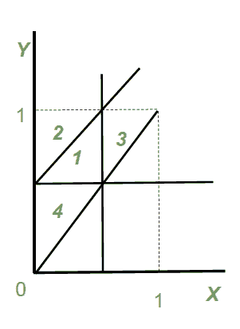
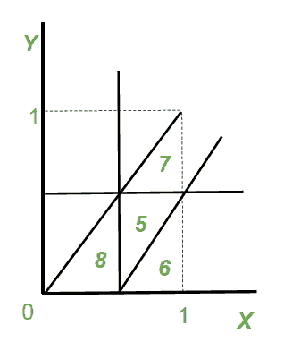

# 将绳子切成三段，使两边形成三角形的概率

> 原文:[https://www . geeksforgeeks . org/将绳子切成三段的概率-这样两边就形成了一个三角形/](https://www.geeksforgeeks.org/probability-of-cutting-a-rope-into-three-pieces-such-that-the-sides-form-a-triangle/)

给我一根绳子。我们必须找到把一根绳子切成 3 段的概率，这样它们就形成了一个三角形。

**回答:** 0.25

**说明:**
让绳子的长度为 1 个单位。我们在绳子上选择两个点 X 和 Y。

**注:**三角形的形成是基于**三角形不等式**即*三角形任意两条边的长度之和必须大于第三条边的长度*

选择绳子上的点 X 和 Y 有两种可能:
**情况 1:** X < Y

选择点 X 和 Y 后的片长:
X 单位，(Y-X)单位，(1-Y)单位
下图为分区绳。

满足三角不等式的 3 种可能组合

1.X+(Y-X)>(1-Y)
=>2Y>1
=>Y>(1/2)

2.X+(1-Y)>(Y-X)
=>2X+1>2Y
=>Y<X+(1/2)

3.(Y-X)+(1-Y)> X
=>2X<1
=>X<1/2

利用上述 3 个条件和 X <y>
组成一个图，图中区域 **1** 的面积为所需面积:1/2*1/2*1/2 = 1/8</y>

**病例 2:** X > Y

选择点 X 和 Y 后的片长:
Y 单位，(X-Y)单位，(1-X)单位
下图为分区绳。

满足三角不等式的 3 种可能组合

1.Y+(X-Y)>(1-X)
=>2X>1
=>X>(1/2)

2.Y+(1-X)>(X-Y)
=>2Y+1>2X
=>X<Y+(1/2)

3.(X-Y)+(1-X)> Y
=>2Y<1
=>Y<1/2

使用 3 个条件和 Y <x>
形成一个图图的 **5** 区域的面积是所需的面积:1/2*1/2*1/2 = 1/8</x>

在这两种情况下，我们得到相同的所需面积，因此所需面积将是:1/8。
所以绳子断成三段，两边形成三角形的概率
由下式给出:
所需面积/总面积= (1/8)/(1/2*1*1) = 1/4 = 0.25。