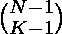
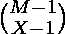

# 在 X 个袋子中分配 M 个物品使得第一个袋子包含 N 个物品的概率

> 原文:[https://www . geeksforgeeks . org/在 x 袋中分发 m 个物品的概率-这样第一袋包含 n 个物品/](https://www.geeksforgeeks.org/probability-of-distributing-m-items-among-x-bags-such-that-first-bag-contains-n-items/)

给定三个整数 **N** 、 **M** 、 **X** 。任务是找到在 X 个袋子中分配 M 个物品的概率，使得第一个袋子包含 N 个物品
**示例:**

> **输入:** M = 7，X =3，N = 3
> **输出:**0.2
> 3 袋装 7 件的方式数为。
> 2 袋装 4 件物品的方式数量为。因为第一个包里有 3 样东西。
> 概率为//
> **输入:** M = 9，X = 3，N = 4
> /**输出:** 0.142857

**进场:**
一般来说，K 袋放置 N 件物品的方式数量为。

*   将 M 个物品保存在 X 个袋子中的方法数量为。
*   将(M-N)个物品保存在(X-1)个袋子中的方法数量为。因为第一个包包含 N 个项目。
*   概率为 / 。

以下是上述方法的实现:

## C++

```
// CPP program to find probability of
// first bag to contain N items such
// that M items are distributed among X bags
#include <bits/stdc++.h>
using namespace std;

// Function to find factorial of a number
int factorial(int n)
{
    if (n <= 1)
        return 1;
    return n * factorial(n - 1);
}

// Function to find nCr
int nCr(int n, int r)
{
    return factorial(n) / (factorial(r) * factorial(n - r));
}

// Function to find probability of
// first bag to contain N items such
// that M items are distributed among X bags
float Probability(int M, int N, int X)
{
    return (float)(nCr(M - N - 1, X - 2) /
                    (nCr(M - 1, X - 1) * 1.0));
}

// Driver code
int main()
{
    int M = 9, X = 3, N = 4;

    // Function call
    cout << Probability(M, N, X);

    return 0;
}
```

## Java 语言(一种计算机语言，尤用于创建网站)

```
// Java program to find probability of
// first bag to contain N items such
// that M items are distributed among X bags

class GFG
{

    // Function to find factorial of a number
    public static int factorial(int n)
    {
        if (n <= 1)
            return 1;

        return n * factorial(n - 1);
    }

    // Function to find nCr
    public static int nCr(int n, int r)
    {
        return factorial(n) / (factorial(r) * factorial(n - r));
    }

    // Function to find probability of
    // first bag to contain N items such
    // that M items are distributed among X bags
    public static float Probability(int M, int N, int X)
    {
        return (float) (nCr(M - N - 1, X - 2) / (nCr(M - 1, X - 1) * 1.0));
    }

    // Driver code
    public static void main(String[] args)
    {
        int M = 9, X = 3, N = 4;

        // Function call
        System.out.println(Probability(M, N, X));
    }
}

// This code is contributed by
// sanjeev2552
```

## 蟒蛇 3

```
# Python3 program to find probability of
# first bag to contain N items such
# that M items are distributed among X bags

# Function to find factorial of a number
def factorial(n) :

    if (n <= 1) :
        return 1;

    return n * factorial(n - 1);

# Function to find nCr
def nCr(n, r) :

    return (factorial(n) / (factorial(r) *
                            factorial(n - r)));

# Function to find probability of
# first bag to contain N items such
# that M items are distributed among X bags
def Probability(M, N, X) :

    return float(nCr(M - N - 1, X - 2) /
                (nCr(M - 1, X - 1) * 1.0));

# Driver code
if __name__ == "__main__" :

    M = 9; X = 3; N = 4;

    # Function call
    print(Probability(M, N, X));

# This code is contributed by AnkitRai01
```

## C#

```
// C# program to find probability of
// first bag to contain N items such
// that M items are distributed among X bags
using System;

class GFG
{

    // Function to find factorial of a number
    static int factorial(int n)
    {
        if (n <= 1)
            return 1;

        return n * factorial(n - 1);
    }

    // Function to find nCr
    static int nCr(int n, int r)
    {
        return factorial(n) / (factorial(r) * factorial(n - r));
    }

    // Function to find probability of
    // first bag to contain N items such
    // that M items are distributed among X bags
    static float Probability(int M, int N, int X)
    {
        return (float) (nCr(M - N - 1, X - 2) / (nCr(M - 1, X - 1) * 1.0));
    }

    // Driver code
    static void Main()
    {
        int M = 9, X = 3, N = 4;

        // Function call
        Console.WriteLine(Probability(M, N, X));
    }
}

// This code is contributed by
// mohitkumar 29
```

## java 描述语言

```
<script>
// Java Script program to find probability of
// first bag to contain N items such
// that M items are distributed among X bags

    // Function to find factorial of a number
    function factorial( n)
    {
        if (n <= 1)
            return 1;

        return n * factorial(n - 1);
    }

    // Function to find nCr
    function nCr( n,  r)
    {
        return factorial(n) / (factorial(r) * factorial(n - r));
    }

    // Function to find probability of
    // first bag to contain N items such
    // that M items are distributed among X bags
    function Probability(M,N,X)
    {
        return parseFloat(nCr(M - N - 1, X - 2) / (nCr(M - 1, X - 1) * 1.0));
    }

    // Driver code
    let M = 9, X = 3, N = 4;

        // Function call
        document.write(Probability(M, N, X).toFixed(6));
// This code is contributed by Bobby
</script>
```

**Output:** 

```
0.142857
```