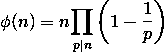

# 欧拉全能函数在[L，R]范围内被 M 整除的概率

> 原文:[https://www . geeksforgeeks . org/全能型概率函数-范围内-l-r-被 m 整除/](https://www.geeksforgeeks.org/probability-of-eulers-totient-function-in-a-range-l-r-to-be-divisible-by-m/)

给定三个整数 **L** 、 **R** 和 **M** ，任务是求【L，R】范围内一个数的[欧拉全能函数](https://www.geeksforgeeks.org/eulers-totient-function/)被 M 整除的概率

> **欧拉全能性函数**是{1，2，3，…，N}中相对于 N 为素数的数的计数，即 **GCD(最大公约数)**与 **N** 为 1 的数。

**示例:**

> **输入:** L = 1，R = 5，M = 2
> **输出:** 0.6
> **说明:**
> N = 1，2，3，4，5 的欧拉全能性函数分别为{1，1，2，2，4}。
> 可被 M(= 2)整除的欧拉全能函数的计数为 3。
> 因此，所需概率为 3/5 = 0.6
> 
> **输入:** L = 1，R = 7，M = 4
> **输出:** 0.142
> **解释:**
> N = 1，2，3，…7 的欧拉全能性函数分别为{1，1，2，2，4，2，6}。
> 可被 M(= 4)整除的欧拉全能性函数的计数为 1。
> 因此，所需概率为 1/7 = 0.142

**方法:**思路是预先计算[欧拉全能函数](https://www.geeksforgeeks.org/eulers-totient-function/)，在给定范围内迭代，计算可被 M 整除的数，计算概率。

> 对于[欧拉全能函数](https://www.geeksforgeeks.org/eulers-totient-function/)的计算，使用**欧拉乘积公式**:
> 
> [](https://media.geeksforgeeks.org/wp-content/uploads/20200718191122/EulersTotientfunction.png)
> 
> 其中**p<sub>I</sub>T3】是 **N** 的质因数。**

对于****(L<= N<= R)**的每个质因数 **i** ，执行以下步骤:**

*   **从**【1，N】**中减去 **i** 的所有倍数。**
*   **通过重复除以 **i** 来更新 **N** 。**
*   **如果减少的 **N** 大于 **1** ，则从结果中去除所有倍数的 **N** 。**

**质因数的计算采用厄拉多塞法的[筛。给定范围内的概率为**计数/(L–R+1)**。](https://www.geeksforgeeks.org/sieve-of-eratosthenes/)**

**下面是上述方法的实现:**

## **C++**

```
// C++ Program to implement
// the above approach
#include <bits/stdc++.h>
using namespace std;
#define size 1000001

// Seieve of Erotosthenes
// to compute all primes
void seiveOfEratosthenes(int* prime)
{
    prime[0] = 1, prime[1] = 0;

    for (int i = 2; i * i < 1000001; i++) {

        // If prime
        if (prime[i] == 0) {
            for (int j = i * i; j < 1000001;
                 j += i) {

                // Mark all its multiples
                // as non-prime
                prime[j] = 1;
            }
        }
    }
}

// Function to find the probability of
// Euler's Totient Function in a given range
float probabiltyEuler(int* prime, int L,
                      int R, int M)
{
    int* arr = new int[size]{ 0 };
    int* eulerTotient = new int[size]{ 0 };
    int count = 0;

    // Initializing two arrays
    // with values from L to R
    // for Euler's totient
    for (int i = L; i <= R; i++) {

        // Indexing from 0
        eulerTotient[i - L] = i;
        arr[i - L] = i;
    }

    for (int i = 2; i < 1000001; i++) {

        // If the current number is prime
        if (prime[i] == 0) {

            // Checking if i is prime factor
            // of numbers in range L to R
            for (int j = (L / i) * i; j <= R;
                 j += i) {

                if (j - L >= 0) {

                    // Update all the numbers
                    // which has prime factor i
                    eulerTotient[j - L]
                        = eulerTotient[j - L]
                          / i * (i - 1);

                    while (arr[j - L] % i == 0) {
                        arr[j - L] /= i;
                    }
                }
            }
        }
    }

    // If number in range has a
    // prime factor > sqrt(number)
    for (int i = L; i <= R; i++) {
        if (arr[i - L] > 1) {
            eulerTotient[i - L]
                = (eulerTotient[i - L] / arr[i - L])
                  * (arr[i - L] - 1);
        }
    }

    for (int i = L; i <= R; i++) {

        // Count those which are divisible by M
        if ((eulerTotient[i - L] % M) == 0) {
            count++;
        }
    }

    // Return the result
    return (1.0 * count / (R + 1 - L));
}

// Driver Code
int main()
{
    int* prime = new int[size]{ 0 };

    seiveOfEratosthenes(prime);

    int L = 1, R = 7, M = 3;

    cout << probabiltyEuler(prime, L, R, M);

    return 0;
}
```

## **Java 语言(一种计算机语言，尤用于创建网站)**

```
// Java Program to implement
// the above approach
import java.util.*;
class GFG{

static final int size = 1000001;

// Seieve of Erotosthenes
// to compute all primes
static void seiveOfEratosthenes(int []prime)
{
    prime[0] = 1;
    prime[1] = 0;

    for (int i = 2; i * i < 1000001; i++)
    {

        // If prime
        if (prime[i] == 0)
        {
            for (int j = i * i; j < 1000001; j += i)
            {

                // Mark all its multiples
                // as non-prime
                prime[j] = 1;
            }
        }
    }
}

// Function to find the probability of
// Euler's Totient Function in a given range
static float probabiltyEuler(int []prime, int L,
                             int R, int M)
{
    int[] arr = new int[size];
    int []eulerTotient = new int[size];
    int count = 0;

    // Initializing two arrays
    // with values from L to R
    // for Euler's totient
    for (int i = L; i <= R; i++)
    {

        // Indexing from 0
        eulerTotient[i - L] = i;
        arr[i - L] = i;
    }

    for (int i = 2; i < 1000001; i++)
    {

        // If the current number is prime
        if (prime[i] == 0)
        {

            // Checking if i is prime factor
            // of numbers in range L to R
            for (int j = (L / i) * i; j <= R; j += i)
            {
                if (j - L >= 0)
                {

                    // Update all the numbers
                    // which has prime factor i
                    eulerTotient[j - L] = eulerTotient[j - L] /
                                                    i * (i - 1);

                    while (arr[j - L] % i == 0)
                    {
                        arr[j - L] /= i;
                    }
                }
            }
        }
    }

    // If number in range has a
    // prime factor > Math.sqrt(number)
    for (int i = L; i <= R; i++)
    {
        if (arr[i - L] > 1)
        {
            eulerTotient[i - L] = (eulerTotient[i - L] / arr[i - L]) *
                                                          (arr[i - L] - 1);
        }
    }

    for (int i = L; i <= R; i++)
    {

        // Count those which are divisible by M
        if ((eulerTotient[i - L] % M) == 0)
        {
            count++;
        }
    }

    // Return the result
    return (float) (1.0 * count / (R + 1 - L));
}

// Driver Code
public static void main(String[] args)
{
    int []prime = new int[size];

    seiveOfEratosthenes(prime);

    int L = 1, R = 7, M = 3;

    System.out.print(probabiltyEuler(prime, L, R, M));
}
}

// This code is contributed by sapnasingh4991
```

## **蟒蛇 3**

```
# Python3 program to implement
# the above approach
size = 1000001

# Seieve of Erotosthenes
# to compute all primes
def seiveOfEratosthenes(prime):

    prime[0] = 1
    prime[1] = 0

    i = 2
    while(i * i < 1000001):

        # If prime
        if (prime[i] == 0):
            j = i * i

            while(j < 1000001):

                # Mark all its multiples
                # as non-prime
                prime[j] = 1
                j = j + i

        i += 1

# Function to find the probability of
# Euler's Totient Function in a given range
def probabiltyEuler(prime, L, R, M):

    arr = [0] * size
    eulerTotient = [0] * size
    count = 0

    # Initializing two arrays
    # with values from L to R
    # for Euler's totient
    for i in range(L, R + 1):

        # Indexing from 0
        eulerTotient[i - L] = i
        arr[i - L] = i

    for i in range(2, 1000001):

        # If the current number is prime
        if (prime[i] == 0):

            # Checking if i is prime factor
            # of numbers in range L to R
            for j in range((L // i) * i, R + 1, i):

                if (j - L >= 0):

                    # Update all the numbers
                    # which has prime factor i
                    eulerTotient[j - L] = (eulerTotient[j - L] //
                                                   i * (i - 1))

                    while (arr[j - L] % i == 0):
                        arr[j - L] =  arr[j - L] // i

    # If number in range has a
    # prime factor > Math.sqrt(number)
    for i in range(L, R + 1):
        if (arr[i - L] > 1):
            eulerTotient[i - L] = ((eulerTotient[i - L] //
                                             arr[i - L]) *
                                       (arr[i - L] - 1))

    for i in range(L, R + 1): 

        # Count those which are divisible by M
        if ((eulerTotient[i - L] % M) == 0):
            count += 1

    # Return the result
    return (float)(1.0 * count / (R + 1 - L))

# Driver code
prime = [0] * size

seiveOfEratosthenes(prime)

L, R, M = 1, 7, 3

print(probabiltyEuler(prime, L, R, M))

# This code is contributed by divyeshrabadiya07
```

## **C#**

```
// C# Program to implement
// the above approach
using System;
class GFG{

static readonly int size = 1000001;

// Seieve of Erotosthenes
// to compute all primes
static void seiveOfEratosthenes(int []prime)
{
    prime[0] = 1;
    prime[1] = 0;

    for (int i = 2; i * i < 1000001; i++)
    {

        // If prime
        if (prime[i] == 0)
        {
            for (int j = i * i; j < 1000001; j += i)
            {

                // Mark all its multiples
                // as non-prime
                prime[j] = 1;
            }
        }
    }
}

// Function to find the probability of
// Euler's Totient Function in a given range
static float probabiltyEuler(int []prime, int L,
                             int R, int M)
{
    int[] arr = new int[size];
    int []eulerTotient = new int[size];
    int count = 0;

    // Initializing two arrays
    // with values from L to R
    // for Euler's totient
    for (int i = L; i <= R; i++)
    {

        // Indexing from 0
        eulerTotient[i - L] = i;
        arr[i - L] = i;
    }

    for (int i = 2; i < 1000001; i++)
    {

        // If the current number is prime
        if (prime[i] == 0)
        {

            // Checking if i is prime factor
            // of numbers in range L to R
            for (int j = (L / i) * i; j <= R; j += i)
            {
                if (j - L >= 0)
                {

                    // Update all the numbers
                    // which has prime factor i
                    eulerTotient[j - L] = eulerTotient[j - L] /
                                                       i * (i - 1);

                    while (arr[j - L] % i == 0)
                    {
                        arr[j - L] /= i;
                    }
                }
            }
        }
    }

    // If number in range has a
    // prime factor > Math.Sqrt(number)
    for (int i = L; i <= R; i++)
    {
        if (arr[i - L] > 1)
        {
            eulerTotient[i - L] = (eulerTotient[i - L] / arr[i - L]) *
                                                        (arr[i - L] - 1);
        }
    }

    for (int i = L; i <= R; i++)
    {

        // Count those which are divisible by M
        if ((eulerTotient[i - L] % M) == 0)
        {
            count++;
        }
    }

    // Return the result
    return (float) (1.0 * count / (R + 1 - L));
}

// Driver Code
public static void Main(String[] args)
{
    int []prime = new int[size];

    seiveOfEratosthenes(prime);

    int L = 1, R = 7, M = 3;

    Console.Write(probabiltyEuler(prime, L, R, M));
}
}

// This code is contributed by sapnasingh4991
```

## **java 描述语言**

```
<script>

// JavaScript Program to implement
// the above approach

let size = 1000001;

let prime = new Array(size,0);
// Seieve of Erotosthenes
// to compute all primes
function seiveOfEratosthenes()
{
    prime[0] = 1;
    prime[1] = 0;

    for (let i = 2; i * i < 1000001; i++)
    {

        // If prime
        if (prime[i] == 0)
        {
            for (let j = i * i; j < 1000001; j += i)
            {

                // Mark all its multiples
                // as non-prime
                prime[j] = 1;
            }
        }
    }
}

// Function to find the probability of
// Euler's Totient Function in a given range
function probabiltyEuler(L,R, M)
{
    let arr = new Array(size,0);
    let eulerTotient = new Array(size,0);
    let count = 0;

    // Initializing two arrays
    // with values from L to R
    // for Euler's totient
    for (let i = L; i <= R; i++)
    {

        // Indexing from 0
        eulerTotient[i - L] = i;
        arr[i - L] = i;
    }

    for (let i = 2; i < 1000001; i++)
    {

        // If the current number is prime
        if (prime[i] == 0)
        {

            // Checking if i is prime factor
            // of numbers in range L to R
            for (let j = (L / i) * i; j <= R; j += i)
            {
                if (j - L >= 0)
                {

                    // Update all the numbers
                    // which has prime factor i
                    eulerTotient[j - L] =
                    eulerTotient[j - L] / i * (i - 1);

                    while (arr[j - L] % i == 0)
                    {
                        arr[j - L] /= i;
                    }
                }
            }
        }
    }

    // If number in range has a
    // prime factor > Math.Sqrt(number)
    for (let i = L; i <= R; i++)
    {
        if (arr[i - L] > 1)
        {
            eulerTotient[i - L] =
            (eulerTotient[i - L] / arr[i - L]) *
                              (arr[i - L] - 1);
        }
    }

    for (let i = L; i <= R; i++)
    {

        // Count those which are divisible by M
        if ((eulerTotient[i - L] % M) == 0)
        {
            count++;
        }
    }

   count/=2;

    // Return the result
    return    1.0 * count / (R + 1 - L);
}

// Driver Code

seiveOfEratosthenes();

let L = 1;
let R = 7;
let M = 3;

document.write(probabiltyEuler(L, R, M).toFixed(7));

</script>
```

****Output:** 

```
0.142857
```** 

*****时间复杂度:** O(Nlog(N))*
***辅助空间:** O(大小)，其中大小表示计算筛的个数。***