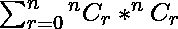
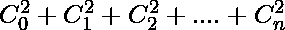
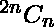
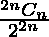

# 两个子集包含相同数量元素的概率

> 原文:[https://www . geesforgeks . org/probability-so-two-subset-包含相同数量的元素/](https://www.geeksforgeeks.org/probability-such-that-two-subset-contains-same-number-of-elements/)

给定一个包含 **N** 元素的集合。如果两个子集 **X** 和 **Y** 被选中，那么找到它们都包含相同数量元素的概率。
**举例:**

> **输入:**4
> T3】输出: 35/128
> **输入:** 2
> **输出:** 3/8

**方法:**
我们选择一个子集 **X** 有 **r** 个元素，那么 **Y** 必须包含 **r** 个元素。一个子集可以有最小 **0** 元素和最大 **N** 元素。
一个集合包含的子集总数 **N** 元素个数为

```
*** QuickLaTeX cannot compile formula:

*** Error message:
Error: Nothing to show, formula is empty

```

，同时选择 **X** 和 **Y** 的总可能方式将是

```
*** QuickLaTeX cannot compile formula:

*** Error message:
Error: Nothing to show, formula is empty

```

**=**

```
*** QuickLaTeX cannot compile formula:

*** Error message:
Error: Nothing to show, formula is empty

```

**=**

```
*** QuickLaTeX cannot compile formula:

*** Error message:
Error: Nothing to show, formula is empty

```

。
Let， **P** =选择 **X** 和 **Y** 的总可能方式，使两者具有相同的元素数量。
那么 P =  =  = 
那么要求的概率就是。
以下是上述方法的实施:

## C++

```
// C++ implementation of
// the above approach
#include <bits/stdc++.h>
using namespace std;

// Returns value of Binomial
// Coefficient C(n, k)
int binomialCoeff(int n, int k)
{
    int res = 1;

    // Since C(n, k) = C(n, n-k)
    if (k > n - k)
        k = n - k;

    // Calculate value of
    for (int i = 0; i < k; ++i) {
        res *= (n - i);
        res /= (i + 1);
    }

    return res;
}

// Iterative Function to
// calculate (x^y) in O(log y)
int power(int x, unsigned int y)
{
    // Initialize result
    int res = 1;

    while (y > 0) {

        // If y is odd, multiply
        // x with result
        if (y & 1)
            res = res * x;

        // y must be even now
        // y = y/2
        y = y >> 1;

        // Change x to x^2
        x = x * x;
    }
    return res;
}

// Function to find probability
void FindProbability(int n)
{

    // Calculate total possible
    // ways and favourable ways.
    int up = binomialCoeff(2 * n, n);
    int down = power(2, 2 * n);

    // Divide by gcd such that
    // they become relatively coprime
    int g = __gcd(up, down);

    up /= g, down /= g;

    cout << up << "/" << down << endl;
}

// Driver code
int main()
{

    int N = 8;

    FindProbability(N);

    return 0;
}
```

## Java 语言(一种计算机语言，尤用于创建网站)

```
// Java implementation of
// the above approach
class GFG
{

    // Returns value of Binomial
    // Coefficient C(n, k)
    static int binomialCoeff(int n, int k)
    {
        int res = 1;

        // Since C(n, k) = C(n, n-k)
        if (k > n - k)
            k = n - k;

        // Calculate value of
        for (int i = 0; i < k; ++i)
        {
            res *= (n - i);
            res /= (i + 1);
        }

        return res;
    }

    // Iterative Function to
    // calculate (x^y) in O(log y)
    static int power(int x, int y)
    {
        // Initialize result
        int res = 1;

        while (y > 0)
        {

            // If y is odd, multiply
            // x with result
            if ((y & 1) == 1)
                res = res * x;

            // y must be even now
            // y = y/2
            y = y >> 1;

            // Change x to x^2
            x = x * x;
        }
        return res;
    }

    // Recursive function to return gcd of a and b
    static int gcd(int a, int b)
    {
        if (b == 0)
            return a;
        return gcd(b, a % b);

    }

    // Function to find probability
    static void FindProbability(int n)
    {

        // Calculate total possible
        // ways and favourable ways.
        int up = binomialCoeff(2 * n, n);
        int down = power(2, 2 * n);

        // Divide by gcd such that
        // they become relatively coprime
        int g = gcd(up, down);

        up /= g;
        down /= g;

        System.out.println(up + "/" + down);
    }

    // Driver code
    public static void main (String[] args)
    {
        int N = 8;

        FindProbability(N);
    }
}

// This code is contributed by AnkitRai01
```

## 蟒蛇 3

```
# Python3 implementation of
# the above approach
import math

# Returns value of Binomial
# Coefficient C(n, k)
def binomialCoeff(n, k):

    res = 1

    # Since C(n, k) = C(n, n-k)
    if (k > n - k):
        k = n - k

    # Calculate value of
    for i in range(0, k):
        res = res * (n - i)
        res = res // (i + 1)

    return res

# Iterative Function to
# calculate (x^y) in O(log y)
def power(x, y):

    # Initialize result
    res = 1

    while (y > 0):

        # If y is odd, multiply
        # x with result
        if (y & 1):
            res = res * x

        # y must be even now
        # y = y/2
        y = y // 2

        # Change x to x^2
        x = x * x

    return res

# Function to find probability
def FindProbability(n):

    # Calculate total possible
    # ways and favourable ways.
    up = binomialCoeff(2 * n, n)
    down = power(2, 2 * n)

    # Divide by gcd such that
    # they become relatively coprime
    g = math.gcd(up,down)

    up = up // g
    down = down // g

    print(up, "/", down)

# Driver code
N = 8
FindProbability(N)

# This code is contributed by Sanjit_Prasad
```

## C#

```
// C# implementation of
// the above approach
using System;
using System.Collections.Generic;

class GFG
{

    // Returns value of Binomial
    // Coefficient C(n, k)
    static int binomialCoeff(int n, int k)
    {
        int res = 1;

        // Since C(n, k) = C(n, n-k)
        if (k > n - k)
            k = n - k;

        // Calculate value of
        for (int i = 0; i < k; ++i)
        {
            res *= (n - i);
            res /= (i + 1);
        }

        return res;
    }

    // Iterative Function to
    // calculate (x^y) in O(log y)
    static int power(int x, int y)
    {
        // Initialize result
        int res = 1;

        while (y > 0)
        {

            // If y is odd, multiply
            // x with result
            if ((y & 1) == 1)
                res = res * x;

            // y must be even now
            // y = y/2
            y = y >> 1;

            // Change x to x^2
            x = x * x;
        }
        return res;
    }

    // Recursive function to
    // return gcd of a and b
    static int gcd(int a, int b)
    {
        if (b == 0)
            return a;
        return gcd(b, a % b);
    }

    // Function to find probability
    static void FindProbability(int n)
    {

        // Calculate total possible
        // ways and favourable ways.
        int up = binomialCoeff(2 * n, n);
        int down = power(2, 2 * n);

        // Divide by gcd such that
        // they become relatively coprime
        int g = gcd(up, down);

        up /= g;
        down /= g;

        Console.WriteLine(up + "/" + down);
    }

    // Driver code
    public static void Main (String[] args)
    {
        int N = 8;

        FindProbability(N);
    }
}

// This code is contributed by 29AjayKumar
```

## java 描述语言

```
<script>

// Javascript implementation of
// the above approach

// Returns value of Binomial
// Coefficient C(n, k)
function binomialCoeff(n, k)
{
    let res = 1;

    // Since C(n, k) = C(n, n-k)
    if (k > n - k)
        k = n - k;

    // Calculate value of
    for (let i = 0; i < k; ++i) {
        res *= (n - i);
        res = parseInt(res / (i + 1));
    }

    return res;
}

// Iterative Function to
// calculate (x^y) in O(log y)
function power(x, y)
{
    // Initialize result
    let res = 1;

    while (y > 0) {

        // If y is odd, multiply
        // x with result
        if (y & 1)
            res = res * x;

        // y must be even now
        // y = y/2
        y = y >> 1;

        // Change x to x^2
        x = x * x;
    }
    return res;
}

// Recursive function to
// return gcd of a and b
function gcd(a, b)
{
    if (b == 0)
        return a;
    return gcd(b, a % b);
}

// Function to find probability
function FindProbability(n)
{

    // Calculate total possible
    // ways and favourable ways.
    let up = binomialCoeff(2 * n, n);
    let down = power(2, 2 * n);

    // Divide by gcd such that
    // they become relatively coprime
    let g = gcd(up, down);

    up = parseInt(up / g), down = parseInt(down / g);

    document.write(up + "/" + down + "<br>");
}

// Driver code

    let N = 8;

    FindProbability(N);

</script>
```

**Output:** 

```
6435/32768
```