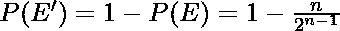

# 断棒碎片形成 n 边多边形的概率

> 原文:[https://www . geeksforgeeks . org/断棒形成 n 边多边形的概率/](https://www.geeksforgeeks.org/probability-that-the-pieces-of-a-broken-stick-form-a-n-sided-polygon/)

我们有一根长度为 l 的棍子。这根棍子在(n-1)个随机选择的点上折断了(零件的长度也可以是非整数或浮点数)，所以我们得到了 n 个零件。我们需要找到这 n 块可以形成 n 边多边形的概率。
**例:**

```
Input  : L = 5 n = 3
Output : 0.25
We need to cut rope of length 5
into three parts.
```

首先我们需要找到 n 个长度可以形成 n 边多边形的条件。让我们考虑一个三角形，我们知道对于一个三角形，最大边的长度必须小于其他边的长度之和。同样，对于 n 边多边形，最大边的长度必须小于其他(n-1)条边的总和。为什么呢？假设我们把棍子分成两半。我们进一步将其中一半分成(n-1)个部分。我们永远不能将它们放置成闭合的多边形。(其实我们能做的最好的就是做 2 条平行线)。所以我们只需要找到没有部分长度大于等于 L/2 的概率。
现在我们需要研究概率。有许多方法来计算所需的概率，我们将使用几何方法。考虑一个周长为 l 的圆。我们在周长上放置 n 个点。他们躺在同一个半圆上的概率是。更多信息请参考[这个](https://math.stackexchange.com/questions/325141/probability-that-n-points-on-a-circle-are-in-one-semicircle/325168)链接，让我们用 P(E)表示。
这个概率实际上和折断棍子一样，这样至少有一部分长度为 1/2。但是我们想要的只是这个事件的补充，因此我们的答案是

## C++

```
// CPP program to find probability that
// a rope of length L when broken into
// n parts form a polygon.
#include<iostream>

using namespace std;

double printProbability(unsigned L, unsigned n)
{
   unsigned p = (1 << (n-1));
   return 1.0 - ((double)n) / ((double)p);
}

int main()
{
   unsigned n = 3, L = 5;
   cout << printProbability(L, n);
   return 0;
}
```

## Java 语言(一种计算机语言，尤用于创建网站)

```
// Java program to find probability that
// a rope of length L when broken into
// n parts form a polygon.

public class GFG {

 static double printProbability(int L, int n)
    {
       int p = (1 << (n-1));
       return 1.0 - ((double)n) / ((double)p);
    }

    // Driver code
    public static void main(String args[])
    {
         int n = 3, L = 5;
         System.out.println(printProbability(L, n));

    }
    // This Code is contributed by ANKITRAI1
}
```

## 蟒蛇 3

```
# Python3 program to find probability that
# a rope of length L when broken into
# n parts form a polygon.

def printProbability(L, n):

    p = (1 << (n-1))
    return 1.0 - (float(n) / float(p) )

if __name__=='__main__':
    n = 3
    L = 5
    print(printProbability(L, n))

# this code is contributed by ash264
```

## C#

```
// C# program to find probability 
// that a rope of length L when
// broken into n parts form a polygon.
using System;

class GFG
{
static double printProbability(int L, int n)
{
    int p = (1 << (n - 1));
    return 1.0 - ((double)n) /
                 ((double)p);
}

// Driver code
public static void Main()
{
    int n = 3, L = 5;
    Console.WriteLine(printProbability(L, n));
}
}

// This code is contributed
// by inder_verma
```

## 服务器端编程语言（Professional Hypertext Preprocessor 的缩写）

```
<?php
// PHP program to find probability that
// a rope of length L when broken into
// n parts form a polygon.

function printProbability($L, $n)
{
    $p = (1 << ($n - 1));
    return 1.0 - ($n) / ($p);
}

// Driver Code
$n = 3; $L = 5;
echo printProbability($L, $n);

// This code is contributed
// by Abby_akku
?>
```

## java 描述语言

```
<script>

// Javascript program to find probability
// that a rope of length L when broken into
// n parts form a polygon.

// Function to find out the
// number of that vertices
function printProbability(L, n)
{
    var p = (1 << (n - 1));
    return 1.0 - n/ p;
}

// Driver code
var n = 3, L = 5;

document.write(printProbability(L, n));

// This code is contributed by Kirti

</script>
```

**Output:** 

```
0.25
```