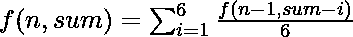
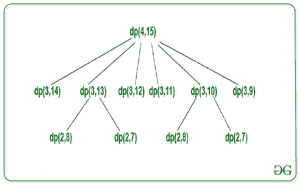

# 掷骰子 N 次得到的所有数之和位于两个给定整数之间的概率

> 原文:[https://www . geeksforgeeks . org/通过掷骰子 n 次获得的所有数字之和位于两个给定整数之间的概率/](https://www.geeksforgeeks.org/probability-that-the-sum-of-all-numbers-obtained-on-throwing-a-dice-n-times-lies-between-two-given-integers/)

给定三个整数 **N** 、 **A** 和 **B** ，任务是计算掷骰子恰好 N 次得到的数之和位于 **A** 和 **B** 之间的概率。

**示例:**

> **输入:** N = 1，A = 2，B = 3
> **输出:** 0.333333
> **说明:**掷骰子 N ( = 1)得到 2 之和的方法是 1 {2}。因此，所需概率= 1/6 = 0.33333
> 
> **输入:** N = 2，A = 3，B = 4
> T3】输出: 0.138889

[**递归方法:**](https://www.geeksforgeeks.org/recursion/) 按照以下步骤解决问题:

*   计算 **A** 和 **B** 之间所有数字的概率并相加得到答案。
*   调用函数 ***find(N，sum)*** 计算从 **a** 到 **b** 每个数字的概率，其中 **a** 和 **b** 之间的数字将作为 **sum** 传递。
    *   基本案例有:
        *   如果**之和**大于 **6 * N** 或小于 **N** ，则返回 0，因为不可能有大于 **N * 6** 或小于 **N** 的和。
        *   如果 **N** 等于 1 且**和**在 1 和 6 之间，则返回 1/6。
    *   由于在每种状态下，一次掷骰子 1 到 6 中的任何一个数都可能出现，因此应该对(该状态的总和–I)进行递归调用，其中 1≤ i ≤ 6。
    *   返回合成概率。

> **递归调用:**
> 

下面是上述方法的实现:

## C++

```
// C++ program for above approach
#include <bits/stdc++.h>
using namespace std;

// Function to calculate the
// probability for the given
// sum to be equal to sum in
// N throws of dice
long double find(int N, int sum)
{
    // Base cases
    if (sum > 6 * N || sum < N)
        return 0;

    if (N == 1) {

        if (sum >= 1 && sum <= 6)
            return 1.0 / 6;
        else
            return 0;
    }
    long double s = 0;
    for (int i = 1; i <= 6; i++)
        s = s + find(N - 1, sum - i) / 6;

    return s;
}

// Driver Code
int main()
{
    int N = 4, a = 13, b = 17;
    long double probability = 0.0;

    for (int sum = a; sum <= b; sum++)
        probability = probability + find(N, sum);

    // Print the answer
    cout << fixed << setprecision(6) << probability;
    return 0;
}
```

## Java 语言(一种计算机语言，尤用于创建网站)

```
// Java program for the above approach
import java.util.*;
class GFG
{

// Function to calculate the
// probability for the given
// sum to be equal to sum in
// N throws of dice
static double find(int N, int sum)
{
    // Base cases
    if (sum > 6 * N || sum < N)
        return 0;
    if (N == 1)
    {
        if (sum >= 1 && sum <= 6)
            return 1.0 / 6;
        else
            return 0;
    }
    double s = 0;
    for (int i = 1; i <= 6; i++)
        s = s + find(N - 1, sum - i) / 6;
    return s;
}

// Driver code
public static void main(String[] args)
{
    int N = 4, a = 13, b = 17;
    double probability = 0.0;
    for (int sum = a; sum <= b; sum++)
        probability = probability + find(N, sum);

    // Print the answer
    System.out.format("%.6f", probability);
}
}

// This code is contributed by code_hunt.
```

## 蟒蛇 3

```
# Python 2 program for above approach

# Function to calculate the
# probability for the given
# sum to be equal to sum in
# N throws of dice
def find(N, sum):

    # Base cases
    if (sum > 6 * N or sum < N):
        return 0
    if (N == 1):
        if (sum >= 1 and sum <= 6):
            return 1.0 / 6
        else:
            return 0
    s = 0
    for i in range(1, 7):
        s = s + find(N - 1, sum - i) / 6
    return s

# Driver Code
if __name__ == "__main__":
    N = 4
    a = 13
    b = 17
    probability = 0.0
    for sum in range(a, b + 1):
        probability = probability + find(N, sum)

    # Print the answer
    print(round(probability, 6))

    # This code is contributed by chitranayal.
```

## C#

```
// C# program for the above approach
using System;
class GFG
{

    // Function to calculate the
    // probability for the given
    // sum to be equal to sum in
    // N throws of dice
    static double find(int N, int sum)
    {

        // Base cases
        if (sum > 6 * N || sum < N)
            return 0;
        if (N == 1)
        {
            if (sum >= 1 && sum <= 6)
                return 1.0 / 6;
            else
                return 0;
        }
        double s = 0;
        for (int i = 1; i <= 6; i++)
            s = s + find(N - 1, sum - i) / 6;
        return s;
    }

  // Driver code
  static void Main()
  {
    int N = 4, a = 13, b = 17;
    double probability = 0.0;
    for (int sum = a; sum <= b; sum++)
        probability = probability + find(N, sum);

    // Print the answer
    Console.WriteLine(Math.Round(probability,6));
  }
}

// This code is contributed by divyeshrabadiya07
```

## java 描述语言

```
<script>

    // Javascript program for the above approach

    // Function to calculate the
    // probability for the given
    // sum to be equal to sum in
    // N throws of dice
    function find(N, sum)
    {

        // Base cases
        if (sum > 6 * N || sum < N)
            return 0;
        if (N == 1)
        {
            if (sum >= 1 && sum <= 6)
                return 1.0 / 6;
            else
                return 0;
        }
        let s = 0;
        for (let i = 1; i <= 6; i++)
            s = s + find(N - 1, sum - i) / 6;
        return s;
    }

    let N = 4, a = 13, b = 17;
    let probability = 0.0;
    for (let sum = a; sum <= b; sum++)
        probability = probability + find(N, sum);

    // Print the answer
    document.write(probability.toFixed(6));

</script>
```

**Output:** 

```
0.505401
```

***时间复杂度:***O((B- a+1)6<sup>n</sup>)
*T8】辅助空间:* O(1)

**动态规划法:**上述递归法需要通过处理以下[重叠子问题](https://www.geeksforgeeks.org/overlapping-subproblems-property-in-dynamic-programming-dp-1/)和[最优子结构](https://www.geeksforgeeks.org/optimal-substructure-property-in-dynamic-programming-dp-2/)进行优化:

[**【重叠子问题:**](https://www.geeksforgeeks.org/overlapping-subproblems-property-in-dynamic-programming-dp-1/)
N = 4 且和=15 的部分递归树:



[**最优子结构:**](https://www.geeksforgeeks.org/optimal-substructure-property-in-dynamic-programming-dp-2/)
对于每个状态，对于其他 6 个状态重复出现，因此 ***f(N，sum)*** 的递归定义为:

> ![dp[N][sum]=\sum_{i=1}^6\frac{dp[N-1][sum-i]}{6}](img/3b9a96ca3ea0cd6bb19aebffc5de0fc3.png "Rendered by QuickLaTeX.com")

**自上而下的方法:**

## C++

```
// C++ program for above approach
#include <bits/stdc++.h>
using namespace std;
float dp[105][605];

// Function to calculate the
// probability for the given
// sum to be equal to sum in
// N throws of dice
float find(int N, int sum)
{
    if (dp[N][sum])
        return dp[N][sum];

    // Base cases
    if (sum > 6 * N || sum < N)
        return 0;
    if (N == 1) {
        if (sum >= 1 && sum <= 6)
            return 1.0 / 6;
        else
            return 0;
    }
    for (int i = 1; i <= 6; i++)
        dp[N][sum] = dp[N][sum]
                     + find(N - 1, sum - i) / 6;
    return dp[N][sum];
}

// Driver Code
int main()
{
    int N = 4, a = 13, b = 17;
    float probability = 0.0;

    // Calculate probability of all
    // sums from a to b
    for (int sum = a; sum <= b; sum++)
        probability = probability + find(N, sum);

    // Print the answer
    cout << fixed << setprecision(6) << probability;
    return 0;
}
```

## Java 语言(一种计算机语言，尤用于创建网站)

```
// Java program for above approach
class GFG
{
    static float[][] dp = new float[105][605];

    // Function to calculate the
    // probability for the given
    // sum to be equal to sum in
    // N throws of dice
    static float find(int N, int sum)
    {
        if (N < 0 | sum < 0)
            return 0;
        if (dp[N][sum] > 0)
            return dp[N][sum];

        // Base cases
        if (sum > 6 * N || sum < N)
            return 0;
        if (N == 1) {
            if (sum >= 1 && sum <= 6)
                return (float) (1.0 / 6);
            else
                return 0;
        }
        for (int i = 1; i <= 6; i++)
            dp[N][sum] = dp[N][sum] + find(N - 1, sum - i) / 6;
        return dp[N][sum];
    }

    // Driver Code
    public static void main(String[] args)
    {
        int N = 4, a = 13, b = 17;
        float probability = 0.0f;

        // Calculate probability of all
        // sums from a to b
        for (int sum = a; sum <= b; sum++)
            probability = probability + find(N, sum);

        // Print the answer
        System.out.printf("%.6f", probability);
    }
}

// This code is contributed by shikhasingrajput
```

## 蟒蛇 3

```
# Python program for above approach
dp = [[0 for i in range(605)] for j in range(105)];

# Function to calculate the
# probability for the given
# sum to be equal to sum in
# N throws of dice
def find(N, sum):
    if (N < 0 | sum < 0):
        return 0;
    if (dp[N][sum] > 0):
        return dp[N][sum];

    # Base cases
    if (sum > 6 * N or sum < N):
        return 0;
    if (N == 1):
        if (sum >= 1 and sum <= 6):
            return (float)(1.0 / 6);
        else:
            return 0;

    for i in range(1,7):
        dp[N][sum] = dp[N][sum] + find(N - 1, sum - i) / 6;
    return dp[N][sum];

# Driver Code
if __name__ == '__main__':
    N = 4; a = 13; b = 17;
    probability = 0.0
    f = 0;

    # Calculate probability of all
    # sums from a to b
    for sum in range(a,b+1):
        probability = probability + find(N, sum);

    # Print the answer
    print("%.6f"% probability);

# This code is contributed by 29AjayKumar
```

## C#

```
// C# program for above approach
using System;
using System.Collections.Generic;
public class GFG
{
  static float[,] dp = new float[105, 605];

  // Function to calculate the
  // probability for the given
  // sum to be equal to sum in
  // N throws of dice
  static float find(int N, int sum)
  {
    if (N < 0 | sum < 0)
      return 0;
    if (dp[N, sum] > 0)
      return dp[N, sum];

    // Base cases
    if (sum > 6 * N || sum < N)
      return 0;
    if (N == 1) {
      if (sum >= 1 && sum <= 6)
        return (float) (1.0 / 6);
      else
        return 0;
    }
    for (int i = 1; i <= 6; i++)
      dp[N, sum] = dp[N, sum] + find(N - 1, sum - i) / 6;
    return dp[N, sum];
  }

  // Driver Code
  public static void Main(String[] args)
  {
    int N = 4, a = 13, b = 17;
    float probability = 0.0f;

    // Calculate probability of all
    // sums from a to b
    for (int sum = a; sum <= b; sum++)
      probability = probability + find(N, sum);

    // Print the answer
    Console.Write("{0:F6}", probability);
  }
}

// This code is contributed by 29AjayKumar
```

## java 描述语言

```
<script>

// Javascript program for above approach

var dp = Array(105).fill().map(()=>Array(605).fill(0.0));

// Function to calculate the
// probability for the given
// sum to be equal to sum in
// N throws of dice
function find(N, sum)
{
    if (N < 0 | sum < 0)
        return 0;
    if (dp[N][sum] > 0)
        return dp[N][sum];

    // Base cases
    if (sum > 6 * N || sum < N)
        return 0;
    if (N == 1)
    {
        if (sum >= 1 && sum <= 6)
            return  (1.0 / 6);
        else
            return 0;
    }

    for(var i = 1; i <= 6; i++)
        dp[N][sum] = dp[N][sum] +
           find(N - 1, sum - i) / 6;

    return dp[N][sum];
}

// Driver Code
var N = 4, a = 13, b = 17;
var probability = 0.0;

// Calculate probability of all
// sums from a to b
for(sum = a; sum <= b; sum++)
    probability = probability + find(N, sum);

// Print the answer
document.write(probability.toFixed(6));

// This code is contributed by umadevi9616

</script>
```

**Output:** 

```
0.505401
```

***时间复杂度:***O(n *和)
***辅助空间:***O(n *和)

**自下而上的方法:**

## C++

```
// C++ program for above approach
#include <bits/stdc++.h>
using namespace std;
float dp[105][605];

// Function to calculate probability
// that the sum of numbers on N throws
// of dice lies between A and B
float find(int N, int a, int b)
{
    float probability = 0.0;

    // Base case
    for (int i = 1; i <= 6; i++)
        dp[1][i] = 1.0 / 6;

    for (int i = 2; i <= N; i++) {

        for (int j = i; j <= 6 * i; j++) {

            for (int k = 1; k <= 6; k++) {

                dp[i][j] = dp[i][j]
                           + dp[i - 1][j - k] / 6;
            }
        }
    }

    // Add the probability for all
    // the numbers between a and b
    for (int sum = a; sum <= b; sum++)
        probability = probability + dp[N][sum];

    return probability;
}

// Driver Code
int main()
{
    int N = 4, a = 13, b = 17;

    float probability = find(N, a, b);

    // Print the answer
    cout << fixed << setprecision(6) << probability;
    return 0;
}
```

## Java 语言(一种计算机语言，尤用于创建网站)

```
// Java program for above approach
import java.util.*;

class GFG{
static float [][]dp = new float[105][605];

// Function to calculate probability
// that the sum of numbers on N throws
// of dice lies between A and B
static float find(int N, int a, int b)
{
    float probability = 0.0f;

    // Base case
    for (int i = 1; i <= 6; i++)
        dp[1][i] = (float) (1.0 / 6);
    for (int i = 2; i <= N; i++)
    {
        for (int j = i; j <= 6 * i; j++)
        {
            for (int k = 1; k <= 6 && k <= j; k++)
            {
                dp[i][j] = dp[i][j]
                           + dp[i - 1][j - k] / 6;
            }
        }
    }

    // Add the probability for all
    // the numbers between a and b
    for (int sum = a; sum <= b; sum++)
        probability = probability + dp[N][sum];
    return probability;
}

// Driver Code
public static void main(String[] args)
{
    int N = 4, a = 13, b = 17;
    float probability = find(N, a, b);

    // Print the answer
    System.out.printf("%.6f",probability);
}
}

// This codeis contributed by shikhasingrajput
```

## 蟒蛇 3

```
# Python3 program for above approach

dp = [[0 for i in range(605)] for j in range(105)]

# Function to calculate probability
# that the sum of numbers on N throws
# of dice lies between A and B
def find(N, a, b) :

    probability = 0.0

    # Base case
    for i in range(1, 7) :
        dp[1][i] = 1.0 / 6

    for i in range(2, N + 1) :

        for j in range(i, (6*i) + 1) :

            for k in range(1, 7) :

                dp[i][j] = dp[i][j] + dp[i - 1][j - k] / 6

    # Add the probability for all
    # the numbers between a and b
    for Sum in range(a, b + 1) :
        probability = probability + dp[N][Sum]

    return probability

N, a, b = 4, 13, 17

probability = find(N, a, b)

# Print the answer
print('%.6f'%probability)

# This code is contributed by divyesh072019.
```

## C#

```
// C# program for above approach
using System;
public class GFG
{
static float [,]dp = new float[105, 605];

// Function to calculate probability
// that the sum of numbers on N throws
// of dice lies between A and B
static float find(int N, int a, int b)
{
    float probability = 0.0f;

    // Base case
    for (int i = 1; i <= 6; i++)
        dp[1, i] = (float) (1.0 / 6);
    for (int i = 2; i <= N; i++)
    {
        for (int j = i; j <= 6 * i; j++)
        {
            for (int k = 1; k <= 6 && k <= j; k++)
            {
                dp[i, j] = dp[i, j]
                           + dp[i - 1, j - k] / 6;
            }
        }
    }

    // Add the probability for all
    // the numbers between a and b
    for (int sum = a; sum <= b; sum++)
        probability = probability + dp[N, sum];
    return probability;
}

// Driver Code
public static void Main(String[] args)
{
    int N = 4, a = 13, b = 17;
    float probability = find(N, a, b);

    // Print the answer
    Console.Write("{0:F6}",probability);
}
}

// This code is contributed by shikhasingrajput
```

## java 描述语言

```
<script>

// Javascript program of the above approach
let dp = new Array(105);

// Loop to create 2D array using 1D array
for(var i = 0; i < dp.length; i++)
{
    dp[i] = new Array(2);
}

for(var i = 0; i < dp.length; i++)
{
    for(var j = 0; j < dp.length; j++)
    {
        dp[i][j] = 0;
    }
}

// Function to calculate probability
// that the sum of numbers on N throws
// of dice lies between A and B
function find(N, a, b)
{
    let probability = 0.0;

    // Base case
    for(let i = 1; i <= 6; i++)
        dp[1][i] =  (1.0 / 6);

    for(let i = 2; i <= N; i++)
    {
        for(let j = i; j <= 6 * i; j++)
        {
            for(let k = 1; k <= 6 && k <= j; k++)
            {
                dp[i][j] = dp[i][j] +
                           dp[i - 1][j - k] / 6;
            }
        }
    }

    // Add the probability for all
    // the numbers between a and b
    for(let sum = a; sum <= b; sum++)
        probability = probability + dp[N][sum];

    return probability;
}

// Driver Code
let N = 4, a = 13, b = 17;
let probability = find(N, a, b);

// Print the answer
document.write(probability);

// This code is contributed by chinmoy1997pal

</script>
```

**Output:** 

```
0.505401
```

***时间复杂度:*** O(N *和)
***辅助空间:*** O(N *和)