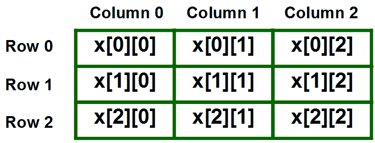

# 练习数组问题

> 原文:[https://www.geeksforgeeks.org/problem-solving-arrays/](https://www.geeksforgeeks.org/problem-solving-arrays/)

在本文中，我们将讨论与数组相关的一些重要概念以及基于这些概念的问题。在了解这个之前，你应该对[数组](https://www.geeksforgeeks.org/array-data-structure/)有一个基本的了解。

**1 型。基于数组声明–**
以下是数组声明的几个要点:

*   一维数组可以声明为 int a[10]或 int a[] = {1，2，3，4}。这意味着在一维数组中指定元素的数量是可选的。
*   二维数组可以声明为 int a[2][4]或 int a[][4] = {1，2，3，4，5，6，7，8}。这意味着指定行数是可选的，但列数是必需的。
*   int a[4]的声明在打印时会将值作为垃圾给出。但是，int a[4] = {1，1}会将剩余的两个元素初始化为 0。

**Que–1。**预测以下程序的输出

```
int main()
{
    int i;
    int arr[5] = {1};
    for (i = 0; i < 5; i++)
        printf("%d ", arr[i]);
    return 0;
}
```

(A) 1 后跟四个垃圾值:
(B)1 0 0 0 0
(C)1 1 1 1
(D)0 0 0 0 0 0

**解决方案:**如前所述，如果数组用很少的元素初始化，剩余的元素将被初始化为 0。因此，将打印 1 后跟 0、0、0、0。

**Que - 2。**预测以下程序的输出:

```
int main()
{
    int a[][] = {{1,2},{3,4}};
    int i, j;
    for (i = 0; i < 2; i++)
        for (j = 0; j < 2; j++)
            printf("%d ", a[i][j]);
    return 0;
}
```

(A) 1 2 3 4
(B)第“int a[][] = {{1，2}，{3，4}}”行编译器错误
(丙)4 垃圾值
(丁)4 3 2 1

**解决方案:**如前所述，指定二维数组中的列数是强制性的，所以，会给出编译时错误。

**2 型。寻找具有给定基地址的元素的地址-**
当一个数组被声明时，一个连续的内存块被分配给它，这有助于从基地址中寻找元素的地址。

对于一维数组 a[100]，第 I 个元素的地址可以表示为:

```
addr(a[i]) =  BA+ i*SIZE

```

其中 BA 表示基地址(第 0 个元素的地址)，SIZE 表示数组中每个元素的大小。

对于二维数组 x[3][3]，元素可以表示为:



由于二维数组在 C 语言中是以行主顺序存储的，所以将首先存储第 0 行，然后是第 1 行和第 2 行。为了找到 x[2][2]的地址，我们需要转到第二行(每行有 3 个元素)。到达第二行后，可以作为一维数组访问。因此，我们需要转到数组的第二个元素。假设 BA 为 0，大小为 1，x[2][2]的地址将为 0 + (2 * 3 + 2) * 1 = 8。

对于具有 m 行 n 列的给定阵列，地址可以计算如下:

```
 add(a[i][j]) = BA + (i*n + j) * SIZE

```

其中 BA 代表基地址(第 0 个元素的地址)，n 代表二维数组中的列数，SIZE 代表数组中每个元素的大小。

**Que - 3。**考虑以下 C 语言中‘二维数组’的声明:

```
char a[100][100];

```

假设主存储器是字节可寻址的，并且阵列从存储器地址 0 开始存储，a[40][50]的地址是:(GATE CS 2002)
(A)4040
(B)4050
(C)5040
(C)5050

**解:**使用所讨论的公式，

```
 addr[40][50] = 0 + (40*100 + 50) * 1 = 4050

```

**Que - 4。**对于访问 X[i][j][k]的 C 程序，以下中间代码由编译器生成。假设整数的大小是 32 位，字符的大小是 8 位。(GATE-CS-2014)

```
t0 = i * 1024
t1= j * 32
t2 = k * 4
t3 =t1 + t0
t4 = t3 + t2
t5 = X[t4]
```

下面关于 C 程序源代码的说法，哪一个是正确的？
(A) X 声明为“int X[32][32][8]”
(B)X 声明为“int X[4][1024][32]”
(C)X 声明为“char X[4][32][8]”
(D)X 声明为“char X[32][16][2]”

**解:**对于三维数组 X[10][20][30]，我们有 10 个大小为[20]*[30]的二维矩阵。因此，对于三维阵列 X[M][N][O]，X[i][j][k]的地址可以计算为:

```
BA + (i*N*O+j*O+k)*SIZE
```

给定不同的表达式，t5 的最终值可以计算为:

```
t5 = X[t4] = X[t3+t2] = X[t1+t0+t2] = X[i*1024+j*32+k*4]
```

通过相等的地址，

```
(i*N*O+j*O+k)SIZE = i*1024+j*32+k*4 = (i*256+j*8+k)4
```

比较 I、j 和 SIZE 的值，我们得到

```
SIZE = 4, N*O = 256 and O = 8, hence, N = 32
```

由于大小是 4，数组将是整数。将 N 和 O 的值与数组匹配为整数的选项是(A)。

**3 型。使用指针访问数组元素-**

*   在一维数组 a[100]中，元素 a[i]可以作为[i]或*(a+i)或*(i+a)来访问
*   a[i]的地址可以作为&a[i]或(a+i)或(i+a)来访问
*   在二维数组 a[100][100]中，元素 a[i][j]可以作为[i][j]或*(a+i)+j)或*(a[i]+j)来访问
*   [i][j]的地址可以作为&a[i][j]或 a[i]+j 或*(a+i)+j 来访问
*   在二维数组中，第 I 行的地址可以作为[i]或*(a+i)来访问

**Que - 5。**假设如下 C 变量声明

```
int *A [10], B[10][10];  
```

在下列表达式中

```
I. A[2]
II. A[2][3]
III. B[1]
IV. B[2][3]
```

如果在 C 程序中用作赋值语句的左侧，哪个不会产生编译时错误？
(甲)仅一、二、四
(乙)仅二、三、四
(丙)仅二、四
(丁)仅四

**解法:**如题所示，A 是 10 个指针的数组，B 是二维数组。考虑到这一点，我们举一个例子:

```
int *A[10], B[10][10];
int C[] ={1, 2, 3, 4, 5};
```

由于 A[2]代表整数指针，它可以将整数数组的地址存储为:A[2]= C；因此，我是有效的。

由于 A[2]代表 C 的基址，A[2][3]可以修改为:A[2][3]= *(C+3)= 0；它会将 C[3]的值更改为 0。因此，二也是有效的。

由于 B 是 2D 阵，B[2][3]可以修改为:B[2][3]= 5；它会将 B[2][3]的值更改为 5。因此，四也是有效的。

由于 B 是 2D 数组，B[2]代表第二行地址，不能在语句的 LHS 使用，因为修改地址无效。因此三是无效的。