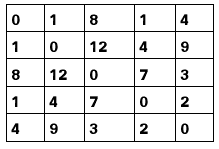

# 最小生成树(Kruskal 和 Prim)的问题求解

> 原文:[https://www . geesforgeks . org/问题解决-最小生成树-kruskals-prims/](https://www.geeksforgeeks.org/problem-solving-minimum-spanning-trees-kruskals-prims/)

最小生成树是 GATE 的一个重要课题。因此，我们将讨论如何基于 MST 解决不同类型的问题。在理解本文之前，您应该了解 MST 及其算法的基础知识([克鲁斯卡尔算法](https://www.geeksforgeeks.org/greedy-algorithms-set-2-kruskals-minimum-spanning-tree-mst/)和[普里姆算法](https://www.geeksforgeeks.org/greedy-algorithms-set-5-prims-mst-for-adjacency-list-representation/))。

**1 型。基于 MST 的概念问题–**
MST 有一些重要的性质，在此基础上可以提出如下概念问题:

*   具有 n 个节点的 MST 中的边数是(n-1)。
*   图的 MST 的权重总是唯一的。然而，可能有不同的方法获得这个权重(如果有相同权重的边)。
*   MST 的权重是 MST 中边的权重之和。
*   对于具有 n 个顶点的 MST，两个顶点之间的最大路径长度为(n-1)。
*   MST 中从一个顶点到另一个顶点只有一条路径。
*   从 MST 中移除任何边都会断开图形。
*   对于边权重不同的图，最小二乘法是唯一的。

**Que–1。**设 G 是一个边权重不同的无向连通图。设 emax 是权重最大的边，emin 是权重最小的边。以下哪个陈述是错误的？(GATE CS 2000)
(A)G 的每个最小生成树都必须包含 emin。
(B)如果 emax 在最小生成树中，那么移除它必须断开 G
(C)没有最小生成树包含 emax
(D) G 有唯一的最小生成树

**解决方案:**由于边权重是唯一的，因此只有一条边 emin，并且将被添加到 MST 中，因此选项(A)始终为真。
由于生成树的边数最少，移除任何边都会断开图形。因此，选项(B)也是正确的。
由于所有的边权重都是不同的，G 将有一个唯一的最小生成树。所以，选项(D)是正确的。
选项 C 为假，因为如果其他权重较小的边正在创建循环，并且添加 emax 之前的边数小于(n-1)，emax 可以成为 MST 的一部分。

**2 型。给定图–**
如何求最小生成树的权重这是基于 MST 的最简单类型的问题。为了用克鲁斯卡尔算法解决这个问题，

*   按照权重不递减的顺序排列边。
*   如果边没有创建循环，则逐个添加边，直到我们得到 n-1 个边，其中 n 是图中的节点数。

**Que–2。**考虑顶点集为{0，1，2，3，4}的完全无向图。下面矩阵 W 中的条目 Wij 是边{i，j}的权重。这个图中的生成树 T 的最小可能权重是多少，使得顶点 0 是树 T 中的一个叶节点？(GATE CS 2010)

(A)7
(B)8
(C)9
(D)10

**解:**在 5 个顶点(v1 到 v5)的图的邻接矩阵中，按非递减顺序排列的边是:

```
(v1,v2), (v1,v4), (v4,v5), (v3,v5), (v1,v5), 
(v2,v4), (v3,v4), (v1,v3), (v2,v5), (v2,v3) 

```

根据给定的情况，顶点 v1 是一个叶节点，它应该只有一条边入射到它。所以，我们最后会考虑。考虑顶点 v2 到 v5，非递减顺序的边是:

```
(v4,v5), (v3,v5), (v2,v4), (v3,v4), (v2,v5), (v2,v3)

```

添加前三条边(v4，v5)，(v3，v5)，(v2，v4)，不会创建循环。此外，我们可以使用 edge (v1，v2)将 v1 连接到 v2。总重量是这 4 条边的重量之和，即 10。

**3 型。对于给定的图，使用克鲁斯卡尔算法可以有多少最小生成树–**

*   如果所有边的权重都不同，则最小生成树是唯一的。
*   如果两条边具有相同的权重，那么我们必须考虑两种可能性，并找到可能的最小生成树。

**Que–3。**下图加权图的不同最小生成树数量为 _ _ _ _(GATE-CS-2014)

(A)4
(B)5
(C)6
(D)7

**解:**有 5 条边权重为 1，在 MST 中全部相加不会产生循环。
由于图有 9 个顶点，因此我们总共需要 8 条边，其中 5 条已经添加。在剩下的 3 条边中，有一条边是固定的，用 f 表示。

对于剩余的 2 条边，一条从 c 或 d 或 e 中选择，另一条从 a 或 b 中选择。剩余的黑色边将总是产生循环，因此它们不被考虑。所以，可能的 MST 是 3*2 = 6。


**4 型。在给定的序列中，哪一个不是使用 Kruskal 算法–**
添加到 MST 的边序列要解决这类问题，请尝试找出 Kruskal 可以产生的边序列。不匹配的序列就是答案。

**Que–4。**考虑下面的图:

下面哪一个不是使用 Kruskal 算法添加到最小生成树的边序列？(GATE-CS-2009)
(A) (b、e)、(e、f)、(A、C)、(B、C)、(f、g)、(C、d)
(B) (b、e)、(e、f)、(A、C)、(f、g)、(B、C)、(C)、(C)、(d)
(C) (b、e)、(A、C)、(e、f)、(B、C)、(f、g)、(C)、(d)
(D) (b、e)、(e、f)、(B、C)、(A、C)、(f、g)

**求解:** Kruskal 算法将边按权重的非递减顺序相加，因此，我们首先将边按权重的非递减顺序排序为:

```
(b,e), (e,f), (a,c), (b,c), (f,g), (a,b), (e,g), (c,d), (b,d), (e,d), (d,f).

```

首先，它将在 MST 中添加(b，e)。然后，它会加上(e，f)和(a，c)(或者(e，f)后面跟着(a，c)，或者反之亦然)，因为两者具有相同的权重，加上两者不会产生循环。
然而，在选项(D)中，在添加(a，c)之前，已经将(b，c)添加到 MST 中。所以不可能是克鲁斯卡尔算法产生的序列。