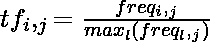
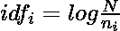
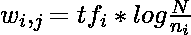
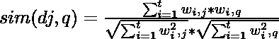
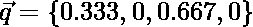

# 布尔模型和向量空间模型上的问题求解

> 原文:[https://www . geesforgeks . org/布尔模型和向量空间模型上的问题解决/](https://www.geeksforgeeks.org/problem-solving-on-boolean-model-and-vector-space-model/)

### **布尔模型:**

它是一个基于集合论和布尔代数的简单检索模型。查询被设计成具有精确语义的布尔表达式。检索策略基于二元决策准则。布尔模型认为索引项在文档中存在或不存在。

**问题解决:**

考虑 5 个包含 6 个术语的文档

*   文档 1 =“术语 1 术语 3”
*   文件 2 = '条款 2 条款 4 条款 6 '
*   文件 3 = '条款 1 条款 2 条款 3 条款 4 条款 5 '
*   文件 4 = '条款 1 条款 3 条款 6 '
*   文件 5 = '条款 3 条款 4 '

布尔模型中的文档

<center>

<figure class="table">

|   | **第一期** | **第二学期** | **第三学期** | **第 4 期** | **第 5 期** | **第 6 期** |
| **文件 1** | one | Zero | one | Zero | Zero | Zero |
| **文件 2** | Zero | one | Zero | one | Zero | one |
| **文件 3** | one | one | one | one | one | Zero |
| **文件 4** | one | Zero | one | Zero | Zero | one |
| **文件 5** | Zero | Zero | one | one | Zero | Zero |

</figure>

</center>

考虑一下这个查询

找到包含条款 1 **和条款 3 **而不是条款 2**的文件**

```
term1 ∧ term3 ∧ ¬ term2
```

<center>

<figure class="table">

|   | **术语 1** | **第二学期** | **第三学期** | 第四学期 | 第五学期 | 第六学期 |
| **文件 1** | **1** | **1** | **1** | Zero | Zero | Zero |
| **文件 2** | **0** | **0** | **0** | one | Zero | one |
| **文件 3** | **1** | **0** | **1** | one | one | Zero |
| **文件 4** | **1** | **1** | **1** | Zero | Zero | one |
| **文件 5** | **0** | **1** | **1** | one | Zero | Zero |

</figure>

</center>

*   文档 1 : 1 ∧ 1∧ 1 = 1
*   文档 2 : 0 ∧ 0 ∧ 0 = 0
*   文档 3 : 1 ∧ 1 ∧ 0 = 0
*   文件 4 : 1 ∧ 1 ∧ 1 = 1
*   文档 5 : 0 ∧ 1 ∧ 1 = 0

基于以上计算**文档 1** 和**文档 4** 与给定的查询相关

### **矢量模型:**

执行运算的方法和计算所需的公式在第 1 部分的上一篇文档中有介绍。考虑以下文档集合。

*   文档 1 = '一二'
*   文件 2 = '三二四'
*   文档 3 = '一二三'
*   文档 4 = '一二'

使用的公式

<center>









</center>

有些术语在文档中出现三次、两次，有时只有一次。文档总数 N=4。因此，这些术语的 IDF 值为:

```
one --> log2(4/3) = 0.4147
two --> log2(4/4) = 0
three --> log2(4/2) = 1
four -->log2(4/1) = 2
```

布尔模型中的表示

<center>

<figure class="table">

|   | **一** | **两个** | **三** | **四** |
| **文件 1** | one | one | Zero | Zero |
| **文件 2** | Zero | one | one | one |
| **文件 3** | one | one | one | Zero |
| **文件 4** | one | one | Zero | Zero |

</figure>

词频计算

```
one --> 3/4 = 0.75
two --> 4/4 = 1
three --> 2/4 = 0.5
four --> 1/4 = 0.25
```

**权重的计算(tf * idf )**

```
weight(one) --> 0.75 * 0.4147 = 0.3110
weight(two) --> 1 * 0 = 0
weight(three) --> 0.5 * 1 = 0.5
weight(four) --> 0.25 * 2 = 0.5
```

用权重表示向量模型

<center>

<figure class="table">

|   | **一** | **两个** | **三** | **四** |
| **文件 1** | 0.3110 | Zero | Zero | Zero |
| **文件 2** | Zero | Zero | Zero point five | Zero point five |
| **文件 3** | 0.3110 | Zero | Zero point five | Zero |
| **文件 4** | 0.3110 | Zero | Zero | Zero |

</figure>

</center>

查询:包含“一三三”的文档

计算查询术语的权重(术语频率)

*   重量(一)–> 1/3 = 0.333
*   重量(三)–> 2/3 = 0.667

向量表示

*   文件
*   查询

相似度计算

<center>

![sim(d1,q) = \frac{0.3110 * 0.333 + 0 * 0 + 0 * 0.667 + 0 * 0}{\sqrt{ (0.3110^2 + 0^2 + 0^2 + 0^2) } *\sqrt {(0.333^2+ 0^2 + 0.667^2 + 0^2)}} = 0.4466\\ sim(d2,q) = \frac{0 * 0.333 + 0 * 0 + 0.5 * 0.667 + 0.5 * 0}{\sqrt{ (0^2 + 0^2 + 0.5^2 + 0.5^2) } *\sqrt {(0.333^2 + 0^2 + 0.667^2 + 0^2)} }= 0.4001 \\ sim(d3,q) = \frac{0.3110 * 0.333 + 0 * 0 + 0.5 * 0.667 + 0 * 0}{\sqrt{ (0.3110^2 + 0^2 + 0.5^2 + 0^2)} * \sqrt{(0.333^2 + 0^2 + 0.667^2 + 0^2)}} = 0.9086\\ sim(d4,q) = \frac{0.3110 * 0.333 + 0 * 0 + 0 * 0.667 + 0 * 0}{\sqrt {(0.3110^2 + 0^2 + 0^2 + 0^2)} * \sqrt{(0.333^2 + 0^2 + 0.667^2 + 0^2)}} = 0.4466\\](img/6c5105ff9d0c152a6d449eb323b9a87e.png "Rendered by QuickLaTeX.com")

</center>

文档的排名(对于排名，我们遵循了统计中的方法，将相同的排名分配给两个不同的项目)

<center>

<figure class="table">

| 文档 | **第二** |
| 文档 | **第四节** |
| 文档 | **1 号** |
| 文档 | **第二** |

</figure>

</center>

由于**文档 3** 之间的相似性大于其他文档之间的相似性，**第三文档与查询更相关。**

</center>