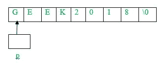
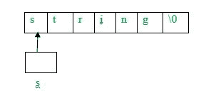
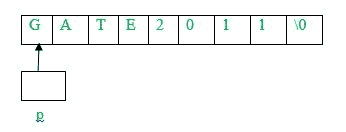

# 练习琴弦上的问题

> 原文:[https://www.geeksforgeeks.org/problem-solving-strings/](https://www.geeksforgeeks.org/problem-solving-strings/)

[串](https://www.geeksforgeeks.org/string-data-structure/)从 GATE 考试的角度来看是一个重要的题目。我们将讨论字符串的关键点以及基于此的不同类型的问题。

有两种方法可以将字符串存储为字符数组(char p[20])或指向字符串的指针(char * s =“string”)，这两种方法都可以作为数组访问。假设 p 是字符数组，s 是指向字符串的指针，以下是要点:

*   运算符 sizeof(p)将给出分配给字符数组的内存。但是，sizeof 将给出独立于 p 所指向的字符串的指针大小。
*   每个字符串都附加一个空字符(“\0”)，表示字符串的结尾。
*   可以使用 strlen()函数计算字符串的长度。但是，该函数的长度中不包含空字符' \0 '。例如，strlen 将返回 6。
*   字符串中的单个字符可以打印为:

    ```
    printf(“%c”, s[0]);
    printf(“%c”, p[1]);
    ```

*   完整字符串可打印为:

    ```
    printf(“%s”, s);
    printf(“%s”, p);
    ```

*   由于 p 是一个字符数组，它的单个元素可以被修改(p[i] = 'c ')。但是，使用 s(字符串指针)，字符串的单个元素不能被修改。
*   由于 s 是一个指针，它也可以指向任何其他字符串(s =“string 2”)。然而，使用 p，这是不可能的。

让我们根据所讨论的概念来讨论一些问题:

**Que–1。**以下 C 程序片段打印什么？

```
char c[] = "GEEK2018";
char *p =c;
printf("%c,%c", *p,*(p+p[3]-p[1]));
```

(A) G，1
(B) G，K
(C)极客 2018
(D)以上都不是

**解:**如题所示，p 指向字符数组 c【】，可以表示为:



由于 p 是字符类型的指针，*p 将打印“G”

使用指针算术，
*(p+p[3]-p[1]) = *(p+75-69)(使用 K 和 E 的 ascii 值)= *(p+6) = 1(因为我们知道 p 保存基字符串的地址意味着第 0th poision string，让我们假设字符串的地址以 2000 开始，因此 p+6 意味着 p 的地址(我们在 2000 年添加 6，这意味着 2006 年，在 2006 年存储“1”，这就是为什么答案是 1)。
因此，输出将是 G，1。

**Que–2。**以下哪个 C 代码片段无效？

(A)char * p = " string 1 "；printf("%c "，* +++p)；
(B)char q[]=“string 1”；printf("%c "，* +++q)；
(C)char * r =“string 1”；printf("%c "，r[1])；
(四)以上都不是

**解决方案:**选项(A)有效，因为 p 是指向“string1”的字符的指针。使用++p，p 将指向“string1”中的字符“t”。因此，*++p 将打印“t”。
选项(B)无效，因为 q 是字符数组的基址，++q(增加基址)无效。
选项(C)有效，因为 r 是指向“string1”字符的指针。因此，

```
r[1] = *(r+1) = ‘t’ and it will print ‘t’.
```

**Que–3。**考虑以下 C 程序段:(GATE CS 2004)

```
char p[20];
char *s = "string";
int length = strlen(s);
int i;
for (i = 0; i < length; i++)
     p[i] = s[length — i];
printf("%s",p);
```

程序输出为:
(A)gnrits
(B)gnrit
(C)string
(D)无输出打印

**解法:**在给定的代码中，p[20]被声明为字符数组，s 是指向字符串的指针。长度将被初始化为 6。在 for 循环(i = 0)的第一次迭代中，



p[i] = s[6-0]，s[6]为' \0'
因此，p[0]变为' \0 '。如上所述，' \0 '表示字符串结束。因此，不会打印任何内容，因为字符串的第一个字符是' \0 '。

**Que–4。**以下 C 程序片段打印什么？

```
char c[] = "GATE2011";
char *p =c;
printf("%s", p + p[3] - p[1]) ;
```

(a)2011 年闸道
(B)及 2011 年闸道
(C) 2011 年闸道
(D) 011

**解:**如题所示，p 指向字符数组 c【】，可以表示为:



由于 p 是字符类型的指针，使用指针算法，
p+p[3]–p[1]= p+69–65(使用 A 和 E 的 Ascii 值)= p + 4

现在，p + 4 将指向 2，将打印从 2 开始直到 2011 年的字符串。