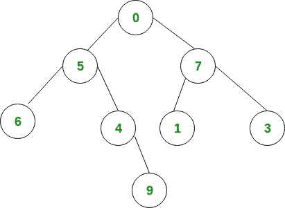

# 表示为字符串的树中第 k 级节点的乘积

> 原文:[https://www . geesforgeks . org/product-nodes-k-th-level-tree-presented-string/](https://www.geeksforgeeks.org/product-nodes-k-th-level-tree-represented-string/)

给定一个整数“K”和一个字符串格式的二叉树。树的每个节点的值都在 0 到 9 之间。我们需要从根开始寻找 K 级元素的乘积。根在 0 级。
**注:**树以下列形式给出:(节点值(左子树)(右子树))
**例:**

```
Input : tree = "(0(5(6()())(4()(9()())))(7(1()())(3()())))" 
        k = 2
Output : 72
Its tree representation is shown below
```



```
Elements at level k = 2 are 6, 4, 1, 3
sum of the digits of these elements = 6 * 4 * 1 * 3 = 72 

Input : tree = "(8(3(2()())(6(5()())()))(5(10()())(7(13()())())))" 
        k = 3
Output : 15
Elements at level k = 3 are 5, 1 and 3
sum of digits of these elements = 5 * 1 * 3 = 15
```

**进场:**

```
1\. Input 'tree' in string format and level k
2\. Initialize level = -1 and product = 1
3\. for each character 'ch' in 'tree'
   3.1  if ch == '(' then
        --> level++
   3.2  else if ch == ')' then
        --> level--
   3.3  else
        if level == k then
           product = product * (ch-'0')
4\. Print product
```

## C++

```
// C++ implementation to find product of
// digits of elements at k-th level
#include <bits/stdc++.h>
using namespace std;

// Function to find product of digits
// of elements at k-th level
int productAtKthLevel(string tree, int k)
{
    int level = -1;
    int product = 1; // Initialize result
    int n = tree.length();

    for (int i = 0; i < n; i++) {
        // increasing level number
        if (tree[i] == '(')
            level++;

        // decreasing level number
        else if (tree[i] == ')')
            level--;

        else {
            // check if current level is
            // the desired level or not
            if (level == k)
                product *= (tree[i] - '0');
        }
    }

    // required product
    return product;
}

// Driver program
int main()
{
    string tree = "(0(5(6()())(4()(9()())))(7(1()())(3()())))";
    int k = 2;
    cout << productAtKthLevel(tree, k);
    return 0;
}
```

## Java 语言(一种计算机语言，尤用于创建网站)

```
// Java implementation to find product of
// digits of elements at k-th level

class GFG
{
    // Function to find product of digits
    // of elements at k-th level
    static int productAtKthLevel(String tree, int k)
    {
        int level = -1;

        // Initialize result
        int product = 1;

        int n = tree.length();

        for (int i = 0; i < n; i++)
        {
            // increasing level number
            if (tree.charAt(i) == '(')
                level++;

            // decreasing level number
            else if (tree.charAt(i) == ')')
                level--;

            else
            {
                // check if current level is
                // the desired level or not
                if (level == k)
                    product *= (tree.charAt(i) - '0');
            }
        }

        // required product
        return product;
    }

    // Driver program
    public static void main(String[] args)
    {
        String tree = "(0(5(6()())(4()(9()())))(7(1()())(3()())))";
        int k = 2;
        System.out.println(productAtKthLevel(tree, k));
    }
}

// This code is contributed
// by Smitha Dinesh Semwal.
```

## 蟒蛇 3

```
# Python 3 implementation
# to find product of
# digits of elements
# at k-th level

# Function to find
# product of digits
# of elements at
# k-th level
def productAtKthLevel(tree, k):

    level = -1

        # Initialize result
    product = 1
    n = len(tree)

    for i in range(0, n):

        # increasing level number
        if (tree[i] == '('):
            level+=1

        # decreasing level number
        elif (tree[i] == ')'):
            level-=1

        else:
            # check if current level is
            # the desired level or not
            if (level == k):
                product *= (int(tree[i]) - int('0'))

    # required product
    return product

# Driver program
tree = "(0(5(6()())(4()(9()())))(7(1()())(3()())))"
k = 2

print(productAtKthLevel(tree, k))

# This code is contributed by
# Smitha Dinesh Semwal
```

## C#

```
// C# implementation to find
// product of digits of
// elements at k-th level
using System;

class GFG
{
    // Function to find product
    // of digits of elements
    // at k-th level
    static int productAtKthLevel(string tree,
                                 int k)
    {
        int level = -1;

        // Initialize result
        int product = 1;

        int n = tree.Length;

        for (int i = 0; i < n; i++)
        {
            // increasing
            // level number
            if (tree[i] == '(')
                level++;

            // decreasing
            // level number
            else if (tree[i] == ')')
                level--;

            else
            {
                // check if current level is
                // the desired level or not
                if (level == k)
                    product *= (tree[i] - '0');
            }
        }

        // required product
        return product;
    }

    // Driver Code
    static void Main()
    {
        string tree = "(0(5(6()())(4()(9()())))(7(1()())(3()())))";
        int k = 2;
        Console.WriteLine(productAtKthLevel(tree, k));
    }
}

// This code is contributed by Sam007
```

## 服务器端编程语言（Professional Hypertext Preprocessor 的缩写）

```
<?php
// php implementation to find product of
// digits of elements at k-th level

// Function to find product of digits
// of elements at k-th level
function productAtKthLevel($tree, $k)
{
    $level = -1;
    $product = 1; // Initialize result
    $n = strlen($tree);

    for ($i = 0; $i < $n; $i++)
    {

        // increasing level number
        if ($tree[$i] == '(')
            $level++;

        // decreasing level number
        else if ($tree[$i] == ')')
            $level--;

        else
        {
            // check if current level is
            // the desired level or not
            if ($level == $k)
                $product *= (ord($tree[$i]) -
                             ord('0'));
        }
    }

    // required product
    return $product;
}

    // Driver Code
    $tree = "(0(5(6()())(4()(9()())))(7(1()())(3()())))";
    $k = 2;
    echo productAtKthLevel($tree, $k);

//This code is contributed by mits
?>
```

## java 描述语言

```
<script>
    // Javascript implementation to find
    // product of digits of
    // elements at k-th level

    // Function to find product
    // of digits of elements
    // at k-th level
    function productAtKthLevel(tree, k)
    {
        let level = -1;

        // Initialize result
        let product = 1;

        let n = tree.length;

        for (let i = 0; i < n; i++)
        {
            // increasing
            // level number
            if (tree[i] == '(')
                level++;

            // decreasing
            // level number
            else if (tree[i] == ')')
                level--;

            else
            {
                // check if current level is
                // the desired level or not
                if (level == k)
                    product *= (tree[i].charCodeAt() - '0'.charCodeAt());
            }
        }

        // required product
        return product;
    }

    let tree = "(0(5(6()())(4()(9()())))(7(1()())(3()())))";
    let k = 2;
    document.write(productAtKthLevel(tree, k));

</script>
```

**输出:**

```
72
```

**时间复杂度:** O(n)

https://youtu.be/Y

-耶尔马 XlSbQ？list = plqm 7 alhxfyshcxd 7r 1j0ky 9 ZG _ gbb 1 dbk〖t0〗]