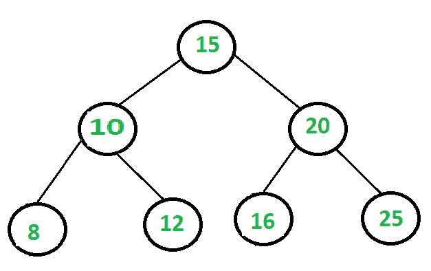

# 二叉树中所有节点的乘积

> 原文:[https://www . geesforgeks . org/二叉树中所有节点的乘积/](https://www.geeksforgeeks.org/product-of-all-nodes-in-a-binary-tree/)

给定一个[二叉树](https://www.geeksforgeeks.org/binary-tree-data-structure/)。任务是编写一个程序来寻找给定二叉树所有节点的乘积。



在上面的二叉树中，
**积**= 15 * 10 * 8 * 12 * 20 * 16 * 25 = 115200000

想法是递归:

*   求左子树的积。
*   找到正确子树的乘积。
*   将左右子树的乘积与当前节点的数据相乘并返回。

以下是上述方法的实现:

## C++

```
// Program to print product of all
// the nodes of a binary tree
#include <iostream>
using namespace std;

// Binary Tree Node
struct Node {
    int key;
    Node *left, *right;
};

/* utility that allocates a new Node
   with the given key */
Node* newNode(int key)
{
    Node* node = new Node;
    node->key = key;
    node->left = node->right = NULL;
    return (node);
}

// Function to find product of
// all the nodes
int productBT(Node* root)
{
    if (root == NULL)
        return 1;

    return (root->key * productBT(root->left) * productBT(root->right));
}

// Driver Code
int main()
{
    // Binary Tree is:
    //       1
    //      /  \
    //     2    3
    //    / \  / \
    //   4   5 6  7
    //          \
    //           8
    Node* root = newNode(1);
    root->left = newNode(2);
    root->right = newNode(3);
    root->left->left = newNode(4);
    root->left->right = newNode(5);
    root->right->left = newNode(6);
    root->right->right = newNode(7);
    root->right->left->right = newNode(8);

    int prod = productBT(root);

    cout << "Product of all the nodes is: "
         << prod << endl;

    return 0;
}
```

## Java 语言(一种计算机语言，尤用于创建网站)

```

// Java Program to print product of all
// the nodes of a binary tree
import java.util.*;
class solution
{

// Binary Tree Node
static class Node {
    int key;
    Node left, right;
};

/* utility that allocates a new Node
   with the given key */
static Node newNode(int key)
{
    Node node = new Node();
    node.key = key;
    node.left = node.right = null;
    return (node);
}

// Function to find product of
// all the nodes
static int productBT(Node root)
{
    if (root == null)
        return 1;

    return (root.key * productBT(root.left) * productBT(root.right));
}

// Driver Code
public static void main(String args[])
{
    // Binary Tree is:
    //       1
    //      /  \
    //     2    3
    //    / \  / \
    //   4   5 6  7
    //          \
    //           8
    Node root = newNode(1);
    root.left = newNode(2);
    root.right = newNode(3);
    root.left.left = newNode(4);
    root.left.right = newNode(5);
    root.right.left = newNode(6);
    root.right.right = newNode(7);
    root.right.left.right = newNode(8);

    int prod = productBT(root);

    System.out.println( "Product of all the nodes is: "+prod);

}
}
//contributed by Arnab Kundu
```

## 蟒蛇 3

```
# Python3 Program to print product of
# all the nodes of a binary tree

# Binary Tree Node

""" utility that allocates a new Node
with the given key """
class newNode:

    # Construct to create a new node
    def __init__(self, key):
        self.key = key
        self.left = None
        self.right = None

# Function to find product of
# all the nodes
def productBT( root) :

    if (root == None):
        return 1

    return (root.key * productBT(root.left) *
                       productBT(root.right))

# Driver Code
if __name__ == '__main__':

    # Binary Tree is:
    #     1
    #     / \
    #     2 3
    # / \ / \
    # 4 5 6 7
    #         \
    #         8
    root = newNode(1)
    root.left = newNode(2)
    root.right = newNode(3)
    root.left.left = newNode(4)
    root.left.right = newNode(5)
    root.right.left = newNode(6)
    root.right.right = newNode(7)
    root.right.left.right = newNode(8)

    prod = productBT(root)

    print("Product of all the nodes is:", prod)

# This code is contributed by
# Shubham Singh(SHUBHAMSINGH10)
```

## C#

```
// C# Program to print product of all
// the nodes of a binary tree
using System;

class GFG
{

    // Binary Tree Node
    class Node
    {
        public int key;
        public Node left, right;
    };

    /* utility that allocates a new Node
    with the given key */
    static Node newNode(int key)
    {
        Node node = new Node();
        node.key = key;
        node.left = node.right = null;
        return (node);
    }

    // Function to find product of
    // all the nodes
    static int productBT(Node root)
    {
        if (root == null)
            return 1;

        return (root.key * productBT(root.left) *
                        productBT(root.right));
    }

    // Driver Code
    public static void Main()
    {
        // Binary Tree is:
        //     1
        //     / \
        //     2 3
        // / \ / \
        // 4 5 6 7
        //         \
        //         8
        Node root = newNode(1);
        root.left = newNode(2);
        root.right = newNode(3);
        root.left.left = newNode(4);
        root.left.right = newNode(5);
        root.right.left = newNode(6);
        root.right.right = newNode(7);
        root.right.left.right = newNode(8);

        int prod = productBT(root);

        Console.WriteLine( "Product of all " +
                        "the nodes is: " + prod);
    }
}

/* This code is contributed PrinciRaj1992 */
```

## java 描述语言

```

<script>
// javascript Program to print product of all
// the nodes of a binary tree
// Binary Tree Node
class Node {
    constructor(val) {
        this.key = val;
        this.left = null;
        this.right = null;
    }
}
/* utility that allocates a new Node
   with the given key */
function newNode(key)
{
    var node = new Node();
    node.key = key;
    node.left = node.right = null;
    return (node);
}

// Function to find product of
// all the nodes
function productBT(root)
{
    if (root == null)
        return 1;

    return (root.key * productBT(root.left) * productBT(root.right));
}

// Driver Code

    // Binary Tree is:
    //       1
    //      /  \
    //     2    3
    //    / \  / \
    //   4   5 6  7
    //          \
    //           8
    var root = newNode(1);
    root.left = newNode(2);
    root.right = newNode(3);
    root.left.left = newNode(4);
    root.left.right = newNode(5);
    root.right.left = newNode(6);
    root.right.right = newNode(7);
    root.right.left.right = newNode(8);

    var prod = productBT(root);

    document.write( "Product of all the nodes is: "+prod);

// This code contributed by gauravrajput1
</script>
```

## java 描述语言

```

<script>
// javascript Program to print product of all
// the nodes of a binary tree
// Binary Tree Node
class Node {
    constructor(val) {
        this.key = val;
        this.left = null;
        this.right = null;
    }
}

/* utility that allocates a new Node
   with the given key */
function newNode(key)
{
    var node = new Node();
    node.key = key;
    node.left = node.right = null;
    return (node);
}

// Function to find product of
// all the nodes
function productBT(root)
{
    if (root == null)
        return 1;

    return (root.key * productBT(root.left) * productBT(root.right));
}

// Driver Code

    // Binary Tree is:
    //       1
    //      /  \
    //     2    3
    //    / \  / \
    //   4   5 6  7
    //          \
    //           8
    var root = newNode(1);
    root.left = newNode(2);
    root.right = newNode(3);
    root.left.left = newNode(4);
    root.left.right = newNode(5);
    root.right.left = newNode(6);
    root.right.right = newNode(7);
    root.right.left.right = newNode(8);

    var prod = productBT(root);

    document.write( "Product of all the nodes is: "+prod);

// This code contributed by umadevi9616
</script>
```

**输出:**

```
Product of all the nodes is: 40320
```

**时间复杂度:** O(n)