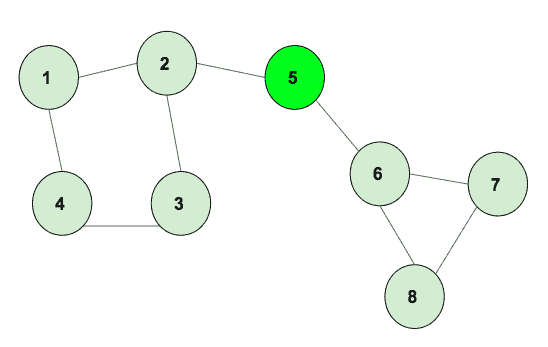

# 无向图

中所有循环长度的乘积

> 原文： [https://www.geeksforgeeks.org/product-of-lengths-of-all-cycles-in-an-undirected-graph/](https://www.geeksforgeeks.org/product-of-lengths-of-all-cycles-in-an-undirected-graph/)

给定一个无向和无权图。 任务是找到其中形成的所有循环的长度的乘积。

**示例 1**：



> 上图有两个长度为 4 和 3 的循环，循环长度的乘积为 12。

**示例 2**：


> 上图有两个长度为 4 和 3 的循环，循环长度的乘积为 12。

**方法**：使用[图形着色方法](https://www.geeksforgeeks.org/detect-cycle-direct-graph-using-colors/)，用唯一的数字标记不同循环的所有顶点。 图形遍历完成后，将所有相似的标记数字推入邻接表，并相应地打印邻接表。 下面给出的是算法：

*   将边插入邻接表。

*   调用 DFS 函数，该函数使用着色方法标记顶点。

*   每当有部分访问的顶点时，请回溯直到到达当前顶点，并用周期号标记所有顶点。 标记所有顶点后，增加循环数。

*   Dfs 完成后，迭代边，并将相同的标记数字边推到另一个邻接列表。

*   在另一个邻接列表中进行迭代，并使用映射号和循环号保留一个循环中的顶点数

*   循环编号，并乘以长度以获得最终乘积，这将是答案。

下面是上述方法的实现：

## C++

```cpp

// C++ program to find the 
// product of lengths of cycle 
#include <bits/stdc++.h> 
using namespace std; 
const int N = 100000; 

// variables to be used 
// in both functions 
vector<int> graph[N]; 

// Function to mark the vertex with 
// different colors for different cycles 
void dfs_cycle(int u, int p, int color[], 
            int mark[], int par[], int& cyclenumber) 
{ 

    // already (completely) visited vertex. 
    if (color[u] == 2) { 
        return; 
    } 

    // seen vertex, but was not completely  
    // visited -> cycle detected. 
    // backtrack based on parents to find 
    // the complete cycle. 
    if (color[u] == 1) { 

        cyclenumber++; 
        int cur = p; 
        mark[cur] = cyclenumber; 

        // backtrack the vertex which are 
        // in the current cycle thats found 
        while (cur != u) { 
            cur = par[cur]; 
            mark[cur] = cyclenumber; 
        } 
        return; 
    } 
    par[u] = p; 

    // partially visited. 
    color[u] = 1; 

    // simple dfs on graph 
    for (int v : graph[u]) { 

        // if it has not been visited previously 
        if (v == par[u]) { 
            continue; 
        } 
        dfs_cycle(v, u, color, mark, par, cyclenumber); 
    } 

    // completely visited. 
    color[u] = 2; 
} 

// add the edges to the graph 
void addEdge(int u, int v) 
{ 
    graph[u].push_back(v); 
    graph[v].push_back(u); 
} 

// Function to print the cycles 
int productLength(int edges, int mark[], int& cyclenumber) 
{ 
    unordered_map<int, int> mp; 

    // push the edges that into the 
    // cycle adjacency list 
    for (int i = 1; i <= edges; i++) { 
        if (mark[i] != 0) 
            mp[mark[i]]++; 
    } 
    int cnt = 1; 

    // prodcut all the length of cycles 
    for (int i = 1; i <= cyclenumber; i++) { 
        cnt = cnt * mp[i]; 
    } 
    if (cyclenumber == 0) 
        cnt = 0; 

    return cnt; 
} 

// Driver Code 
int main() 
{ 

    // add edges 
    addEdge(1, 2); 
    addEdge(2, 3); 
    addEdge(3, 4); 
    addEdge(4, 6); 
    addEdge(4, 7); 
    addEdge(5, 6); 
    addEdge(3, 5); 
    addEdge(7, 8); 
    addEdge(6, 10); 
    addEdge(5, 9); 
    addEdge(10, 11); 
    addEdge(11, 12); 
    addEdge(11, 13); 
    addEdge(12, 13); 

    // arrays required to color the 
    // graph, store the parent of node 
    int color[N]; 
    int par[N]; 

    // mark with unique numbers 
    int mark[N]; 

    // store the numbers of cycle 
    int cyclenumber = 0; 
    int edges = 13; 

    // call DFS to mark the cycles 
    dfs_cycle(1, 0, color, mark, par, cyclenumber); 

    // function to print the cycles 
    cout << productLength(edges, mark, cyclenumber); 

    return 0; 
} 

```

## Java

```java

// Java program to find the  
// product of lengths of cycle 
import java.io.*; 
import java.util.*; 

class GFG  
{ 
    static int N = 100000; 
    static int cyclenumber; 

    // variables to be used 
    // in both functions 
    //@SuppressWarnings("unchecked") 
    static Vector<Integer>[] graph = new Vector[N]; 

    // This static block is used to initialize  
    // array of Vector, otherwise it will throw 
    // NullPointerException 
    static 
    { 
        for (int i = 0; i < N; i++) 
            graph[i] = new Vector<>(); 
    } 

    // Function to mark the vertex with 
    // different colors for different cycles 
    static void dfs_cycle(int u, int p, int[] color,  
                          int[] mark, int[] par)  
    { 

        // already (completely) visited vertex. 
        if (color[u] == 2) 
            return; 

        // seen vertex, but was not completely 
        // visited -> cycle detected. 
        // backtrack based on parents to find 
        // the complete cycle. 
        if (color[u] == 1)  
        { 
            cyclenumber++; 
            int cur = p; 
            mark[cur] = cyclenumber; 

            // backtrack the vertex which are 
            // in the current cycle thats found 
            while (cur != u) 
            { 
                cur = par[cur]; 
                mark[cur] = cyclenumber; 
            } 
            return; 
        } 
        par[u] = p; 

        // partially visited. 
        color[u] = 1; 

        // simple dfs on graph 
        for (int v : graph[u])  
        { 

            // if it has not been visited previously 
            if (v == par[u]) 
            { 
                continue; 
            } 
            dfs_cycle(v, u, color, mark, par); 
        } 

        // completely visited. 
        color[u] = 2; 
    } 

    // add the edges to the graph 
    static void addEdge(int u, int v) 
    { 
        graph[u].add(v); 
        graph[v].add(u); 
    } 

    // Function to print the cycles 
    static int productLength(int edges, int[] mark)  
    { 
        HashMap<Integer,  
                Integer> mp = new HashMap<>(); 

        // push the edges that into the 
        // cycle adjacency list 
        for (int i = 1; i <= edges; i++) 
        { 
            if (mark[i] != 0) 
            { 
                mp.put(mark[i], mp.get(mark[i]) == null ?  
                                1 : mp.get(mark[i]) + 1); 
            } 
        } 
        int cnt = 1; 

        // prodcut all the length of cycles 
        for (int i = 1; i <= cyclenumber; i++)  
        { 
            cnt = cnt * mp.get(i); 
        } 
        if (cyclenumber == 0) 
            cnt = 0; 

        return cnt; 
    } 

    // Driver Code 
    public static void main(String[] args) throws IOException  
    { 

        // add edges 
        addEdge(1, 2); 
        addEdge(2, 3); 
        addEdge(3, 4); 
        addEdge(4, 6); 
        addEdge(4, 7); 
        addEdge(5, 6); 
        addEdge(3, 5); 
        addEdge(7, 8); 
        addEdge(6, 10); 
        addEdge(5, 9); 
        addEdge(10, 11); 
        addEdge(11, 12); 
        addEdge(11, 13); 
        addEdge(12, 13); 

        // arrays required to color the 
        // graph, store the parent of node 
        int[] color = new int[N]; 
        int[] par = new int[N]; 

        // mark with unique numbers 
        int[] mark = new int[N]; 

        // store the numbers of cycle 
        cyclenumber = 0; 
        int edges = 13; 

        // call DFS to mark the cycles 
        dfs_cycle(1, 0, color, mark, par); 

        // function to print the cycles 
        System.out.println(productLength(edges, mark)); 
    } 
} 

// This code is contributed by 
// sanjeev2552 

```

## Python

```py

# Python3 program to find the 
# product of lengths of cycle 
from collections import defaultdict 

# Function to mark the vertex with 
# different colors for different cycles 
def dfs_cycle(u, p, color, mark, par): 

    global cyclenumber 

    # already (completely) visited vertex. 
    if color[u] == 2:  
        return

    # seen vertex, but was not completely  
    # visited -> cycle detected. 
    # backtrack based on parents to find 
    # the complete cycle. 
    if color[u] == 1:  

        cyclenumber += 1
        cur = p 
        mark[cur] = cyclenumber 

        # backtrack the vertex which are 
        # in the current cycle thats found 
        while cur != u:  
            cur = par[cur] 
            mark[cur] = cyclenumber 

        return

    par[u] = p 

    # partially visited. 
    color[u] = 1

    # simple dfs on graph 
    for v in graph[u]:  

        # if it has not been visited previously 
        if v == par[u]:  
            continue

        dfs_cycle(v, u, color, mark, par) 

    # completely visited. 
    color[u] = 2

# add the edges to the graph 
def addEdge(u, v): 

    graph[u].append(v) 
    graph[v].append(u) 

# Function to print the cycles 
def productLength(edges, mark, cyclenumber): 

    mp = defaultdict(lambda:0) 

    # push the edges that into the 
    # cycle adjacency list 
    for i in range(1, edges+1):  
        if mark[i] != 0: 
            mp[mark[i]] += 1

    cnt = 1

    # prodcut all the length of cycles 
    for i in range(1, cyclenumber + 1):  
        cnt = cnt * mp[i] 

    if cyclenumber == 0: 
        cnt = 0

    return cnt 

# Driver Code 
if __name__ == "__main__": 

    N = 100000
    graph = [[] for i in range(N)] 

    # add edges 
    addEdge(1, 2) 
    addEdge(2, 3) 
    addEdge(3, 4) 
    addEdge(4, 6) 
    addEdge(4, 7) 
    addEdge(5, 6) 
    addEdge(3, 5) 
    addEdge(7, 8) 
    addEdge(6, 10) 
    addEdge(5, 9) 
    addEdge(10, 11) 
    addEdge(11, 12) 
    addEdge(11, 13) 
    addEdge(12, 13) 

    # arrays required to color the 
    # graph, store the parent of node 
    color, par = [None] * N, [None] * N 

    # mark with unique numbers 
    mark = [None] * N 

    # store the numbers of cycle 
    cyclenumber, edges = 0, 13

    # call DFS to mark the cycles 
    dfs_cycle(1, 0, color, mark, par) 

    # function to print the cycles 
    print(productLength(edges, mark,  
                        cyclenumber)) 

# This code is contributed by Rituraj Jain 

```

## C#

```cs

// C# program to find the  
// product of lengths of cycle 
using System; 
using System.Collections.Generic; 

class GFG  
{ 
    static int N = 100000; 
    static int cyclenumber; 

    // variables to be used 
    // in both functions 
    //@SuppressWarnings("unchecked") 
    static List<int>[] graph = new List<int>[N]; 

    // This static block is used to initialize  
    // array of List, otherwise it will throw 
    // NullPointerException 

    // Function to mark the vertex with 
    // different colors for different cycles 
    static void dfs_cycle(int u, int p, int[] color,  
                        int[] mark, int[] par)  
    { 

        // already (completely) visited vertex. 
        if (color[u] == 2) 
            return; 

        // seen vertex, but was not completely 
        // visited -> cycle detected. 
        // backtrack based on parents to find 
        // the complete cycle. 
        if (color[u] == 1)  
        { 
            cyclenumber++; 
            int cur = p; 
            mark[cur] = cyclenumber; 

            // backtrack the vertex which are 
            // in the current cycle thats found 
            while (cur != u) 
            { 
                cur = par[cur]; 
                mark[cur] = cyclenumber; 
            } 
            return; 
        } 
        par[u] = p; 

        // partially visited. 
        color[u] = 1; 

        // simple dfs on graph 
        foreach (int v in graph[u])  
        { 

            // if it has not been visited previously 
            if (v == par[u]) 
            { 
                continue; 
            } 
            dfs_cycle(v, u, color, mark, par); 
        } 

        // completely visited. 
        color[u] = 2; 
    } 

    // add the edges to the graph 
    static void addEdge(int u, int v) 
    { 
        graph[u].Add(v); 
        graph[v].Add(u); 
    } 

    // Function to print the cycles 
    static int productLength(int edges, int[] mark)  
    { 
        Dictionary<int,int> mp = new Dictionary<int,int>(); 

        // push the edges that into the 
        // cycle adjacency list 
        for (int i = 1; i <= edges; i++) 
        { 
            if (mark[i] != 0) 
            { 
                    if(mp.ContainsKey(mark[i])) 
                        mp[mark[i]] = mp[mark[i]] + 1;  
                    else
                        mp.Add(mark[i], 1); 

            } 
        } 
        int cnt = 1; 

        // prodcut all the length of cycles 
        for (int i = 1; i <= cyclenumber; i++)  
        { 
            cnt = cnt * mp[i]; 
        } 
        if (cyclenumber == 0) 
            cnt = 0; 

        return cnt; 
    } 

    // Driver Code 
    public static void Main(String[] args) 
    { 

        for (int i = 0; i < N; i++) 
            graph[i] = new List<int>(); 

        // add edges 
        addEdge(1, 2); 
        addEdge(2, 3); 
        addEdge(3, 4); 
        addEdge(4, 6); 
        addEdge(4, 7); 
        addEdge(5, 6); 
        addEdge(3, 5); 
        addEdge(7, 8); 
        addEdge(6, 10); 
        addEdge(5, 9); 
        addEdge(10, 11); 
        addEdge(11, 12); 
        addEdge(11, 13); 
        addEdge(12, 13); 

        // arrays required to color the 
        // graph, store the parent of node 
        int[] color = new int[N]; 
        int[] par = new int[N]; 

        // mark with unique numbers 
        int[] mark = new int[N]; 

        // store the numbers of cycle 
        cyclenumber = 0; 
        int edges = 13; 

        // call DFS to mark the cycles 
        dfs_cycle(1, 0, color, mark, par); 

        // function to print the cycles 
        Console.WriteLine(productLength(edges, mark)); 
    } 
} 

// This code is contributed by 29AjayKumar 

```

**Output:**

```
12

```

**时间复杂度**：`O(N)`，其中 N 是图中的节点数。


* * *

* * *

如果您喜欢 GeeksforGeeks 并希望做出贡献，则还可以使用 [tribution.geeksforgeeks.org](https://contribute.geeksforgeeks.org/) 撰写文章，或将您的文章邮寄至 tribution@geeksforgeeks.org。 查看您的文章出现在 GeeksforGeeks 主页上，并帮助其他 Geeks。

如果您发现任何不正确的地方，请单击下面的“改进文章”按钮，以改进本文。