# 给定几何级数的 N 项乘积

> 原文:[https://www . geesforgeks . org/给定几何级数的 n 项产品/](https://www.geeksforgeeks.org/product-of-n-terms-of-a-given-geometric-series/)

给定一个数 **N** ，第一项 **'a'** 和一个[几何级数](https://www.geeksforgeeks.org/geometric-progression/)的公共比 **'r'** ，任务是找到给定几何级数的前 N 项的乘积。

**示例:**

> **输入:** a = 1，r = 2，N = 4
> **输出:** 64
> **解释:**
> 上述通用术语的前四个术语是 1、2、4、8。
> 四个数的乘积是 1*2*4*8 = 64
> 
> **输入:** a = 1，r = 0.5，N = 3
> **输出:** 0.125
> **解释:**
> 上述 G.P .的前三项为 1，1/2，1/4。
> 四个数的乘积是 1*(1/2)*(1/4) = 1/8 = 0.125

**天真法:**思路是找出给定几何级数的所有 N 项，将得到的所有项相乘。

下面是上述方法的实现:

## C++

```
// C++ program for the above approach
#include <bits/stdc++.h>
using namespace std;

// Function to calculate product of
// geometric series
float productOfGP(float a, float r, int n)
{
    // Initialise final product with 1
    float product = 1;

    for (int i = 0; i < n; i++) {
        // Multiply product with each
        // term stored in a
        product = product * a;
        a = a * r;
    }

    // Return the final product
    return product;
}

// Driver Code
int main()
{
    // Given first term
    // and common ratio
    float a = 1, r = 2;

    // Number of terms
    int N = 4;

    // Function Call
    cout << productOfGP(a, r, N);
}
```

## Java 语言(一种计算机语言，尤用于创建网站)

```
// Java program for the above approach
import java.util.*;
class GFG{

// Function to calculate product of
// geometric series
static float productOfGP(float a,
                         float r, int n)
{
    // Initialise final product with 1
    float product = 1;

    for (int i = 0; i < n; i++)
    {
        // Multiply product with each
        // term stored in a
        product = product * a;
        a = a * r;
    }

    // Return the final product
    return product;
}

// Driver Code
public static void main(String args[])
{
    // Given first term
    // and common ratio
    float a = 1, r = 2;

    // Number of terms
    int N = 4;

    // Function Call
    System.out.print(productOfGP(a, r, N));
}
}

// This code is contributed by Code_Mech
```

## 蟒蛇 3

```
# Python3 program for the above approach

# Function to calculate product of
# geometric series
def productOfGP(a, r, n):

    # Initialise final product with 1
    product = 1;

    for i in range(0, n):

        # Multiply product with each
        # term stored in a
        product = product * a;
        a = a * r;

    # Return the final product
    return product;

# Driver code

# Given first term
# and common ratio
a = 1
r = 2;

# Number of terms
N = 4;

# Function Call
print(productOfGP(a, r, N))

# This code is contributed by Pratima Pandey.
```

## C#

```
// C# program for the above approach
using System;
class GFG{

// Function to calculate product of
// geometric series
static float productOfGP(float a,
                         float r, int n)
{
    // Initialise final product with 1
    float product = 1;

    for (int i = 0; i < n; i++)
    {
        // Multiply product with each
        // term stored in a
        product = product * a;
        a = a * r;
    }

    // Return the final product
    return product;
}

// Driver Code
public static void Main()
{
    // Given first term
    // and common ratio
    float a = 1, r = 2;

    // Number of terms
    int N = 4;

    // Function Call
    Console.Write(productOfGP(a, r, N));
}
}

// This code is contributed by Code_Mech
```

## java 描述语言

```
<script>
    // Javascript program for the above approach 

    // Function to calculate product of
    // geometric series
    function productOfGP(a, r, n)
    {

        // Initialise final product with 1
        let product = 1;

        for (let i = 0; i < n; i++)
        {

            // Multiply product with each
            // term stored in a
            product = product * a;
            a = a * r;
        }

        // Return the final product
        return product;
    }

    // Given first term
    // and common ratio
    let a = 1, r = 2;

    // Number of terms
    let N = 4;

    // Function Call
    document.write(productOfGP(a, r, N));

   // This code is contributed by divyesh072019.
</script>
```

**Output:** 

```
64
```

**有效方法:**有效方法是观察给定几何级数的所有 **N 项**的乘积形成公式:

> 总检察长是
> 
> 
> 产品至第一期限=
> 
> 产品至第二期限=
> 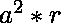
> 产品至第三期限=
> 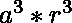
> 产品至第四期限=
> 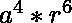
> 。
> 。
> 。
> 产品更新条款=
> 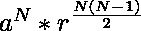

下面是上述方法的实现:

## C++

```
// C++ program for the above approach
#include <bits/stdc++.h>
using namespace std;

// Function to calculate product of
// geometric series
float productOfGP(float a, float r,
                  int n)
{
    // Return the final product with the
    // above formula
    return pow(a, n)
           * pow(r, n * (n - 1) / 2);
}

// Driver Code
int main()
{
    // Given first term
    // and common ratio
    float a = 1, r = 2;

    // Number of terms
    int N = 4;

    // Function Call
    cout << productOfGP(a, r, N);
}
```

## Java 语言(一种计算机语言，尤用于创建网站)

```
// Java program for the above approach
class GFG{

// Function to calculate product of
// geometric series
static float productOfGP(float a, float r, int n)
{

    // Return the final product with the
    // above formula
    return (float)Math.pow(a, n) *
           (float)Math.pow(r, n * (n - 1) / 2);
}

// Driver Code
public static void main(String s[])
{

    // Given first term
    // and common ratio
    float a = 1, r = 2;

    // Number of terms
    int N = 4;

    // Function Call
    System.out.println(productOfGP(a, r, N));
}
}

// This code is contributed by rutvik_56
```

## 蟒蛇 3

```
# Python3 program for the above approach

# Function to calculate product of
# geometric series
def productOfGP(a, r, n):

    # Return the final product with the
    # above formula
    return pow(a, n) * pow(r, n * (n - 1) // 2);

# Driver Code

# Given first term
# and common ratio
a = 1; r = 2;

# Number of terms
N = 4;

# Function Call
print(productOfGP(a, r, N));

# This code is contributed by Code_Mech
```

## C#

```
// C# program for the above approach
using System;
class GFG{

// Function to calculate product of
// geometric series
static float productOfGP(float a, float r, int n)
{

    // Return the final product with the
    // above formula
    return (float)Math.Pow(a, n) *
           (float)Math.Pow(r, n * (n - 1) / 2);
}

// Driver Code
public static void Main(String[] args)
{

    // Given first term
    // and common ratio
    float a = 1, r = 2;

    // Number of terms
    int N = 4;

    // Function Call
    Console.WriteLine(productOfGP(a, r, N));
}
}

// This code is contributed by shivanisinghss2110
```

## java 描述语言

```
<script>

// Javascript program for the above approach

// Function to calculate product of
// geometric series
function productOfGP(a, r, n)
{

    // Return the final product with the
    // above formula
    return Math.pow(a, n) *
           Math.pow(r, n * (n - 1) / 2);
}

// Driver code

// Given first term
// and common ratio
let a = 1, r = 2;

// Number of terms
let N = 4;

// Function Call
document.write(productOfGP(a, r, N));

// This code is contributed by mukesh07

</script>
```

**Output:** 

```
64
```

***时间复杂度:** O(N)*
***辅助空间:*** *O(1)*

**另一种方法:**

> 假设有一个 N 项的 GP，如下所示:
> 
> 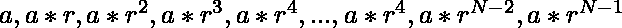
> 第一个和最后一个学期的乘积=
> 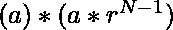
> =
> 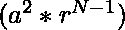
> 第二个和第二个学期的乘积=
> 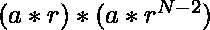
> =
> 
> 第三个和第三个学期的乘积=
> 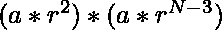
> =
> 
> 以此类推……
> 以几何级数表示，第一个和最后一个学期的乘积与第二个和第二个学期的乘积相同，以此类推，不管
> 因此，如果
> 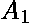和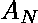是 GP 的第一个和最后一个术语，那么 GP 的前 N 个术语的乘积将是
> 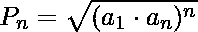

下面是上述方法的实现:

## C++

```
// C++ program for the above approach
#include <bits/stdc++.h>
using namespace std;

// Function to calculate product of N
// terms of geometric series
float productOfGP(float a, float r,
                  int n)
{
    // Find the product of first
    // and the last term
    int an = a * pow(r, n - 1);

    // Return the sqrt of the above
    // expression to find the product
    return sqrt(pow(a * an, n));
}

// Driver Code
int main()
{
    // Given first term
    // and common ratio
    float a = 1, r = 2;

    // Number of terms
    int N = 4;

    // Function Call
    cout << productOfGP(a, r, N);
}
```

## Java 语言(一种计算机语言，尤用于创建网站)

```
// Java program for the above approach
import java.util.*;
class GFG{

// Function to calculate product of N
// terms of geometric series
static float productOfGP(float a, float r, int n)
{
    // Find the product of first
    // and the last term
    int an = (int)(a * (int)(Math.pow(r, n - 1)));

    // Return the sqrt of the above
    // expression to find the product
    return (int)Math.sqrt((int)Math.pow(a * an, n));
}

// Driver Code
public static void main(String args[])
{
    // Given first term
    // and common ratio
    float a = 1, r = 2;

    // Number of terms
    int N = 4;

    // Function Call
    System.out.print(productOfGP(a, r, N));
}
}

// This code is contributed by Code_Mech
```

## 蟒蛇 3

```
# Python3 program for the above approach
import math

# Function to calculate product of N
# terms of geometric series
def productOfGP(a, r, n):

    # Find the product of first
    # and the last term
    an = a * pow(r, n - 1);

    # Return the sqrt of the above
    # expression to find the product
    return (math.sqrt(pow(a * an, n)))

# Driver code

# Given first term
# and common ratio
a = 1
r = 2;

# Number of terms
N = 4;

# Function Call
print(productOfGP(a, r, N))

# This code is contributed by Pratima Pandey.
```

## C#

```
// C# program for the above approach
using System;
class GFG{

// Function to calculate product of N
// terms of geometric series
static float productOfGP(float a, float r, int n)
{
    // Find the product of first
    // and the last term
    int an = (int)(a * (int)(Math.Pow(r, n - 1)));

    // Return the sqrt of the above
    // expression to find the product
    return (int)Math.Sqrt((int)Math.Pow(a * an, n));
}

// Driver Code
public static void Main()
{
    // Given first term
    // and common ratio
    float a = 1, r = 2;

    // Number of terms
    int N = 4;

    // Function Call
    Console.Write(productOfGP(a, r, N));
}
}

// This code is contributed by Code_Mech
```

## java 描述语言

```
<script>

// Javascript program for the above approach

// Function to calculate product of N
// terms of geometric series
function productOfGP(a, r, n)
{

    // Find the product of first
    // and the last term
    let an = a * Math.pow(r, n - 1);

    // Return the sqrt of the above
    // expression to find the product
    return Math.sqrt(Math.pow(a * an, n));
}

// Driver code

// Given first term
// and common ratio
let a = 1, r = 2;

// Number of terms
let N = 4;

// Function Call
document.write(productOfGP(a, r, N));

// This code is contributed by divyeshrabadiya07

</script>
```

**Output:** 

```
64
```