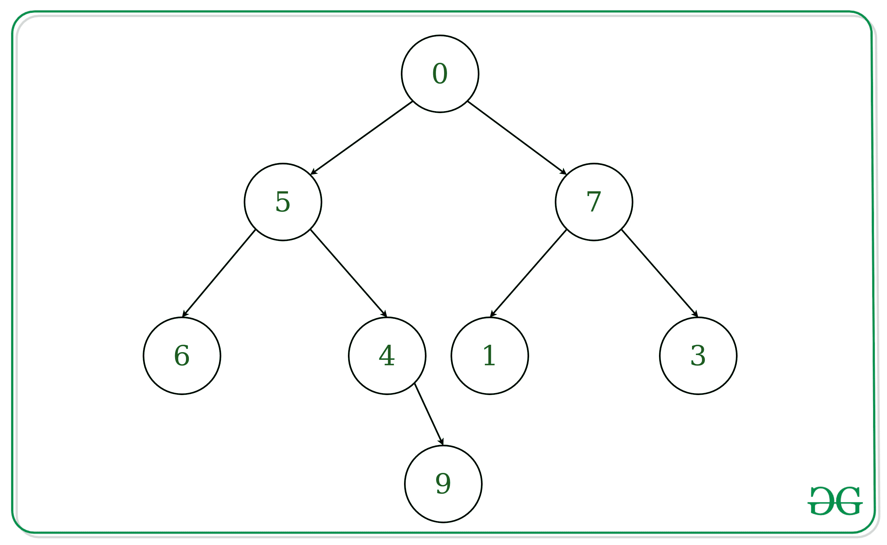

# 用递归表示为字符串的树中第 k 级节点的乘积

> 原文:[https://www . geeksforgeeks . org/树中第 k 级节点产品-使用递归表示为字符串/](https://www.geeksforgeeks.org/product-of-nodes-at-k-th-level-in-a-tree-represented-as-string-using-recursion/)

**先决条件:** [给定一个整数“ **K** ”和一个字符串格式的二叉树，表示为字符串](https://www.geeksforgeeks.org/product-nodes-k-th-level-tree-represented-string/)
的树中第 K 级节点的乘积。树的每个节点的值都在 0 到 9 之间。我们需要从根开始寻找 K 级元素的乘积。根在 0 级。
**注:**树以下列形式给出:(节点值(左子树)(右子树))
**例:**

> **输入:**Tree =“(0(5(6()))(4()(9())))(7(1()))(3())))”
> k = 2
> T4】输出:72
> T7】解释:T9】其树型表示如下
> 
> 
> 
> k = 2 级的元素是 6、4、1、3
> 这些元素的乘积= 6 * 4 * 1 * 3 = 72
> **输入:**Tree =“(8(3(2)(2)(3)))(6(5(5)(1)(3)))))(5(10(10)(6)(7(13)(2)))))))”
> k = 3
> **输出:**15
> k = 3 级的元素是这些元素的 5、1 和 3
> 的乘积

**方法:**想法是将字符串视为一棵树，而不实际创建一棵树，简单地以[后序方式](https://www.geeksforgeeks.org/iterative-postorder-traversal/)递归遍历字符串，并考虑仅在 k 级的节点。
以下是上述方法的实施:

## C++

```
// C++ implementation to find product
// of elements at k-th level

#include <bits/stdc++.h>
using namespace std;

// Recursive Function to find product
// of elements at k-th level
int productAtKthLevel(string tree,
            int k, int& i, int level){

    if (tree[i++] == '(') {

        // if subtree is null,
        // just like if root == NULL
        if (tree[i] == ')')
            return 1;

        int product = 1;

        // Consider only level k node
        // to be part of the product
        if (level == k)
            product = tree[i] - '0';

        // Recur for Left Subtree
        int leftproduct = productAtKthLevel(
                    tree, k, ++i, level + 1);

        // Recur for Right Subtree
        int rightproduct = productAtKthLevel(
                tree, k, ++i, level + 1);

        // Taking care of ')' after
        // left and right subtree
        ++i;
        return product * leftproduct *
                       rightproduct;
    }
}

// Driver Code
int main()
{
    string tree = "(0(5(6()())(4()"
    "(9()())))(7(1()())(3()())))";
    int k = 2;
    int i = 0;

    cout << productAtKthLevel(tree, k, i, 0);

    return 0;
}
```

## Java 语言(一种计算机语言，尤用于创建网站)

```
// Java implementation to find
// product of elements at k-th level

class GFG {
    static int i;

    // Recursive Function to find product
    // of elements at k-th level
    static int productAtKthLevel(
        String tree, int k, int level){

        if (tree.charAt(i++) == '(') {

            // if subtree is null,
            // just like if root == null
            if (tree.charAt(i) == ')')
                return 1;

            int product = 1;

            // Consider only level k node
            // to be part of the product
            if (level == k)
                product = tree.charAt(i) - '0';

            // Recur for Left Subtree
            ++i;
            int leftproduct = productAtKthLevel(
                            tree, k, level + 1);

            // Recur for Right Subtree
            ++i;
            int rightproduct = productAtKthLevel(
                            tree, k, level + 1);

            // Taking care of ')' after
            // left and right subtree
            ++i;
            return product * leftproduct
              * rightproduct;
        }
        return Integer.MIN_VALUE;
    }

    // Driver Code
    public static void main(String[] args)
    {
        String tree = "(0(5(6()())(4()"
        + "(9()())))(7(1()())(3()())))";
        int k = 2;
        i = 0;
        System.out.print(
            productAtKthLevel(tree, k, 0)
        );
    }
}
```

## 计算机编程语言

```
# Python implementation to find product of
# digits of elements at k-th level

# Recursive Function to find product
# of elements at k-th level
def productAtKthLevel(tree, k, i, level):

    if(tree[i[0]]=='('):
        i[0]+= 1
        # if subtree is null,
        # just like if root == NULL
        if(tree[i[0]] == ')'):
            return 1           

        product = 1
        # Consider only level k node
        # to be part of the product
        if(level == k):
            product = int(tree[i[0]])

        # Recur for Left Subtree
        i[0]+= 1
        leftproduct = productAtKthLevel(tree,
                            k, i, level + 1)

        # Recur for Right Subtree
        i[0]+= 1
        rightproduct = productAtKthLevel(tree,
                            k, i, level + 1)

        # Taking care of ')' after left and right subtree
        i[0]+= 1
        return product * leftproduct * rightproduct        

# Driver Code
if __name__ == "__main__":
    tree = "(0(5(6()())(4()(9()())))(7(1()())(3()())))"
    k = 2
    i =[0]
    print(productAtKthLevel(tree, k, i, 0))
```

## C#

```
// C# implementation to find product
// of elements at k-th level

using System;

class GFG {
    static int i;

    // Recursive Function to find product
    // of elements at k-th level
    static int productAtKthLevel(
        String tree, int k, int level){

        if (tree[i++] == '(') {

            // if subtree is null,
            // just like if root == null
            if (tree[i] == ')')
                return 1;

            int product = 1;

            // Consider only level k node
            // to be part of the product
            if (level == k)
                product = tree[i] - '0';

            // Recur for Left Subtree
            ++i;
            int leftproduct = productAtKthLevel(
                            tree, k, level + 1);

            // Recur for Right Subtree
            ++i;
            int rightproduct =
            productAtKthLevel(tree, k, level + 1);

            // Taking care of ')' after
            // left and right subtree
            ++i;
            return product *
              leftproduct * rightproduct;
        }
        return int.MinValue;
    }

    // Driver Code
    public static void Main(String[] args)
    {
        String tree = "(0(5(6()())(4()"
        +"(9()())))(7(1()())(3()())))";
        int k = 2;
        i = 0;
        Console.Write(productAtKthLevel(tree, k, 0));
    }
}
```

## java 描述语言

```
<script>

// JavaScript implementation to find product
// of elements at k-th level
var i;
// Recursive Function to find product
// of elements at k-th level
function productAtKthLevel( tree, k, level){
    if (tree[i++] == '(') {
        // if subtree is null,
        // just like if root == null
        if (tree[i] == ')')
            return 1;
        var product = 1;
        // Consider only level k node
        // to be part of the product
        if (level == k)
            product = tree[i] - '0';
        // Recur for Left Subtree
        ++i;
        var leftproduct = productAtKthLevel(
                        tree, k, level + 1);
        // Recur for Right Subtree
        ++i;
        var rightproduct =
        productAtKthLevel(tree, k, level + 1);
        // Taking care of ')' after
        // left and right subtree
        ++i;
        return product *
          leftproduct * rightproduct;
    }
    return int.MinValue;
}
// Driver Code
var tree = "(0(5(6()())(4()(9()())))(7(1()())(3()())))";
var k = 2;
i = 0;
document.write(productAtKthLevel(tree, k, 0));

</script>
```

**Output:** 

```
72
```

**时间复杂度:** O(N)