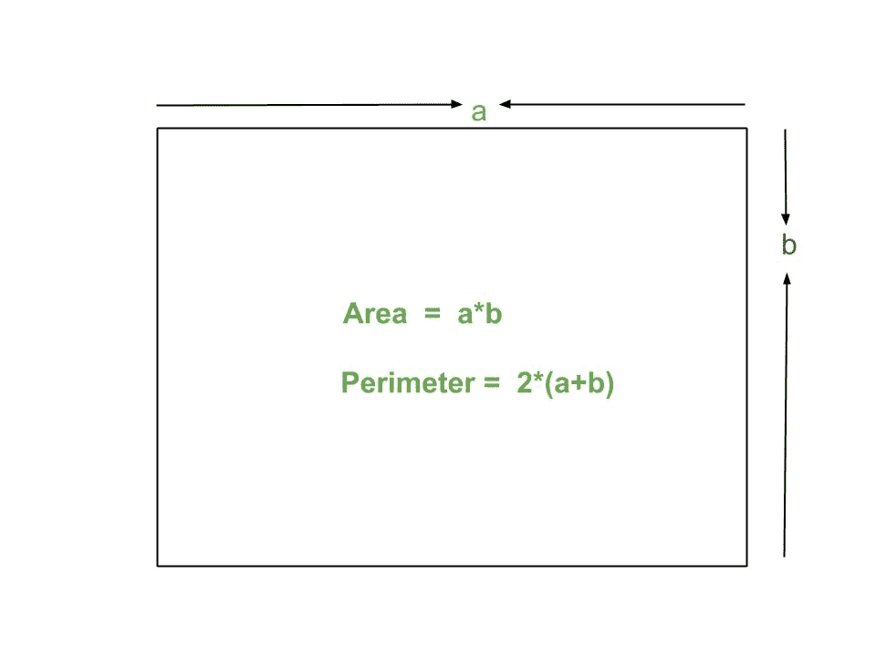

# 矩形面积和周长程序

> 原文:[https://www . geesforgeks . org/program-area-period-rectangle/](https://www.geeksforgeeks.org/program-area-perimeter-rectangle/)

矩形是平面上的平面图形。它有四条边和四个相等的 90 度角。在矩形中，所有的四条边都不像正方形一样等长，相对的边有相等的长度。矩形的两条对角线长度相等。



示例:

```
Input : 4 5
Output : Area = 20
         Perimeter = 18

Input : 2 3
Output : Area = 6
         Perimeter = 10
```

**公式:**

```
Area of rectangle : a*b 
Perimeter of rectangle: 2*(a + b) 
```

## C++

```
// CPP program to find area
// and perimeter of rectangle
#include<bits/stdc++.h>
using namespace std;

// Utility function
int areaRectangle(int a, int b)
{
   int area = a * b;
   return area;
}

int perimeterRectangle(int a, int b)
{
   int perimeter = 2*(a + b);
   return perimeter;
}

// Driver program
int main()
{
  int a = 5;
  int b = 6;
  cout << "Area = " << areaRectangle(a, b) << endl;
  cout << "Perimeter = " << perimeterRectangle(a, b);
  return 0;
}
```

## Java 语言(一种计算机语言，尤用于创建网站)

```
// Java program to find area
// and perimeter of rectangle
import java.io.*;

class Geometry {

    // Utility function
    static int areaRectangle(int a, int b)
    {
       int area = a * b;
       return area;
    }

    static int perimeterRectangle(int a, int b)
    {
       int perimeter = 2*(a + b);
       return perimeter;
    }

    // Driver Function
    public static void main (String[] args) {

        int a = 5;
        int b = 6;
        System.out.println("Area = "+ areaRectangle(a, b));
        System.out.println("Perimeter = "+ perimeterRectangle(a, b));

    }
}

// This code is contributed by Chinmoy Lenka
```

## 蟒蛇 3

```
# Python3 code to find area
# and perimeter of rectangle

# Utility function
def areaRectangle(a, b):
    return (a * b)

def perimeterRectangle(a, b):
    return (2 * (a + b))

# Driver function
a = 5;
b = 6;
print ("Area = ", areaRectangle(a, b))
print ("Perimeter = ", perimeterRectangle(a, b))

# This code is contributed by 'saloni1297'.
```

## C#

```
// C# program to find area
// and perimeter of rectangle
using System;

class GFG {

    // Utility function
    static int areaRectangle(int a, int b)
    {
        int area = a * b;
        return area;
    }

    static int perimeterRectangle(int a, int b)
    {
        int perimeter = 2 * (a + b);
        return perimeter;
    }

    // Driver Function
    public static void Main()
    {

        int a = 5;
        int b = 6;

        Console.WriteLine("Area = "
                      + areaRectangle(a, b));
        Console.WriteLine("Perimeter = "
                 + perimeterRectangle(a, b));
    }
}

// This code is contributed by vt_m.
```

## 服务器端编程语言（Professional Hypertext Preprocessor 的缩写）

```
<?php
// PHP program to find area
// and perimeter of rectangle

// Utility function
function areaRectangle( $a, $b)
{
    $area = $a * $b;
    return $area;
}

function perimeterRectangle( $a, $b)
{
    $perimeter = 2 * ($a + $b);
    return $perimeter;
}

// Driver program
$a = 5;
$b = 6;
echo("Area = " );
echo(areaRectangle($a, $b));
echo("\n");
echo( "Perimeter = ");
echo(perimeterRectangle($a, $b));

// This code is contributed by vt_m.
?>
```

## java 描述语言

```
<script>

// Javascript program to find area
// and perimeter of rectangle

// Utility function
function areaRectangle(a, b)
{
    let area = a * b;
    return area;
}

function perimeterRectangle(a, b)
{
    let perimeter = 2*(a + b);
    return perimeter;
}

// Driver program

let a = 5;
let b = 6;
document.write("Area = " + areaRectangle(a, b) + "<br>");
document.write("Perimeter = " + perimeterRectangle(a, b));

// This code is contributed by Manoj

</script>
```

输出:

```
Area = 30
Perimeter = 22
```

本文由**萨洛尼·古普塔**供稿。如果你喜欢 GeeksforGeeks 并想投稿，你也可以使用[write.geeksforgeeks.org](http://www.write.geeksforgeeks.org)写一篇文章或者把你的文章邮寄到 review-team@geeksforgeeks.org。看到你的文章出现在极客博客主页上，帮助其他极客。
如果你发现任何不正确的地方，或者你想分享更多关于上面讨论的话题的信息，请写评论。