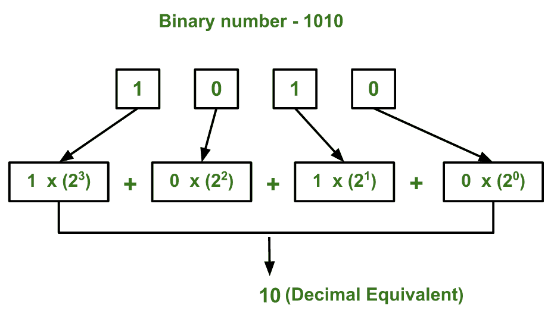

# 二进制到十进制转换程序

> 原文:[https://www . geesforgeks . org/program-二进制-十进制-转换/](https://www.geeksforgeeks.org/program-binary-decimal-conversion/)

给定一个二进制数作为输入，我们需要编写一个程序，将给定的二进制数转换成等价的十进制数。

**示例:**

```
Input : 111
Output : 7

Input : 1010
Output : 10

Input: 100001
Output: 33
```

其思想是从最右边的数字开始提取给定二进制数的数字，并保留一个变量 dec_value。从二进制数中提取数字时，将该数字与适当的基数(2 的幂)相乘，并将其与变量 dec_value 相加。最后，变量 dec_value 将存储所需的十进制数。
例如:
如果二进制数是 111。
dec _ value = 1*(2^2)+1*(2^1)+1*(2^0)= 7

下图说明了如何将(1010)转换为等效的十进制值:



下面是上述想法的实现:

## C++

```
// C++ program to convert binary to decimal
#include <iostream>
using namespace std;

// Function to convert binary to decimal
int binaryToDecimal(int n)
{
    int num = n;
    int dec_value = 0;

    // Initializing base value to 1, i.e 2^0
    int base = 1;

    int temp = num;
    while (temp) {
        int last_digit = temp % 10;
        temp = temp / 10;

        dec_value += last_digit * base;

        base = base * 2;
    }

    return dec_value;
}

// Driver program to test above function
int main()
{
    int num = 10101001;

    cout << binaryToDecimal(num) << endl;
}
```

## Java 语言(一种计算机语言，尤用于创建网站)

```
// Java program to convert
// binary to decimal

// Function to convert
// binary to decimal
class GFG {
    static int binaryToDecimal(int n)
    {
        int num = n;
        int dec_value = 0;

        // Initializing base
        // value to 1, i.e 2^0
        int base = 1;

        int temp = num;
        while (temp > 0) {
            int last_digit = temp % 10;
            temp = temp / 10;

            dec_value += last_digit * base;

            base = base * 2;
        }

        return dec_value;
    }

    // Driver Code
    public static void main(String[] args)
    {
        int num = 10101001;
        System.out.println(binaryToDecimal(num));
    }
}

// This code is contributed by mits.
```

## 蟒蛇 3

```
# Python3 program to convert
# binary to decimal

# Function to convert
# binary to decimal
def binaryToDecimal(n):
    num = n;
    dec_value = 0;

    # Initializing base
    # value to 1, i.e 2 ^ 0
    base = 1;

    temp = num;
    while(temp):
        last_digit = temp % 10;
        temp = int(temp / 10);

        dec_value += last_digit * base;
        base = base * 2;
    return dec_value;

# Driver Code
num = 10101001;
print(binaryToDecimal(num));

# This code is contributed by mits
```

## C#

```
// C# program to convert
// binary to decimal

// Function to convert
// binary to decimal
class GFG {
    public static int binaryToDecimal(int n)
    {
        int num = n;
        int dec_value = 0;

        // Initializing base1
        // value to 1, i.e 2^0
        int base1 = 1;

        int temp = num;
        while (temp > 0) {
            int last_digit = temp % 10;
            temp = temp / 10;

            dec_value += last_digit * base1;

            base1 = base1 * 2;
        }

        return dec_value;
    }

    // Driver Code
    public static void Main()
    {
        int num = 10101001;

        System.Console.Write(binaryToDecimal(num));
    }
}

// This code is contributed by mits.
```

## 服务器端编程语言（Professional Hypertext Preprocessor 的缩写）

```
<?php
// PHP program to convert
// binary to decimal

// Function to convert
// binary to decimal
function binaryToDecimal($n)
{
    $num = $n;
    $dec_value = 0;

    // Initializing base value
    // to 1, i.e 2^0
    $base = 1;

    $temp = $num;
    while ($temp)
    {
        $last_digit = $temp % 10;
        $temp = $temp / 10;

        $dec_value += $last_digit
                        * $base;
        $base = $base*2;
    }
    return $dec_value;
}

    // Driver Code
    $num = 10101001;
    echo binaryToDecimal($num), "\n";

// This code is contributed by ajit
?>
```

## java 描述语言

```
<script>

// JavaScript program to convert binary to decimal

// Function to convert binary to decimal
function binaryToDecimal(n)
{
    let num = n;
    let dec_value = 0;

    // Initializing base value to 1, i.e 2^0
    let base = 1;

    let temp = num;
    while (temp) {
        let last_digit = temp % 10;
        temp = Math.floor(temp / 10);

        dec_value += last_digit * base;

        base = base * 2;
    }

    return dec_value;
}

// Driver program to test above function
    let num = 10101001;

    document.write(binaryToDecimal(num) + "<br>");

// This code is contributed by Surbhi Tyagi

</script>
```

**输出:**

```
169
```

**注意:**程序只对整数范围内的二进制数起作用。如果您想处理 20 位或 30 位这样的长二进制数，可以使用字符串变量来存储二进制数。

下面是一个类似的程序，用字符串变量代替整数来存储二进制值:

## C++

```
// C++ program to convert binary to decimal
// when input is represented as binary string.
#include <iostream>
#include <string>
using namespace std;

// Function to convert binary to decimal
int binaryToDecimal(string n)
{
    string num = n;
    int dec_value = 0;

    // Initializing base value to 1, i.e 2^0
    int base = 1;

    int len = num.length();
    for (int i = len - 1; i >= 0; i--) {
        if (num[i] == '1')
            dec_value += base;
        base = base * 2;
    }

    return dec_value;
}

// Driver program to test above function
int main()
{
    string num = "10101001";
    cout << binaryToDecimal(num) << endl;
}
```

## Java 语言(一种计算机语言，尤用于创建网站)

```
// Java program to convert binary to
// decimal when input is represented
// as binary string.
import java.io.*;

class GFG {

    // Function to convert binary to decimal
    static int binaryToDecimal(String n)
    {
        String num = n;
        int dec_value = 0;

        // Initializing base value to 1,
        // i.e 2^0
        int base = 1;

        int len = num.length();
        for (int i = len - 1; i >= 0; i--) {
            if (num.charAt(i) == '1')
                dec_value += base;
            base = base * 2;
        }

        return dec_value;
    }

    // Driver program to test above function
    public static void main(String[] args)
    {
        String num = new String("10101001");
        System.out.println(binaryToDecimal(num));
    }
}

// This code is contribute by Prerna Saini
```

## 蟒蛇 3

```
# Python3 program to convert binary
# to decimal when input is
# represented as binary string.

# Function to convert
# binary to decimal
def binaryToDecimal(n):
    num = n;
    dec_value = 0;

    # Initializing base
    # value to 1, i.e 2 ^ 0
    base1 = 1;

    len1 = len(num);
    for i in range(len1 - 1, -1, -1):
        if (num[i] == '1'):    
            dec_value += base1;
        base1 = base1 * 2;

    return dec_value;

# Driver Code
num = "10101001";
print(binaryToDecimal(num));

# This code is contributed by mits
```

## C#

```
// C# program to convert binary to
// decimal when input is represented
// as binary string.
using System;

class GFG {

    // Function to convert binary to decimal
    static int binaryToDecimal(String n)
    {
        String num = n;
        int dec_value = 0;

        // Initializing base value to 1,
        // i.e 2^0
        int base1 = 1;

        int len = num.Length;
        for (int i = len - 1; i >= 0; i--) {
            if (num[i] == '1')
                dec_value += base1;
            base1 = base1 * 2;
        }

        return dec_value;
    }

    // Driver Code
    public static void Main()
    {
        String num = "10101001";
        Console.WriteLine(binaryToDecimal(num));
    }
}

// This code is contribute by mits
```

## 服务器端编程语言（Professional Hypertext Preprocessor 的缩写）

```
<?php
// PHP program to convert binary
// to decimal when input is
// represented as binary string.

// Function to convert
// binary to decimal
function binaryToDecimal($n)
{
    $num = $n;
    $dec_value = 0;

    // Initializing base
    // value to 1, i.e 2^0
    $base = 1;

    $len = strlen($num);
    for ($i = $len - 1; $i >= 0; $i--)
    {
        if ($num[$i] == '1')    
            $dec_value += $base;
        $base = $base * 2;
    }

    return $dec_value;
}

// Driver Code
$num = "10101001";
echo binaryToDecimal($num), "\n";

// This code is contributed by aj_36
?>
```

## java 描述语言

```
<script>

// Javascript program to convert binary to decimal
// when input is represented as binary string.

// Function to convert binary to decimal
function binaryToDecimal(n)
{
    let num = n;
    let dec_value = 0;

    // Initializing base value to 1, i.e 2^0
    let base = 1;

    let len = num.length;
    for (let i = len - 1; i >= 0; i--) {
        if (num[i] == '1')
            dec_value += base;
        base = base * 2;
    }

    return dec_value;
}

// Driver program to test above function

    let num = "10101001";
    document.write(binaryToDecimal(num) + "<br>");

// This code is contributed by Mayank Tyagi

</script>
```

**输出:**

```
169
```

**使用预定义函数:**

## C++

```
#include <iostream>
using namespace std;

int main()
{
    char binaryNumber[] = "1001";

    cout << stoi(binaryNumber, 0, 2);

    return 0;
}
// This code is contributed by whysodarkbro
```

## C

```
#include <stdio.h>
#include <math.h>
#include <stdlib.h>

int main()
{
    char binaryNumber[] = "1001";
    int bin, dec = 0;

    bin = atoi(binaryNumber);

    for(int i = 0; bin; i++, bin /= 10)
        if (bin % 10)
            dec += pow(2, i);

    printf("%d", dec);

    return 0;
}

// This code is contributed by whysodarkbro
```

## Java 语言(一种计算机语言，尤用于创建网站)

```
public class GFG {
    public static void main(String args[])
    {
        String binaryNumber = "1001";
        System.out.println(Integer.parseInt(binaryNumber, 2));
    }
}

// This code is contributed
// By Yash Kumar Arora
```

## 蟒蛇 3

```
n = input()

# Convert n to base 2
s = int(n, 2)

print(s)
```

## C#

```
using System;

class GFG {

public static void Main()
{
    int value = 1001;
    Console.Write(Convert.ToInt32(value.ToString(), 2));
}
}

// This code is contributed by SoumikMondal
```

## java 描述语言

```
<script>

var binaryNumber = "1001";
document.write(parseInt(binaryNumber, 2));

// This code contributed by Princi Singh
</script>
```

**输出:**

```
9
```

本文由 [**哈什·阿加瓦尔**](https://www.facebook.com/harsh.agarwal.16752) 供稿。如果你喜欢 GeeksforGeeks 并想投稿，你也可以使用[contribute.geeksforgeeks.org](http://www.contribute.geeksforgeeks.org)写一篇文章或者把你的文章邮寄到 contribute@geeksforgeeks.org。看到你的文章出现在极客博客主页上，帮助其他极客。
如果发现有不正确的地方，或者想分享更多关于上述话题的信息，请写评论。