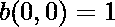

# 二项式系数表程序

> 原文:[https://www . geesforgeks . org/program-二项式-系数-表格/](https://www.geeksforgeeks.org/program-binomial-coefficients-table/)

给定整数 max，打印[二项式系数](https://www.geeksforgeeks.org/dynamic-programming-set-9-binomial-coefficient/)表，该表打印所有二项式系数 B(m，x)，其中 m 和 x 从 0 到 max 变化
**示例:**

```
Input : max = 3
Output :  
 0   1
 1   1   1
 2   1   2   1
 3   1   3   3   1
```

解释什么是二项式系数最简单的方法是说，它们计算项目分组的某些方式。具体来说，二项式系数 B(m，x)计算从 n 个不同项目的集合中选择 k 个项目的无序集合的方式数。
二项式系数用于研究二项式分布和多分量冗余系统。
**举例:**

```
Compute B(7, 3)  where m = 7 and x = 1 
          (7!/3!(7-3)!)7
        = 7!/3!*4!
        = (7*6*5*4*3*2*1)/(3*2*1)*(4*3*2*1)
        = 35
```

需要一个二项式系数表来确定任何值 m 和 x 的二项式系数。
**问题分析:**
二项式系数可以递归计算如下–
![B(m, x) = B(m, x - 1) [m - x + 1 / x], x = 1, 2, 3 .... m   ](img/10721d6fed89e0e194037c5c66ac7421.png "Rendered by QuickLaTeX.com")此外，
也就是说，当 x 为零或 m 为零时，二项式系数为 1。程序打印的二项式系数表。

## C++

```
// C++ program for binomial coefficients
#include <stdio.h>

// Function to print binomial table
int printbinomial(int max)
{
    for (int m = 0; m <= max; m++) {
        printf("%2d", m);
        int binom = 1;
        for (int x = 0; x <= m; x++) {

            // B(m, x) is 1 if either m or x is
            // is 0.
            if (m != 0 && x != 0)

                // Otherwise using recursive formula
                // B(m, x) = B(m, x - 1) * (m - x + 1) / x
                binom = binom * (m - x + 1) / x;

            printf("%4d", binom);
        }
        printf("\n");
    }
}

// Driver Function
int main()
{
    int max = 10;
    printbinomial(max);
    return 0;
}
```

## Java 语言(一种计算机语言，尤用于创建网站)

```
// Java program for
// binomial coefficients
import java.io.*;

class GFG
{

// Function to print
// binomial table
static void printbinomial(int max)
{
    for (int m = 0; m <= max; m++)
    {
        System.out.print(m + " ");
        int binom = 1;
        for (int x = 0; x <= m; x++)
        {

            // B(m, x) is 1 if either
            // m or x is is 0.
            if (m != 0 && x != 0)

                // Otherwise using
                // recursive formula
                // B(m, x) = B(m, x - 1) *
                //            (m - x + 1) / x
                binom = binom * (m - x + 1) / x;

            System.out.print(binom + " ");
        }
        System.out.println();
    }
}

// Driver Code
public static void main (String[] args)
{
    int max = 10;
    printbinomial(max);
}
}

// This code is contributed
// by akt_mit
```

## 蟒蛇 3

```
# Python3 program for binomial
# coefficients

# Function to print binomial table
def printbinomial (max):

    for m in range(max + 1):
        print( '% 2d'% m, end = ' ')
        binom = 1
        for x in range(m + 1):

            # B(m, x) is 1 if either m
            # or x is is 0.
            if m != 0 and x != 0:

                # Otherwise using recursive
                # formula
                # B(m, x) = B(m, x - 1) *
                #           (m - x + 1) / x
                binom = binom * (m - x + 1) / x
            print( '% 4d'% binom, end = ' ')
        print("\n", end = '')

# Driver Function
max = 10
printbinomial(max)

# This code is contributed by "Sharad_bhardwaj".
```

## C#

```
// C# program for binomial coefficients
using System;

public class GFG {

    // Function to print binomial table
    static void printbinomial(int max)
    {
        for (int m = 0; m <= max; m++) {
            Console.Write(m + " ");
            int binom = 1;
            for (int x = 0; x <= m; x++) {

                // B(m, x) is 1 if either m
                // or x is is 0.
                if (m != 0 && x != 0)

                    // Otherwise using recursive formula
                    // B(m, x) = B(m, x - 1) * (m - x + 1) / x
                    binom = binom * (m - x + 1) / x;

                Console.Write(binom + " ");
            }
            Console.WriteLine();
        }
    }

    // Driver Function
    static public void Main()
    {
        int max = 10;
        printbinomial(max);
    }
}

// This code is contributed by vt_m.
```

## 服务器端编程语言（Professional Hypertext Preprocessor 的缩写）

```
<?php
// PHP program for
// binomial coefficients

// Function to print
// binomial table
function printbinomial($max)
{
    for ($m = 0; $m <= $max; $m++)
    {
        echo $m;
        $binom = 1;
        for ($x = 0; $x <= $m; $x++)
        {

            // B(m, x) is 1 if either
            // m or x is 0.
            if ($m != 0 && $x != 0)

                // Otherwise using
                // recursive formula
                // B(m, x) = B(m, x - 1) *
                //            (m - x + 1) / x
                $binom = $binom * ($m - $x + 1) / $x;

            echo " ", $binom, " ";
        }
    echo "\n";
    }
}

// Driver Code
$max = 10;
printbinomial($max);

// This code is contributed by aj_36
?>
```

## java 描述语言

```
<script>
// Javascript program for
// binomial coefficients

// Function to print
// binomial table
function printbinomial(max)
{
    for (let m = 0; m <= max; m++)
    {
        document.write(m);
        let binom = 1;
        for (let x = 0; x <= m; x++)
        {

            // B(m, x) is 1 if either
            // m or x is 0.
            if (m != 0 && x != 0)

                // Otherwise using
                // recursive formula
                // B(m, x) = B(m, x - 1) *
                //            (m - x + 1) / x
                binom = binom * (m - x + 1) / x;

            document.write(" " + binom + " ");
        }
    document.write("<br>");
    }
}

// Driver Code
let max = 10;
printbinomial(max);

// This code is contributed by _saurabh_jaiswal
</script>
```

**输出:**

```
 0   1
 1   1   1
 2   1   2   1
 3   1   3   3   1
 4   1   4   6   4   1
 5   1   5  10  10   5   1
 6   1   6  15  20  15   6   1
 7   1   7  21  35  35  21   7   1
 8   1   8  28  56  70  56  28   8   1
 9   1   9  36  84 126 126  84  36   9   1
10   1  10  45 120 210 252 210 120  45  10   1
```