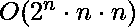

# 桥梁和火炬问题程序

> 原文:[https://www.geeksforgeeks.org/program-bridge-torch-problem/](https://www.geeksforgeeks.org/program-bridge-torch-problem/)

给定一个正整数数组，表示 n 个人的交叉时间。这些人站在桥的一边。桥牌一次最多能容纳两个人。当两个人过桥时，他们必须以较慢的人的速度前进。找出所有人能过桥的最短总时间。*详见* [*本拼图*](https://www.geeksforgeeks.org/puzzle-18-torch-and-bridge/) *了解更多*。
**注:**较慢的人的步伐是由较大的时间给出的。

```
Input:  Crossing Times = {10, 20, 30}
Output: 60
Explanation
1\. Firstly person '1' and '2' cross the bridge
   with total time about 20 min(maximum of 10, 20) 
2\. Now the person '1' will come back with total 
   time of '10' minutes.
3\. Lastly the person '1' and '3' cross the bridge
   with total time about 30 minutes
Hence total time incurred in whole journey will be
20 + 10 + 30 = 60

Input: Crossing Times = [1, 2, 5, 8}
Output: 15
Explanation
See this for full explanation.
```

方法是使用动态编程。在深入研究动态程序之前，让我们看看解决这个问题所需的以下观察结果。

1.  当任何两个人过桥时，最快的人过桥时间不会在回答中给出，因为他们都以最慢的人的速度移动。

2.  当一些人过河到达右边时，只有最快的人(最小的整数)会回到左边。

3.  人只能出现在桥的左侧或右侧。因此，如果我们保持左掩码，那么通过设置左掩码中不存在的位“1”，可以很容易地计算出右掩码。例如，右屏蔽=((2<sup>n</sup>)–1)异或(左屏蔽)。

4.  任何人都可以很容易地用位掩码(通常称为“掩码”)来表示。当“屏蔽”的第 I<sup>位被设置时，这意味着该人出现在桥的左侧，否则该人将出现在桥的右侧。比如让 **6 人**的面具为 100101，代表人 1、4、6 出现在桥的左侧，人 2、3、5 出现在桥的右侧。</sup>

## 卡片打印处理机（Card Print Processor 的缩写）

```
// C++ program to find minimum time required to
// send people on other side of bridge
#include <bits/stdc++.h>
using namespace std;

/* Global dp[2^20][2] array, in dp[i][j]--
   'i' denotes mask in which 'set bits' denotes
   total people standing at left side of bridge
   and 'j' denotes the turn that represent on
   which side we have to send people either
   from left to right(0) or from right to
   left(1)  */
int dp[1 << 20][2];

/* Utility function to find total time required
   to send people to other side of bridge */
int findMinTime(int leftmask, bool turn, int arr[], int& n)
{

    // If all people has been transfered
    if (!leftmask)
        return 0;

    int& res = dp[leftmask][turn];

    // If we already have solved this subproblem,
    // return the answer.
    if (~res)
        return res;

    // Calculate mask of right side of people
    int rightmask = ((1 << n) - 1) ^ leftmask;

    /* if turn == 1 means currently people are at
     right side, thus we need to transfer
     people to the left side */
    if (turn == 1) {
        int minRow = INT_MAX, person;
        for (int i = 0; i < n; ++i) {

            // Select one people whose time is less
            // among all others present at right
            // side
            if (rightmask & (1 << i)) {
                if (minRow > arr[i]) {
                    person = i;
                    minRow = arr[i];
                }
            }
        }

        // Add that person to answer and recurse for next turn
        // after initializing that person at left side
        res = arr[person] + findMinTime(leftmask | (1 << person),
                                        turn ^ 1, arr, n);
    }
    else {

        // __builtin_popcount() is inbuilt gcc function
        // which will count total set bits in 'leftmask'
        if (__builtin_popcount(leftmask) == 1) {
            for (int i = 0; i < n; ++i) {

                // Since one person is present at left
                // side, thus return that person only
                if (leftmask & (1 << i)) {
                    res = arr[i];
                    break;
                }
            }
        }
        else {

            // try for every pair of people by
            // sending them to right side

            // Initialize the result with maximum value
            res = INT_MAX;
            for (int i = 0; i < n; ++i) {

                // If ith person is not present then
                // skip the rest loop
                if (!(leftmask & (1 << i)))
                    continue;

                for (int j = i + 1; j < n; ++j) {
                    if (leftmask & (1 << j)) {

                        // Find maximum integer(slowest
                        // person's time)
                        int val = max(arr[i], arr[j]);

                        // Recurse for other people after un-setting
                        // the ith and jth bit of left-mask
                        val += findMinTime(leftmask ^ (1 << i) ^ (1 << j),
                                                       turn ^ 1, arr, n);
                        // Find minimum answer among
                        // all chosen values
                        res = min(res, val);
                    }
                }
            }
        }
    }
    return res;
}

// Utility function to find minimum time
int findTime(int arr[], int n)
{
    // Find the mask of 'n' peoples
    int mask = (1 << n) - 1;

    // Initialize all entries in dp as -1
    memset(dp, -1, sizeof(dp));

    return findMinTime(mask, 0, arr, n);
}

// Driver program
int main()
{
    int arr[] = { 10, 20, 30 };
    int n = sizeof(arr)/sizeof(arr[0]);
    cout << findTime(arr, n);
    return 0;
}
```

```
Output 
60
```

**时间复杂度:** 
**辅助空间:** 